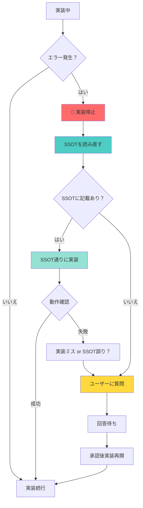

# 🚨 SSOT実装時のガードレール（逸脱防止ルール）

**作成日**: 2025年10月5日  
**最終更新**: 2025年10月10日  
**バージョン**: 1.1.0  
**目的**: SSOT実行中の「勝手な判断による逸脱」を完全に防止する

---

## 🔗 関連ドキュメント（必読）

このドキュメントは以下のドキュメントと連携して機能します：

| ドキュメント | 目的 | 参照タイミング |
|-----------|------|-------------|
| **error_detection_protocol.md** | エラー検知時の自動停止プロトコル | エラー発生時（最優先） |
| **system_boundary_violations.md** | システム境界違反パターン集 | 実装方針検討時 |
| **ssot_implementation_guard.md**（本書） | SSOT実装時の総合ガードレール | SSOT実装全般 |

**推奨される使用順序**:
1. エラー発生 → `error_detection_protocol.md`（自動停止）
2. システム境界確認 → `system_boundary_violations.md`（パターン確認）
3. SSOT実装継続 → `ssot_implementation_guard.md`（本書）

---

## 📋 このドキュメントの目的

### 問題の本質

SSOT実装中に以下のような問題が発生します：

```
エラー発生 → 「直せばいいでしょ」 → 勝手にPrisma編集 → SSOT違反
```

**原因**:
1. エラーが出た時にSSOTを読み直さない
2. 「慌てて修正しよう」という短絡的な思考
3. システムの境界（hotel-saasはプロキシ専用）を忘れる

### 解決策

このドキュメントは、AIが**SSOT実装中にエラーに遭遇した時の絶対ルール**を定義します。

---

## 🚦 エラー発生時の絶対ルール

### ステップ1: 実装を停止する

```
エラー発生 → 【ここで一旦停止】
```

**やってはいけないこと**:
- ❌ すぐにエラーを修正しようとする
- ❌ 「データベースに接続できない → Prismaを編集しよう」という短絡思考
- ❌ 「動けばいい」という発想

**やるべきこと**:
- ✅ **実装を停止**
- ✅ **SSOTを読み直す**

---

### ステップ2: SSOTを読み直す

```
エラー発生 → 実装停止 → 【SSOTを読み直す】
```

**確認項目**:
1. このシステム（hotel-saas/pms/member）の役割は何か？
2. データベース直接アクセスは許可されているか？
3. どのシステム経由でデータを取得すべきか？
4. エラーの原因はSSOT違反ではないか？

**SSOTで確認する内容**:
- システム間連携フロー
- API仕様
- 禁止事項セクション
- 「SSOTに準拠しないと発生する問題」セクション

---

### ステップ3: SSOT記載の確認

```
SSOTを読み直す → 【記載があるか確認】
```

#### ケースA: SSOTに記載がある

```markdown
✅ SSOTに記載あり → SSOT通りに実装
```

**例**:
- SSOT: 「hotel-saasはhotel-commonのAPIを経由する」
- エラー: 「Prismaが使えない」
- **正しい対応**: hotel-commonのAPI経由に修正

#### ケースB: SSOTに記載がない

```markdown
❓ SSOTに記載なし → ユーザーに質問
```

**質問テンプレート**:
```
申し訳ございません。以下のエラーが発生しましたが、
SSOTに記載がないため、対応方法を教えていただけますか？

## エラー内容
[エラーメッセージ]

## 該当SSOT
[SSOTファイル名]

## SSOT記載内容
[関連する記載内容]

## 疑問点
[具体的な疑問]
```

---

### ステップ4: 実装再開（承認後）

```
SSOT確認 → ユーザー承認 → 【実装再開】
```

---

## ❌ 絶対にやってはいけないこと

### 1. システムの境界を越えた実装

```typescript
// ❌ hotel-saasでPrismaを直接使用（絶対禁止）
import { PrismaClient } from '@prisma/client';
const prisma = new PrismaClient();
const tenants = await prisma.tenant.findMany();

// ✅ hotel-commonのAPIを経由（正しい）
const tenants = await $fetch('http://localhost:3400/api/v1/admin/tenants');
```

**理由**:
- hotel-saasは**プロキシ専用システム**
- データベース直接アクセスは**hotel-commonのみ**
- システムの境界を越えた実装は**アーキテクチャ違反**

**参照SSOT**:
- [SSOT_SAAS_MULTITENANT.md](../docs/03_ssot/00_foundation/SSOT_SAAS_MULTITENANT.md)
- [SSOT_SYSTEM_INTEGRATION.md](../docs/architecture/SSOT_SYSTEM_INTEGRATION.md)

---

### 2. 開発環境専用のフォールバック実装

```typescript
// ❌ 開発環境専用フォールバック（絶対禁止）
const tenantId = session.tenantId || 'default';

// ❌ 環境分岐実装（絶対禁止）
if (process.env.NODE_ENV === 'development') {
  tenantId = 'default';
}

// ✅ 本番同等実装（正しい）
const tenantId = session.tenantId;
if (!tenantId) {
  throw new Error('テナントIDが取得できません');
}
```

**理由**:
- 開発環境で動いても**本番環境で全機能停止**
- フォールバックは**本番障害の原因**
- 開発・本番は**同じ実装**であるべき

**参照SSOT**:
- [SSOT_PRODUCTION_PARITY_RULES.md](../docs/03_ssot/00_foundation/SSOT_PRODUCTION_PARITY_RULES.md)

---

### 3. SSOTを読まずに実装を続ける

```
エラー発生 → すぐ修正 ← ❌ これが最悪のパターン
```

**なぜ最悪か**:
1. SSOTに正しい実装方法が書いてある
2. それを読まずに実装 → SSOT違反
3. レビュー時に全修正 → 時間の無駄
4. ユーザーの信頼を失う

**正しいパターン**:
```
エラー発生 → 実装停止 → SSOT確認 → 正しい実装
```

---

## 🎯 エラー別対応表

| エラー | ❌ 誤った対応 | ✅ 正しい対応 | 参照SSOT |
|--------|-------------|-------------|---------|
| **DB接続エラー** | Prismaを直接編集 | SSOT確認 → hotel-common経由に修正 | SSOT_SAAS_MULTITENANT.md |
| **認証エラー** | Cookieを直接操作 | SSOT確認 → セッション取得方法を確認 | SSOT_SAAS_ADMIN_AUTHENTICATION.md |
| **テナント取得失敗** | 'default'でフォールバック | SSOT確認 → 正しいセッション取得方法を実装 | SSOT_SAAS_MULTITENANT.md |
| **APIエラー** | 新しいAPIを作る | SSOT確認 → 既存API仕様を確認 | SSOT_API_SPECIFICATION.md |
| **型エラー** | anyで回避 | SSOT確認 → 正しい型定義を確認 | SSOT_DATABASE_SCHEMA.md |
| **ミドルウェアエラー** | ミドルウェアを削除 | SSOT確認 → 正しいミドルウェア使用方法を確認 | SSOT_SAAS_ADMIN_AUTHENTICATION.md |

---

## 📊 フローチャート



---

## 🔍 システム別の境界ルール

### hotel-saas

**役割**: プロキシ（中継）専用

**許可されること**:
- ✅ hotel-commonのAPIを呼び出す
- ✅ フロントエンド実装（Pages、Composables、ミドルウェア）
- ✅ APIプロキシ実装（`server/api/`配下）

**禁止されること**:
- ❌ Prismaを直接使用
- ❌ データベースに直接接続
- ❌ Redisに直接接続（認証は例外）
- ❌ hotel-pms/memberのDBに直接アクセス

**参照SSOT**:
- [SSOT_SAAS_MULTITENANT.md](../docs/03_ssot/00_foundation/SSOT_SAAS_MULTITENANT.md)

---

### hotel-common

**役割**: API基盤・データベースアクセス層

**許可されること**:
- ✅ Prisma使用
- ✅ PostgreSQLアクセス
- ✅ Redisアクセス
- ✅ 全システムへのAPI提供

**禁止されること**:
- ❌ フロントエンド実装（Pages等）
- ❌ システム固有のビジネスロジック（各システムから呼び出される形）

**参照SSOT**:
- [SSOT_SYSTEM_INTEGRATION.md](../docs/architecture/SSOT_SYSTEM_INTEGRATION.md)

---

### hotel-pms / hotel-member

**役割**: 独立システム（将来的に統合）

**許可されること**:
- ✅ 各システム専用のPrisma使用
- ✅ 各システム専用のDB使用

**禁止されること**:
- ❌ hotel-saasのDBに直接アクセス
- ❌ 他システムのテーブルに直接アクセス

**参照SSOT**:
- [SSOT_PMS_SPECIFICATION.md](../docs/01_systems/pms/SSOT_PMS_SPECIFICATION.md)

---

## 🧪 テストケース：正しい思考パターン

### シナリオ1: hotel-saasでテナント一覧取得中にエラー

**状況**:
```
実装中: hotel-saasでテナント一覧を取得したい
エラー: Prismaが使えない
```

**❌ 誤った思考**:
```
「Prismaが使えない → Prismaをインストールしよう」
→ hotel-saasにPrismaを追加
→ テナント一覧取得実装
→ SSOT違反
```

**✅ 正しい思考**:
```
「Prismaが使えない → まずSSOT確認」
→ SSOT_SAAS_MULTITENANT.mdを読む
→ 「hotel-saasはhotel-common経由」と記載
→ hotel-commonのAPI経由に実装
→ SSOT準拠
```

---

### シナリオ2: セッションからテナントID取得失敗

**状況**:
```
実装中: セッションからテナントIDを取得
エラー: session.tenantIdがundefined
```

**❌ 誤った思考**:
```
「undefinedだから → フォールバックを追加しよう」
→ const tenantId = session.tenantId || 'default'
→ 開発環境で動作
→ 本番環境で全機能停止
```

**✅ 正しい思考**:
```
「undefinedだから → まずSSOT確認」
→ SSOT_SAAS_MULTITENANT.mdを読む
→ 「セッションから動的取得、フォールバック禁止」と記載
→ セッション取得方法を確認
→ 正しい実装に修正
→ SSOT準拠
```

---

## 📚 関連SSOT一覧

実装中にエラーが出たら、以下のSSOTを確認してください：

| SSOT | 内容 | 確認すべき状況 |
|------|------|--------------|
| [SSOT_SAAS_MULTITENANT.md](../docs/03_ssot/00_foundation/SSOT_SAAS_MULTITENANT.md) | マルチテナント基盤 | テナント関連エラー |
| [SSOT_SAAS_ADMIN_AUTHENTICATION.md](../docs/03_ssot/00_foundation/SSOT_SAAS_ADMIN_AUTHENTICATION.md) | 管理画面認証 | 認証・セッションエラー |
| [SSOT_PRODUCTION_PARITY_RULES.md](../docs/03_ssot/00_foundation/SSOT_PRODUCTION_PARITY_RULES.md) | 本番同等ルール | フォールバック実装時 |
| [SSOT_DATABASE_SCHEMA.md](../docs/03_ssot/00_foundation/SSOT_DATABASE_SCHEMA.md) | DBスキーマ統一 | DB・Prismaエラー |
| [SSOT_SYSTEM_INTEGRATION.md](../docs/architecture/SSOT_SYSTEM_INTEGRATION.md) | システム間連携 | API呼び出しエラー |

---

## ✅ チェックリスト：実装前の確認

実装を開始する前に、以下を確認してください：

- [ ] 対象システムの役割を理解したか？
  - hotel-saas: プロキシ専用
  - hotel-common: API基盤・DB層
  - hotel-pms/member: 独立システム

- [ ] データベースアクセスの方法を確認したか？
  - hotel-saasはhotel-common経由
  - Prisma直接使用は禁止

- [ ] 本番同等ルールを確認したか？
  - フォールバック禁止
  - 環境分岐禁止
  - ハードコード禁止

- [ ] 関連SSOTを読んだか？
  - 認証SSOT
  - マルチテナントSSOT
  - システム間連携SSOT

---

## 🚨 緊急時の対応

### 「どうしても今すぐ実装したい」という時

**答え**: **NO**

理由：
1. 急いで実装 → SSOT違反 → 後で全修正
2. レビュー時に問題発覚 → 時間の無駄
3. ユーザーの信頼を失う

**正しい対応**:
1. 実装を停止
2. SSOTを確認
3. ユーザーに質問（記載がない場合）
4. 承認後に実装再開

**時間の比較**:
- ❌ 急いで実装 → レビュー → 全修正: **2時間**
- ✅ SSOT確認 → 正しい実装: **30分**

---

## 📝 まとめ

### エラー発生時の絶対ルール

```
1. 実装停止
2. SSOT確認
3. 記載あり → SSOT通りに実装
4. 記載なし → ユーザーに質問
5. 承認後実装再開
```

### 絶対にやってはいけないこと

```
1. システムの境界を越えた実装（hotel-saasでPrisma直接使用等）
2. 開発環境専用のフォールバック実装
3. SSOTを読まずに実装を続ける
```

### 最重要ポイント

**「慌てて修正」ではなく「SSOTを確認」**

---

**最終更新**: 2025年10月5日  
**作成者**: AI Assistant (Luna)  
**バージョン**: 1.0.0


