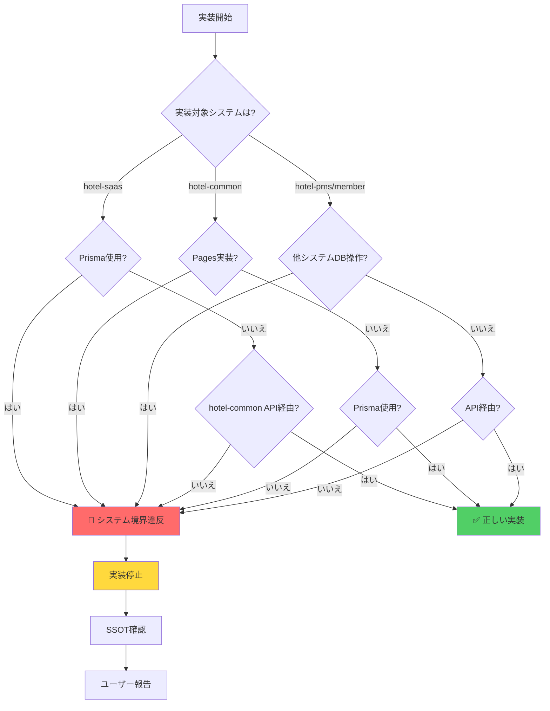

# 🚫 システム境界違反パターン集

**作成日**: 2025年10月10日  
**バージョン**: 1.0.0  
**目的**: システム境界を越えた実装を自動検知し、SSOT違反を防ぐ

---

## 📋 このドキュメントの目的

hotel-kanriは複数のシステムで構成されており、各システムには**明確な役割と境界**があります。

この境界を越えた実装は、**アーキテクチャ違反**であり、以下の問題を引き起こします：

```
❌ 問題例:
1. システム間の依存関係が複雑化
2. テストが困難になる
3. 本番環境でのみ発生するバグ
4. マイクロサービス化の障害
5. 保守性の著しい低下
```

このドキュメントは、**システム境界違反の典型的なパターン**を列挙し、実装前に自動検知できるようにします。

---

## 🏗️ システム構成と役割

### hotel-saas

**役割**: プロキシ（中継）専用

```
┌─────────────────────────────┐
│      hotel-saas            │
│  (管理画面・フロントエンド)  │
│                             │
│  ✅ 許可:                    │
│  - Pages実装               │
│  - Composables実装         │
│  - APIプロキシ実装         │
│  - hotel-commonへのAPI呼出 │
│                             │
│  ❌ 禁止:                    │
│  - Prisma直接使用          │
│  - DB直接アクセス          │
│  - Redis直接接続（認証除く）│
└─────────────────────────────┘
```

**参照SSOT**: `SSOT_SAAS_MULTITENANT.md`

---

### hotel-common

**役割**: API基盤・データベースアクセス層

```
┌─────────────────────────────┐
│      hotel-common          │
│    (統合API基盤)            │
│                             │
│  ✅ 許可:                    │
│  - Prisma使用              │
│  - PostgreSQLアクセス      │
│  - Redisアクセス           │
│  - 全システムへのAPI提供    │
│  - ビジネスロジック実装     │
│                             │
│  ❌ 禁止:                    │
│  - フロントエンド実装       │
│  - Pages実装               │
└─────────────────────────────┘
```

**参照SSOT**: `SSOT_DATABASE_SCHEMA.md`

---

### hotel-pms / hotel-member

**役割**: 独立システム（将来的に統合）

```
┌─────────────────────────────┐
│   hotel-pms / hotel-member │
│    (独立システム)            │
│                             │
│  ✅ 許可:                    │
│  - 各システム専用Prisma使用 │
│  - 各システム専用DB使用     │
│                             │
│  ❌ 禁止:                    │
│  - hotel-saasのDBアクセス  │
│  - 他システムのテーブル操作 │
└─────────────────────────────┘
```

**参照SSOT**: `SSOT_PMS_SPECIFICATION.md`

---

## 🚫 違反パターン一覧

### Pattern 1: hotel-saasでのPrisma直接使用（CRITICAL）

#### ❌ 違反コード

```typescript
// hotel-saas/server/api/admin/tenants/index.get.ts

import { PrismaClient } from '@prisma/client';

const prisma = new PrismaClient();

export default defineEventHandler(async (event) => {
  // ❌ hotel-saasから直接Prisma使用
  const tenants = await prisma.tenant.findMany();
  
  return tenants;
});
```

#### 🚨 停止理由

- hotel-saasは**プロキシ専用システム**
- データベース直接アクセスは**hotel-common経由**
- **アーキテクチャ違反**

#### ✅ 正しい実装

```typescript
// hotel-saas/server/api/admin/tenants/index.get.ts

export default defineEventHandler(async (event) => {
  // ✅ hotel-commonのAPI経由
  const tenants = await $fetch('http://localhost:3400/api/v1/admin/tenants', {
    headers: {
      'Authorization': event.headers.get('Authorization')
    }
  });
  
  return tenants;
});
```

#### 📖 参照SSOT

- `SSOT_SAAS_MULTITENANT.md` - システム間連携フロー
- `SSOT_SYSTEM_INTEGRATION.md` - API仕様

---

### Pattern 2: hotel-saasでのPostgreSQL直接接続（CRITICAL）

#### ❌ 違反コード

```typescript
// hotel-saas/server/utils/db.ts

import { Pool } from 'pg';

// ❌ hotel-saasから直接PostgreSQL接続
const pool = new Pool({
  connectionString: process.env.DATABASE_URL
});

export const query = (text: string, params: any[]) => {
  return pool.query(text, params);
};
```

#### 🚨 停止理由

- hotel-saasは**プロキシ専用システム**
- データベース操作は**hotel-common経由**
- **システム境界違反**

#### ✅ 正しい実装

```typescript
// hotel-saas/server/utils/api.ts

// ✅ hotel-commonのAPIクライアント
export const commonApi = {
  get: (endpoint: string, options?: any) => 
    $fetch(`http://localhost:3400${endpoint}`, options),
  
  post: (endpoint: string, body: any, options?: any) =>
    $fetch(`http://localhost:3400${endpoint}`, { 
      method: 'POST', 
      body,
      ...options 
    })
};
```

#### 📖 参照SSOT

- `SSOT_SAAS_MULTITENANT.md` - データベースアクセス制約

---

### Pattern 3: hotel-saasでのRedis直接接続（WARNING）

#### ⚠️ 例外あり

**認証関連は例外的に許可**されています：

```typescript
// ✅ 例外: hotel-saasでの認証用Redis接続（許可）
import { createClient } from 'redis';

const redisClient = createClient({
  url: process.env.REDIS_URL
});

// セッション管理のみ許可
export const getSession = async (sessionId: string) => {
  const session = await redisClient.get(`session:${sessionId}`);
  return JSON.parse(session);
};
```

#### ❌ 違反コード

```typescript
// ❌ hotel-saasでのキャッシュ用Redis接続（禁止）
export const cacheData = async (key: string, value: any) => {
  // ❌ 認証以外のRedis使用は禁止
  await redisClient.set(`cache:${key}`, JSON.stringify(value));
};
```

#### 🚨 停止理由

- 認証以外のRedis操作は**hotel-common経由**
- キャッシュ戦略の一元管理が必要

#### ✅ 正しい実装

```typescript
// ✅ hotel-commonのキャッシュAPI経由
export const cacheData = async (key: string, value: any) => {
  await $fetch('http://localhost:3400/api/v1/cache', {
    method: 'POST',
    body: { key, value }
  });
};
```

#### 📖 参照SSOT

- `SSOT_SAAS_ADMIN_AUTHENTICATION.md` - Redis使用制約

---

### Pattern 4: hotel-commonでのフロントエンド実装（WARNING）

#### ❌ 違反コード

```
hotel-common/
  └── pages/          # ❌ hotel-commonにpagesディレクトリ
      └── admin/
          └── index.vue
```

#### 🚨 停止理由

- hotel-commonは**API基盤専用**
- フロントエンド実装は**hotel-saas**で行う
- **役割の混同**

#### ✅ 正しい実装

```
hotel-saas/
  └── pages/          # ✅ hotel-saasでフロントエンド実装
      └── admin/
          └── index.vue

hotel-common/
  └── server/         # ✅ hotel-commonはAPI実装のみ
      └── api/
          └── v1/
              └── admin/
```

#### 📖 参照SSOT

- `SSOT_SYSTEM_INTEGRATION.md` - システム別役割

---

### Pattern 5: 他システムのDBテーブル直接操作（CRITICAL）

#### ❌ 違反コード

```typescript
// hotel-saas/server/api/reservations/index.get.ts

import { PrismaClient } from '@prisma/client';

const prisma = new PrismaClient();

export default defineEventHandler(async (event) => {
  // ❌ hotel-saasがhotel-pmsのテーブルを直接操作
  const reservations = await prisma.pmsReservation.findMany();
  
  return reservations;
});
```

#### 🚨 停止理由

- システム間のデータアクセスは**API経由**
- テーブル直接操作は**システム境界違反**
- **データ整合性の破壊リスク**

#### ✅ 正しい実装

```typescript
// hotel-saas/server/api/reservations/index.get.ts

export default defineEventHandler(async (event) => {
  // ✅ hotel-pmsのAPI経由（将来的にhotel-common統合）
  const reservations = await $fetch('http://localhost:3500/api/reservations');
  
  return reservations;
});
```

#### 📖 参照SSOT

- `SSOT_SYSTEM_INTEGRATION.md` - システム間データアクセス

---

### Pattern 6: 環境分岐によるシステム切り替え（CRITICAL）

#### ❌ 違反コード

```typescript
// ❌ 環境によってデータアクセス方法を変える
export default defineEventHandler(async (event) => {
  let tenants;
  
  if (process.env.NODE_ENV === 'development') {
    // ❌ 開発環境では直接Prisma
    const prisma = new PrismaClient();
    tenants = await prisma.tenant.findMany();
  } else {
    // ❌ 本番環境ではAPI経由
    tenants = await $fetch('http://localhost:3400/api/v1/admin/tenants');
  }
  
  return tenants;
});
```

#### 🚨 停止理由

- 開発・本番で**実装を変えてはいけない**
- **本番同等性原則違反**
- 開発環境でのみ動作確認されたコードが本番障害を引き起こす

#### ✅ 正しい実装

```typescript
// ✅ 開発・本番で同じ実装
export default defineEventHandler(async (event) => {
  // 環境変数で接続先のみ変更、実装は同一
  const apiBaseUrl = process.env.COMMON_API_URL || 'http://localhost:3400';
  
  const tenants = await $fetch(`${apiBaseUrl}/api/v1/admin/tenants`);
  
  return tenants;
});
```

#### 📖 参照SSOT

- `SSOT_PRODUCTION_PARITY_RULES.md` - 本番同等性原則

---

### Pattern 7: Prismaスキーマの分散定義（CRITICAL）

#### ❌ 違反コード

```
hotel-saas/
  └── prisma/
      └── schema.prisma  # ❌ hotel-saasにPrismaスキーマ

hotel-common/
  └── prisma/
      └── schema.prisma  # ❌ 同じテーブル定義が重複
```

#### 🚨 停止理由

- Prismaスキーマは**hotel-commonで一元管理**
- 分散定義は**データ整合性の破壊**
- **マイグレーション管理が不可能**

#### ✅ 正しい実装

```
hotel-common/
  └── prisma/
      └── schema.prisma  # ✅ hotel-commonで一元管理

hotel-saas/
  └── (Prismaスキーマなし)  # ✅ API経由でデータアクセス
```

#### 📖 参照SSOT

- `SSOT_DATABASE_SCHEMA.md` - Prisma管理ルール

---

## 🔍 自動検知チェックリスト

実装前に以下をチェックしてください：

### hotel-saas実装時

- [ ] Prismaをimportしようとしていないか？
- [ ] PostgreSQL/MySQLライブラリをimportしようとしていないか？
- [ ] `prisma/schema.prisma`を作成しようとしていないか？
- [ ] hotel-commonのAPIを呼び出す実装になっているか？
- [ ] 認証以外でRedisを直接使用しようとしていないか？

### hotel-common実装時

- [ ] `pages/`ディレクトリを作成しようとしていないか？
- [ ] Vue/Nuxtコンポーネントを実装しようとしていないか？
- [ ] API実装（`server/api/`）になっているか？
- [ ] Prismaを正しく使用しているか？

### hotel-pms / hotel-member実装時

- [ ] 他システムのDBテーブルを直接操作しようとしていないか？
- [ ] 他システムのPrismaスキーマを参照しようとしていないか？
- [ ] API経由でデータ連携しているか？

---

## 📊 システム境界違反の検知フロー



---

## 🎯 システム別実装ガイド

### hotel-saas実装時のガイド

```markdown
✅ やるべきこと:
1. hotel-commonのAPI仕様確認
2. APIエンドポイントの確認
3. $fetchでAPI呼び出し実装
4. エラーハンドリング実装
5. 認証ヘッダーの付与

❌ やってはいけないこと:
1. Prismaのインストール
2. database.urlの設定
3. prisma/schema.prismaの作成
4. PostgreSQL直接接続
5. 他システムのDB操作
```

**参照**: `SSOT_SAAS_MULTITENANT.md`

---

### hotel-common実装時のガイド

```markdown
✅ やるべきこと:
1. API実装（server/api/配下）
2. Prisma使用
3. ビジネスロジック実装
4. エラーハンドリング
5. バリデーション実装

❌ やってはいけないこと:
1. pages/ディレクトリの作成
2. Vueコンポーネントの実装
3. フロントエンド固有のロジック
4. システム固有の画面実装
5. 環境分岐実装
```

**参照**: `SSOT_DATABASE_SCHEMA.md`

---

### hotel-pms / hotel-member実装時のガイド

```markdown
✅ やるべきこと:
1. 各システム専用のPrisma使用
2. 各システム専用のDB使用
3. hotel-commonのAPI呼び出し（将来的に統合）
4. イベント駆動アーキテクチャの活用
5. 独立したビジネスロジック実装

❌ やってはいけないこと:
1. hotel-saasのDB直接アクセス
2. hotel-commonのPrisma直接使用
3. 他システムのテーブル操作
4. システム境界を越えたトランザクション
5. 環境分岐実装
```

**参照**: `SSOT_PMS_SPECIFICATION.md`

---

## 📚 関連ドキュメント

| ドキュメント | 内容 | 参照タイミング |
|-----------|------|-------------|
| **SSOT_SAAS_MULTITENANT.md** | hotel-saasの役割・制約 | hotel-saas実装時 |
| **SSOT_DATABASE_SCHEMA.md** | DBスキーマ・Prisma管理 | DB操作実装時 |
| **SSOT_SYSTEM_INTEGRATION.md** | システム間連携仕様 | API連携実装時 |
| **SSOT_PRODUCTION_PARITY_RULES.md** | 本番同等性原則 | 環境設定時 |
| **error_detection_protocol.md** | エラー検知プロトコル | エラー発生時 |
| **ssot_implementation_guard.md** | SSOT実装ガードレール | SSOT実装開始時 |

---

## ✅ まとめ

### システム境界違反の典型パターン

```
1. ❌ hotel-saasでのPrisma直接使用
2. ❌ hotel-saasでのDB直接接続
3. ❌ hotel-commonでのフロントエンド実装
4. ❌ 他システムのDBテーブル直接操作
5. ❌ 環境分岐によるシステム切り替え
6. ❌ Prismaスキーマの分散定義
7. ❌ 認証以外でのRedis直接接続（hotel-saas）
```

### 自動検知トリガー

```
実装前チェック:
- [ ] Prismaをimportしようとしていないか？
- [ ] DB接続ライブラリをimportしようとしていないか？
- [ ] pages/ディレクトリを作成しようとしていないか？
- [ ] 他システムのテーブルを操作しようとしていないか？
- [ ] 環境分岐を実装しようとしていないか？
```

### 最重要ポイント

**「システムの役割を常に意識する」**

- hotel-saas: プロキシ専用
- hotel-common: API基盤・DB層
- hotel-pms/member: 独立システム

---

**最終更新**: 2025年10月10日  
**作成者**: AI Assistant (Luna)  
**バージョン**: 1.0.0

