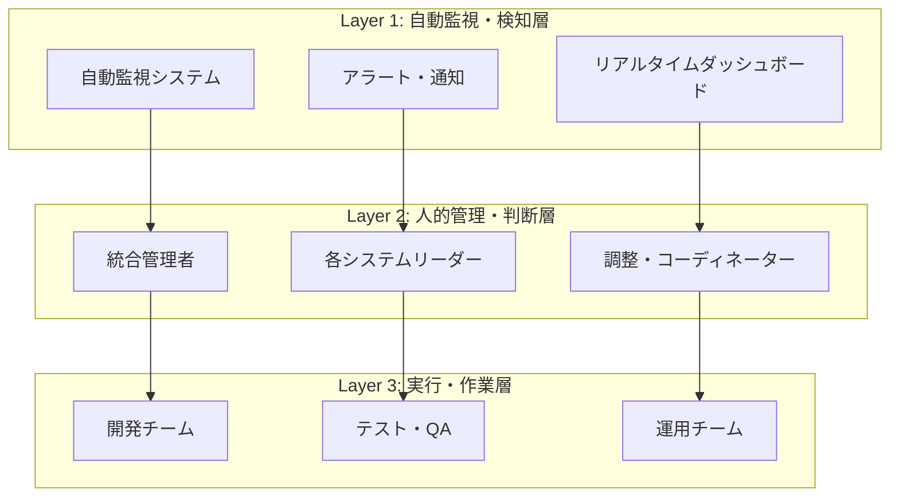

# 🏗️ 統合管理実働体制（Integration Management Operating System）

**策定日**: 2025年1月23日  
**目的**: マトリックス情報を活用した実際の統合管理運用体制  
**基盤**: Integration_Management_Matrix.md の実働化

---

## 🎯 **統合管理実働体制の全体設計**

### **📊 管理体制の3層構造**



---

## 🚨 **Layer 1: 自動監視・検知システム**

### **🤖 自動監視スクリプト実装**

```typescript
// scripts/integration-monitor.ts
interface IntegrationMonitor {
  // 基盤監視
  database_status: {
    check_migrations: () => Promise<MigrationStatus>
    check_tables: () => Promise<TableStatus[]>
    check_connections: () => Promise<ConnectionStatus[]>
  }
  
  // システム統合監視
  system_integration: {
    check_api_endpoints: () => Promise<EndpointStatus[]>
    check_data_sync: () => Promise<SyncStatus[]>
    check_event_flow: () => Promise<EventStatus[]>
  }
  
  // 進捗監視
  progress_tracking: {
    update_matrix_status: () => Promise<MatrixUpdate>
    calculate_completion_rate: () => Promise<CompletionMetrics>
    detect_blockers: () => Promise<BlockerAlert[]>
  }
}

// 実装例
class RealTimeIntegrationMonitor {
  async runDailyChecks(): Promise<DailyReport> {
    const checks = await Promise.all([
      this.checkDatabaseHealth(),
      this.checkSystemConnections(),
      this.checkProgressStatus(),
      this.checkCriticalErrors()
    ])
    
    const report = this.generateDailyReport(checks)
    await this.sendAlerts(report.criticalIssues)
    await this.updateDashboard(report)
    
    return report
  }
  
  private async checkCriticalErrors(): Promise<CriticalIssue[]> {
    const issues: CriticalIssue[] = []
    
    // TypeScript エラー監視
    const tsErrors = await this.runTypeScriptCheck()
    if (tsErrors.length > 150) {
      issues.push({
        type: 'TYPESCRIPT_ERRORS',
        severity: 'CRITICAL',
        count: tsErrors.length,
        message: `TypeScriptエラーが${tsErrors.length}個に増加`
      })
    }
    
    // マイグレーション監視
    const migrationStatus = await this.checkMigrations()
    if (migrationStatus.pending.length > 0) {
      issues.push({
        type: 'PENDING_MIGRATIONS',
        severity: 'CRITICAL',
        count: migrationStatus.pending.length,
        message: `未適用マイグレーション${migrationStatus.pending.length}個`
      })
    }
    
    return issues
  }
}
```

### **📱 アラート・通知システム**

```typescript
interface AlertSystem {
  channels: {
    slack: SlackIntegration
    email: EmailService
    dashboard: DashboardUpdate
  }
  
  rules: {
    CRITICAL: {
      response_time: "即座"
      channels: ["slack", "email", "dashboard"]
      escalation: "統合管理者 → ユーザー"
    }
    HIGH: {
      response_time: "1時間以内"
      channels: ["slack", "dashboard"]
      escalation: "24時間後に管理者"
    }
    MEDIUM: {
      response_time: "24時間以内"
      channels: ["dashboard"]
      escalation: "週次レポート"
    }
  }
}

// Slack通知例
class SlackAlertManager {
  async sendCriticalAlert(issue: CriticalIssue): Promise<void> {
    const message = {
      channel: "#hotel-integration-critical",
      blocks: [
        {
          type: "section",
          text: {
            type: "mrkdwn",
            text: `🚨 *CRITICAL ISSUE DETECTED*\n\n*Type:* ${issue.type}\n*Message:* ${issue.message}\n*Severity:* ${issue.severity}`
          }
        },
        {
          type: "actions",
          elements: [
            {
              type: "button",
              text: { type: "plain_text", text: "View Dashboard" },
              url: "http://localhost:5556/dashboard"
            },
            {
              type: "button", 
              text: { type: "plain_text", text: "Acknowledge" },
              action_id: "acknowledge_alert"
            }
          ]
        }
      ]
    }
    
    await this.slack.chat.postMessage(message)
    await this.scheduleEscalation(issue, Date.now() + 30 * 60 * 1000) // 30分後
  }
}
```

---

## 👥 **Layer 2: 人的管理・判断体制**

### **🎯 統合管理者の役割・責任**

```typescript
interface IntegrationManagerRole {
  daily_responsibilities: [
    "自動監視レポートの確認・分析",
    "CRITICAL/HIGHアラートの即座対応",
    "各システムチームとの進捗確認",
    "ブロッカー解決のための調整"
  ]
  
  weekly_responsibilities: [
    "統合進捗率の計算・報告",
    "マトリックス更新・メンテナンス",
    "次週計画の策定・調整",
    "品質・リスク評価"
  ]
  
  escalation_authority: {
    CRITICAL_issues: "即座にユーザー報告"
    resource_conflicts: "開発リソース再配分"
    timeline_adjustments: "スケジュール変更権限"
    technical_decisions: "技術選択の最終決定"
  }
}

// 統合管理者のデイリールーチン
class IntegrationManagerDailyRoutine {
  async executeDailyRoutine(): Promise<DailyManagementReport> {
    const morning = await this.morningChecks()
    const afternoon = await this.afternoonCoordination()
    const evening = await this.eveningReview()
    
    return {
      critical_actions_taken: morning.critical_responses,
      team_coordination: afternoon.meetings,
      progress_updates: evening.matrix_updates,
      tomorrow_priorities: evening.next_day_plan
    }
  }
  
  private async morningChecks(): Promise<MorningReport> {
    // 1. 夜間監視レポート確認
    const nightlyReport = await this.getNightlyMonitoringReport()
    
    // 2. CRITICALアラート対応
    const criticalIssues = nightlyReport.filter(i => i.severity === 'CRITICAL')
    for (const issue of criticalIssues) {
      await this.handleCriticalIssue(issue)
    }
    
    // 3. 今日のタスク優先順位決定
    const todayPriorities = await this.calculateDailyPriorities()
    
    return { critical_responses: criticalIssues, priorities: todayPriorities }
  }
  
  private async handleCriticalIssue(issue: CriticalIssue): Promise<void> {
    switch (issue.type) {
      case 'PENDING_MIGRATIONS':
        await this.escalateToUser(`未適用マイグレーション検出: ${issue.message}`)
        break
      case 'SYSTEM_CONNECTION_FAILURE':
        await this.coordinateSystemTeams(issue.affected_systems)
        break
      case 'DATA_SYNC_FAILURE':
        await this.initiateSyncRecovery(issue.sync_details)
        break
    }
  }
}
```

### **👨‍💼 各システムリーダーの体制**

```typescript
interface SystemLeaderStructure {
  hotel_member_leader: {
    name: "Suno (hotel-member AI)"
    responsibilities: [
      "顧客データ統合の進捗管理",
      "prisma-client-py接続の実装",
      "FastAPI統合の技術判断"
    ]
    daily_reports: "統合基盤接続状況"
    escalation_to: "統合管理者"
  }
  
  hotel_pms_leader: {
    name: "Luna (hotel-pms AI)"
    responsibilities: [
      "予約・客室データ統合",
      "統一基盤への接続実装", 
      "フロント業務との整合性"
    ]
    daily_reports: "PMS統合進捗状況"
    escalation_to: "統合管理者"
  }
  
  hotel_saas_leader: {
    name: "Sun (hotel-saas AI)"
    responsibilities: [
      "注文データの統一基盤移行",
      "service_ordersテーブル設計",
      "SQLite→PostgreSQL移行"
    ]
    daily_reports: "注文システム統合状況"
    escalation_to: "統合管理者"
  }
}

// システムリーダー連携システム
class SystemLeaderCoordination {
  async dailyStandUp(): Promise<StandUpReport> {
    const reports = await Promise.all([
      this.getMemberSystemReport(),
      this.getPMSSystemReport(),
      this.getSaaSSystemReport()
    ])
    
    const blockers = this.identifyBlockers(reports)
    const dependencies = this.checkDependencies(reports)
    
    if (blockers.length > 0) {
      await this.escalateBlockers(blockers)
    }
    
    return {
      system_reports: reports,
      identified_blockers: blockers,
      dependency_issues: dependencies,
      coordination_actions: await this.planCoordinationActions(reports)
    }
  }
}
```

---

## ⚙️ **Layer 3: 実行・作業システム**

### **🔄 開発チーム作業管理**

```typescript
interface DevelopmentWorkflowSystem {
  task_assignment: {
    source: "Integration_Management_Matrix.md"
    priority_based: "CRITICAL → HIGH → MEDIUM → LOW"
    dependency_aware: "前段階完了確認後に開始"
  }
  
  daily_execution: {
    morning_sync: "統合管理者からのタスク受領"
    progress_updates: "リアルタイム進捗報告"
    blocker_escalation: "即座の問題報告"
    evening_report: "完了・継続・ブロック状況"
  }
  
  quality_gates: {
    code_completion: "TypeScriptエラー0個"
    integration_test: "システム間接続確認"
    data_validation: "データ整合性チェック"
  }
}

// 開発作業追跡システム
class DevelopmentTracker {
  async trackDailyProgress(): Promise<DevelopmentReport> {
    const activeTask = await this.getCurrentTask()
    const progress = await this.measureProgress(activeTask)
    const blockers = await this.identifyBlockers(activeTask)
    
    // リアルタイム進捗更新
    await this.updateMatrixStatus(activeTask.id, progress)
    
    // ブロッカー検出時の自動エスカレーション
    if (blockers.length > 0) {
      await this.escalateBlockers(blockers)
    }
    
    return {
      task: activeTask,
      completion_rate: progress.percentage,
      estimated_completion: progress.eta,
      blockers: blockers,
      next_steps: await this.planNextSteps(activeTask, progress)
    }
  }
}
```

### **🧪 テスト・品質保証システム**

```typescript
interface QualityAssuranceSystem {
  automated_testing: {
    unit_tests: "各システム個別機能"
    integration_tests: "システム間連携"
    database_tests: "データ整合性・マイグレーション"
    api_tests: "エンドポイント・レスポンス"
  }
  
  manual_verification: {
    user_acceptance: "実際の業務フロー確認"
    cross_system_scenarios: "複数システム連携シナリオ"
    performance_testing: "負荷・応答時間"
  }
  
  quality_gates: {
    code_quality: "TypeScriptエラー0個、テストカバレッジ80%+"
    integration_quality: "全API接続成功、データ同期遅延<5秒"
    business_quality: "実業務フロー100%動作"
  }
}
```

---

## 📊 **統合運用ダッシュボード実装**

### **🖥️ リアルタイム監視画面**

```typescript
interface IntegrationDashboard {
  overview_panel: {
    integration_completion: "85% (11/13 tables)"
    system_connections: "25% (1/4 systems)"
    critical_issues: number
    high_priority_tasks: number
  }
  
  system_status_grid: {
    hotel_member: SystemStatus
    hotel_pms: SystemStatus  
    hotel_saas: SystemStatus
    hotel_common: SystemStatus
  }
  
  progress_timeline: {
    phase1_completion: "60%"
    phase2_start_date: "2025-01-27"
    overall_timeline: "On Track / At Risk / Delayed"
  }
  
  alert_center: {
    active_alerts: Alert[]
    recent_actions: Action[]
    escalation_queue: EscalationItem[]
  }
}

// ダッシュボード実装
class IntegrationDashboardServer {
  async startDashboard(): Promise<void> {
    const express = require('express')
    const app = express()
    
    // WebSocket for real-time updates
    const server = require('http').createServer(app)
    const io = require('socket.io')(server)
    
    // Real-time data updates every 30 seconds
    setInterval(async () => {
      const status = await this.getIntegrationStatus()
      io.emit('status-update', status)
    }, 30000)
    
    app.get('/dashboard', (req, res) => {
      res.sendFile(path.join(__dirname, 'dashboard.html'))
    })
    
    app.get('/api/status', async (req, res) => {
      const status = await this.getIntegrationStatus()
      res.json(status)
    })
    
    server.listen(3401, () => {
      console.log('🖥️  Integration Dashboard: http://localhost:3401/dashboard')
    })
  }
}
```

---

## 🎯 **実働体制の即座実装計画**

### **今日実装開始（1/23）**

```typescript
interface TodayImplementation {
  morning: [
    "自動監視スクリプト基本版作成",
    "TypeScriptエラー監視の自動化",
    "Slack通知の基本設定"
  ]
  
  afternoon: [
    "各システムリーダーとの体制確認",
    "デイリースタンドアップの開始",
    "マトリックス更新プロセスの確立"
  ]
  
  evening: [
    "統合ダッシュボードの基本版構築",
    "明日のタスク優先順位決定",
    "ユーザーへの初回運用報告"
  ]
}
```

### **今週完成目標（1/23-1/29）**

1. **自動監視システム稼働**: 24時間体制の監視開始
2. **人的管理体制確立**: 統合管理者・システムリーダーの役割分担
3. **実働ダッシュボード**: リアルタイム進捗・アラート表示
4. **品質ゲート運用**: 各段階での品質確認体制

**マトリックス情報を活用した実働統合管理体制により、統合プロジェクトを確実に成功に導きます。** 