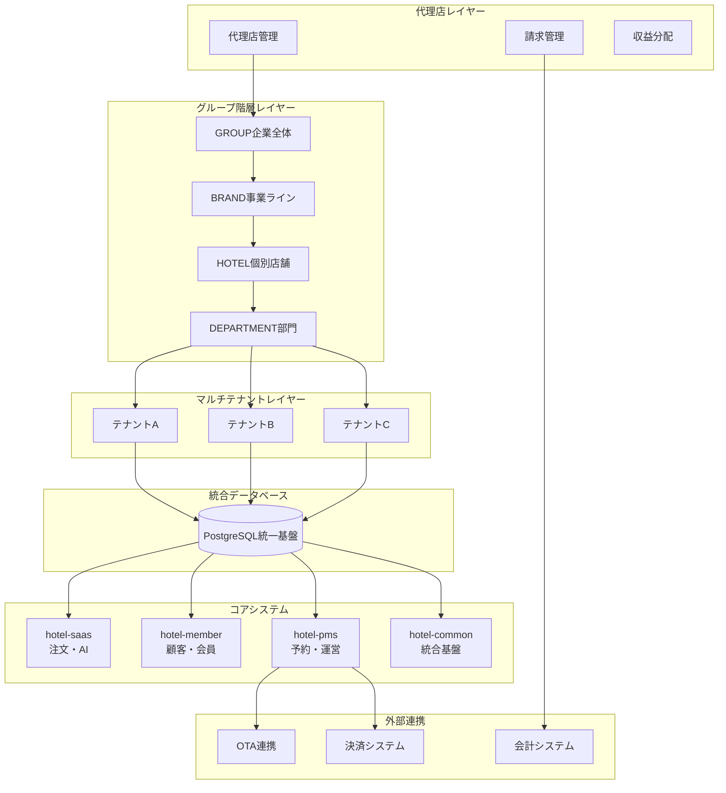
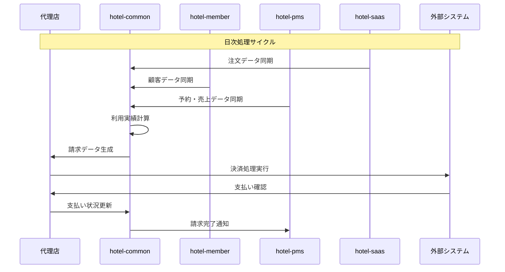

# 🌟 完全統合ホテルシステム - 最終モデル設計書

**策定日**: 2025年1月23日  
**対象**: 全ホテルシステム完全統合・代理店管理・料金請求・グループ連携  
**目的**: 複雑性を俯瞰した段階的実装のためのマスタープラン

---

## 🎯 **システム全体俯瞰図**

### **📊 完全統合アーキテクチャ**



---

## 📋 **完全データモデル設計**

### **🏢 代理店・請求管理テーブル群**

```sql
-- ================================
-- 代理店管理システム
-- ================================

-- 代理店マスタ
CREATE TABLE agencies (
  id TEXT PRIMARY KEY DEFAULT gen_random_uuid(),
  agency_code TEXT UNIQUE NOT NULL,
  agency_name TEXT NOT NULL,
  business_type agency_business_type NOT NULL, -- 'DIRECT', 'FRANCHISE', 'MANAGEMENT'
  contact_info JSONB NOT NULL DEFAULT '{}',
  contract_start_date DATE NOT NULL,
  contract_end_date DATE,
  commission_rate DECIMAL(5,4) NOT NULL DEFAULT 0.15, -- 15%手数料
  payment_terms TEXT NOT NULL DEFAULT 'monthly',
  status agency_status NOT NULL DEFAULT 'ACTIVE',
  created_at TIMESTAMP DEFAULT NOW(),
  updated_at TIMESTAMP DEFAULT NOW(),
  deleted_at TIMESTAMP
);

-- 代理店-テナント関係
CREATE TABLE agency_tenants (
  id TEXT PRIMARY KEY DEFAULT gen_random_uuid(),
  agency_id TEXT NOT NULL REFERENCES agencies(id),
  tenant_id TEXT NOT NULL REFERENCES tenants(id),
  management_type management_type_enum NOT NULL, -- 'FULL', 'BILLING_ONLY', 'SUPPORT_ONLY'
  commission_override DECIMAL(5,4), -- 個別手数料設定
  effective_from DATE NOT NULL DEFAULT CURRENT_DATE,
  effective_until DATE,
  created_at TIMESTAMP DEFAULT NOW(),
  
  UNIQUE(agency_id, tenant_id, effective_from)
);

-- システム利用料金プラン
CREATE TABLE service_plans (
  id TEXT PRIMARY KEY DEFAULT gen_random_uuid(),
  plan_code TEXT UNIQUE NOT NULL,
  plan_name TEXT NOT NULL,
  plan_type plan_type_enum NOT NULL, -- 'BASIC', 'STANDARD', 'PREMIUM', 'ENTERPRISE'
  base_monthly_fee DECIMAL(10,2) NOT NULL,
  user_unit_price DECIMAL(8,2) NOT NULL DEFAULT 0,
  room_unit_price DECIMAL(8,2) NOT NULL DEFAULT 0,
  transaction_fee_rate DECIMAL(5,4) NOT NULL DEFAULT 0,
  ai_credit_included INT NOT NULL DEFAULT 0,
  features JSONB NOT NULL DEFAULT '{}',
  max_tenants INT,
  max_users_per_tenant INT,
  is_active BOOLEAN DEFAULT true,
  created_at TIMESTAMP DEFAULT NOW(),
  updated_at TIMESTAMP DEFAULT NOW()
);

-- テナント料金設定
CREATE TABLE tenant_billing_configs (
  id TEXT PRIMARY KEY DEFAULT gen_random_uuid(),
  tenant_id TEXT NOT NULL REFERENCES tenants(id),
  service_plan_id TEXT NOT NULL REFERENCES service_plans(id),
  agency_id TEXT REFERENCES agencies(id),
  billing_cycle billing_cycle_enum NOT NULL DEFAULT 'MONTHLY', -- 'MONTHLY', 'QUARTERLY', 'YEARLY'
  custom_pricing JSONB DEFAULT '{}',
  auto_billing BOOLEAN DEFAULT true,
  billing_contact JSONB NOT NULL,
  effective_from DATE NOT NULL DEFAULT CURRENT_DATE,
  effective_until DATE,
  created_at TIMESTAMP DEFAULT NOW(),
  
  UNIQUE(tenant_id, effective_from)
);

-- 利用実績・請求データ
CREATE TABLE usage_records (
  id TEXT PRIMARY KEY DEFAULT gen_random_uuid(),
  tenant_id TEXT NOT NULL REFERENCES tenants(id),
  billing_period_start DATE NOT NULL,
  billing_period_end DATE NOT NULL,
  active_users_count INT NOT NULL DEFAULT 0,
  rooms_count INT NOT NULL DEFAULT 0,
  reservations_count INT NOT NULL DEFAULT 0,
  ai_credits_used INT NOT NULL DEFAULT 0,
  transaction_volume DECIMAL(15,2) NOT NULL DEFAULT 0,
  raw_usage_data JSONB NOT NULL DEFAULT '{}',
  calculated_at TIMESTAMP DEFAULT NOW(),
  
  UNIQUE(tenant_id, billing_period_start, billing_period_end)
);

-- 請求書
CREATE TABLE invoices (
  id TEXT PRIMARY KEY DEFAULT gen_random_uuid(),
  invoice_number TEXT UNIQUE NOT NULL,
  tenant_id TEXT NOT NULL REFERENCES tenants(id),
  agency_id TEXT REFERENCES agencies(id),
  usage_record_id TEXT NOT NULL REFERENCES usage_records(id),
  billing_period_start DATE NOT NULL,
  billing_period_end DATE NOT NULL,
  
  -- 料金計算内訳
  base_fee DECIMAL(10,2) NOT NULL DEFAULT 0,
  user_fees DECIMAL(10,2) NOT NULL DEFAULT 0,
  room_fees DECIMAL(10,2) NOT NULL DEFAULT 0,
  transaction_fees DECIMAL(10,2) NOT NULL DEFAULT 0,
  ai_credit_fees DECIMAL(10,2) NOT NULL DEFAULT 0,
  subtotal DECIMAL(10,2) NOT NULL,
  tax_amount DECIMAL(10,2) NOT NULL DEFAULT 0,
  total_amount DECIMAL(10,2) NOT NULL,
  
  -- 代理店手数料
  agency_commission DECIMAL(10,2) NOT NULL DEFAULT 0,
  net_amount DECIMAL(10,2) NOT NULL,
  
  status invoice_status NOT NULL DEFAULT 'DRAFT',
  issued_at TIMESTAMP,
  due_date DATE,
  paid_at TIMESTAMP,
  payment_method TEXT,
  notes TEXT,
  
  created_at TIMESTAMP DEFAULT NOW(),
  updated_at TIMESTAMP DEFAULT NOW()
);
```

### **🏗️ 拡張コアテーブル群**

```sql
-- ================================
-- サービス注文管理（hotel-saas統合）
-- ================================

-- サービス注文（統一基盤）
CREATE TABLE service_orders (
  id TEXT PRIMARY KEY DEFAULT gen_random_uuid(),
  tenant_id TEXT NOT NULL REFERENCES tenants(id),
  customer_id TEXT REFERENCES customers(id),
  reservation_id TEXT REFERENCES reservations(id),
  room_number TEXT NOT NULL,
  order_number TEXT UNIQUE NOT NULL,
  
  -- 注文内容
  order_items JSONB NOT NULL DEFAULT '[]',
  subtotal DECIMAL(10,2) NOT NULL,
  tax_amount DECIMAL(10,2) NOT NULL DEFAULT 0,
  service_charge DECIMAL(10,2) NOT NULL DEFAULT 0,
  total_amount DECIMAL(10,2) NOT NULL,
  
  -- 注文状態
  status order_status NOT NULL DEFAULT 'PENDING',
  ordered_at TIMESTAMP NOT NULL DEFAULT NOW(),
  delivered_at TIMESTAMP,
  billed_at TIMESTAMP,
  
  -- システム連携
  origin_system TEXT NOT NULL DEFAULT 'hotel-saas',
  synced_at TIMESTAMP DEFAULT NOW(),
  updated_by_system TEXT NOT NULL DEFAULT 'hotel-saas',
  
  -- PMS請求連携
  billing_status billing_status DEFAULT 'PENDING',
  invoice_id TEXT REFERENCES invoices(id),
  
  created_at TIMESTAMP DEFAULT NOW(),
  updated_at TIMESTAMP DEFAULT NOW(),
  deleted_at TIMESTAMP
);

-- サービスメニュー（統一基盤）
CREATE TABLE service_menu_items (
  id TEXT PRIMARY KEY DEFAULT gen_random_uuid(),
  tenant_id TEXT NOT NULL REFERENCES tenants(id),
  category_id TEXT NOT NULL,
  item_code TEXT NOT NULL,
  item_name TEXT NOT NULL,
  description TEXT,
  base_price DECIMAL(8,2) NOT NULL,
  
  -- 在庫・提供可能性
  is_available BOOLEAN DEFAULT true,
  stock_quantity INT,
  preparation_time_minutes INT DEFAULT 30,
  
  -- 提供条件
  available_hours JSONB DEFAULT '{}', -- 時間帯制限
  room_type_restrictions TEXT[],
  member_only BOOLEAN DEFAULT false,
  
  -- システム管理
  origin_system TEXT NOT NULL DEFAULT 'hotel-saas',
  synced_at TIMESTAMP DEFAULT NOW(),
  
  created_at TIMESTAMP DEFAULT NOW(),
  updated_at TIMESTAMP DEFAULT NOW(),
  deleted_at TIMESTAMP,
  
  UNIQUE(tenant_id, item_code)
);

-- ================================
-- スタッフ・権限管理（hotel-pms統合）
-- ================================

-- スタッフ管理（統一基盤）
CREATE TABLE staff_members (
  id TEXT PRIMARY KEY DEFAULT gen_random_uuid(),
  tenant_id TEXT NOT NULL REFERENCES tenants(id),
  organization_id TEXT REFERENCES organization_hierarchy(id),
  employee_id TEXT NOT NULL,
  name TEXT NOT NULL,
  email TEXT UNIQUE NOT NULL,
  phone TEXT,
  
  -- 認証情報
  password_hash TEXT NOT NULL,
  last_login_at TIMESTAMP,
  failed_login_count INT DEFAULT 0,
  is_locked BOOLEAN DEFAULT false,
  
  -- 勤務情報
  hire_date DATE NOT NULL,
  department TEXT,
  employment_status employment_status DEFAULT 'ACTIVE',
  
  -- システム権限
  system_permissions JSONB NOT NULL DEFAULT '{}',
  role_ids TEXT[] DEFAULT '{}',
  
  created_at TIMESTAMP DEFAULT NOW(),
  updated_at TIMESTAMP DEFAULT NOW(),
  deleted_at TIMESTAMP,
  
  UNIQUE(tenant_id, employee_id)
);

-- 役職・権限定義
CREATE TABLE staff_roles (
  id TEXT PRIMARY KEY DEFAULT gen_random_uuid(),
  tenant_id TEXT NOT NULL REFERENCES tenants(id),
  role_code TEXT NOT NULL,
  role_name TEXT NOT NULL,
  description TEXT,
  
  -- システム別権限
  hotel_pms_permissions JSONB DEFAULT '{}',
  hotel_member_permissions JSONB DEFAULT '{}',
  hotel_saas_permissions JSONB DEFAULT '{}',
  hotel_common_permissions JSONB DEFAULT '{}',
  
  -- 階層レベル権限
  hierarchy_level INT DEFAULT 1, -- 1-5
  can_access_child_tenants BOOLEAN DEFAULT false,
  
  is_active BOOLEAN DEFAULT true,
  created_at TIMESTAMP DEFAULT NOW(),
  updated_at TIMESTAMP DEFAULT NOW(),
  
  UNIQUE(tenant_id, role_code)
);

-- ================================
-- AI利用・クレジット管理
-- ================================

-- AI機能利用履歴
CREATE TABLE ai_usage_logs (
  id TEXT PRIMARY KEY DEFAULT gen_random_uuid(),
  tenant_id TEXT NOT NULL REFERENCES tenants(id),
  user_id TEXT REFERENCES users(id),
  staff_id TEXT REFERENCES staff_members(id),
  
  -- AI機能詳細
  ai_function_type ai_function_type_enum NOT NULL,
  function_name TEXT NOT NULL,
  input_data JSONB,
  output_data JSONB,
  
  -- コスト情報
  credits_consumed INT NOT NULL DEFAULT 1,
  processing_time_ms INT,
  
  -- システム情報
  source_system TEXT NOT NULL,
  api_endpoint TEXT,
  request_id TEXT,
  
  executed_at TIMESTAMP DEFAULT NOW(),
  
  INDEX(tenant_id, executed_at),
  INDEX(ai_function_type, executed_at)
);
```

### **📊 ENUM定義**

```sql
-- ================================
-- 列挙型定義
-- ================================

CREATE TYPE agency_business_type AS ENUM ('DIRECT', 'FRANCHISE', 'MANAGEMENT', 'SUPPORT');
CREATE TYPE agency_status AS ENUM ('ACTIVE', 'SUSPENDED', 'TERMINATED');
CREATE TYPE management_type_enum AS ENUM ('FULL', 'BILLING_ONLY', 'SUPPORT_ONLY');
CREATE TYPE plan_type_enum AS ENUM ('BASIC', 'STANDARD', 'PREMIUM', 'ENTERPRISE', 'CUSTOM');
CREATE TYPE billing_cycle_enum AS ENUM ('MONTHLY', 'QUARTERLY', 'YEARLY');
CREATE TYPE invoice_status AS ENUM ('DRAFT', 'ISSUED', 'SENT', 'PAID', 'OVERDUE', 'CANCELLED');
CREATE TYPE order_status AS ENUM ('PENDING', 'CONFIRMED', 'PREPARING', 'DELIVERED', 'CANCELLED');
CREATE TYPE billing_status AS ENUM ('PENDING', 'BILLED', 'PAID', 'REFUNDED');
CREATE TYPE employment_status AS ENUM ('ACTIVE', 'INACTIVE', 'TERMINATED', 'LEAVE');
CREATE TYPE ai_function_type_enum AS ENUM (
  'CONCIERGE_CHAT', 'RESERVATION_ASSIST', 'CUSTOMER_ANALYSIS', 
  'REVENUE_OPTIMIZATION', 'SENTIMENT_ANALYSIS', 'TRANSLATION',
  'RECOMMENDATION_ENGINE', 'PREDICTIVE_ANALYTICS'
);
```

---

## 🎯 **段階的実装タスク体系**

### **Phase 1: 統合基盤強化（2-3週間）**

```typescript
interface Phase1Tasks {
  マイグレーション適用: {
    priority: "CRITICAL",
    tasks: [
      "未適用マイグレーションの実行（room_grades等）",
      "schema_versionsの整合性確認",
      "既存データの検証・バックアップ"
    ]
  },
  
  TypeScriptエラー修正: {
    priority: "HIGH", 
    tasks: [
      "LogEntryインターフェース拡張（149個エラー対応）",
      "HotelMemberHierarchyAdapter実装",
      "型定義の統一・修正"
    ]
  },
  
  代理店基盤実装: {
    priority: "HIGH",
    tasks: [
      "agencies, service_plans テーブル作成",
      "基本的な代理店管理API実装",
      "料金プラン設定機能"
    ]
  }
}
```

### **Phase 2: システム間連携強化（3-4週間）**

```typescript
interface Phase2Tasks {
  hotel_saas統合: {
    priority: "HIGH",
    tasks: [
      "service_orders, service_menu_items テーブル作成",
      "SQLiteからPostgreSQL移行ツール作成",
      "注文データの統一基盤移行"
    ]
  },
  
  hotel_member接続: {
    priority: "HIGH", 
    tasks: [
      "prisma-client-py環境整備",
      "統一基盤への接続設定",
      "顧客データの段階的移行"
    ]
  },
  
  hotel_pms統合準備: {
    priority: "MEDIUM",
    tasks: [
      "staff_members, staff_roles テーブル作成",
      "権限管理システムの統合設計",
      "PMS予約システムの統一基盤接続"
    ]
  }
}
```

### **Phase 3: 請求・決済システム（4-5週間）**

```typescript
interface Phase3Tasks {
  請求管理実装: {
    priority: "HIGH",
    tasks: [
      "usage_records, invoices テーブル完全実装",
      "自動請求計算エンジン",
      "代理店手数料分配システム"
    ]
  },
  
  決済連携: {
    priority: "MEDIUM",
    tasks: [
      "外部決済システム連携",
      "自動支払い処理",
      "未払い管理・督促システム"
    ]
  },
  
  AI利用管理: {
    priority: "MEDIUM",
    tasks: [
      "ai_usage_logs テーブル実装",
      "クレジット消費追跡",
      "AI利用料金計算"
    ]
  }
}
```

### **Phase 4: グループ階層・完全統合（5-6週間）**

```typescript
interface Phase4Tasks {
  階層管理完全実装: {
    priority: "HIGH",
    tasks: [
      "4レベル階層の各システム適用",
      "階層別データ共有ポリシー実装",
      "上位組織からの統合ダッシュボード"
    ]
  },
  
  統合ダッシュボード: {
    priority: "MEDIUM",
    tasks: [
      "グループ全体売上分析",
      "テナント別パフォーマンス",
      "代理店収益レポート"
    ]
  },
  
  最終統合テスト: {
    priority: "CRITICAL",
    tasks: [
      "全システム統合テスト",
      "負荷テスト・パフォーマンス最適化",
      "本番環境移行準備"
    ]
  }
}
```

---

## 📊 **複雑性管理マトリックス**

### **システム間依存関係**

| 機能 | hotel-saas | hotel-member | hotel-pms | hotel-common | agencies | 外部連携 |
|------|------------|--------------|-----------|--------------|----------|----------|
| **顧客管理** | 参照 | 主管理 | 限定更新 | 統合基盤 | 参照 | - |
| **予約管理** | 参照 | 新規作成 | 主管理 | 統合基盤 | - | OTA連携 |
| **注文管理** | 主管理 | 参照 | 請求連携 | 統合基盤 | - | 決済連携 |
| **スタッフ管理** | - | - | 主管理 | 統合基盤 | 参照 | - |
| **請求管理** | 利用データ | 利用データ | 売上データ | 統合基盤 | 主管理 | 会計連携 |
| **AI機能** | 利用 | 利用 | 利用 | 利用管理 | 使用量管理 | - |

### **データ流れ・同期パターン**



---

## 🎯 **成功指標・完成定義**

### **段階別成功指標**

```typescript
interface SuccessMetrics {
  Phase1完了指標: {
    技術指標: [
      "TypeScriptエラー0件",
      "マイグレーション100%適用",
      "統合テスト通過率100%"
    ],
    機能指標: [
      "代理店登録機能動作",
      "基本料金プラン設定可能",
      "テナント-代理店関係設定可能"
    ]
  },
  
  Phase2完了指標: {
    技術指標: [
      "全システム統一DB接続完了",
      "データ同期遅延<5秒",
      "API応答時間<200ms"
    ],
    機能指標: [
      "注文から請求までの自動連携",
      "顧客データの統一管理",
      "予約データの統一管理"
    ]
  },
  
  最終完成指標: {
    技術指標: [
      "同時接続1000ユーザー対応",
      "99.9%可用性達成",
      "データ整合性100%維持"
    ],
    ビジネス指標: [
      "請求処理100%自動化",
      "代理店手数料自動分配",
      "階層別分析レポート提供"
    ]
  }
}
```

**ユーザーのご指摘により、システムの真の複雑性と完全統合への道筋が明確になりました。この最終モデルに向けて段階的に実装を進めます。** 