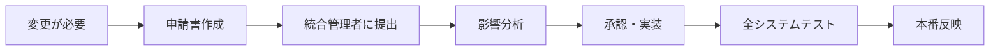

# 🗄️ 統一データベース管理ルール（必読・必守）

**対象**: Luna（hotel-pms）、Suno（hotel-member）、Sun（hotel-saas）  
**管理者**: 統合管理者（ユーザー）  
**重要度**: 🚨 **CRITICAL** - 違反はシステム全停止につながります

---

## 🎯 **基本原則**

### **統一データベースとは**
```
🏢 hotel-common PostgreSQL = 全システム共通のデータ保管庫
📄 prisma/schema.prisma = データベースの設計図（1つのみ）
⚙️ 各システム = 同じデータベースを見る異なる窓口
```

### **なぜ統一管理が必要？**
- ✅ **データ整合性**: 全システムで同じ情報を共有
- ✅ **リアルタイム同期**: 変更が即座に全システムに反映
- ⚠️ **1つが壊れると全て停止**: だからこそ慎重な管理が必要

---

## 🚫 **絶対禁止事項**

### **❌ 勝手にやってはいけないこと**
```bash
# 絶対にやってはいけない操作
❌ prisma/schema.prisma の直接編集
❌ npx prisma db push の実行
❌ npx prisma migrate の実行
❌ 独自スキーマファイルの作成
❌ 別データベースへの接続変更
```

### **⚠️ 違反時の影響**
```
個人の変更 → 全システム停止 → 全ホテル業務停止
復旧作業: 数時間〜数日
責任: 変更者が全責任を負う
```

---

## ✅ **正しい手順**

### **データベース変更が必要な時**


### **申請が必要な変更**
- 🔧 **テーブル追加・削除**
- 🔧 **フィールド追加・削除・変更**
- 🔧 **データ型変更**
- 🔧 **インデックス追加・削除**
- 🔧 **制約追加・削除**

---

## 📝 **申請プロセス**

### **Step 1: 申請書作成**
```yaml
# スキーマ変更申請書
申請者: [Luna/Suno/Sun]
システム名: [hotel-pms/hotel-member/hotel-saas]
変更内容: [具体的な変更内容]
変更理由: [なぜ必要か]
影響範囲: [どのシステムに影響するか]
緊急度: [通常/高/緊急]
希望実施日: [いつまでに必要か]
テスト方法: [どのように動作確認するか]
```

### **Step 2: 影響分析（統合管理者が実施）**
- 🔍 他システムへの影響調査
- 🧪 必要なテスト計画立案
- ⏰ 実装スケジュール調整
- 🛡️ ロールバック計画策定

### **Step 3: 承認・実装**
- ✅ 承認後、統合管理者が実装
- 📋 全システムでの動作確認
- 🚀 段階的な本番反映

---

## ⚡ **緊急度別の処理時間**

| 緊急度 | 処理時間 | 適用例 |
|--------|----------|--------|
| **緊急** | 2時間以内 | システム停止バグ修正 |
| **高** | 24時間以内 | 重要機能の不具合修正 |
| **通常** | 1週間以内 | 新機能追加・改善 |

---

## 💼 **各システムの役割分担**

### **🌙 Luna（hotel-pms）**
- **管理データ**: 予約、客室状況、チェックイン/アウト
- **申請例**: 客室管理フィールド追加、予約ステータス変更

### **⚡ Suno（hotel-member）**
- **管理データ**: 顧客情報、会員ランク、ポイント
- **申請例**: 顧客属性追加、ポイント計算ロジック変更

### **☀️ Sun（hotel-saas）**
- **管理データ**: 注文、サービスメニュー、AIコンシェルジュ
- **申請例**: 注文システム拡張、メニューカテゴリ追加

---

## 🔧 **現在使用可能な操作**

### **✅ 安全に実行可能な操作**
```bash
# データの参照・作成・更新・削除
✅ await db.customers.findMany()
✅ await db.reservations.create({...})
✅ await db.rooms.update({...})
✅ await db.orders.delete({...})

# スキーマに影響しない操作
✅ データの検索・フィルタリング
✅ 既存フィールドでの並び替え
✅ ビジネスロジックの変更
```

---

## 🚨 **緊急時対応**

### **システム停止時の連絡先**
```
統合管理者: [連絡方法]
緊急時チャット: [チャットルーム]
エスカレーション: [上位責任者]
```

### **応急処置**
1. **即座停止**: 問題のある操作を中断
2. **状況報告**: 統合管理者に即座連絡
3. **ログ保存**: エラーログを保存・共有
4. **待機**: 指示があるまで追加操作禁止

---

## 📋 **申請書テンプレート**

```markdown
# スキーマ変更申請書

## 基本情報
- **申請者**: [名前]
- **システム**: [hotel-pms/hotel-member/hotel-saas]
- **申請日**: [日付]
- **緊急度**: [通常/高/緊急]

## 変更内容
### 変更対象
- **テーブル名**: 
- **操作種別**: [追加/変更/削除]
- **具体的変更**: 

### 変更理由
- **背景**: 
- **解決したい課題**: 
- **期待効果**: 

## 影響分析
### 影響システム
- [ ] hotel-pms
- [ ] hotel-member  
- [ ] hotel-saas
- [ ] hotel-common

### 必要な対応
- **各システムでの修正内容**: 
- **データ移行の必要性**: 
- **ダウンタイムの有無**: 

## テスト計画
- **テスト内容**: 
- **テスト環境**: 
- **確認項目**: 

## スケジュール
- **希望実施日**: 
- **完了予定日**: 
- **関連する他の作業**: 
```

---

## 📞 **申請・質問の連絡方法**

### **申請提出**
1. 申請書を作成
2. 統合管理者に提出
3. 承認待ち
4. 指示に従って対応

### **質問・相談**
- 💬 **事前相談歓迎**: 変更が必要か迷った時
- 🤝 **設計相談**: より良い実装方法の相談
- 🆘 **トラブル相談**: 問題発生時の対応

---

## 🎯 **まとめ**

### **覚えておくべき3つのルール**
1. **🚫 勝手にスキーマを変更しない**
2. **📝 変更は必ず申請する**  
3. **🆘 困ったら即座に相談する**

### **統一データベースの恩恵**
- 💫 **データの整合性**: 常に正確な情報
- ⚡ **リアルタイム同期**: 即座の情報反映
- 🛡️ **安定したシステム**: 計画的な変更管理

**このルールを守ることで、全システムが安定して動作し、ホテル業務を支える信頼性の高いシステムを維持できます。**

---

**🔖 このドキュメントは定期的に更新されます。最新版を必ず確認してください。** 