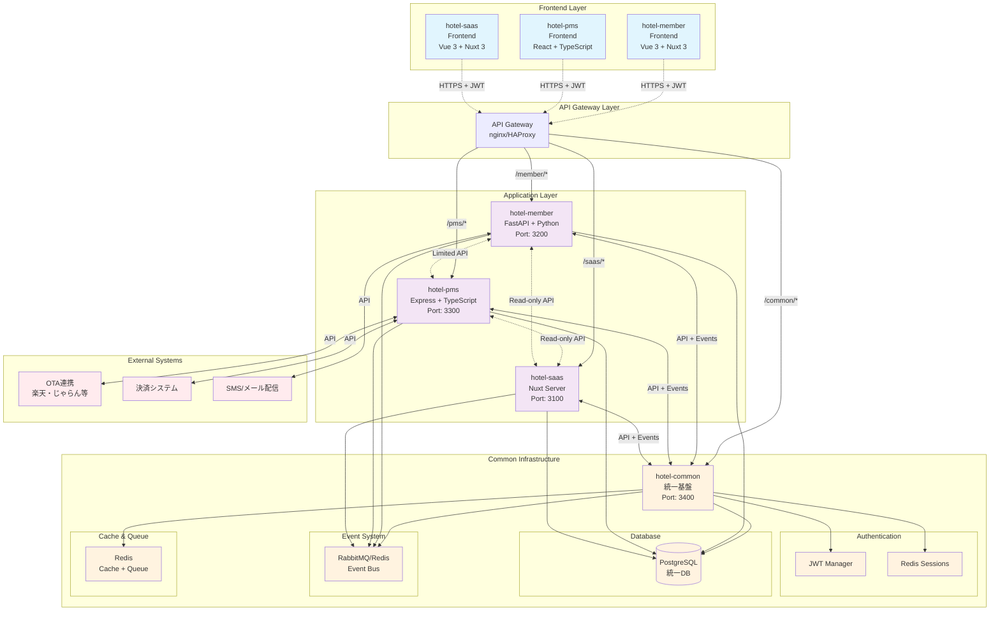
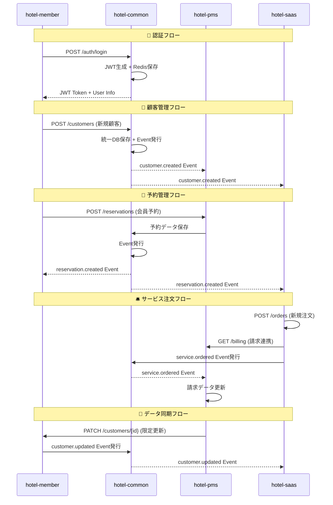
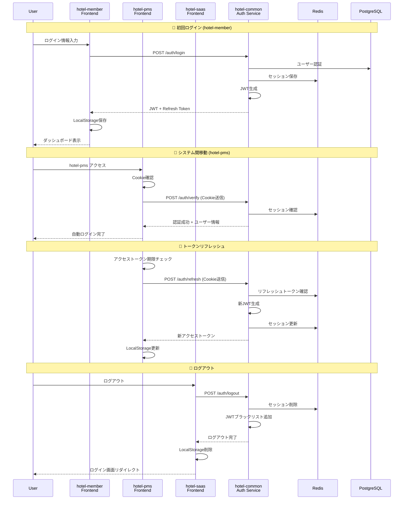
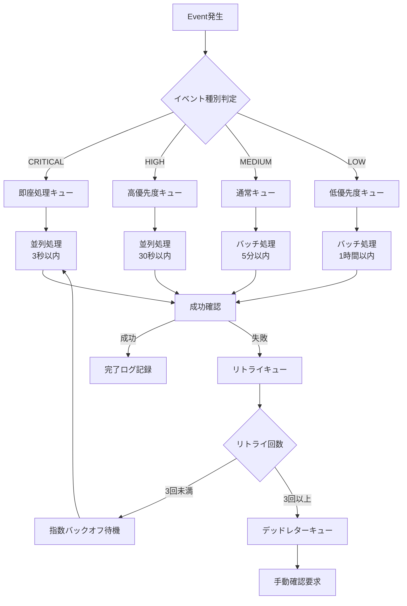
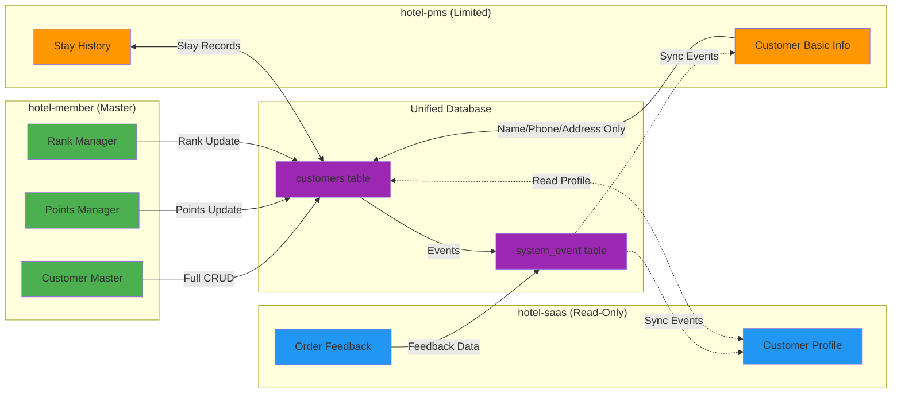
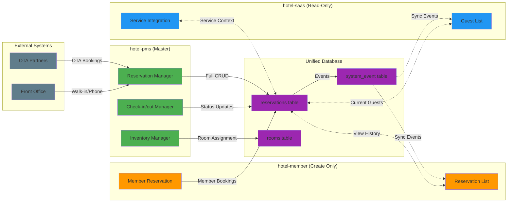
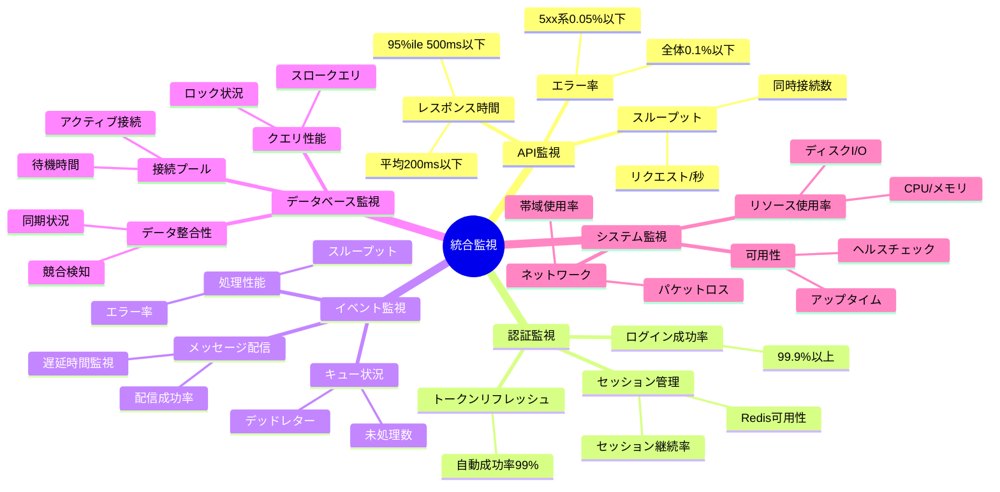

# システム統合マップ (System Integration Map)

**作成日**: 2024年12月28日  
**バージョン**: 1.0.0  
**対象システム**: hotel-common, hotel-member, hotel-pms, hotel-saas  
**目的**: システム間連携の全体像把握・設計確認・運用管理

## 1. 全体アーキテクチャ図 (Overall Architecture)

### 1.1 システム間連携概要



## 2. API連携マップ (API Integration Map)

### 2.1 REST API 連携図



### 2.2 API エンドポイント詳細マッピング

#### hotel-member API
```
🔗 External APIs
POST   /api/v2/auth/login                    # ログイン
POST   /api/v2/auth/refresh                  # トークンリフレッシュ
POST   /api/v2/auth/logout                   # ログアウト

👥 Customer Management APIs  
GET    /api/v2/customers                     # 顧客一覧
POST   /api/v2/customers                     # 顧客作成
GET    /api/v2/customers/{id}                # 顧客詳細
PUT    /api/v2/customers/{id}                # 顧客更新
DELETE /api/v2/customers/{id}                # 顧客削除

💎 Member-Specific APIs
GET    /api/v2/customers/{id}/points         # ポイント履歴
POST   /api/v2/customers/{id}/points         # ポイント操作
GET    /api/v2/customers/{id}/rank           # ランク情報
PUT    /api/v2/customers/{id}/rank           # ランク変更

🏨 Reservation Integration
POST   /api/v2/reservations                  # 会員予約作成
GET    /api/v2/reservations/member/{id}      # 会員予約履歴
```

#### hotel-pms API
```
🏨 Reservation Management APIs
GET    /api/v2/reservations                  # 予約一覧
POST   /api/v2/reservations                  # 予約作成
GET    /api/v2/reservations/{id}             # 予約詳細
PUT    /api/v2/reservations/{id}             # 予約更新
DELETE /api/v2/reservations/{id}             # 予約キャンセル

🛏️ Room Management APIs
GET    /api/v2/rooms                         # 部屋一覧
GET    /api/v2/rooms/availability            # 空室状況
PUT    /api/v2/rooms/{id}/status             # 部屋状態更新
POST   /api/v2/rooms/{id}/maintenance        # メンテナンス設定

👥 Customer Management (Limited)
GET    /api/v2/customers/{id}                # 顧客詳細取得
PATCH  /api/v2/customers/{id}/basic          # 基本情報更新のみ

🏨 Front Office APIs
POST   /api/v2/reservations/{id}/checkin     # チェックイン
POST   /api/v2/reservations/{id}/checkout    # チェックアウト
GET    /api/v2/occupancy/today               # 今日の稼働状況
```

#### hotel-saas API  
```
🛎️ Service Management APIs
POST   /api/v2/orders                        # 注文作成
GET    /api/v2/orders                        # 注文一覧
PUT    /api/v2/orders/{id}/status            # 注文状態更新
GET    /api/v2/orders/customer/{id}          # 顧客注文履歴

🎯 Concierge APIs
POST   /api/v2/concierge/requests            # コンシェルジュ依頼
GET    /api/v2/concierge/services            # 利用可能サービス
PUT    /api/v2/concierge/{id}/status         # 依頼状態更新

👥 Customer Data (Read-Only)
GET    /api/v2/customers/{id}                # 顧客基本情報
GET    /api/v2/customers/search              # 顧客検索
GET    /api/v2/reservations/current          # 現在滞在中ゲスト
```

## 3. 認証連携マップ (Authentication Integration Map)

### 3.1 SSO認証フロー



### 3.2 JWT クレーム統一仕様

```typescript
// 統一JWTペイロード構造
interface UnifiedJWTPayload {
  // RFC 7519 標準クレーム
  iss: "hotel-common-auth"           // 発行者
  sub: string                        // ユーザーID (UUID)
  aud: ["hotel-member", "hotel-pms", "hotel-saas"] // 対象システム
  exp: number                        // 有効期限 (8時間)
  iat: number                        // 発行時刻
  jti: string                        // JWT ID (Redis管理)

  // Hotel固有クレーム
  tenant_id: string                  // テナントID
  email: string                      // メールアドレス  
  role: "STAFF"|"MANAGER"|"ADMIN"|"OWNER"|"SYSTEM"
  level: 1|2|3|4|5                  // 権限レベル
  permissions: string[]              // 詳細権限

  // セッション管理
  session_id: string                 // Redisセッション識別子
  device_id?: string                 // デバイス識別子
  ip_address?: string                // 発行時IP
}
```

## 4. イベント連携マップ (Event Integration Map)

### 4.1 Event-driven アーキテクチャ

```mermaid
graph LR
    subgraph "Event Publishers"
        HM[hotel-member]
        HP[hotel-pms] 
        HS[hotel-saas]
    end

    subgraph "Event Infrastructure"
        EB[Event Bus<br/>Redis Streams/RabbitMQ]
        EQ[Event Queue]
        EH[Event Handler]
    end

    subgraph "Event Consumers"
        HM2[hotel-member<br/>Consumer]
        HP2[hotel-pms<br/>Consumer]
        HS2[hotel-saas<br/>Consumer]
    end

    subgraph "Event Storage"
        DB[(PostgreSQL<br/>system_event)]
        LOG[Event Logs]
    end

    %% Publishing
    HM -->|customer.* events| EB
    HP -->|reservation.* events| EB  
    HS -->|service.* events| EB

    %% Infrastructure
    EB --> EQ
    EQ --> EH
    EH --> DB
    EH --> LOG

    %% Consuming
    EB -.->|customer.updated| HP2
    EB -.->|customer.updated| HS2
    EB -.->|reservation.created| HM2
    EB -.->|reservation.created| HS2
    EB -.->|service.ordered| HP2
```

### 4.2 イベント種別とフロー

#### 4.2.1 顧客関連イベント
```yaml
Publisher: hotel-member
Events:
  customer.created:
    trigger: 新規顧客作成
    payload: { customer_id, tenant_id, customer_data }
    consumers: [hotel-pms, hotel-saas]
    priority: MEDIUM
    
  customer.updated:  
    trigger: 顧客情報更新
    payload: { customer_id, tenant_id, changed_fields, before_data, after_data }
    consumers: [hotel-pms, hotel-saas]
    priority: HIGH
    
  customer.rank_changed:
    trigger: 会員ランク変更
    payload: { customer_id, old_rank, new_rank, effective_date }
    consumers: [hotel-pms, hotel-saas]
    priority: MEDIUM
    
  customer.points_changed:
    trigger: ポイント増減
    payload: { customer_id, point_change, new_balance, transaction_type }
    consumers: [hotel-saas]
    priority: LOW
```

#### 4.2.2 予約関連イベント
```yaml
Publisher: hotel-pms
Events:
  reservation.created:
    trigger: 新規予約作成
    payload: { reservation_id, customer_id, tenant_id, reservation_data }
    consumers: [hotel-member, hotel-saas]
    priority: HIGH
    
  reservation.updated:
    trigger: 予約情報変更
    payload: { reservation_id, changed_fields, before_data, after_data }
    consumers: [hotel-member, hotel-saas]
    priority: HIGH
    
  checkin_checkout.checked_in:
    trigger: チェックイン完了
    payload: { reservation_id, customer_id, room_number, checkin_time }
    consumers: [hotel-member, hotel-saas]
    priority: CRITICAL
    
  checkin_checkout.checked_out:
    trigger: チェックアウト完了  
    payload: { reservation_id, customer_id, checkout_time, final_charges }
    consumers: [hotel-member, hotel-saas]
    priority: CRITICAL
    
  reservation.cancelled:
    trigger: 予約キャンセル
    payload: { reservation_id, cancellation_reason, cancelled_by }
    consumers: [hotel-member, hotel-saas]
    priority: HIGH
```

#### 4.2.3 サービス関連イベント
```yaml
Publisher: hotel-saas  
Events:
  service.ordered:
    trigger: サービス注文作成
    payload: { order_id, customer_id, reservation_id, service_details, amount }
    consumers: [hotel-pms]
    priority: HIGH
    
  service.completed:
    trigger: サービス提供完了
    payload: { order_id, completion_time, satisfaction_rating }
    consumers: [hotel-pms, hotel-member]
    priority: MEDIUM
    
  concierge.requested:
    trigger: コンシェルジュ依頼
    payload: { request_id, customer_id, request_type, details }
    consumers: [hotel-pms]
    priority: MEDIUM
    
  feedback.submitted:
    trigger: フィードバック投稿
    payload: { feedback_id, customer_id, rating, comments }
    consumers: [hotel-member, hotel-pms]
    priority: LOW
```

### 4.3 イベント処理パイプライン



## 5. データフロー図 (Data Flow Diagram)

### 5.1 顧客データフロー



### 5.2 予約データフロー



## 6. 運用監視マップ (Operations Monitoring Map)

### 6.1 監視ポイント



### 6.2 アラート設定

| 監視項目 | 警告閾値 | 重大閾値 | 対応者 | 対応時間 |
|----------|----------|----------|--------|----------|
| API応答時間 | 1秒 | 3秒 | 運用チーム | 5分 |
| エラー率 | 1% | 5% | 開発チーム | 即座 |
| 認証失敗率 | 5% | 10% | セキュリティ | 即座 |
| DB接続エラー | 1件 | 5件 | DBA | 即座 |
| Redis障害 | 接続不可 | - | インフラ | 即座 |
| イベント遅延 | 5分 | 15分 | 開発チーム | 10分 |
| ディスク使用率 | 80% | 90% | インフラ | 30分 |

---

## 📝 実装確認チェックリスト

### API連携
- [ ] 全エンドポイントの動作確認
- [ ] レスポンス形式統一確認
- [ ] エラーハンドリング一貫性
- [ ] 認証ヘッダー統一

### 認証連携  
- [ ] SSO動作確認
- [ ] JWT検証動作確認
- [ ] セッション管理動作確認
- [ ] 自動リフレッシュ動作確認

### イベント連携
- [ ] 全イベント種別の配信確認
- [ ] 優先度別処理確認
- [ ] 失敗時リトライ確認
- [ ] デッドレター処理確認

### 運用監視
- [ ] 監視ダッシュボード設定
- [ ] アラート設定確認
- [ ] ログ収集設定
- [ ] 障害対応手順確認

**注意事項**:
1. この統合マップは実装時の完全なガイドラインです
2. 各連携ポイントの動作確認を必ず実施してください
3. 監視設定は本番稼働前に必ず動作確認してください
4. 障害時の手順書は別途詳細化してください 