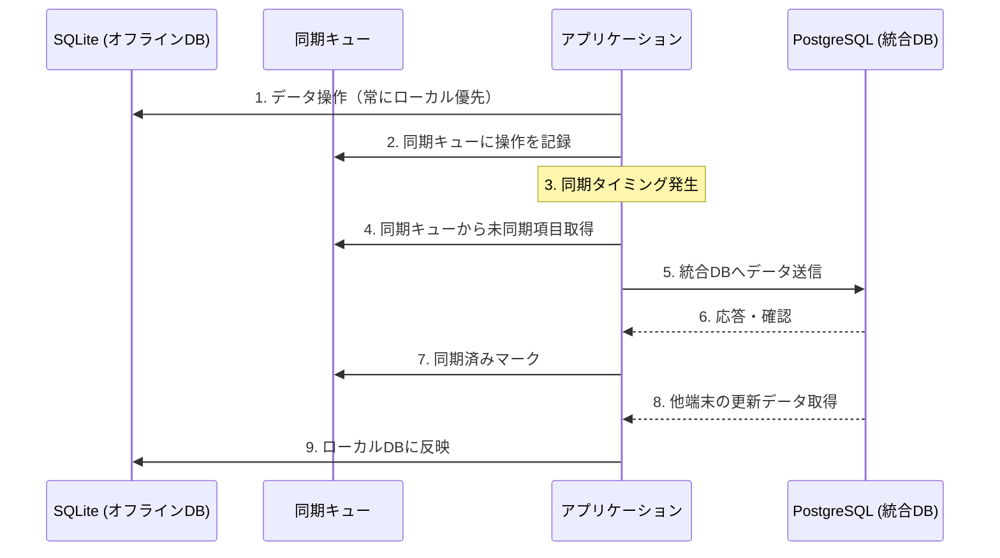

# 🔄 オフラインDB管理ガイド

## OmotenasuAI PMS "Tsukuyomi" オフラインデータベース運用指針

**作成日**: 2025-02-15  
**対象**: 開発・運用チーム向け  
**ステータス**: 確定

---

## 📋 概要

本ドキュメントはhotel-pmsシステムにおけるオフラインデータベース（SQLite）と統合データベース（PostgreSQL）の運用方法、同期メカニズム、およびベストプラクティスをまとめたものです。

---

## 🏗 基本アーキテクチャ

### 二重データベース構造

| データベース | 技術 | 役割 | 配置場所 |
|------------|------|------|---------|
| **オフラインDB** | SQLite | 日常業務の全処理、オフライン動作保証 | 各フロント端末のローカルストレージ |
| **統合DB** | PostgreSQL | システム間データ共有、履歴保存 | クラウド/中央サーバー |

### デプロイメント形態

- **Electron版** (ポート3301): Windows/Mac向けデスクトップアプリ
- **ブラウザ版** (ポート3300): Webブラウザからアクセス可能版
  - 注: ブラウザ版はオフライン機能に制限あり

---

## 🔄 データ同期の仕組み

### 同期タイミング

1. **定期自動同期**
   - デフォルト間隔: 5分 (300,000ミリ秒)
   - 環境変数 `SYNC_INTERVAL` で調整可能

2. **イベントトリガー同期**
   - 重要データ更新時（予約作成・更新時など）
   - チェックイン/アウト処理完了時
   - 顧客情報更新時

3. **手動同期**
   - ユーザーによる明示的なリクエスト時
   - 管理画面からの強制実行時

4. **ネットワーク状態変化時**
   - オフラインからオンラインへの復帰時
   - 長時間オフライン後の接続回復時

5. **起動時同期**
   - システム起動時に差分確認・同期実行

### 同期フロー

### 優先度管理

- 同期キューの優先度: 1-10（高いほど優先）
- 重要トランザクション（予約・会計関連）: 優先度8-10
- 一般データ更新: 優先度5
- マスタデータ同期: 優先度3

---

## 🖥 複数端末環境での運用

### データフロー

- 各端末は独自のSQLiteデータベースを保持
- 端末間の直接通信はなし
- 統合DBを介したデータ伝播
  - 端末A → 統合DB → 端末B

### 競合解決

- タイムスタンプベースの基本ルール
- 後に更新されたデータが優先
- 特定データタイプ（予約など）は専用の競合解決ロジック適用
- 解決不能な競合はログ記録と管理者通知

### 端末役割

- マスター端末とサブ端末の区分け
- 特定操作（日締め、レポート出力など）はマスター端末のみ
- 権限設定により端末ごとに操作範囲を制限

---

## 💾 データ保有ポリシー

### オフラインDBの保有期間

| データ種別 | 保有期間 | 備考 |
|----------|---------|------|
| 進行中予約 | 全て | チェックアウト前の全予約 |
| 過去予約 | 3ヶ月 | チェックアウト済み |
| 会計データ | 6ヶ月 | 取引記録、領収書情報 |
| マスタデータ | 全て | 客室情報、料金設定など |

### データ容量管理

- SQLiteファイルサイズ上限: 約500MB（標準設定）
- 容量超過時は自動アーカイブ処理実行
- アーカイブデータは統合DBに完全保存
- 必要に応じてアーカイブデータの再取得が可能

### クリーンアップ

- 定期メンテナンス時に古いデータを自動クリーンアップ
- 統合DBへの完全同期確認後に削除処理実行
- 手動クリーンアップ機能も管理者向けに提供

---

## 🔧 トラブルシューティング

### 一般的な問題と解決策

| 問題 | 対応策 |
|-----|--------|
| 同期エラー | 1. 手動同期実行 2. アプリ再起動 3. 同期ログ確認 |
| データ競合 | 1. 競合内容確認 2. 手動解決選択 3. 必要に応じてデータ復元 |
| DB破損 | 1. バックアップから復元 2. 統合DBから再同期 |

### 同期状態の確認方法

- UI上の同期インジケーター確認
- 管理画面の同期ステータス画面
- ログファイル（`sync.log`）の確認

---

## 📊 パフォーマンス最適化

### SQLiteチューニング

- インデックス最適化
- 定期的なVACUUM実行
- トランザクション適切な使用

### 同期効率化

- バッチ処理によるネットワークコール最小化
- 差分同期による転送データ量削減
- 圧縮転送オプション

---

## 📝 関連ドキュメント

- [phase-1-use-case-definition.md](./phase-1-use-case-definition.md) - オフラインファースト設計の基本方針
- [sync-flow.md](./sync-flow.md) - 同期の仕組みと頻度に関する詳細
- [system-integration.md](./system-integration.md) - システム間連携の基本設計
- [integration-implementation-plan.md](./integration-implementation-plan.md) - 段階的な統合実装計画
- [offline-error-handling.md](./offline-error-handling.md) - オフライン時のエラー処理方針

---

**作成者**: Luna (hotel-pms専門AI)  
**承認者**: 開発チームリーダー