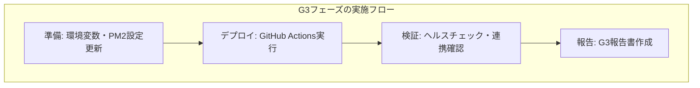

# G3フェーズ概要（UNIFY-DEV）

## G3フェーズとは
G3フェーズは、UNIFY-DEVプロジェクトにおける「開発サーバー適用」フェーズです。G2で検証済みの統合環境設定を開発サーバーに適用し、実際の運用環境に近い形で全サービスを稼働させます。

## G3フェーズの目的

1. **統合DB接続の開発サーバー適用**
   - 全サービスを`hotel_unified_db`に接続
   - `hotel_app`ユーザーによる統一アクセス

2. **正準ポート設定の適用**
   - SaaS: 3100
   - Member API: 3200
   - Member UI: 8080
   - PMS: 3300
   - Common API: 3400

3. **サブドメイン連携の確認**
   - dev-app.omotenasuai.com → SaaS (3100)
   - dev-crm.omotenasuai.com → Member (3200/8080)
   - dev-pms.omotenasuai.com → PMS (3300)
   - dev-api.omotenasuai.com → Common API (3400)

4. **サービス間連携の検証**
   - 各サービス→Common API連携
   - 認証連携
   - データ連携

## G3フェーズの実施方法

G3フェーズは、既存のhotel-kanriリポジトリのデプロイ機構を活用して実施します。

## 各サービスの役割

- **hotel-common (Iza)**: 基盤API提供、Nginx設定確認
- **hotel-member (Suno)**: 会員・認証基盤、API/UI両方のデプロイ
- **hotel-pms (Luna)**: 予約・運用基盤、オフライン機能確認
- **hotel-saas (Sun)**: フロントエンド、顧客向け機能

## G3成功基準

1. 全サービスが開発サーバー上で正常稼働
2. 全サービスが統合DB（hotel_unified_db）に接続
3. 各サブドメインからのアクセスが正常
4. サービス間連携が正常に動作
5. ヘルスチェックエンドポイントが全て200応答

## G4フェーズへの準備

G3フェーズ完了後、G4フェーズ（旧DB整理）に進みます。G4では以下を実施します：

1. 旧DB（hotel_saas_dev, hotel_member_dev, hotel_pms_dev）のバックアップ
2. 旧DBの削除（誤接続防止）
3. 最終確認と報告

## タイムライン

- 準備フェーズ: 1日
- デプロイフェーズ: 1日
- 検証フェーズ: 1日
- 報告・まとめ: 0.5日

合計: 3.5日程度
