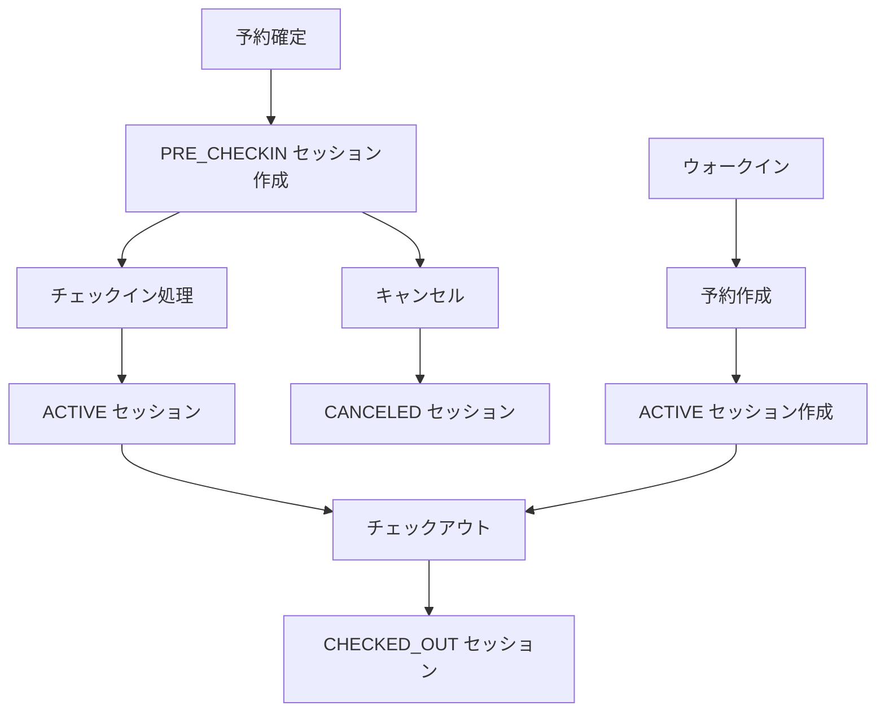

# 🏗️ 【hotel-common追加質問回答】技術実装詳細回答書

**作成日**: 2025年1月19日  
**対象**: hotel-commonチーム  
**回答者**: hotel-kanri統合管理システム  
**優先度**: 🔴 **最高優先度**

---

## 📋 **追加質問への詳細回答**

### **1. Order.id の型互換性について**

#### **現在のOrder.id型の確認と対応戦略**

**✅ 段階的型移行戦略**:
```typescript
// Phase 1: 既存Int型IDの保持 + 新UUID追加
model ServiceOrder {
  // 既存フィールド（互換性維持）
  id                Int                @id @default(autoincrement()) // 既存のInt型ID
  legacy_id         Int?               // 移行期間中のバックアップ
  
  // 新規フィールド
  uuid              String             @unique @default(uuid()) // 新しいUUID
  sessionId         String?            // セッションとの紐付け
  
  serviceId         String
  roomId            String?            // 段階的にnullableに
  customerId        String?
  quantity          Int                @default(1)
  status            OrderStatus        @default(PENDING)
  requestedAt       DateTime           @default(now())
  completedAt       DateTime?
  amount            Decimal
  notes             String?
  
  // リレーション
  service           Service            @relation(fields: [serviceId], references: [id])
  session           CheckinSession?    @relation(fields: [sessionId], references: [id])
  
  @@index([id])           // 既存インデックス維持
  @@index([uuid])         // 新規UUIDインデックス
  @@index([sessionId])    // セッション検索用
  @@map("service_orders")
}
```

#### **互換性レイヤーの実装**
```typescript
// API互換性レイヤー
interface OrderCompatibilityService {
  // 既存Int ID APIとの互換性維持
  async getOrderById(id: number): Promise<ServiceOrder> {
    return await prisma.serviceOrder.findUnique({
      where: { id }
    });
  }
  
  // 新UUID API
  async getOrderByUuid(uuid: string): Promise<ServiceOrder> {
    return await prisma.serviceOrder.findUnique({
      where: { uuid }
    });
  }
  
  // 統合検索（Int ID または UUID）
  async getOrder(identifier: string | number): Promise<ServiceOrder> {
    if (typeof identifier === 'number') {
      return await this.getOrderById(identifier);
    }
    
    // UUID形式チェック
    if (this.isUUID(identifier)) {
      return await this.getOrderByUuid(identifier);
    }
    
    // Int文字列の場合
    const intId = parseInt(identifier);
    if (!isNaN(intId)) {
      return await this.getOrderById(intId);
    }
    
    throw new Error('Invalid order identifier');
  }
  
  private isUUID(str: string): boolean {
    const uuidRegex = /^[0-9a-f]{8}-[0-9a-f]{4}-[1-5][0-9a-f]{3}-[89ab][0-9a-f]{3}-[0-9a-f]{12}$/i;
    return uuidRegex.test(str);
  }
}
```

#### **段階的移行スケジュール**
```yaml
Week 1: 
  - ServiceOrderテーブルにuuid列追加
  - 既存レコードにUUID生成・設定
  - 互換性APIレイヤー実装

Week 2-4: 
  - 新規作成はUUID使用
  - 既存システムはInt ID継続使用
  - 段階的にUUID移行

Week 5-8: 
  - 全システムUUID対応完了
  - Int ID廃止準備
  - 最終移行
```

### **2. セッション作成のタイミング**

#### **セッション作成フローの詳細設計**

**✅ 3段階セッション管理**:
```typescript
enum SessionCreationTiming {
  RESERVATION_CONFIRMED = 'RESERVATION_CONFIRMED',  // 予約確定時
  PRE_CHECKIN = 'PRE_CHECKIN',                     // チェックイン前
  CHECKIN_PROCESS = 'CHECKIN_PROCESS'              // チェックイン時
}

interface SessionCreationFlow {
  // 1. 予約確定時（PRE_CHECKIN状態）
  async createPreCheckinSession(reservationId: string): Promise<CheckinSession> {
    const reservation = await getReservation(reservationId);
    
    return await prisma.checkinSession.create({
      data: {
        tenantId: reservation.tenantId,
        sessionNumber: await generateSessionNumber(reservation.roomId, reservation.checkInDate),
        reservationId: reservation.id,
        roomId: reservation.roomId,
        customerId: reservation.customerId,
        guestInfo: await buildGuestInfoFromReservation(reservation),
        adults: reservation.adults,
        children: reservation.children,
        checkInAt: reservation.checkInDate, // 予定時刻
        plannedCheckOut: reservation.checkOutDate,
        status: 'PRE_CHECKIN', // 重要: PRE_CHECKIN状態
        specialRequests: reservation.specialRequests
      }
    });
  }
  
  // 2. 実際のチェックイン時（ACTIVE状態に変更）
  async activateSession(sessionId: string, actualCheckInTime: Date): Promise<CheckinSession> {
    return await prisma.checkinSession.update({
      where: { id: sessionId },
      data: {
        checkInAt: actualCheckInTime, // 実際のチェックイン時刻
        status: 'ACTIVE',
        updatedAt: new Date()
      }
    });
  }
  
  // 3. ウォークイン（予約なし）の場合
  async createWalkInSession(walkInData: WalkInSessionData): Promise<CheckinSession> {
    // まず予約レコード作成
    const reservation = await prisma.reservation.create({
      data: {
        tenantId: walkInData.tenantId,
        reservationNumber: await generateReservationNumber(),
        customerId: walkInData.customerId,
        roomId: walkInData.roomId,
        checkInDate: walkInData.checkInTime,
        checkOutDate: walkInData.plannedCheckOut,
        adults: walkInData.adults,
        children: walkInData.children,
        status: 'CONFIRMED',
        origin: 'WALK_IN', // 重要: ウォークイン識別
        totalAmount: walkInData.estimatedAmount,
        createdById: walkInData.staffId,
        updatedById: walkInData.staffId
      }
    });
    
    // 即座にACTIVEセッション作成
    return await prisma.checkinSession.create({
      data: {
        tenantId: walkInData.tenantId,
        sessionNumber: await generateSessionNumber(walkInData.roomId, walkInData.checkInTime),
        reservationId: reservation.id,
        roomId: walkInData.roomId,
        customerId: walkInData.customerId,
        guestInfo: walkInData.guestInfo,
        adults: walkInData.adults,
        children: walkInData.children,
        checkInAt: walkInData.checkInTime, // 実際のチェックイン時刻
        plannedCheckOut: walkInData.plannedCheckOut,
        status: 'ACTIVE', // 重要: 即座にACTIVE
        specialRequests: walkInData.specialRequests,
        notes: 'Walk-in guest'
      }
    });
  }
}
```

#### **セッション状態遷移図**


### **3. 既存システムとの統合順序**

#### **システム間の責任分担と統合フロー**

**✅ 明確な責任分担**:
```typescript
interface SystemResponsibilities {
  // hotel-common: データ管理・API提供
  hotelCommon: {
    provides: [
      'セッション管理API',
      'セッション作成・更新・削除',
      'セッション検索・取得',
      'データベース管理',
      'イベント発行'
    ],
    responsibilities: [
      'セッションデータの整合性保証',
      'API応答性能保証',
      'データバックアップ・復旧'
    ]
  };
  
  // hotel-pms: ビジネスロジック・フロント業務
  hotelPms: {
    provides: [
      'チェックイン・チェックアウト処理',
      'フロント業務フロー',
      '予約管理',
      '請求処理'
    ],
    responsibilities: [
      'ビジネスルール適用',
      'フロントスタッフUI',
      '業務フロー管理'
    ]
  };
}
```

#### **統合フローの詳細**
```typescript
// チェックイン処理の統合フロー
interface CheckinIntegrationFlow {
  // Step 1: hotel-pms がチェックイン開始
  async initiateCheckin(reservationId: string): Promise<CheckinSession> {
    // hotel-pms → hotel-common API呼び出し
    const session = await hotelCommonApi.createOrActivateSession({
      reservationId,
      actualCheckInTime: new Date(),
      staffId: getCurrentStaff().id
    });
    
    // hotel-pms 内部処理
    await this.updateRoomStatus(session.roomId, 'OCCUPIED');
    await this.notifyHousekeeping(session.roomId, 'GUEST_CHECKED_IN');
    
    return session;
  }
  
  // Step 2: hotel-common がセッション管理
  async createOrActivateSession(data: CheckinRequest): Promise<CheckinSession> {
    const existingSession = await this.findPreCheckinSession(data.reservationId);
    
    if (existingSession) {
      // PRE_CHECKIN → ACTIVE
      return await this.activateSession(existingSession.id, data.actualCheckInTime);
    } else {
      // 新規セッション作成（ウォークイン等）
      return await this.createActiveSession(data);
    }
  }
}
```

#### **Week 2統合スケジュール詳細**
```yaml
Monday (Week 2 Day 1):
  AM: hotel-common API完成確認
  PM: hotel-pms統合開始（API呼び出し実装）

Tuesday (Week 2 Day 2):
  AM: チェックイン処理統合
  PM: チェックアウト処理統合

Wednesday (Week 2 Day 3):
  AM: hotel-saas統合開始
  PM: セッション番号による注文管理実装

Thursday (Week 2 Day 4):
  AM: hotel-member統合
  PM: 全システム統合テスト

Friday (Week 2 Day 5):
  AM: 統合テスト・バグ修正
  PM: 週末テスト準備
```

### **4. データ移行の具体的な手順**

#### **現在滞在中ゲストのセッション作成タイミング**

**✅ 段階的移行実行計画**:
```typescript
interface MigrationExecutionPlan {
  // Phase 1: システム停止時間最小化（深夜実行）
  async migrateActiveGuests(): Promise<MigrationResult> {
    const migrationStart = new Date();
    
    // Step 1: 現在滞在中の予約取得
    const activeReservations = await prisma.reservation.findMany({
      where: { 
        status: 'CHECKED_IN',
        checkInDate: { lte: new Date() },
        checkOutDate: { gte: new Date() }
      },
      include: { customer: true, room: true }
    });
    
    console.log(`Found ${activeReservations.length} active reservations`);
    
    // Step 2: バッチ処理でセッション作成
    const batchSize = 50;
    const results: SessionCreationResult[] = [];
    
    for (let i = 0; i < activeReservations.length; i += batchSize) {
      const batch = activeReservations.slice(i, i + batchSize);
      
      const batchResults = await Promise.allSettled(
        batch.map(reservation => this.createActiveSessionFromReservation(reservation))
      );
      
      results.push(...batchResults);
      
      // 進捗ログ
      console.log(`Processed ${Math.min(i + batchSize, activeReservations.length)}/${activeReservations.length} reservations`);
    }
    
    return {
      totalProcessed: activeReservations.length,
      successful: results.filter(r => r.status === 'fulfilled').length,
      failed: results.filter(r => r.status === 'rejected').length,
      duration: Date.now() - migrationStart.getTime()
    };
  }
  
  // 個別セッション作成
  async createActiveSessionFromReservation(reservation: ReservationWithDetails): Promise<CheckinSession> {
    return await prisma.checkinSession.create({
      data: {
        tenantId: reservation.tenantId,
        sessionNumber: await generateSessionNumber(reservation.roomId, reservation.checkInDate),
        reservationId: reservation.id,
        roomId: reservation.roomId,
        customerId: reservation.customerId,
        guestInfo: await buildGuestInfoFromCustomer(reservation.customer),
        adults: reservation.adults,
        children: reservation.children,
        checkInAt: reservation.checkInDate, // 予約のチェックイン日時使用
        plannedCheckOut: reservation.checkOutDate,
        status: 'ACTIVE', // 現在滞在中なのでACTIVE
        specialRequests: reservation.specialRequests,
        notes: `Migrated from active reservation at ${new Date().toISOString()}`
      }
    });
  }
}
```

#### **複数宿泊期間にまたがる注文の判定ロジック**

**✅ 高精度時系列判定アルゴリズム**:
```typescript
interface OrderSessionMappingService {
  async mapOrdersToSessions(): Promise<OrderMappingResult> {
    // Step 1: 全注文を時系列で取得
    const orders = await prisma.serviceOrder.findMany({
      where: { sessionId: null }, // 未マッピングの注文のみ
      orderBy: { requestedAt: 'asc' },
      include: { service: true }
    });
    
    // Step 2: 各注文に対してセッション判定
    const mappingResults: OrderMappingResult[] = [];
    
    for (const order of orders) {
      const sessionMapping = await this.findBestSessionForOrder(order);
      mappingResults.push(sessionMapping);
    }
    
    return {
      totalOrders: orders.length,
      mappedOrders: mappingResults.filter(r => r.sessionId !== null).length,
      unmappedOrders: mappingResults.filter(r => r.sessionId === null).length,
      mappingDetails: mappingResults
    };
  }
  
  // 注文に最適なセッションを判定
  async findBestSessionForOrder(order: ServiceOrder): Promise<OrderSessionMapping> {
    if (!order.roomId) {
      return { orderId: order.id, sessionId: null, confidence: 0, reason: 'No room ID' };
    }
    
    // 該当部屋の全セッションを取得
    const roomSessions = await prisma.checkinSession.findMany({
      where: { roomId: order.roomId },
      orderBy: { checkInAt: 'asc' }
    });
    
    if (roomSessions.length === 0) {
      return { orderId: order.id, sessionId: null, confidence: 0, reason: 'No sessions found for room' };
    }
    
    // 時系列判定ロジック
    const candidates: SessionCandidate[] = [];
    
    for (const session of roomSessions) {
      const confidence = this.calculateSessionConfidence(order, session);
      if (confidence > 0) {
        candidates.push({ session, confidence });
      }
    }
    
    if (candidates.length === 0) {
      return { orderId: order.id, sessionId: null, confidence: 0, reason: 'No matching time period' };
    }
    
    // 最高信頼度のセッションを選択
    const bestCandidate = candidates.sort((a, b) => b.confidence - a.confidence)[0];
    
    return {
      orderId: order.id,
      sessionId: bestCandidate.session.id,
      confidence: bestCandidate.confidence,
      reason: `Best match with ${bestCandidate.confidence}% confidence`
    };
  }
  
  // セッション信頼度計算
  private calculateSessionConfidence(order: ServiceOrder, session: CheckinSession): number {
    const orderTime = order.requestedAt;
    const sessionStart = session.checkInAt;
    const sessionEnd = session.checkOutAt || session.plannedCheckOut;
    
    // 基本的な時間範囲チェック
    if (orderTime < sessionStart || orderTime > sessionEnd) {
      return 0; // 時間範囲外
    }
    
    // 信頼度計算（複数要素を考慮）
    let confidence = 100; // 基本信頼度
    
    // 1. 時間的近接性（チェックインからの経過時間）
    const hoursFromCheckin = (orderTime.getTime() - sessionStart.getTime()) / (1000 * 60 * 60);
    if (hoursFromCheckin < 1) {
      confidence += 10; // チェックイン直後は高信頼度
    } else if (hoursFromCheckin > 48) {
      confidence -= 5; // 2日以上経過は信頼度低下
    }
    
    // 2. セッション状態
    if (session.status === 'ACTIVE') {
      confidence += 5;
    } else if (session.status === 'CHECKED_OUT') {
      confidence -= 2;
    }
    
    // 3. 注文タイプ（時間帯による妥当性）
    const orderHour = orderTime.getHours();
    if (order.service?.category === 'FOOD') {
      if ((orderHour >= 7 && orderHour <= 10) || // 朝食
          (orderHour >= 12 && orderHour <= 14) || // 昼食
          (orderHour >= 18 && orderHour <= 22)) { // 夕食
        confidence += 5;
      }
    }
    
    // 4. 顧客一致性（可能な場合）
    if (order.customerId && order.customerId === session.customerId) {
      confidence += 15;
    }
    
    return Math.max(0, Math.min(100, confidence));
  }
}
```

#### **移行実行スケジュール**
```yaml
移行実行日: 2025年1月26日（土）深夜 2:00-4:00

2:00-2:30: 
  - システム停止・バックアップ作成
  - 現在滞在中ゲストのセッション作成

2:30-3:30:
  - 既存注文データのセッション紐付け
  - データ整合性確認

3:30-4:00:
  - システム再起動・動作確認
  - 移行結果レポート作成
```

---

## 🔧 **実装支援ツール**

### **移行監視ダッシュボード**
```typescript
interface MigrationMonitoringDashboard {
  // リアルタイム進捗表示
  progress: {
    totalSessions: number;
    createdSessions: number;
    totalOrders: number;
    mappedOrders: number;
    currentPhase: string;
    estimatedCompletion: Date;
  };
  
  // エラー監視
  errors: {
    sessionCreationErrors: ErrorLog[];
    orderMappingErrors: ErrorLog[];
    dataInconsistencies: InconsistencyLog[];
  };
  
  // 品質指標
  quality: {
    sessionMappingAccuracy: number;
    orderMappingConfidence: number;
    dataIntegrityScore: number;
  };
}
```

### **ロールバック準備**
```sql
-- 緊急ロールバック用スクリプト
-- 1. 新規作成セッションの削除
DELETE FROM checkin_sessions WHERE created_at >= '2025-01-26 02:00:00';

-- 2. 注文のセッション紐付け解除
UPDATE service_orders SET session_id = NULL WHERE updated_at >= '2025-01-26 02:00:00';

-- 3. データベース整合性確認
SELECT 
  COUNT(*) as total_orders,
  COUNT(session_id) as mapped_orders,
  COUNT(*) - COUNT(session_id) as unmapped_orders
FROM service_orders;
```

---

## 🎯 **最終確認事項**

### **実装準備チェックリスト**
```yaml
データベース準備:
  - [ ] ServiceOrderテーブルのuuid列追加
  - [ ] CheckinSessionテーブル作成
  - [ ] SessionBillingテーブル作成
  - [ ] インデックス・制約設定

API実装:
  - [ ] セッション管理API実装
  - [ ] 互換性レイヤー実装
  - [ ] エラーハンドリング実装

移行準備:
  - [ ] データ移行スクリプト作成
  - [ ] 移行監視ツール準備
  - [ ] ロールバック手順確認

テスト準備:
  - [ ] 単体テスト実装
  - [ ] 統合テスト実装
  - [ ] 性能テスト準備
```

**これらの詳細回答により、hotel-commonチームでの確実な実装が可能になります。**

**さらなる技術的詳細が必要でしたら、いつでもお声がけください！**

---

**作成者**: hotel-kanri統合管理システム  
**対象**: hotel-commonチーム  
**承認者**: システム統括責任者


