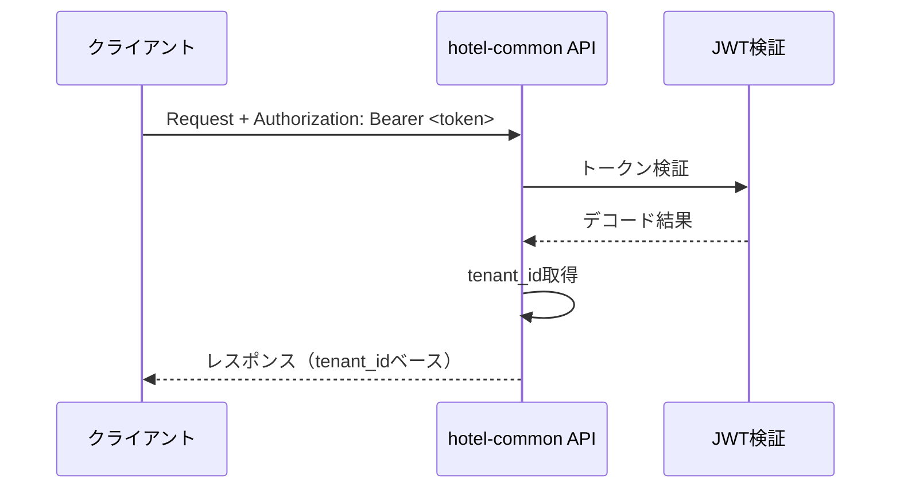
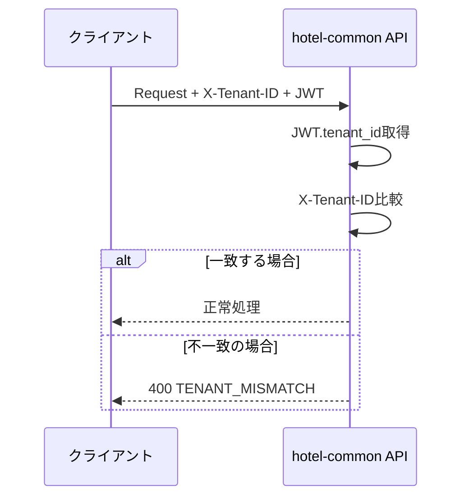

# 複数テナント所属認証方針

## ⚠️ 仕様変更通知

**2025年10月4日 仕様変更により JWT認証を廃止しました**

本ドキュメントに記載されているJWT認証関連の内容は、**Session認証（Redis + HttpOnly Cookie）** に変更されました。

**最新の仕様は以下を参照してください**:
- [SSOT_SAAS_MULTITENANT.md](../../../03_ssot/00_foundation/SSOT_SAAS_MULTITENANT.md#スタッフ複数テナント所属)
- [SSOT_SAAS_ADMIN_AUTHENTICATION.md](../../../03_ssot/00_foundation/SSOT_SAAS_ADMIN_AUTHENTICATION.md#テナント切り替え)

---

## 📋 概要

本ドキュメントは、1つのユーザーIDが複数テナントに所属する場合の認証・認可方針を定義します。

**策定日**: 2025-01-02  
**対象システム**: hotel-common, hotel-saas, hotel-member, hotel-pms  
**ステータス**: ⚠️ 廃止（JWT認証→Session認証に変更）

## 🎯 基本方針

### 正の情報源
**JWTの`tenant_id`クレームを正の情報源とする**

```typescript
// JWTペイロード例
{
  user_id: "staff-001",
  tenant_id: "hotel-001",           // 現在アクティブなテナント（正）
  accessible_tenants: ["hotel-001", "hotel-002", "hotel-003"],
  email: "staff@example.com",
  role: "admin",
  iat: 1735804200,
  exp: 1735832800
}
```

### X-Tenant-IDヘッダーの扱い
- **必須性**: 任意
- **用途**: 検証用（送信時はJWTとの一致を確認）
- **優先度**: JWTの`tenant_id` > X-Tenant-ID

## 🔐 認証仕様

### 1. 基本認証フロー



### 2. X-Tenant-ID検証フロー



## ⚠️ エラーハンドリング

### 不一致時のレスポンス

```typescript
// X-Tenant-IDとJWT.tenant_idが不一致の場合
HTTP 400 Bad Request
{
  "success": false,
  "error": {
    "code": "TENANT_MISMATCH",
    "message": "X-Tenant-ID must match JWT tenant_id"
  },
  "details": {
    "jwt_tenant_id": "hotel-001",
    "header_tenant_id": "hotel-002"
  },
  "timestamp": "2025-01-02T10:30:00.000Z",
  "request_id": "req_1735804200000_abc123"
}
```

### エラーコード一覧

| コード | HTTPステータス | 説明 |
|--------|---------------|------|
| `TENANT_MISMATCH` | 400 | X-Tenant-IDとJWT tenant_idの不一致 |
| `TENANT_ID_REQUIRED` | 400 | テナントIDが必要だが取得できない |
| `TENANT_ACCESS_DENIED` | 403 | テナントへのアクセス権限なし |
| `TENANT_NOT_FOUND` | 404 | 指定されたテナントが存在しない |

## 🔄 テナント切替

### switch-tenant API仕様

**エンドポイント**: `POST /api/v1/auth/switch-tenant`

#### リクエスト
```json
{
  "tenantId": "hotel-002"
}
```

#### レスポンス
```json
{
  "success": true,
  "data": {
    "accessToken": "eyJhbGciOiJIUzI1NiIs...",
    "refreshToken": "refresh_token_here",
    "expiresIn": 28800,
    "tokenType": "Bearer",
    "tenant": {
      "id": "hotel-002",
      "name": "ホテル002"
    }
  },
  "timestamp": "2025-01-02T10:30:00.000Z",
  "request_id": "req_1735804200000_abc123"
}
```

#### 処理フロー
1. 現在のJWTから`accessible_tenants`を確認
2. 切替先テナントへのアクセス権限を検証
3. 新しい`tenant_id`で新規アクセストークンを発行
4. リフレッシュトークンも併せて発行

## 🛠️ 実装ガイドライン

### 認証ミドルウェア実装例

```typescript
export const authMiddleware = (req: Request & { user?: any }, res: Response, next: NextFunction) => {
  // 1. JWT認証処理
  const authHeader = req.headers.authorization;
  if (!authHeader) {
    return res.status(401).json({
      error: 'UNAUTHORIZED',
      message: 'Authentication token is required'
    });
  }

  try {
    const token = authHeader.replace('Bearer ', '');
    const decoded = jwt.verify(token, JWT_SECRET) as any;
    req.user = decoded;

    // 2. X-Tenant-ID検証（オプション）
    const headerTenantId = req.headers['x-tenant-id'] as string;
    if (headerTenantId && headerTenantId !== req.user.tenant_id) {
      return res.status(400).json({
        error: 'TENANT_MISMATCH',
        message: 'X-Tenant-ID must match JWT tenant_id',
        details: {
          jwt_tenant_id: req.user.tenant_id,
          header_tenant_id: headerTenantId
        }
      });
    }

    next();
  } catch (error) {
    return res.status(401).json({
      error: 'INVALID_TOKEN',
      message: 'Invalid or expired token'
    });
  }
};
```

### API実装例

```typescript
// フロントデスクAPI実装例
router.get('/rooms', authMiddleware, async (req: Request, res: Response) => {
  try {
    // JWTからテナントIDを取得（正の情報源）
    const tenantId = (req as any).user?.tenant_id;
    
    if (!tenantId) {
      return res.status(400).json({
        error: 'TENANT_ID_REQUIRED',
        message: 'テナントIDが必要です'
      });
    }

    // テナントIDベースでデータ取得
    const rooms = await hotelDb.getAdapter().room.findMany({
      where: { tenantId, isDeleted: false }
    });

    return res.json({
      success: true,
      data: rooms,
      timestamp: new Date().toISOString()
    });
  } catch (error) {
    return res.status(500).json({
      error: 'INTERNAL_ERROR',
      message: 'Internal server error'
    });
  }
});
```

## 🔧 **詳細技術仕様**

### JWT仕様詳細

#### **正式クレーム名と型定義**
```typescript
interface HierarchicalJWTPayload {
  // 基本クレーム（snake_case固定）
  user_id: string;              // ユーザーID
  tenant_id: string;            // 現在アクティブなテナントID
  accessible_tenants: string[]; // アクセス可能テナント一覧
  
  // 認証・認可情報
  email: string;
  role: 'STAFF' | 'ADMIN' | 'SUPER_ADMIN' | 'MANAGER' | 'OWNER' | 'SYSTEM';
  level: number;
  permissions: string[];
  
  // 階層管理情報
  hierarchy_context: {
    organization_id: string;
    organization_level: 1 | 2 | 3 | 4;
    organization_type: 'GROUP' | 'BRAND' | 'HOTEL' | 'DEPARTMENT';
    organization_path: string;
    access_scope: string[];
    data_access_policies: Record<string, any>;
  };
  
  // JWT標準クレーム
  iat: number;  // 発行時刻
  exp: number;  // 有効期限
  jti: string;  // JWT ID
  type?: 'access' | 'refresh';  // トークンタイプ
}
```

**重要**: `tenantId`等のcamelCase表記は使用しない

#### **署名・検証仕様**
```typescript
// 署名アルゴリズム
algorithm: "HS256" (HMAC SHA-256)

// 鍵管理
secret: process.env.JWT_SECRET || 'hotel-common-development-secret'
clockSkew: デフォルト（未設定）

// 未実装項目
iss: 発行者（未設定）
aud: 対象者（未設定）
JWKS: JSON Web Key Set（未実装）
```

#### **鍵ローテーション手順**
1. 新しいJWT_SECRETを環境変数に設定
2. アプリケーション再起動
3. 既存トークンは次回リフレッシュ時に新鍵で再発行

#### **有効期限設定**
```typescript
// アクセストークン
TTL: 8時間 (28800秒)
exp: iat + (8 * 60 * 60)

// リフレッシュトークン
TTL: 未明示（要改善）
推奨: 30日

// 更新推奨タイミング
自動リフレッシュ: 有効期限の5分前
手動リフレッシュ: 401エラー受信時
```

### API仕様詳細

#### **リフレッシュAPI**
```typescript
POST /api/v1/auth/refresh

// リクエスト
{
  "refreshToken": string  // 必須
}

// 成功レスポンス (200)
{
  "success": true,
  "data": {
    "accessToken": string,
    "refreshToken": string,  // 新しいリフレッシュトークンも返却推奨
    "expires_at": string     // ISO 8601形式
  },
  "timestamp": string,
  "request_id": string
}

// エラーレスポンス (400/401)
{
  "success": false,
  "error": {
    "code": "MISSING_REFRESH_TOKEN" | "INVALID_REFRESH_TOKEN",
    "message": string
  },
  "timestamp": string,
  "request_id": string
}
```

#### **テナント切替API詳細**
```typescript
POST /api/v1/auth/switch-tenant

// リクエスト
{
  "tenantId": string  // 切替先テナントID
}

// 成功レスポンス (200)
{
  "success": true,
  "data": {
    "accessToken": string,
    "refreshToken": string,  // 必ず返却
    "expiresIn": 28800,
    "tokenType": "Bearer",
    "tenant": {
      "id": string,
      "name": string
    }
  },
  "timestamp": string,
  "request_id": string
}
```

### エラー仕様詳細

#### **HTTPステータスコード規約**
| ステータス | 用途 | 具体例 |
|-----------|------|--------|
| **400** | リクエスト形式エラー | テナント不一致、必須パラメータ不足 |
| **401** | 認証エラー | トークン失効/欠落/無効 |
| **403** | 認可エラー | 権限不足、テナントアクセス拒否 |
| **404** | リソース不存在 | テナント/ユーザー不存在 |
| **500** | システムエラー | データベースエラー、内部処理エラー |

#### **標準エラーボディ**
```typescript
// 必須フィールド
{
  "success": false,        // 必須: boolean
  "error": {              // 必須: object
    "code": string,       // 必須: エラーコード
    "message": string     // 必須: エラーメッセージ
  },
  "details"?: any,        // 任意: 詳細情報
  "timestamp": string,    // 必須: ISO 8601形式
  "request_id": string    // 必須: リクエスト追跡ID
}
```

#### **主要エラーコード一覧**
```typescript
// 認証関連
'UNAUTHORIZED'           // 401: 認証が必要
'INVALID_TOKEN'          // 401: 無効なトークン
'TOKEN_EXPIRED'          // 401: トークン期限切れ
'MISSING_REFRESH_TOKEN'  // 400: リフレッシュトークン不足
'INVALID_REFRESH_TOKEN'  // 401: 無効なリフレッシュトークン

// テナント関連
'TENANT_ID_REQUIRED'     // 400: テナントID必須
'TENANT_MISMATCH'        // 400: X-Tenant-IDとJWT不一致
'TENANT_ACCESS_DENIED'   // 403: テナントアクセス権限なし
'TENANT_NOT_FOUND'       // 404: テナント不存在

// 権限関連
'FORBIDDEN'              // 403: アクセス権限なし
'INSUFFICIENT_PERMISSIONS' // 403: 権限不足

// システム関連
'INTERNAL_ERROR'         // 500: 内部エラー
'DATABASE_ERROR'         // 500: データベースエラー
```

### セキュリティ仕様

#### **X-Tenant-ID検証強化**
```typescript
// 実装例
const headerTenantId = req.headers['x-tenant-id'] as string;
if (headerTenantId && headerTenantId !== req.user.tenant_id) {
  return res.status(400).json({
    error: {
      code: 'TENANT_MISMATCH',
      message: 'X-Tenant-ID must match JWT tenant_id'
    },
    details: {
      jwt_tenant_id: req.user.tenant_id,
      header_tenant_id: headerTenantId
    }
  });
}
```

#### **トークン整合性検証**
```typescript
// accessible_tenants内にtenant_idが含まれているかチェック
if (!req.user.accessible_tenants.includes(req.user.tenant_id)) {
  return res.status(500).json({
    error: {
      code: 'INTERNAL_ERROR',
      message: 'Token integrity violation'
    }
  });
}
```

#### **権限判定ロジック**
```typescript
// SUPER_ADMIN: 全テナントアクセス可能
if (req.user.role === 'SUPER_ADMIN') {
  // 制限なし
}

// 通常ユーザー: accessible_tenantsに含まれるテナントのみ
if (!req.user.accessible_tenants.includes(targetTenantId)) {
  return res.status(403).json({
    error: {
      code: 'TENANT_ACCESS_DENIED',
      message: 'Access to target tenant not allowed'
    }
  });
}
```

### レート制限仕様

#### **推奨設定**
```typescript
// リフレッシュAPI
'/api/v1/auth/refresh': {
  windowMs: 60 * 1000,    // 1分間
  max: 10,                // 最大10回
  message: 'Too many refresh attempts'
}

// テナント切替API
'/api/v1/auth/switch-tenant': {
  windowMs: 60 * 1000,    // 1分間
  max: 5,                 // 最大5回
  message: 'Too many tenant switch attempts'
}
```

**現状**: 未実装（実装推奨）

### 互換性・移行ガイド

#### **既存クライアント向け注意点**
1. **エラーコード変更**: 新しいエラーコード体系への対応
2. **レスポンス構造**: 標準化されたエラーボディへの対応
3. **X-Tenant-ID**: 送信時は必ずJWTと一致させる
4. **リフレッシュトークン**: 新しいトークンも返却される

#### **段階的移行手順**
1. **Phase 1**: 新エラー形式の受け入れ対応
2. **Phase 2**: X-Tenant-ID検証への対応
3. **Phase 3**: 新リフレッシュフローへの移行

## 📝 クライアント実装ガイド

### 推奨実装パターン

```typescript
// 1. 基本パターン（推奨）
const response = await fetch('/api/v1/admin/front-desk/rooms', {
  headers: {
    'Authorization': `Bearer ${accessToken}`,
    'Content-Type': 'application/json'
  }
});

// 2. 検証強化パターン（オプション）
const response = await fetch('/api/v1/admin/front-desk/rooms', {
  headers: {
    'Authorization': `Bearer ${accessToken}`,
    'X-Tenant-ID': currentTenantId,  // JWTのtenant_idと一致させる
    'Content-Type': 'application/json'
  }
});
```

### テナント切替実装例

```typescript
async function switchTenant(newTenantId: string) {
  try {
    const response = await fetch('/api/v1/auth/switch-tenant', {
      method: 'POST',
      headers: {
        'Authorization': `Bearer ${currentAccessToken}`,
        'Content-Type': 'application/json'
      },
      body: JSON.stringify({ tenantId: newTenantId })
    });

    if (response.ok) {
      const data = await response.json();
      
      // トークンを更新
      localStorage.setItem('accessToken', data.data.accessToken);
      localStorage.setItem('refreshToken', data.data.refreshToken);
      
      // 現在のテナント情報を更新
      setCurrentTenant(data.data.tenant);
      
      return data.data;
    } else {
      throw new Error('テナント切替に失敗しました');
    }
  } catch (error) {
    console.error('テナント切替エラー:', error);
    throw error;
  }
}
```

## 🔍 テスト仕様

### 単体テスト項目

1. **正常系**
   - JWTのみでの認証成功
   - X-Tenant-ID一致時の認証成功
   - テナント切替の成功

2. **異常系**
   - X-Tenant-ID不一致時の400エラー
   - アクセス権限なしテナントへの切替時の403エラー
   - 無効なJWTでの401エラー

### 統合テスト項目

1. **マルチテナント環境での動作確認**
2. **テナント切替後のAPI動作確認**
3. **権限継承の確認**

## 📊 運用・監視

### ログ出力項目

```typescript
// 認証ログ
{
  "event": "auth_success",
  "user_id": "staff-001",
  "tenant_id": "hotel-001",
  "accessible_tenants": ["hotel-001", "hotel-002"],
  "request_id": "req_1735804200000_abc123",
  "timestamp": "2025-01-02T10:30:00.000Z"
}

// テナント切替ログ
{
  "event": "tenant_switch",
  "user_id": "staff-001",
  "from_tenant": "hotel-001",
  "to_tenant": "hotel-002",
  "success": true,
  "request_id": "req_1735804200000_abc124",
  "timestamp": "2025-01-02T10:31:00.000Z"
}
```

### メトリクス監視

- テナント切替頻度
- 認証エラー率
- TENANT_MISMATCHエラー発生率

## 🔄 バージョン履歴

| バージョン | 日付 | 変更内容 |
|-----------|------|----------|
| 1.1.0 | 2025-01-02 | 詳細技術仕様追加（JWT仕様、API詳細、エラー規約、セキュリティ仕様、レート制限、移行ガイド） |
| 1.0.0 | 2025-01-02 | 初版作成 |

## 📞 問い合わせ

本方針に関する質問や変更要求は、hotel-commonチームまでお問い合わせください。

---

**注意**: 本方針は全システム共通の仕様です。変更時は関連システムへの影響を十分に検討してください。
