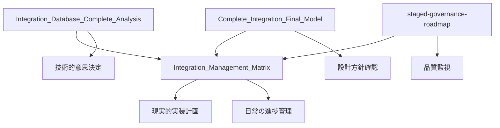

# 🏛️ 統合管理・ガバナンス

**このディレクトリには統合プロジェクトの管理方針、分析結果、ガバナンス体制が含まれています**

---

## 🎯 **概要**

統合プロジェクトの適切な管理と品質保証のための管理文書です。統合管理者と各システム担当者が、プロジェクトの全体像と進捗を把握するために使用します。

---

## 📚 **文書一覧**

### **[Integration_Management_Matrix.md](Integration_Management_Matrix.md)**
- **目的**: 統合状況の一元管理
- **対象**: 統合管理者、各システム担当者
- **重要度**: 🚨 CRITICAL
- **内容**: 統合状況マトリックス、現実的実装計画

### **[Integration_Database_Complete_Analysis.md](Integration_Database_Complete_Analysis.md)**
- **目的**: データベース統合の現状分析
- **対象**: 技術担当者、統合管理者
- **重要度**: HIGH
- **内容**: 各システムの実態調査結果

### **[Complete_Integration_Final_Model.md](Complete_Integration_Final_Model.md)**
- **目的**: 統合システムの最終モデル定義
- **対象**: 全担当者
- **重要度**: HIGH
- **内容**: 理想的な統合システムの設計

### **[staged-governance-roadmap.md](staged-governance-roadmap.md)**
- **目的**: 段階的ガバナンス移行計画
- **対象**: 統合管理者
- **重要度**: MEDIUM
- **内容**: Level 0-3の段階的監視体制

---

## 📊 **統合管理の階層**

### **Level 1: 戦略・方針（統合管理者）**
```
📋 Integration_Management_Matrix.md
├── 統合状況の把握
├── 優先度の決定
├── リソース配分
└── 進捗管理
```

### **Level 2: 分析・現状把握（技術チーム）**
```
🔍 Integration_Database_Complete_Analysis.md
├── 技術的実態調査
├── システム間の依存関係
├── データ構造分析
└── 課題特定
```

### **Level 3: 設計・モデル（アーキテクト）**
```
🏗️ Complete_Integration_Final_Model.md
├── 理想的システム設計
├── 技術選択の根拠
├── 長期的ビジョン
└── 拡張性確保
```

### **Level 4: 運用・ガバナンス（運用チーム）**
```
📈 staged-governance-roadmap.md
├── 段階的移行管理
├── 品質監視体制
├── リスク管理
└── 継続的改善
```

---

## 🎯 **利用シナリオ別ガイド**

### **📋 統合管理者の日常業務**
#### **毎日の確認事項**
1. **[統合状況マトリックス](Integration_Management_Matrix.md)** - 進捗確認
2. 各システム担当者からの報告確認
3. 問題・課題の優先度判定

#### **週次レビュー**
1. **[現状分析](Integration_Database_Complete_Analysis.md)** - 技術的状況確認
2. **[最終モデル](Complete_Integration_Final_Model.md)** - 設計方針の再確認
3. **[ガバナンスロードマップ](staged-governance-roadmap.md)** - 運用方針調整

### **🔧 技術担当者の参照方法**
#### **技術的意思決定時**
1. **[現状分析](Integration_Database_Complete_Analysis.md)** - 現在の制約確認
2. **[最終モデル](Complete_Integration_Final_Model.md)** - 目指すべき方向性確認
3. **[統合マトリックス](Integration_Management_Matrix.md)** - 他システムへの影響確認

#### **問題発生時**
1. **[統合マトリックス](Integration_Management_Matrix.md)** - 影響範囲の特定
2. **[ガバナンスロードマップ](staged-governance-roadmap.md)** - 対応プロセス確認

---

## 📈 **進捗管理の仕組み**

### **統合状況の可視化**
```yaml
Integration_Management_Matrix.md での管理項目:
  テーブル実装状況:
    - ✅ 完了済み
    - 🔄 実装中
    - ❌ 未実装
  
  システム間連携:
    - 🔗 接続済み
    - 🔄 設定中
    - ❌ 未接続
  
  技術統合:
    - 📊 統一済み
    - 🔄 移行中
    - ❌ 分散状態
```

### **品質管理指標**
```yaml
品質指標:
  技術品質:
    - データ整合性: 100%
    - API応答時間: < 200ms
    - システム稼働率: > 99.5%
  
  ビジネス品質:
    - ダブルブッキング: 0件/月
    - 請求漏れ: 0件/月
    - オペレーション効率: 30%向上
  
  プロジェクト品質:
    - スケジュール遵守率: > 90%
    - 品質ゲート通過率: 100%
    - ルール遵守率: 100%
```

---

## 🚨 **ガバナンスレベルと管理強度**

### **Level 0: Legacy（監視なし）**
- **対象**: 移行前のシステム
- **管理**: 従来通りの開発
- **制約**: なし

### **Level 1: Transition（軽微な監視）**
- **対象**: 移行準備中のシステム
- **管理**: 警告レベルの監視
- **制約**: 一部ルール適用

### **Level 2: Standard（標準監視）**
- **対象**: 移行中のシステム
- **管理**: 標準的な品質管理
- **制約**: 主要ルール適用

### **Level 3: Strict（厳格監視）**
- **対象**: 統合完了済みシステム
- **管理**: 全面的な品質管理
- **制約**: 全ルール適用

---

## 📊 **ドキュメント間の関係性**



---

## 🔄 **継続的改善**

### **定期レビュー**
- **月次**: 統合状況マトリックスの更新
- **四半期**: ガバナンス方針の見直し
- **半年**: 最終モデルの調整
- **年次**: 全体戦略の再評価

### **改善プロセス**
1. **問題発見**: 日常監視での課題特定
2. **原因分析**: 関連文書での根本原因調査
3. **対策立案**: ガバナンス文書に基づく解決策
4. **実装・検証**: 段階的な改善実施
5. **文書更新**: 学習事項の文書反映

---

## 📞 **活用方法**

### **新規参画者**
1. **[統合マトリックス](Integration_Management_Matrix.md)** で全体像把握
2. **[現状分析](Integration_Database_Complete_Analysis.md)** で技術的背景理解
3. **[最終モデル](Complete_Integration_Final_Model.md)** で目標理解

### **意思決定者**
1. **[統合マトリックス](Integration_Management_Matrix.md)** での状況判断
2. **[ガバナンスロードマップ](staged-governance-roadmap.md)** での方針決定

### **技術者**
1. **[現状分析](Integration_Database_Complete_Analysis.md)** での制約確認
2. **[最終モデル](Complete_Integration_Final_Model.md)** での設計指針確認

---

**🏛️ 適切なガバナンスで、統合プロジェクトの成功を確実にしましょう！** 