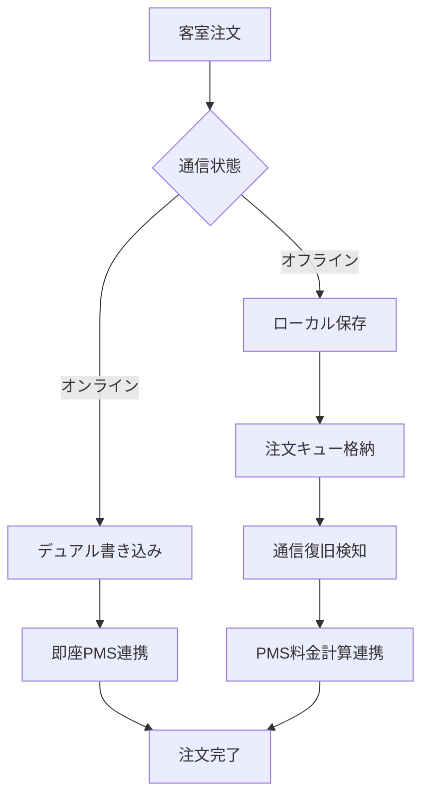

# ☀️ hotel-saas：ルームサービス・オフライン運用完全仕様書

**仕様書ID**: SAAS-OFFLINE-ROOM-SERVICE-001  
**対象システム**: hotel-saas（客室サービス・注文管理）  
**作成日**: 2025年1月23日  
**管理者**: Iza（統合管理者）  
**連携システム**: hotel-pms（料金計算・会計処理）

---

## 🎯 **ルームサービス・オフライン運用要件**

### **会計業務継続の絶対要件**
```yaml
継続必須業務:
  ✅ 客室からの注文受付: 24時間対応必須
  ✅ 料金計算・合算: PMSとの連携必須
  ✅ 在庫管理: オフライン時も減算必須
  ✅ 注文履歴: データ消失防止必須
  
ビジネス影響:
  - 注文停止 = 売上機会損失
  - 料金計算エラー = 会計処理混乱
  - データ消失 = 顧客満足度低下
```

---

## 🔄 **１. hotel-saas オフライン運用アーキテクチャ**

### **1.1 デュアルデータベース設計**
```typescript
// hotel-saas/src/database/offline-order-manager.ts
export class SaaSOfflineManager {
  private localDB: IndexedDB     // 客室タブレット用
  private unifiedClient: UnifiedPrismaClient  // PostgreSQL統合基盤
  private syncQueue: OrderSyncQueue
  
  // デュアル書き込み実装
  async createOrder(orderData: OrderRequest) {
    const order = await Promise.allSettled([
      // 1. ローカル即座保存（UX優先・オフライン対応）
      this.localDB.orders.add({
        ...orderData,
        id: generateUUID(),
        status: 'PENDING_LOCAL',
        created_offline: true,
        sync_status: 'queued'
      }),
      
      // 2. 統一基盤並行書き込み（他システム連携）
      this.unifiedClient.serviceOrder.create({
        data: {
          ...orderData,
          tenantId: process.env.TENANT_ID,
          originSystem: 'hotel-saas',
          syncedAt: new Date()
        }
      })
    ])
    
    return this.handleOrderResult(order)
  }
}
```

### **1.2 オフライン注文フロー**


---

## 📱 **２. 客室タブレット・オフライン対応**

### **2.1 オフライン UI/UX 設計**
```yaml
通知システム:
  🔌 オフライン中: 「オフライン中・注文は正常に受付中」
  ⏰ 処理遅延: 「通信復旧後に料金確定・お会計に反映」
  ✅ 注文受付: 「ご注文ありがとうございます（注文番号: #1234）」
  🔄 同期中: 「料金計算中・まもなく完了」

機能制限表示:
  ✅ 注文受付: 通常通り動作
  ⚠️ リアルタイム料金: 「復旧後に正確な料金表示」
  ❌ ポイント利用: 「オンライン復旧後にご利用可能」
```

### **2.2 オフライン注文処理**
```typescript
// 客室タブレット用オフライン対応
interface OfflineOrder {
  orderData: {
    id: string
    room_number: string
    customer_id?: string
    items: OrderItem[]
    estimated_total: number  // 概算料金
    created_at: Date
  }
  
  localStatus: {
    status: 'pending_local' | 'queued' | 'syncing' | 'completed'
    retry_count: number
    last_attempt: Date
    estimated_delivery: Date
  }
  
  syncRequirements: {
    needs_pms_billing: boolean
    needs_inventory_update: boolean
    needs_price_calculation: boolean
  }
}
```

---

## 💰 **３. PMS料金計算・会計連携**

### **3.1 オフライン時料金計算**
```typescript
// hotel-saas/src/pricing/offline-calculator.ts
export class OfflinePricingCalculator {
  private priceCache: Map<string, MenuItemPrice>
  
  constructor() {
    // 料金マスタをローカルキャッシュ
    this.loadPricingCache()
  }
  
  // オフライン概算料金計算
  calculateEstimatedTotal(items: OrderItem[]): PriceEstimate {
    let subtotal = 0
    const unavailableItems: string[] = []
    
    for (const item of items) {
      const cachedPrice = this.priceCache.get(item.menu_id)
      if (cachedPrice) {
        subtotal += cachedPrice.base_price * item.quantity
      } else {
        unavailableItems.push(item.menu_id)
      }
    }
    
    return {
      estimated_subtotal: subtotal,
      estimated_tax: subtotal * 0.1,
      estimated_total: subtotal * 1.1,
      unavailable_items: unavailableItems,
      accuracy: unavailableItems.length === 0 ? 'HIGH' : 'MEDIUM',
      needs_recalculation: true
    }
  }
}
```

### **3.2 PMS連携・同期仕様**
```yaml
同期段階:
  Phase 1: 注文データ送信
    - hotel-saas → hotel-pms
    - service.ordered Event発行
    - 注文内容・概算料金送信
    
  Phase 2: 正確な料金計算
    - PMS側で会員割引・税計算
    - 客室料金との合算処理
    - 正確な料金をhotel-saasに返信
    
  Phase 3: 最終確定
    - hotel-saas UI更新（正確料金表示）
    - 在庫数量確定減算
    - お客様への確定通知送信
```

---

## 🔄 **４. 同期・復旧システム**

### **4.1 注文同期キュー**
```typescript
interface OrderSyncQueue {
  pending_orders: OfflineOrder[]
  sync_strategy: 'immediate' | 'batch' | 'priority'
  
  // 優先度別同期
  processSyncQueue(): Promise<SyncResult> {
    const high_priority = this.pending_orders.filter(o => 
      o.syncRequirements.needs_pms_billing || 
      o.orderData.estimated_total > 5000  // 高額注文優先
    )
    
    const standard_orders = this.pending_orders.filter(o => 
      !high_priority.includes(o)
    )
    
    // 高優先度を先に同期
    await this.syncOrderBatch(high_priority)
    await this.syncOrderBatch(standard_orders)
  }
}
```

### **4.2 料金計算同期**
```typescript
// PMS連携・料金確定処理
async syncOrderWithPMS(order: OfflineOrder): Promise<void> {
  try {
    // 1. PMS料金計算API呼び出し
    const pmsCalculation = await this.pmsApiClient.calculateOrderTotal({
      order_id: order.orderData.id,
      room_number: order.orderData.room_number,
      items: order.orderData.items,
      customer_id: order.orderData.customer_id
    })
    
    // 2. 料金差異確認
    const estimatedTotal = order.orderData.estimated_total
    const actualTotal = pmsCalculation.total_amount
    const difference = Math.abs(actualTotal - estimatedTotal)
    
    // 3. 差異が大きい場合は通知
    if (difference > 500) {
      await this.notifyPriceDifference(order, estimatedTotal, actualTotal)
    }
    
    // 4. 最終料金確定
    await this.finalizeOrder(order, pmsCalculation)
    
  } catch (error) {
    // 同期失敗時はリトライキューに追加
    await this.addToRetryQueue(order, error)
  }
}
```

---

## 📊 **５. 在庫管理・オフライン対応**

### **5.1 在庫管理戦略**
```yaml
在庫管理方針:
  オンライン時:
    - リアルタイム在庫チェック
    - 注文確定時に即座減算
    - 他システムとの在庫共有
    
  オフライン時:
    - ローカル在庫キャッシュで判定
    - 注文受付時に仮減算
    - 復旧時に正確な在庫と照合
    
  復旧時検証:
    - 在庫不足判明 → お客様に謝罪・代替提案
    - 在庫問題なし → 注文確定処理
```

### **5.2 在庫競合解決**
```typescript
// オフライン注文の在庫競合解決
async resolveInventoryConflicts(): Promise<ConflictResolution[]> {
  const conflicts: ConflictResolution[] = []
  
  for (const order of this.pendingOrders) {
    for (const item of order.orderData.items) {
      const currentStock = await this.getActualInventory(item.menu_id)
      const reservedQty = this.getOfflineReservedQty(item.menu_id)
      
      if (currentStock < reservedQty) {
        conflicts.push({
          order_id: order.orderData.id,
          item_id: item.menu_id,
          requested: item.quantity,
          available: currentStock,
          resolution: 'CUSTOMER_NOTIFICATION_REQUIRED'
        })
      }
    }
  }
  
  return conflicts
}
```

---

## 🚨 **６. エラーハンドリング・例外処理**

### **6.1 オフライン時エラー処理**
```yaml
エラー分類:
  通信断エラー:
    対応: オフライン模式に自動切替
    UI: 「オフライン中・注文受付継続中」表示
    
  在庫不足エラー:
    対応: 注文受付・復旧時に在庫確認
    UI: 「在庫確認中・まもなくご連絡」表示
    
  料金計算エラー:
    対応: 概算料金で受付・復旧時に正確計算
    UI: 「料金計算中・正確な料金は後ほど確定」
    
  決済連携エラー:
    対応: PMS会計処理に委譲
    UI: 「お会計はフロントにて承ります」
```

### **6.2 復旧時例外処理**
```typescript
// 復旧時の例外ケース処理
class OrderRecoveryManager {
  async handleRecoveryExceptions() {
    const exceptions = await this.detectRecoveryIssues()
    
    for (const exception of exceptions) {
      switch (exception.type) {
        case 'INVENTORY_SHORTAGE':
          await this.handleInventoryShortage(exception)
          break
          
        case 'PRICE_DISCREPANCY':
          await this.handlePriceDiscrepancy(exception)
          break
          
        case 'CUSTOMER_CHECKOUT':
          await this.handleCustomerAlreadyLeft(exception)
          break
          
        case 'DUPLICATE_ORDER':
          await this.handleDuplicateOrder(exception)
          break
      }
    }
  }
}
```

---

## 🔧 **７. 技術実装ガイド**

### **7.1 必須実装ファイル**
```yaml
Core Files:
  src/database/offline-order-manager.ts: オフライン注文管理
  src/pricing/offline-calculator.ts: オフライン料金計算
  src/sync/order-sync-queue.ts: 注文同期キュー
  src/inventory/offline-inventory.ts: オフライン在庫管理
  src/ui/offline-indicator.tsx: オフライン状態表示
  src/recovery/order-recovery-manager.ts: 復旧時例外処理
```

### **7.2 環境設定**
```bash
# hotel-saas/.env
# オフライン対応設定
OFFLINE_MODE_ENABLED=true
OFFLINE_ORDER_CACHE_SIZE=1000
OFFLINE_SYNC_INTERVAL_MINUTES=5

# PMS連携設定
PMS_API_URL="http://localhost:3300/api"
PMS_BILLING_ENDPOINT="/billing/orders"

# 在庫管理設定
INVENTORY_CACHE_DURATION_HOURS=24
INVENTORY_SAFETY_STOCK_RATIO=0.1
```

---

## ✅ **８. 完了確認基準**

### **8.1 機能確認チェックリスト**
```yaml
オフライン注文機能:
  - [ ] 通信断時の注文受付継続
  - [ ] ローカル在庫チェック機能
  - [ ] 概算料金計算・表示
  - [ ] 注文キュー管理

PMS連携機能:
  - [ ] 注文データ自動送信
  - [ ] 料金計算結果受信
  - [ ] 会計システム連携
  - [ ] 差異通知機能

復旧・同期機能:
  - [ ] 自動復旧検知
  - [ ] 注文一括同期
  - [ ] 在庫競合解決
  - [ ] 例外ケース処理
```

### **8.2 性能・安定性基準**
```yaml
性能要件:
  - 注文受付応答: < 2秒
  - 概算料金計算: < 1秒
  - 同期処理完了: < 30秒
  - 在庫確認: < 500ms

安定性要件:
  - オフライン運用: 24時間以上
  - 注文データ消失: 0件
  - 料金計算精度: 99.9%以上
  - 在庫管理精度: 99.5%以上
```

---

## 🎯 **９. 実装優先順序**

### **Phase 1: 基本オフライン対応（1週間）**
1. ✅ オフライン注文受付機能
2. ✅ ローカルデータベース実装
3. ✅ 基本UI通知システム

### **Phase 2: PMS連携・同期（1週間）**
4. ✅ 注文同期キュー実装
5. ✅ PMS料金計算連携
6. ✅ 復旧時処理システム

### **Phase 3: 高度化・最適化（継続）**
7. ⚪ 在庫競合解決高度化
8. ⚪ 例外処理完全化
9. ⚪ 性能・UI最適化

---

## 📞 **サポート・質問**

### **PMS連携・料金計算**
- **料金計算API**: PMS担当Luna（hotel-pms）との調整必須
- **会計システム連携**: 既存PMS会計処理への統合相談
- **データ同期仕様**: hotel-common Event-driven基盤活用

### **在庫・メニュー管理**
- **在庫管理方針**: ビジネス要件との整合性確認
- **メニュー・料金更新**: リアルタイム更新 vs バッチ更新選択
- **競合解決ルール**: お客様影響最小化を最優先

---

**☀️ Sun（hotel-saas担当）、この包括仕様に基づいてルームサービス・オフライン対応を完璧に実装してください！**

**Luna（hotel-pms担当）との連携必須項目**:
1. 注文→料金計算API設計
2. 会計システム統合仕様
3. 復旧時同期プロトコル

**最終更新**: 2025年1月23日  
**次回レビュー**: Sun・Luna実装完了後 