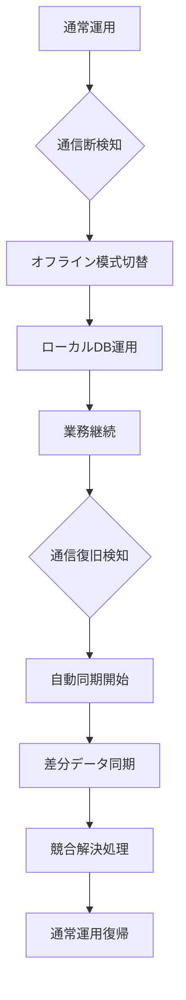

# 🔌 オフライン運用ドキュメント集

**ディレクトリ**: `/docs/offline/`  
**目的**: ホテル統合システムのオフライン・通信障害時運用に関する全仕様の一元管理  
**管理者**: Iza（統合管理者）  
**最終更新**: 2025年1月23日

---

## 📋 **ドキュメント一覧**

### **🎯 主要仕様書**

| ファイル名 | 対象システム | 内容 | 担当AI |
|-----------|-------------|------|--------|
| `Luna_Offline_Database_Integration_Specification.md` | hotel-pms | オフライン・統合DB運用完全仕様 | 🌙 Luna |
| `Hotel_SaaS_Offline_Room_Service_Specification.md` | hotel-saas | ルームサービス・オフライン運用仕様 | ☀️ Sun |

### **🔄 関連仕様（他ディレクトリ）**

| ファイル名 | 場所 | オフライン関連内容 |
|-----------|------|------------------|
| `HOTEL_PMS_INTEGRATION_REQUIREMENTS_ANSWERS.md` | `/` | Q&A形式オフライン要件 |
| `event-driven-architecture-design.md` | `/docs/` | PMSオフライン戦略・キャッシュ管理 |
| `pin-jwt-integration-spec.md` | `/docs/` | オフライン認証仕様 |

---

## 🎯 **オフライン運用の全体像**

### **システム別オフライン対応状況**

```yaml
🌙 hotel-pms (Luna):
  ✅ 24時間オフライン運用可能
  ✅ SQLite + PostgreSQL デュアルDB
  ✅ asyncQueue同期機構
  ✅ オフライン認証（PIN + JWT）
  ✅ 自動復旧・差分同期

☀️ hotel-saas (Sun):
  🔄 ルームサービス・オフライン対応実装中
  ✅ IndexedDB + PostgreSQL デュアルDB
  ✅ 概算料金計算・注文受付継続
  ✅ PMS連携・料金確定同期
  ✅ 在庫管理・競合解決

⚡ hotel-member (Suno):
  ✅ 既存機能オフライン継続
  ✅ 会員データキャッシュ
  ✅ 復旧時同期対応
  ❌ 新規会員登録はオンライン必須
```

---

## 🔄 **オフライン運用フロー**

### **通常時 → オフライン → 復旧の流れ**



### **業務継続可能機能**

```yaml
✅ 完全継続可能:
  - チェックイン/アウト処理
  - 客室ステータス管理
  - ルームサービス注文受付
  - 料金計算・会計処理
  - 日報作成・管理
  - 帳票出力・印刷

⚠️ 制限付き継続:
  - 会員ポイント利用（キャッシュ範囲内）
  - リアルタイム在庫確認（キャッシュベース）
  - OTA連携（復旧後一括同期）

❌ オンライン必須:
  - 新規会員登録
  - 外部決済システム連携
  - リアルタイムOTA在庫更新
```

---

## 🔧 **技術アーキテクチャ概要**

### **デュアルデータベース設計**

```yaml
Primary (オンライン):
  - PostgreSQL: hotel_unified_db
  - 用途: 統合基盤・システム間連携
  - クライアント: UnifiedPrismaClient

Secondary (オフライン):
  - hotel-pms: SQLite + Drizzle ORM
  - hotel-saas: IndexedDB (ブラウザ)
  - 用途: オフライン業務継続・高速アクセス
```

### **同期・復旧システム**

```yaml
同期機構:
  - asyncQueue: 非同期同期キュー
  - 優先度制御: 高額取引・重要業務優先
  - 競合解決: タイムスタンプ + システム優先度
  - 自動復旧: 通信復旧時の自動同期開始

データ整合性:
  - CRC32チェックサム: リアルタイム
  - 完全照合: 日次バッチ
  - 統計分析: 週次監視
```

---

## 📊 **性能・安定性基準**

### **パフォーマンス要件**

```yaml
応答時間:
  - ローカルDB: < 100ms
  - 同期処理: < 500ms
  - オフライン切替: < 3秒
  - 復旧同期: < 30秒

処理能力:
  - 同時注文処理: 50件/分
  - 同期キュー: 1000件保持
  - データ保持期間: 24時間以上
```

### **安定性要件**

```yaml
可用性:
  - オフライン運用: 24時間以上
  - データ消失率: 0%
  - 同期成功率: 99.5%以上
  - 復旧成功率: 100%

整合性:
  - データ整合性: 99.9%以上
  - 料金計算精度: 99.9%以上
  - 在庫管理精度: 99.5%以上
```

---

## 🚨 **緊急時対応手順**

### **通信障害発生時**

```yaml
1. 自動検知・切替:
   - navigator.onLine監視
   - オフライン模式自動切替
   - UI通知バナー表示

2. 業務継続:
   - ローカルDB運用開始
   - キュー蓄積開始
   - スタッフ通知・案内

3. 監視・待機:
   - 定期復旧試行
   - キュー状況監視
   - 緊急事態エスカレーション
```

### **復旧時処理**

```yaml
1. 復旧検知:
   - 通信確認・認証テスト
   - システム状態確認

2. 同期実行:
   - 優先度別同期開始
   - 競合検知・解決
   - 整合性確認

3. 通常復帰:
   - オンライン模式復帰
   - スタッフ完了通知
   - 監視強化期間設定
```

---

## 📞 **サポート・連絡先**

### **技術的問題**
- **統合管理**: Iza（統合管理者）
- **PMS問題**: Luna（hotel-pms担当AI）
- **SaaS問題**: Sun（hotel-saas担当AI）
- **Member問題**: Suno（hotel-member担当AI）

### **運用・業務問題**
- **緊急障害**: 即座に統合管理者に報告
- **仕様確認**: 該当システム担当AIに相談
- **新機能要望**: システム統合全体への影響評価必須

---

## 📅 **実装スケジュール**

### **現在の状況（2025年1月23日）**

```yaml
✅ 完了:
  - Luna: オフライン仕様書完成
  - Sun: ルームサービス・オフライン仕様書完成
  - 統合アーキテクチャ設計完了

🔄 実装中:
  - Luna: PostgreSQL統合・デュアルDB実装
  - Sun: ルームサービス・オフライン機能実装
  - 統合テスト環境構築

⏳ 予定:
  - Week 1-2: 基本オフライン対応実装
  - Week 3-4: PMS-SaaS連携・同期システム
  - Week 5-6: 統合テスト・最適化
```

---

## 🔄 **更新履歴**

| 日付 | 更新内容 | 更新者 |
|------|----------|-------|
| 2025-01-23 | 初版作成・ディレクトリ整理 | Iza |
| 2025-01-23 | Luna・Sun仕様書移動完了 | Iza |

**次回更新予定**: 実装進捗に応じて週次更新

---

**🔌 オフライン運用で「どんな状況でもお客様サービスを止めない」ホテルシステムを実現！** 🏨 