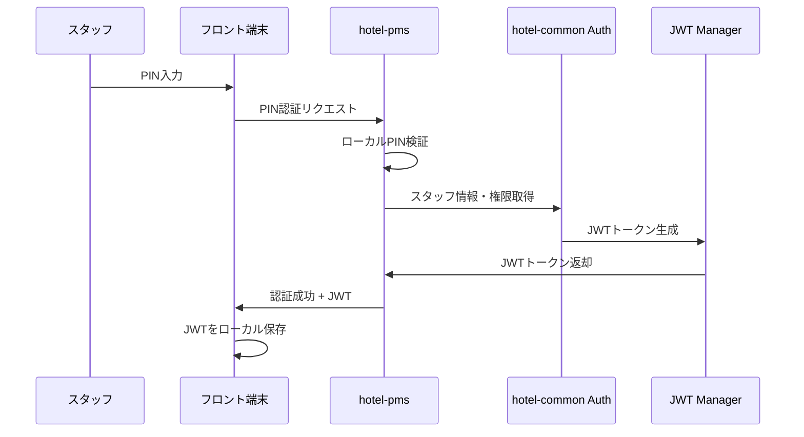
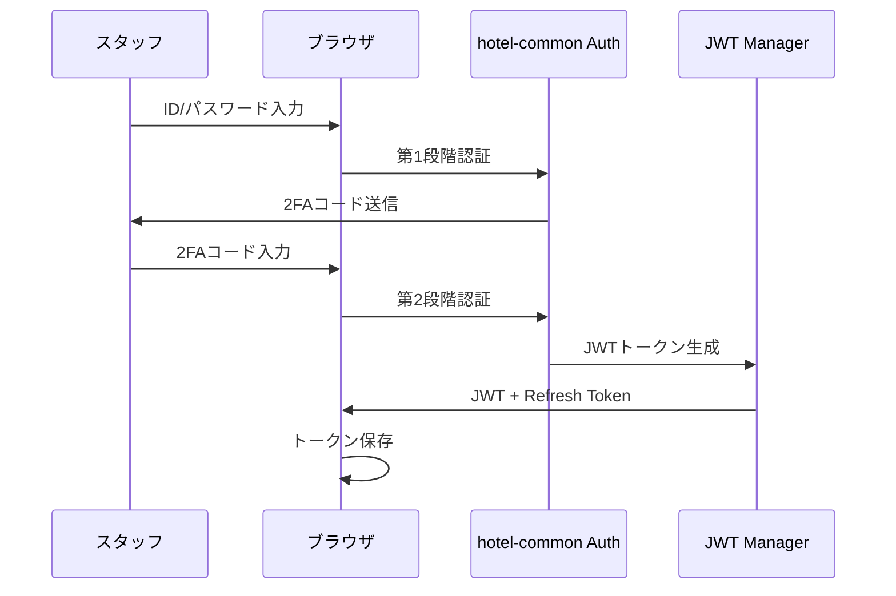

# 🔐 PIN-JWT認証統合仕様

## 📋 **概要**

フロント端末のPIN認証と統一JWT基盤を連携し、端末種別に応じた認証方式を提供する。

## 🎯 **要件**

### **認証方式の使い分け**
```typescript
const authMethods = {
  frontDesk: {
    method: 'pin',
    deviceType: 'terminal',
    sessionType: 'short',  // 8時間
    security: 'standard'
  },
  office: {
    method: 'password-2fa',
    deviceType: 'browser', 
    sessionType: 'long',   // 24時間
    security: 'high'
  },
  mobile: {
    method: 'biometric',
    deviceType: 'mobile',
    sessionType: 'medium', // 12時間
    security: 'high'
  }
}
```

## 🔄 **認証フロー設計**

### **フロント端末（PIN → JWT）**


### **事務所ブラウザ（パスワード + 2FA → JWT）**


## 🗃️ **データベース設計**

### **Staff認証テーブル（拡張）**
```sql
-- 既存staffテーブルに追加
ALTER TABLE staff ADD COLUMN pin_hash VARCHAR(255);
ALTER TABLE staff ADD COLUMN pin_updated_at TIMESTAMP;
ALTER TABLE staff ADD COLUMN two_fa_enabled BOOLEAN DEFAULT false;
ALTER TABLE staff ADD COLUMN two_fa_secret VARCHAR(255);
ALTER TABLE staff ADD COLUMN device_preferences JSONB;
```

### **認証セッション管理テーブル**
```sql
CREATE TABLE auth_sessions (
  id UUID PRIMARY KEY,
  staff_id UUID REFERENCES staff(id),
  device_type VARCHAR(20) NOT NULL, -- 'terminal', 'browser', 'mobile'
  auth_method VARCHAR(20) NOT NULL, -- 'pin', 'password', 'biometric'
  jwt_token_hash VARCHAR(255) NOT NULL,
  refresh_token_hash VARCHAR(255),
  ip_address INET,
  user_agent TEXT,
  expires_at TIMESTAMP NOT NULL,
  last_activity TIMESTAMP DEFAULT NOW(),
  is_active BOOLEAN DEFAULT true,
  created_at TIMESTAMP DEFAULT NOW()
);
```

### **PIN認証ログテーブル**
```sql
CREATE TABLE pin_auth_logs (
  id UUID PRIMARY KEY,
  staff_id UUID REFERENCES staff(id),
  terminal_id VARCHAR(100),
  pin_attempt VARCHAR(10), -- 一部マスク済み
  result VARCHAR(20), -- 'success', 'failed', 'locked'
  ip_address INET,
  attempted_at TIMESTAMP DEFAULT NOW()
);
```

## 🔧 **API設計**

### **PIN認証API**
```typescript
// PIN認証
POST /api/auth/pin
Body: {
  pin: string;
  terminal_id: string;
  device_info?: DeviceInfo;
}
Response: {
  success: boolean;
  token?: string;
  refresh_token?: string;
  staff_info?: StaffInfo;
  permissions?: Permission[];
  expires_at?: string;
}

// PIN変更
PUT /api/auth/pin/change
Headers: { Authorization: Bearer <jwt> }
Body: {
  current_pin: string;
  new_pin: string;
}
```

### **統合認証API**
```typescript
// パスワード + 2FA認証
POST /api/auth/login
Body: {
  email: string;
  password: string;
  two_fa_code?: string;
  device_type: 'browser' | 'mobile';
}

// トークン更新
POST /api/auth/refresh
Body: {
  refresh_token: string;
}

// ログアウト
POST /api/auth/logout
Headers: { Authorization: Bearer <jwt> }
```

## 🎨 **実装詳細**

### **PIN認証ミドルウェア**
```typescript
// hotel-pms/middleware/pin-auth.ts
export async function pinAuthMiddleware(req: Request, res: Response, next: NextFunction) {
  const { pin, terminal_id } = req.body;
  
  try {
    // 1. PIN検証
    const staff = await validatePIN(pin, terminal_id);
    if (!staff) {
      await logFailedAttempt(pin, terminal_id, req.ip);
      return res.status(401).json({ error: 'PIN認証に失敗しました' });
    }
    
    // 2. JWT生成
    const jwtPayload = {
      staff_id: staff.id,
      tenant_id: staff.tenant_id,
      device_type: 'terminal',
      auth_method: 'pin',
      permissions: await getStaffPermissions(staff.id)
    };
    
    const token = await JwtManager.generate(jwtPayload, '8h');
    const refreshToken = await JwtManager.generateRefresh(staff.id, '24h');
    
    // 3. セッション記録
    await createAuthSession({
      staff_id: staff.id,
      device_type: 'terminal',
      auth_method: 'pin',
      jwt_token_hash: hashToken(token),
      refresh_token_hash: hashToken(refreshToken),
      ip_address: req.ip,
      user_agent: req.headers['user-agent'],
      expires_at: new Date(Date.now() + 8 * 60 * 60 * 1000) // 8時間
    });
    
    res.json({
      success: true,
      token,
      refresh_token: refreshToken,
      staff_info: {
        id: staff.id,
        name: staff.name,
        position: staff.position
      },
      permissions: jwtPayload.permissions,
      expires_at: new Date(Date.now() + 8 * 60 * 60 * 1000).toISOString()
    });
    
  } catch (error) {
    console.error('PIN認証エラー:', error);
    res.status(500).json({ error: 'サーバーエラー' });
  }
}
```

### **JWT検証ミドルウェア**
```typescript
// hotel-common/middleware/jwt-auth.ts
export async function jwtAuthMiddleware(req: Request, res: Response, next: NextFunction) {
  const token = extractTokenFromHeader(req.headers.authorization);
  
  if (!token) {
    return res.status(401).json({ error: 'トークンが必要です' });
  }
  
  try {
    // 1. JWT検証
    const payload = await JwtManager.verify(token);
    
    // 2. セッション確認
    const session = await getActiveSession(payload.staff_id, hashToken(token));
    if (!session || !session.is_active) {
      return res.status(401).json({ error: 'セッションが無効です' });
    }
    
    // 3. 権限情報をリクエストに追加
    req.staff = {
      id: payload.staff_id,
      tenant_id: payload.tenant_id,
      permissions: payload.permissions,
      device_type: payload.device_type,
      auth_method: payload.auth_method
    };
    
    // 4. 最終アクティビティ更新
    await updateSessionActivity(session.id);
    
    next();
    
  } catch (error) {
    console.error('JWT検証エラー:', error);
    res.status(401).json({ error: 'トークンが無効です' });
  }
}
```

## 🔐 **セキュリティ仕様**

### **PIN管理**
```typescript
// PIN要件
const PIN_REQUIREMENTS = {
  length: { min: 4, max: 8 },
  complexity: 'numeric', // 数字のみ
  expiry: 90, // 90日で期限切れ
  history: 5, // 過去5回分は再利用不可
  lockout: {
    attempts: 3,
    duration: 30 // 30分ロック
  }
};

// PIN暗号化
function hashPIN(pin: string, salt: string): string {
  return bcrypt.hashSync(pin + salt, 10);
}
```

### **セッション管理**
```typescript
// セッション設定
const SESSION_CONFIG = {
  terminal: {
    duration: 8 * 60 * 60, // 8時間
    idle_timeout: 2 * 60 * 60, // 2時間無操作でタイムアウト
    concurrent_limit: 1 // 端末ごと1セッション
  },
  browser: {
    duration: 24 * 60 * 60, // 24時間
    idle_timeout: 4 * 60 * 60, // 4時間無操作でタイムアウト
    concurrent_limit: 3 // 複数タブ対応
  }
};
```

## 🧪 **実装優先度**

### **Phase 1: 基本PIN-JWT連携**
1. PIN認証API実装
2. JWT生成・検証機能
3. セッション管理テーブル作成
4. 基本認証ミドルウェア

### **Phase 2: セキュリティ強化**
1. PIN管理機能（変更・期限・ロックアウト）
2. セッション管理強化
3. 認証ログ機能
4. 不正アクセス検知

### **Phase 3: UI/UX改善**
1. PIN設定画面
2. セッション管理画面
3. セキュリティ設定画面
4. 認証状況ダッシュボード

## 📱 **フロントエンド実装**

### **PIN入力画面**
```vue
<!-- hotel-pms/pages/auth/pin.vue -->
<template>
  <div class="pin-auth-container">
    <h2>PIN認証</h2>
    <div class="pin-input">
      <input 
        v-model="pin" 
        type="password" 
        maxlength="8"
        placeholder="PINを入力"
        @keyup.enter="authenticate"
      />
    </div>
    <button @click="authenticate" :disabled="loading">
      ログイン
    </button>
  </div>
</template>

<script setup>
const pin = ref('');
const loading = ref(false);

async function authenticate() {
  if (pin.value.length < 4) return;
  
  loading.value = true;
  try {
    const response = await $fetch('/api/auth/pin', {
      method: 'POST',
      body: {
        pin: pin.value,
        terminal_id: getTerminalId(),
        device_info: getDeviceInfo()
      }
    });
    
    if (response.success) {
      // JWTトークンを保存
      await $auth.setToken(response.token);
      await $auth.setRefreshToken(response.refresh_token);
      
      // スタッフ情報を保存
      await $auth.setUser(response.staff_info);
      
      // ダッシュボードにリダイレクト
      await navigateTo('/dashboard');
    }
  } catch (error) {
    console.error('認証エラー:', error);
    // エラーメッセージ表示
  } finally {
    loading.value = false;
    pin.value = ''; // PIN クリア
  }
}
</script>
```

## 🔄 **既存システムとの統合**

### **hotel-common連携**
```typescript
// hotel-pms側でhotel-common認証ライブラリを使用
import { 
  JwtManager, 
  SessionManager, 
  PermissionChecker 
} from 'hotel-common';

// 認証フロー統合
const authResult = await JwtManager.authenticateWithPIN(pin, terminalId);
```

### **権限チェック統合**
```typescript
// API呼び出し時の権限確認
async function checkPermissionMiddleware(req, res, next) {
  const hasPermission = await PermissionChecker.check(
    req.staff.id,
    'hotel-pms',
    'reservation',
    'create'
  );
  
  if (!hasPermission) {
    return res.status(403).json({ error: '権限がありません' });
  }
  
  next();
}
```

## 📝 **Luna実装時の注意点**

1. **PIN保存**: 平文保存禁止、必ずハッシュ化
2. **セッション管理**: デバイス別セッション制限
3. **トークン管理**: 適切な有効期限設定
4. **セキュリティログ**: 全認証試行の記録
5. **オフライン対応**: 通信断絶時のフォールバック機能
6. **パフォーマンス**: 認証処理の高速化
7. **エラーハンドリング**: 適切なエラーメッセージとログ 