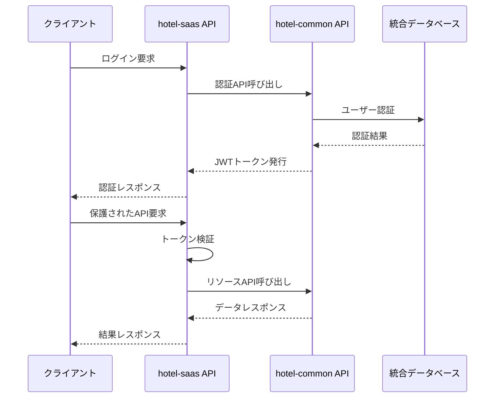

# JWT認証システム統合仕様書

**Doc-ID**: SPEC-2025-003
**Version**: 1.0
**Status**: Active
**Owner**: 金子裕司
**Linked-Docs**: ADR-2025-003, REL-2025-002

---

## 📋 **概要**

hotel-saasプロジェクトにおけるJWT認証システムの統合仕様書です。hotel-commonの`HotelSaasAuth`クラスを基盤とした統一認証システムの設計と実装方針を定義します。

## 🎯 **基本方針**

### **1. 統一認証アーキテクチャ**
- **hotel-common統合**: `HotelSaasAuth`クラスを基盤として使用
- **単一認証フロー**: 環境に依存しない一貫した認証システム
- **JWT標準化**: 統一されたトークン形式とペイロード構造

### **2. 認証システム統合**
- **既存システム統合**: 複数の認証方式を単一システムに統合
- **環境非依存**: 開発・本番環境で同一の認証フロー
- **権限管理統一**: ロールベースアクセス制御の一元管理

## 🏗️ **システムアーキテクチャ**

### **認証フロー**


### **コンポーネント構成**
```
hotel-saas/
├── composables/
│   └── useJwtAuth.ts           # 統一認証コンポーザブル
├── server/
│   ├── middleware/
│   │   └── admin-auth.ts       # 認証ミドルウェア
│   ├── utils/
│   │   └── auth-helpers.ts     # 認証ヘルパー関数
│   └── api/v1/auth/
│       ├── login.post.ts       # ログインAPI
│       └── validate-token.post.ts # トークン検証API
└── middleware/
    └── admin-auth.ts           # ルートガード
```

## 🔧 **技術仕様**

### **JWTトークン構造**
```typescript
interface HotelAuthToken {
  userId: string
  tenantId: string
  role: string
  systemSource: 'saas' | 'member' | 'pms'
  permissions: string[]
  expiresAt: number
  iat: number
  exp: number
}
```

### **認証レスポンス形式**
```typescript
interface AuthResponse {
  success: boolean
  data?: {
    accessToken: string
    user: {
      id: string
      email: string
      tenantId: string
      role: string
      permissions: string[]
    }
    availableTenants?: Array<{
      id: string
      name: string
      role: string
    }>
  }
  error?: {
    code: string
    message: string
  }
}
```

## 🔐 **認証コンポーネント仕様**

### **1. useJwtAuth コンポーザブル**

#### **状態管理**
```typescript
interface AuthState {
  token: string | null
  user: AuthUser | null
  isAuthenticated: boolean
  isLoading: boolean
  availableTenants: AvailableTenant[]
}
```

#### **主要メソッド**
- `signIn(credentials)`: ログイン処理
- `signOut()`: ログアウト処理
- `validateToken(token)`: トークン検証
- `initialize()`: 認証状態初期化
- `switchTenant(tenantId)`: テナント切り替え

### **2. 認証ミドルウェア**

#### **サーバーサイド認証**
```typescript
// server/utils/auth-helpers.ts
export interface AuthUser {
  id: string
  email: string
  tenantId: string
  role: string
  permissions: string[]
  token: string // 生のJWTトークン
}

export async function verifyAuth(event: H3Event): Promise<AuthUser | null>
```

#### **クライアントサイドガード**
```typescript
// middleware/admin-auth.ts
export default defineNuxtRouteMiddleware(async (to) => {
  const { isAuthenticated, initialize } = useJwtAuth()

  if (!isAuthenticated.value) {
    await initialize()
    if (!isAuthenticated.value) {
      return navigateTo('/admin/login')
    }
  }
})
```

## 🔄 **API統合仕様**

### **認証API**

#### **ログインAPI**
```typescript
// POST /api/v1/auth/login
interface LoginRequest {
  email: string
  password: string
  roomNumber?: string
}

interface LoginResponse extends AuthResponse {
  data: {
    accessToken: string
    user: AuthUser
    availableTenants: AvailableTenant[]
  }
}
```

#### **トークン検証API**
```typescript
// POST /api/v1/integration/validate-token
interface ValidateTokenRequest {
  token: string
}

interface ValidateTokenResponse {
  success: boolean
  data?: {
    user: AuthUser
    isValid: boolean
  }
}
```

### **hotel-common統合**

#### **認証API呼び出し**
```typescript
const hotelCommonApiUrl = process.env.HOTEL_COMMON_API_URL || 'http://localhost:3400'

// ログイン処理
const authResponse = await $fetch(`${hotelCommonApiUrl}/api/v1/auth/login`, {
  method: 'POST',
  body: credentials
})

// トークン検証
const validationResponse = await $fetch(`${hotelCommonApiUrl}/api/v1/auth/validate-token`, {
  method: 'POST',
  body: { token }
})
```

## 🛡️ **セキュリティ仕様**

### **トークンセキュリティ**
- **有効期限**: 24時間（設定可能）
- **保存方式**: localStorage（クライアント）
- **送信方式**: Authorization Bearerヘッダー
- **暗号化**: JWT標準暗号化

### **権限管理**
```typescript
enum UserRole {
  ADMIN = 'admin',
  STAFF = 'staff',
  USER = 'user'
}

interface Permission {
  resource: string
  action: string
  conditions?: Record<string, any>
}
```

### **認証エラーハンドリング**
```typescript
interface AuthError {
  code: 'INVALID_CREDENTIALS' | 'TOKEN_EXPIRED' | 'INSUFFICIENT_PERMISSIONS'
  message: string
  statusCode: 401 | 403
}
```

## 📊 **実装状況**

### **完了済み機能**
- ✅ JWT認証基盤実装
- ✅ hotel-common統合
- ✅ 統一認証ミドルウェア
- ✅ トークン検証システム
- ✅ マルチテナント対応
- ✅ 認証状態管理

### **進行中機能**
- 🔄 権限管理システム拡張
- 🔄 セッション管理最適化
- 🔄 認証ログ機能

## 🧪 **テスト仕様**

### **認証フローテスト**
```typescript
describe('JWT認証システム', () => {
  test('ログイン成功フロー', async () => {
    const credentials = {
      email: 'admin@omotenasuai.com',
      password: 'password'
    }

    const response = await $fetch('/api/v1/auth/login', {
      method: 'POST',
      body: credentials
    })

    expect(response.success).toBe(true)
    expect(response.data.accessToken).toBeDefined()
    expect(response.data.user).toBeDefined()
  })

  test('トークン検証フロー', async () => {
    const token = 'valid-jwt-token'

    const response = await $fetch('/api/v1/integration/validate-token', {
      method: 'POST',
      body: { token }
    })

    expect(response.success).toBe(true)
    expect(response.data.user).toBeDefined()
  })
})
```

### **セキュリティテスト**
- 無効なトークンでのアクセス拒否
- 期限切れトークンの適切な処理
- 権限不足時の403エラー
- CSRF攻撃対策

## 🚀 **パフォーマンス要件**

### **レスポンス時間**
- ログイン処理: 500ms以内
- トークン検証: 100ms以内
- 認証ミドルウェア: 50ms以内

### **スケーラビリティ**
- 同時認証リクエスト: 1000req/sec対応
- トークンキャッシュ: Redis使用（将来実装）
- セッション管理: メモリ効率最適化

## 🔄 **移行計画**

### **Phase 1: 基盤統合（完了）**
- JWT認証システム実装
- hotel-common統合
- 基本認証フロー確立

### **Phase 2: 機能拡張（進行中）**
- 権限管理システム拡張
- セッション管理最適化
- 認証ログ機能

### **Phase 3: 高度化（計画中）**
- 2FA認証対応
- SSO統合
- 認証監査機能

## 🎊 **期待効果**

### **開発効率向上**
- 認証ロジック統一による保守性向上
- 環境依存コード削減
- デバッグ効率向上

### **セキュリティ強化**
- 統一認証による脆弱性削減
- 適切な権限管理
- 監査ログ機能

### **ユーザー体験向上**
- 一貫したログイン体験
- シームレスなテナント切り替え
- 適切なエラーハンドリング

---

## 📋 **関連ドキュメント**

- **ADR-2025-003**: JWT認証システム統合の技術判断記録
- **REL-2025-002**: JWT認証システム実装リリースノート
- **SPEC-2025-001**: プロジェクト管理フレームワーク
