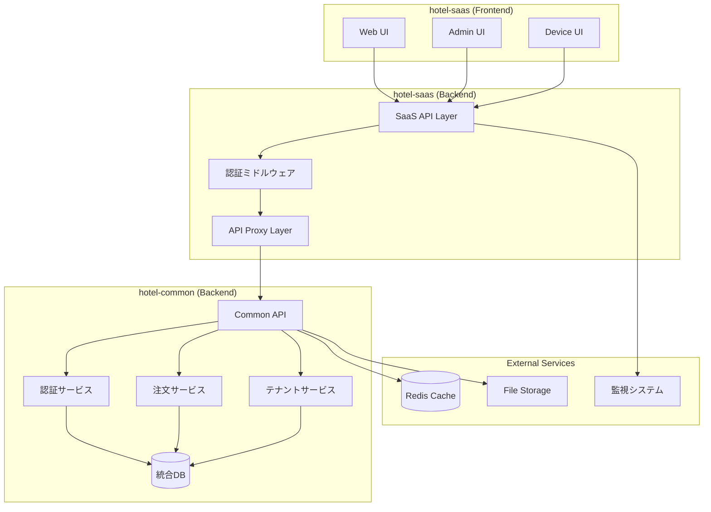

# 移行・統合戦略仕様書

**Doc-ID**: SPEC-2025-013
**Version**: 1.0
**Status**: Active
**Owner**: 金子裕司
**Linked-Docs**: SPEC-2025-006, SPEC-2025-012, SPEC-2025-004, ADR-2025-004

---

## 📋 **概要**

hotel-saasプロジェクトの移行・統合戦略の包括的仕様書です。hotel-common API統合、段階的移行計画、本番環境デプロイ、トラブルシューティング、品質保証を統合的に定義します。

## 🎯 **移行目標**

### **基本方針**
- **段階的移行**: リスク最小化による安全な移行
- **ゼロダウンタイム**: サービス継続性の確保
- **品質保証**: 包括的テスト・検証体制
- **ロールバック対応**: 迅速な復旧体制

### **成功指標**
- API統合完了率: 100%
- サービス稼働率: 99.99%維持
- パフォーマンス劣化: 5%以内
- データ整合性: 100%保証

## 🏗️ **移行アーキテクチャ**

### **統合システム全体構成**


### **移行段階設計**
```typescript
interface MigrationPhases {
  // Phase 1: 基盤統合（完了）
  phase1: {
    duration: '2週間'
    status: 'completed'
    scope: [
      'authentication_integration',
      'tenant_management',
      'basic_api_proxy',
      'error_handling'
    ]
    success_criteria: [
      'login_functionality_100%',
      'tenant_switching_100%',
      'api_proxy_stability_99%'
    ]
  }

  // Phase 2: コア機能統合（進行中）
  phase2: {
    duration: '3週間'
    status: 'in_progress'
    scope: [
      'order_management_api',
      'menu_management_api',
      'device_management_api',
      'real_time_notifications'
    ]
    success_criteria: [
      'order_api_integration_100%',
      'menu_api_integration_100%',
      'device_api_integration_100%',
      'websocket_stability_99%'
    ]
  }

  // Phase 3: 高度機能統合（計画中）
  phase3: {
    duration: '4週間'
    status: 'planned'
    scope: [
      'analytics_integration',
      'cms_integration',
      'advanced_features',
      'performance_optimization'
    ]
    success_criteria: [
      'analytics_accuracy_99%',
      'cms_functionality_100%',
      'performance_improvement_20%'
    ]
  }

  // Phase 4: 本番最適化（計画中）
  phase4: {
    duration: '2週間'
    status: 'planned'
    scope: [
      'production_deployment',
      'monitoring_setup',
      'disaster_recovery',
      'documentation_completion'
    ]
    success_criteria: [
      'production_stability_99.99%',
      'monitoring_coverage_100%',
      'recovery_time_4h'
    ]
  }
}
```

## 🔄 **API統合戦略**

### **統合優先度マトリックス**
```yaml
最高優先度 (Phase 1完了):
  認証系API:
    - POST /api/v1/auth/login: ✅ 完了
    - POST /api/auth/validate: ✅ 完了
    - POST /api/v1/auth/refresh: ✅ 完了

  テナント系API:
    - GET /api/tenants: ✅ 完了
    - GET /api/tenants/{id}: ✅ 完了

高優先度 (Phase 2進行中):
  注文系API:
    - POST /api/v1/orders: 🔄 統合中
    - GET /api/v1/orders/history: 🔄 統合中
    - GET /api/v1/orders/active: ✅ 完了
    - PUT /api/v1/orders/{id}/status: ⏳ 計画中

  メニュー系API:
    - GET /api/v1/menu/items: ⏳ 計画中
    - GET /api/v1/menu/categories: ⏳ 計画中

中優先度 (Phase 3計画中):
  管理画面API:
    - GET /api/v1/admin/dashboard/stats: ⏳ 計画中
    - GET /api/v1/admin/summary: ⏳ 計画中
    - GET /api/v1/admin/devices/count: ⏳ 計画中

  統計・分析API:
    - GET /api/v1/analytics/kpi: ⏳ 計画中
    - GET /api/v1/analytics/products: ⏳ 計画中
```

### **API統合パターン**
```typescript
interface APIIntegrationPattern {
  // プロキシパターン（推奨）
  proxy_pattern: {
    description: 'hotel-saas APIがhotel-common APIへプロキシ'
    implementation: 'server/api/v1/**/*.ts'
    benefits: [
      'フロントエンド変更最小',
      'エラーハンドリング統一',
      'キャッシュ・ログ統合',
      'セキュリティ制御'
    ]
    example: `
      export default defineEventHandler(async (event) => {
        const authUser = await verifyAuth(event)
        const response = await $fetch(\`\${HOTEL_COMMON_API_URL}/api/v1/orders\`, {
          method: 'GET',
          headers: {
            'Authorization': \`Bearer \${authUser.token}\`,
            'Content-Type': 'application/json'
          }
        })
        return response
      })
    `
  }

  // 直接統合パターン
  direct_integration: {
    description: 'フロントエンドから直接hotel-common API呼び出し'
    implementation: 'composables/useApiClient.ts'
    use_cases: [
      'リアルタイム通信',
      'ファイルアップロード',
      'ストリーミングAPI'
    ]
  }

  // ハイブリッドパターン
  hybrid_pattern: {
    description: 'プロキシと直接統合の組み合わせ'
    strategy: 'セキュリティレベルと機能要件に応じて選択'
  }
}
```

## 🧪 **テスト・品質保証戦略**

### **テスト体系**
```yaml
単体テスト:
  対象:
    - API プロキシ関数
    - 認証ミドルウェア
    - データ変換ロジック
    - エラーハンドリング

  ツール:
    - Vitest (テストフレームワーク)
    - MSW (API モック)
    - @vue/test-utils (Vue コンポーネント)

  カバレッジ目標: 80%以上

統合テスト:
  対象:
    - hotel-saas ↔ hotel-common API連携
    - 認証フロー全体
    - データ整合性
    - エラー伝播

  シナリオ:
    - 正常系フロー
    - 異常系フロー
    - 境界値テスト
    - 負荷テスト

  自動化率: 90%以上

E2Eテスト:
  対象:
    - ユーザージャーニー全体
    - クロスブラウザ対応
    - レスポンシブ対応
    - パフォーマンス

  ツール:
    - Playwright (E2Eテスト)
    - Lighthouse (パフォーマンス)
    - Axe (アクセシビリティ)

  実行頻度: CI/CD毎回
```

### **品質ゲート**
```typescript
interface QualityGates {
  // コード品質
  code_quality: {
    typescript_errors: 0
    eslint_errors: 0
    prettier_compliance: '100%'
    code_coverage: '>80%'
  }

  // API品質
  api_quality: {
    response_time_p95: '<200ms'
    error_rate: '<1%'
    availability: '>99.9%'
    data_consistency: '100%'
  }

  // セキュリティ
  security: {
    vulnerability_scan: 'passed'
    authentication_test: 'passed'
    authorization_test: 'passed'
    data_encryption: 'verified'
  }

  // パフォーマンス
  performance: {
    lighthouse_score: '>90'
    core_web_vitals: 'passed'
    memory_usage: '<512MB'
    bundle_size: '<2MB'
  }
}
```

## 🚀 **デプロイメント戦略**

### **段階的デプロイ**
```yaml
Blue-Green デプロイ:
  概要: 新旧環境を並行稼働させてリスクを最小化

  手順:
    1. Green環境に新バージョンデプロイ
    2. Green環境でテスト実行
    3. トラフィックを段階的にGreenに移行
    4. Blue環境を待機状態で保持
    5. 問題なければBlue環境を更新

カナリアデプロイ:
  概要: 一部ユーザーに新機能を先行提供

  段階:
    - 5%: 内部テストユーザー
    - 20%: ベータテストユーザー
    - 50%: 一般ユーザーの半数
    - 100%: 全ユーザー

  監視指標:
    - エラー率
    - レスポンス時間
    - ユーザー満足度
    - ビジネスメトリクス

フィーチャーフラグ:
  概要: 機能の有効/無効を動的制御

  用途:
    - 段階的機能リリース
    - A/Bテスト実施
    - 緊急時機能無効化
    - ユーザーセグメント別機能提供
```

### **環境管理**
```typescript
interface EnvironmentManagement {
  // 開発環境
  development: {
    database: 'SQLite (local)'
    api_endpoint: 'http://localhost:3400'
    cache: 'Memory'
    monitoring: 'Console logs'
    features: 'All enabled'
  }

  // ステージング環境
  staging: {
    database: 'PostgreSQL (staging)'
    api_endpoint: 'https://api-staging.hotel-common.com'
    cache: 'Redis (staging)'
    monitoring: 'Basic monitoring'
    features: 'Production-like'
  }

  // 本番環境
  production: {
    database: 'PostgreSQL (production)'
    api_endpoint: 'https://api.hotel-common.com'
    cache: 'Redis Cluster'
    monitoring: 'Full monitoring'
    features: 'Stable features only'
  }
}
```

## 🔧 **トラブルシューティング戦略**

### **問題分類・対応マトリックス**
```yaml
認証関連問題:
  症状:
    - ログイン失敗
    - トークン無効エラー
    - 権限不足エラー

  診断手順:
    1. トークンの有効性確認
    2. hotel-common API接続確認
    3. 権限設定確認
    4. セッション状態確認

  対処法:
    - トークン再発行
    - API接続設定見直し
    - 権限設定修正
    - セッションクリア

API統合問題:
  症状:
    - API呼び出し失敗
    - データ形式不一致
    - タイムアウトエラー
    - レスポンス遅延

  診断手順:
    1. API エンドポイント確認
    2. リクエスト形式確認
    3. ネットワーク接続確認
    4. hotel-common側ログ確認

  対処法:
    - エンドポイント修正
    - データ形式調整
    - タイムアウト設定調整
    - リトライ機構追加

パフォーマンス問題:
  症状:
    - 画面表示遅延
    - API レスポンス遅延
    - メモリ使用量増加
    - CPU使用率高騰

  診断手順:
    1. パフォーマンス監視確認
    2. ボトルネック特定
    3. リソース使用状況確認
    4. クエリ実行計画確認

  対処法:
    - キャッシュ最適化
    - クエリ最適化
    - リソース増強
    - 負荷分散設定
```

### **監視・アラート体系**
```typescript
interface MonitoringStrategy {
  // アプリケーション監視
  application_monitoring: {
    metrics: [
      'response_time',
      'error_rate',
      'throughput',
      'availability'
    ]
    tools: ['New Relic', 'DataDog', 'Prometheus']
    alerts: {
      error_rate_threshold: '5%'
      response_time_threshold: '500ms'
      availability_threshold: '99.9%'
    }
  }

  // インフラ監視
  infrastructure_monitoring: {
    metrics: [
      'cpu_usage',
      'memory_usage',
      'disk_usage',
      'network_io'
    ]
    tools: ['CloudWatch', 'Grafana', 'Zabbix']
    alerts: {
      cpu_threshold: '80%'
      memory_threshold: '85%'
      disk_threshold: '90%'
    }
  }

  // ビジネス監視
  business_monitoring: {
    metrics: [
      'user_activity',
      'conversion_rate',
      'revenue_impact',
      'customer_satisfaction'
    ]
    tools: ['Google Analytics', 'Mixpanel', 'Custom Dashboard']
    alerts: {
      conversion_drop: '20%'
      revenue_impact: '10%'
      satisfaction_drop: '0.5_points'
    }
  }
}
```

## 🔄 **データ移行戦略**

### **移行計画**
```yaml
データ移行フェーズ:
  Phase 1: 基本データ移行
    対象:
      - テナント情報
      - ユーザー・スタッフ情報
      - 基本設定データ

    手順:
      1. データエクスポート
      2. データ変換・クレンジング
      3. 統合DB投入
      4. 整合性チェック

    検証:
      - データ件数一致
      - 主キー整合性
      - 外部キー整合性
      - ビジネスルール適合

  Phase 2: 業務データ移行
    対象:
      - 注文履歴
      - メニューデータ
      - デバイス情報
      - 統計データ

    手順:
      1. 増分データ同期
      2. リアルタイム同期設定
      3. 切り替えタイミング調整
      4. 最終同期実行

    検証:
      - データ完全性
      - 時系列整合性
      - 集計値一致
      - 機能動作確認

  Phase 3: 履歴データ移行
    対象:
      - 古い注文履歴
      - ログデータ
      - 分析用データ
      - アーカイブデータ

    手順:
      1. バッチ処理による移行
      2. 圧縮・最適化
      3. アーカイブストレージ移行
      4. アクセス権限設定
```

### **データ整合性保証**
```typescript
interface DataIntegrityStrategy {
  // 移行前検証
  pre_migration_validation: {
    data_profiling: 'データ品質分析'
    schema_validation: 'スキーマ整合性確認'
    business_rule_check: 'ビジネスルール適合確認'
    dependency_analysis: '依存関係分析'
  }

  // 移行中監視
  migration_monitoring: {
    progress_tracking: '進捗監視'
    error_detection: 'エラー検知'
    rollback_preparation: 'ロールバック準備'
    performance_monitoring: 'パフォーマンス監視'
  }

  // 移行後検証
  post_migration_validation: {
    data_comparison: 'データ比較'
    functional_testing: '機能テスト'
    performance_testing: 'パフォーマンステスト'
    user_acceptance_testing: 'ユーザー受け入れテスト'
  }
}
```

## 📊 **進捗管理・レポート**

### **進捗追跡システム**
```yaml
KPI管理:
  技術指標:
    - API統合完了率: 現在65% → 目標100%
    - テストカバレッジ: 現在75% → 目標90%
    - パフォーマンス改善: 現在+15% → 目標+25%
    - バグ修正率: 現在90% → 目標98%

  品質指標:
    - コード品質スコア: 現在8.2/10 → 目標9.0/10
    - セキュリティスコア: 現在A- → 目標A+
    - 可用性: 現在99.5% → 目標99.9%
    - ユーザー満足度: 現在4.2/5 → 目標4.5/5

  ビジネス指標:
    - 機能完成度: 現在80% → 目標100%
    - ユーザー採用率: 現在70% → 目標90%
    - サポート問い合わせ減少: 現在-20% → 目標-50%
    - ROI改善: 現在+30% → 目標+50%

レポート体系:
  日次レポート:
    - 進捗サマリー
    - 発生した問題
    - 解決した課題
    - 翌日の計画

  週次レポート:
    - マイルストーン達成状況
    - KPI推移
    - リスク評価
    - リソース状況

  月次レポート:
    - 全体進捗評価
    - 品質メトリクス
    - 予算・スケジュール
    - ステークホルダー報告
```

## 🚀 **今後の拡張計画**

### **Phase 5以降の計画**
```yaml
Phase 5: 高度統合 (3ヶ月後)
  機能:
    - AI/ML統合
    - リアルタイム分析
    - 予測機能
    - 自動化機能

  技術:
    - マイクロサービス化
    - イベント駆動アーキテクチャ
    - サーバーレス統合
    - エッジコンピューティング

Phase 6: グローバル展開 (6ヶ月後)
  機能:
    - 多地域対応
    - 多通貨対応
    - 法規制対応
    - 現地化対応

  技術:
    - CDN最適化
    - 地域別データセンター
    - 国際化フレームワーク
    - コンプライアンス自動化
```

## 🔒 **セキュリティ・コンプライアンス**

### **セキュリティ統合**
```yaml
認証・認可:
  - JWT統合認証
  - Multi-Factor Authentication
  - Role-Based Access Control
  - API Key管理

データ保護:
  - 転送時暗号化 (TLS 1.3)
  - 保存時暗号化 (AES-256)
  - 個人情報匿名化
  - データ保持ポリシー

監査・コンプライアンス:
  - アクセスログ記録
  - 変更履歴追跡
  - GDPR対応
  - SOC2準拠
```

---

## 📋 **関連ドキュメント**

- **SPEC-2025-006**: システムアーキテクチャ設計仕様書
- **SPEC-2025-012**: データベースアーキテクチャ設計仕様書
- **SPEC-2025-004**: 統合API仕様書
- **ADR-2025-004**: Prisma統合アーキテクチャ移行戦略の決定
