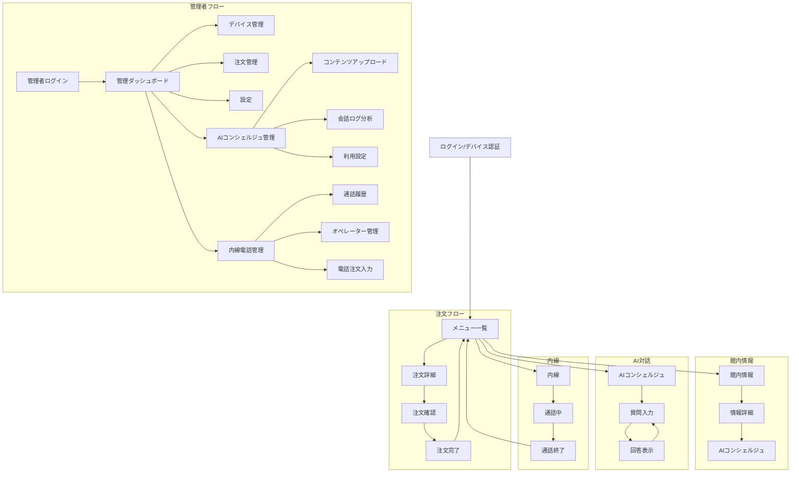

# Hotel-SaaS アーキテクチャ設計

## 1. ディレクトリ構成

```
hotel-saas/
├── components/           # 共通コンポーネント
│   ├── common/          # 汎用コンポーネント
│   ├── order/           # 注文関連コンポーネント
│   ├── info/            # 館内情報関連コンポーネント
│   ├── concierge/       # AIコンシェルジュコンポーネント
│   └── voip/            # 内線関連コンポーネント
├── pages/               # ページコンポーネント
│   ├── auth/            # 認証関連
│   │   ├── login.vue    # ログインページ
│   │   └── logout.vue   # ログアウト処理
│   ├── admin/           # 管理画面（管理者認証必須）
│   │   ├── index.vue    # 管理ダッシュボード 
│   │   ├── devices/     # デバイス管理
│   │   ├── orders/      # 注文管理
│   │   ├── concierge/   # AIコンシェルジュ管理
│   │   ├── phone/       # 内線電話管理
│   │   └── settings/    # システム設定
│   ├── order/           # 注文関連
│   │   ├── index.vue    # メニュー一覧
│   │   └── [id].vue     # 注文詳細
│   ├── concierge/       # AIコンシェルジュ
│   │   └── index.vue    # AI対話ページ
│   ├── info/            # 館内情報
│   │   ├── index.vue    # 情報一覧
│   │   └── [id].vue     # 情報詳細
│   └── voip/            # 内線
│       └── index.vue    # 内線画面
├── middleware/          # ミドルウェア
│   ├── auth.ts          # 認証ミドルウェア 
│   ├── device-auth.ts   # デバイス認証ミドルウェア
│   └── admin.ts         # 管理者認証ミドルウェア
├── server/              # サーバーサイド
│   ├── api/             # APIエンドポイント
│   │   └── v1/
│   │       ├── auth/    # 認証API
│   │       ├── device/  # デバイス認証API
│   │       ├── admin/   # 管理者API
│   │       ├── concierge/ # AIコンシェルジュAPI
│   │       ├── order/   # 注文API
│   │       ├── info/    # 館内情報API
│   │       └── phone/   # 内線電話API
│   └── ws/              # WebSocket
│       ├── order.ts     # 注文WebSocket
│       ├── voip.ts      # 内線WebSocket
│       └── signaling.ts # WebRTCシグナリング
├── stores/              # 状態管理
│   ├── auth.ts          # 認証状態
│   ├── concierge.ts     # AIコンシェルジュ状態
│   ├── order.ts         # 注文状態
│   └── voip.ts          # 内線状態
└── types/               # 型定義
    ├── concierge.ts     # AIコンシェルジュ関連型
    ├── order.ts         # 注文関連型
    ├── info.ts          # 館内情報関連型
    ├── phone.ts         # 内線電話関連型
    └── voip.ts          # 内線関連型
```

## 2. ページ遷移図



## 3. データフロー

### 3.1 注文フロー
1. メニュー一覧表示
   - カテゴリ別表示
   - 提供時間帯制御
2. 注文作成
   - 数量選択
   - 時間指定
3. WebSocket通知
   - フロント/キッチンへ通知
   - ステータス更新

### 3.2 館内情報フロー
1. 情報一覧表示
   - 期間表示
   - 多言語対応
2. AIコンシェルジュ
   - 質問入力
   - 回答表示

### 3.3 AIコンシェルジュフロー
1. ユーザー質問
   - 多言語入力対応
   - 自然言語処理
2. RAG検索処理
   - ベクトルデータベース検索
   - コンテキスト生成
3. AI応答生成
   - 外部AIサービス連携
   - 回答整形・表示
4. 会話ログ保存
   - 利用統計分析
   - インサイト抽出

### 3.4 内線電話フロー
1. 内線発信
   - 客室からオペレーターへの発信
   - WebRTCシグナリング
   - P2P接続確立
2. 通話管理
   - 通話状態管理
   - 録音・文字起こし
   - 通話履歴記録
3. 電話注文処理
   - オペレーター側での注文入力
   - キッチンへの通知
   - 注文ステータス更新

### 3.5 認証フロー
1. 客室UI認証（デバイスベース）
   - デバイスID/MACアドレスによる自動認証
   - 登録済みデバイスのみアクセス可能
   - `/` (トップページ)とその配下の客室向けページが対象

2. 管理画面認証（ユーザーベース）
   - ID/パスワードによる明示的なログイン
   - ロールベースのアクセス制御
   - `/admin` 配下の管理ページが対象

## 4. 技術スタック

### 4.1 フロントエンド
- Nuxt 3
- TypeScript
- Tailwind CSS
- WebSocket
- WebRTC

### 4.2 バックエンド
- Node.js
- WebSocket
- 認証系
  - デバイス認証（MAC/IPアドレスベース）
  - JWT認証（管理者ユーザー向け）
- AI/RAG
  - 外部AIサービス（OpenAI API等）
  - ベクトルデータベース（Pinecone/Qdrant等）
- 内線電話
  - WebRTCシグナリングサーバー
  - STUN/TURNサーバー
  - 音声文字起こしAPI

### 4.3 インフラ
- Docker
- Nginx
- PostgreSQL
- S3/CloudStorage（録音データ保存）

## 5. セキュリティ考慮事項

1. 認証
   - **客室UI**: デバイスベースの認証（MAC/IPアドレス）
   - **管理画面**: JWTベースのユーザー認証
   - セッション管理の分離
   - 相互独立したアクセス制御

2. 通信
   - HTTPS
   - WebSocket over SSL
   - WebRTC暗号化（SRTP/DTLS）
   - データ暗号化

3. 入力検証
   - XSS対策
   - CSRF対策
   - SQLインジェクション対策
   
4. AIコンシェルジュセキュリティ
   - ユーザー入力のサニタイゼーション
   - レート制限による過剰利用防止
   - センシティブ情報の保護

5. 内線電話セキュリティ
   - 通話データの暗号化
   - 録音データのアクセス制限
   - テナント間のデータ分離
   - 通話記録の監査証跡

## 6. パフォーマンス要件

1. レスポンス時間
   - ページロード: 2秒以内
   - API応答: 1秒以内
   - WebSocket: 0.5秒以内
   - AIコンシェルジュ: 2秒以内
   - 内線通話接続: 3秒以内

2. 同時接続
   - 500 req/s
   - P95=3秒以内
   - 同時通話数: 50

## 7. 開発フロー

1. 機能開発
   - コンポーネント作成
   - API実装
   - WebSocket実装
   - テスト作成

2. テスト
   - 単体テスト
   - 統合テスト
   - E2Eテスト

3. デプロイ
   - ステージング環境
   - 本番環境 

## データモデル設計

### 論理削除（ソフトデリート）

当システムでは、データの整合性と履歴追跡を維持するため、基本的に論理削除を採用しています。
以下の実装方針に従ってください：

1. **共通フィールド**
   ```prisma
   isDeleted  Boolean   @default(false)  // 論理削除フラグ
   deletedAt  DateTime? // 削除実行日時
   ```

2. **検索・表示ロジック**
   - 通常の検索・一覧表示では `isDeleted: false` のレコードのみ表示
   - 管理画面では削除済みデータの表示/非表示を切替可能に
   - 履歴データや関連データ参照時にも削除状態を明示

3. **削除・復元操作**
   - 論理削除は `server/utils/softDelete.ts` のユーティリティ関数を使用
   - 物理削除は特別な要件（法的削除要請など）がある場合のみ検討

4. **UI表示の考慮**
   - 削除済みデータを表示する際は `[削除済み]` 等の表示を追加

5. **状態管理の考慮事項**
   - `isDeleted` と `isActive` は別の概念として管理する
   - `isDeleted`: データ存在の論理状態（削除済みか否か）
   - `isActive`: 業務上の運用状態（有効か無効か）
   - 組み合わせて使用: `{ isActive: true, isDeleted: false }` = 有効なデータ

6. **運用上のベストプラクティス**
   - 一時的な無効化: `isActive = false` に設定
   - 完全な削除: 論理削除 `isDeleted = true` を使用
   - 削除済みデータの復元: `isDeleted = false, deletedAt = null` に戻す
   - 削除UIには論理削除であることを明示し、誤解を防ぐ 