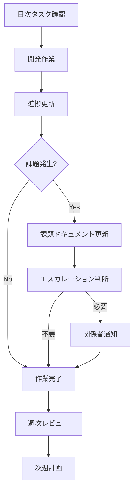

# インフォメーション機能 進捗管理ドキュメント

このディレクトリには、インフォメーション機能の開発進捗を管理するためのドキュメントが格納されています。

## 📋 ドキュメント一覧

### 📊 [開発進捗管理](./DEVELOPMENT_STATUS.md)
**目的**: 全体的な開発状況とマイルストーンの管理
**更新頻度**: 週2回 (月・木)
**対象読者**: プロジェクトマネージャー、開発チーム全体

**内容**:
- 全体進捗概要 (フェーズ別進捗率)
- 完了済み機能一覧
- 開発中・未実装機能 (ドラッグ&ドロップ編集機能を含む)
- 品質指標とテスト状況
- 既存システムへの影響確認
- 今後の展望とマイルストーン

### 🛠️ [技術実装進捗](./TECHNICAL_PROGRESS.md)
**目的**: 技術的な実装詳細と課題の管理
**更新頻度**: 週1回 (金曜日)
**対象読者**: エンジニア、技術リーダー

**内容**:
- アーキテクチャ実装状況
- API実装詳細
- パフォーマンス指標
- セキュリティ実装状況
- テスト実装状況
- CI/CDパイプライン状況

### 🚨 [現在の課題とアクション](./CURRENT_ISSUES.md)
**目的**: 緊急課題と具体的なアクションアイテムの管理
**更新頻度**: 毎日
**対象読者**: 開発者、課題担当者

**内容**:
- 緊急・重要課題一覧 (ドラッグ&ドロップ編集機能の実装を含む)
- 優先度別アクションアイテム
- 今週のアクションプラン
- リスク管理
- エスカレーション基準

## 🎯 使用方法

### 日次運用
1. **朝**: [現在の課題とアクション](./CURRENT_ISSUES.md) を確認
2. **夕**: 進捗更新と翌日のタスク整理

### 週次運用
1. **月曜**: [開発進捗管理](./DEVELOPMENT_STATUS.md) の更新
2. **木曜**: [開発進捗管理](./DEVELOPMENT_STATUS.md) の中間更新
3. **金曜**: [技術実装進捗](./TECHNICAL_PROGRESS.md) の更新と週次レビュー

### 月次運用
1. 全ドキュメントの包括的レビュー
2. メトリクス分析とトレンド確認
3. 次月の計画調整

## 📈 進捗管理フロー



## 🔄 更新ルール

### 必須更新タイミング
- ✅ **マイルストーン達成時**: 全ドキュメント更新
- ✅ **緊急課題発生時**: 課題ドキュメント即座更新
- ✅ **アーキテクチャ変更時**: 技術ドキュメント更新
- ✅ **リリース前**: 全ドキュメント最終確認

### 更新責任者
| ドキュメント | 主担当 | 副担当 | 承認者 |
|-------------|--------|--------|--------|
| 開発進捗管理 | プロジェクトマネージャー | 開発リーダー | CTO |
| 技術実装進捗 | 技術リーダー | シニアエンジニア | 開発リーダー |
| 課題とアクション | 開発者 | 技術リーダー | プロジェクトマネージャー |

## 📊 メトリクス管理

### 追跡指標
- **進捗率**: フェーズ別完了率
- **品質**: テストカバレッジ、バグ密度
- **パフォーマンス**: 応答時間、リソース使用量、ドラッグ操作応答性
- **セキュリティ**: 脆弱性数、対応率
- **ユーザビリティ**: ドラッグ&ドロップ操作性、エディタ使いやすさ

### ダッシュボード連携
```typescript
// 進捗データのAPI例
interface ProgressMetrics {
  overall: number;           // 全体進捗率
  phases: PhaseProgress[];   // フェーズ別進捗
  quality: QualityMetrics;   // 品質指標
  risks: RiskItem[];         // リスク項目
  issues: IssueItem[];       // 課題項目
}
```

## 🚨 アラート設定

### 自動通知条件
- 🔴 **緊急**: セキュリティ課題、本番障害
- 🟡 **警告**: 期限遅延リスク、品質低下
- 🟢 **情報**: マイルストーン達成、機能完成

### 通知先
- **緊急**: 全開発メンバー + 管理者
- **警告**: 関係者 + プロジェクトマネージャー
- **情報**: 開発チーム

## 📚 関連ドキュメント

### 上位ドキュメント
- [インフォメーション機能要件定義](../INFO_REQUIREMENTS.md)
- [技術仕様書](../INFO_TECHNICAL_SPEC.md)
- [開発チェックリスト](../DEVELOPMENT_CHECKLIST.md)

### 並行ドキュメント
- [MVP開発タスク](../../MVP_DEV_TASKS.md)
- [アーキテクチャ概要](../../ARCHITECTURE.md)
- [開発ルール](../../DEVELOPMENT_RULES.md)

### 新機能関連ドキュメント
- [レイアウト編集機能仕様書](../LAYOUT_EDITOR_SPEC.md)
- [レイアウト編集機能タスクリスト](../LAYOUT_EDITOR_TASKS.md)

### 下位ドキュメント
- [API仕様書](../../API_SPEC.md)
- [テスト仕様書](../INFO_TASK_SPECS.md)
- [UI設計書](../../UI_STYLE_GUIDE.md)

## 🎯 成功指標

### 短期目標 (1-2週間)
- ✅ ドラッグ&ドロップ編集機能基盤構築 100% 完了
- ✅ 緊急課題 100% 解決
- ✅ 重要課題 80% 進捗
- ✅ テストカバレッジ > 80%
- ✅ パフォーマンス目標達成

### 中期目標 (1ヶ月)
- ✅ ドラッグ&ドロップ編集機能 100% 完成
- ✅ レイアウトテンプレート機能実装
- ✅ 管理画面統合完了
- ✅ フェーズ3 機能 50% 完成
- ✅ 運用ドキュメント完備
- ✅ セキュリティ監査合格
- ✅ ユーザビリティテスト実施

### 長期目標 (2-3ヶ月)
- ✅ 全機能完成
- ✅ 本番環境デプロイ
- ✅ 運用監視体制確立
- ✅ 次期開発計画策定

## 📞 サポート・連絡先

### 技術的な質問
- **Slack**: #info-development
- **レイアウト編集機能**: #layout-editor-dev
- **メール**: dev-team@hotel-saas.local

### プロジェクト管理
- **Slack**: #project-management
- **メール**: pm-team@hotel-saas.local

### 緊急時連絡
- **電話**: 内線 999
- **緊急Slack**: #emergency-support

---

**最終更新**: 2025-01-27
**次回レビュー**: 2025-01-30
**文書管理者**: 開発チーム

> 💡 **Tips**: ドキュメントは常に最新の状態を保ち、チーム全体で情報共有を行いましょう。疑問点や改善提案があれば、いつでも開発チームまでご連絡ください。