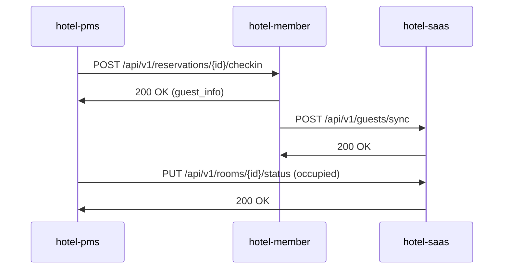
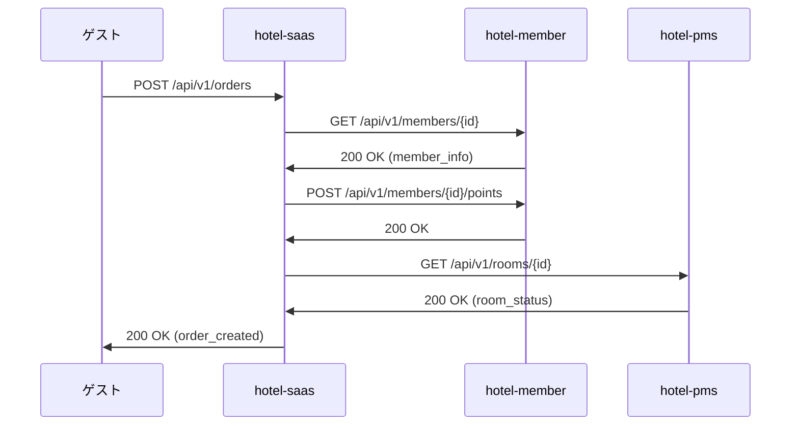
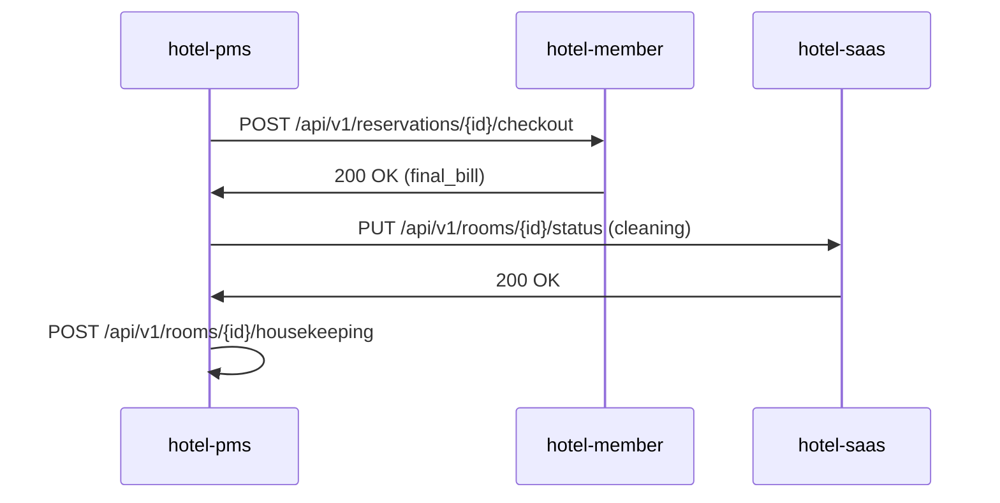

# API連携仕様書

## 1. 共通API仕様

### 1.1 基本情報
- **プロトコル**: HTTP/HTTPS
- **データ形式**: JSON
- **文字エンコーディング**: UTF-8
- **認証方式**: JWT Bearer Token

### 1.2 共通レスポンス形式
```typescript
interface ApiResponse<T> {
  success: boolean
  data?: T
  error?: {
    code: string
    message: string
    details?: any
  }
  meta: {
    tenant_id: string
    timestamp: string
    request_id: string
    system: 'saas' | 'member' | 'pms'
  }
}
```

### 1.3 共通ヘッダー
```http
Authorization: Bearer <JWT_TOKEN>
Content-Type: application/json
X-Tenant-ID: <TENANT_ID>
X-Request-ID: <UUID>
X-System-Source: saas|member|pms
```

## 2. システム間API エンドポイント

### 2.1 hotel-saas (:3100)

#### 注文関連API
```typescript
// 注文作成
POST /api/v1/orders
{
  "guest_id": number,
  "room_id": string,
  "items": OrderItem[],
  "total": number
}

// 注文取得
GET /api/v1/orders/:id
Response: Order

// 注文一覧取得
GET /api/v1/orders?room_id=101&status=active
Response: Order[]

// 注文ステータス更新
PUT /api/v1/orders/:id/status
{
  "status": "received|cooking|ready|delivered|completed"
}
```

#### ゲスト情報連携API
```typescript
// ゲスト情報取得（hotel-memberから）
GET /api/v1/guests/:id
Response: Guest

// ゲストポイント更新通知
POST /api/v1/guests/:id/points
{
  "points": number,
  "reason": string,
  "order_id": number
}
```

### 2.2 hotel-member (:3200)

#### 会員管理API
```typescript
// 会員登録
POST /api/v1/members
{
  "name": string,
  "email": string,
  "phone": string,
  "room_number": string
}

// 会員情報取得
GET /api/v1/members/:id
Response: Member

// ポイント履歴取得
GET /api/v1/members/:id/points
Response: PointHistory[]

// ポイント付与
POST /api/v1/members/:id/points
{
  "points": number,
  "reason": string,
  "order_id": number
}
```

#### 予約管理API
```typescript
// 予約作成
POST /api/v1/reservations
{
  "guest_id": number,
  "room_id": string,
  "checkin_date": string,
  "checkout_date": string,
  "total_amount": number
}

// 予約取得
GET /api/v1/reservations/:id
Response: Reservation

// チェックイン処理
PUT /api/v1/reservations/:id/checkin
{
  "checkin_time": string,
  "notes": string
}

// チェックアウト処理
PUT /api/v1/reservations/:id/checkout
{
  "checkout_time": string,
  "final_amount": number
}
```

### 2.3 hotel-pms (:3300)

#### 客室管理API
```typescript
// 客室一覧取得
GET /api/v1/rooms
Response: Room[]

// 客室ステータス更新
PUT /api/v1/rooms/:id/status
{
  "status": "available|occupied|maintenance|cleaning",
  "notes": string
}

// 客室情報取得
GET /api/v1/rooms/:id
Response: Room

// 清掃タスク作成
POST /api/v1/rooms/:id/housekeeping
{
  "task_type": "cleaning|maintenance|inspection",
  "priority": "low|medium|high",
  "notes": string
}
```

#### 清掃管理API
```typescript
// 清掃タスク一覧
GET /api/v1/housekeeping/tasks
Response: HousekeepingTask[]

// 清掃タスク完了
PUT /api/v1/housekeeping/tasks/:id/complete
{
  "completed_by": string,
  "notes": string,
  "next_task": string
}
```

## 3. システム間連携フロー

### 3.1 チェックイン時の連携フロー


### 3.2 注文時の連携フロー


### 3.3 チェックアウト時の連携フロー


## 4. エラーハンドリング

### 4.1 共通エラーコード
```typescript
enum ErrorCode {
  AUTHENTICATION_FAILED = 'AUTH_001',
  AUTHORIZATION_FAILED = 'AUTH_002',
  INVALID_REQUEST = 'REQ_001',
  RESOURCE_NOT_FOUND = 'RES_001',
  RESOURCE_CONFLICT = 'RES_002',
  SYSTEM_ERROR = 'SYS_001',
  EXTERNAL_API_ERROR = 'EXT_001'
}
```

### 4.2 エラーレスポンス例
```json
{
  "success": false,
  "error": {
    "code": "RES_001",
    "message": "指定されたリソースが見つかりません",
    "details": {
      "resource_type": "order",
      "resource_id": "12345"
    }
  },
  "meta": {
    "tenant_id": "hotel-abc",
    "timestamp": "2024-07-15T08:47:00Z",
    "request_id": "req-12345",
    "system": "saas"
  }
}
```

## 5. 認証・認可

### 5.1 JWT トークン構造
```typescript
interface JwtPayload {
  user_id: string
  tenant_id: string
  email: string
  role: string
  system_access: SystemAccess[]
  exp: number
  iat: number
}

interface SystemAccess {
  system: 'saas' | 'member' | 'pms'
  permissions: string[]
}
```

### 5.2 システム間認証
```typescript
// 各システムでの認証チェック
const validateSystemAccess = (token: string, requiredSystem: string) => {
  const decoded = jwt.verify(token, JWT_SECRET) as JwtPayload

  const hasAccess = decoded.system_access.some(
    access => access.system === requiredSystem
  )

  if (!hasAccess) {
    throw new Error('AUTHORIZATION_FAILED')
  }

  return decoded
}
```

## 6. レート制限

### 6.1 制限設定
```typescript
const RATE_LIMITS = {
  'api/v1/orders': { requests: 100, window: '1m' },
  'api/v1/members': { requests: 50, window: '1m' },
  'api/v1/rooms': { requests: 200, window: '1m' }
}
```

### 6.2 制限超過時のレスポンス
```json
{
  "success": false,
  "error": {
    "code": "RATE_LIMIT_EXCEEDED",
    "message": "レート制限を超過しました",
    "details": {
      "limit": 100,
      "window": "1m",
      "reset_time": "2024-07-15T08:48:00Z"
    }
  }
}
```

## 7. 監視・ログ

### 7.1 APIアクセスログ
```typescript
interface ApiAccessLog {
  timestamp: string
  request_id: string
  method: string
  path: string
  status_code: number
  response_time: number
  user_id: string
  tenant_id: string
  system_source: string
  system_target: string
}
```

### 7.2 メトリクス
- リクエスト数（システム別）
- レスポンス時間（エンドポイント別）
- エラー率（システム別）
- 認証失敗数（ユーザー別）

この仕様書に基づいて、各システムでAPI連携を実装してください。

---

## 8. 付録: Room Memo API 概要（詳細は specs/2025-09-10_room-memo-spec.v1.md）

- GET  `/api/v1/admin/rooms/{roomNumber}/memos`
- POST `/api/v1/admin/room-memos`
- PUT  `/api/v1/admin/room-memos/{id}`
- PUT  `/api/v1/admin/room-memos/{id}/status`
- GET  `/api/v1/admin/room-memos/{id}/comments`
- POST `/api/v1/admin/room-memos/{id}/comments`
- GET  `/api/v1/admin/room-memos/{id}/history`
- DELETE `/api/v1/admin/room-memos/{id}`

カテゴリ固定値: reservation | handover | lost_item | maintenance | cleaning | guest_request | other（default: handover）
可視性: public | private | role（default: public）
既読管理: 任意（Phase 2）
rooms.notes: 廃止（room_memosへ移行）
