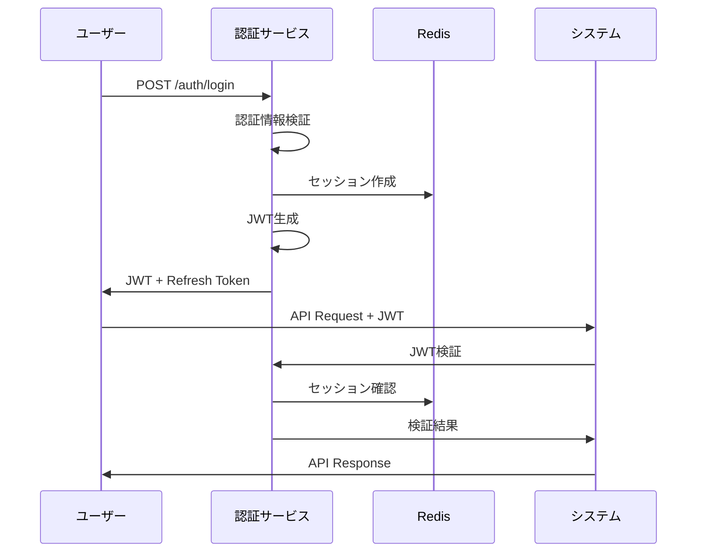
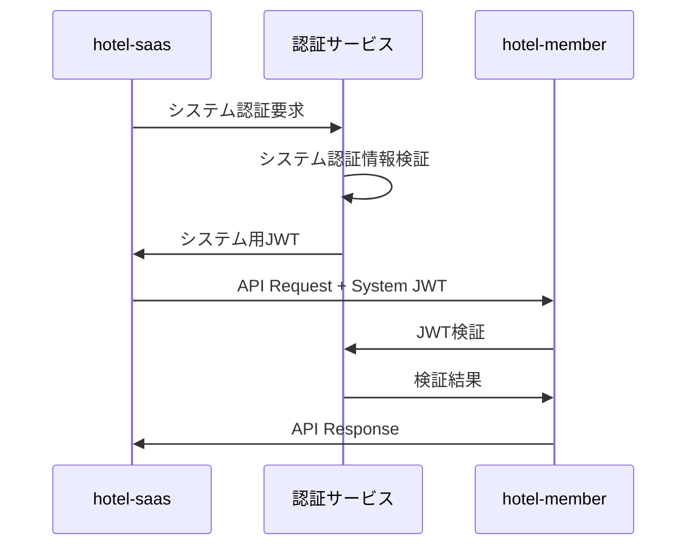

# 認証・認可連携仕様書

## 1. 認証アーキテクチャ

### 1.1 統合認証システム
```
┌─────────────────────────────────────────────────┐
│             統合認証サービス                      │
│           (JWT + Redis Session)                 │
└─────────────────────────────────────────────────┘
                      │
        ┌─────────────┼─────────────┐
        │             │             │
┌───────▼───────┐ ┌───▼───┐ ┌───────▼───────┐
│  hotel-saas   │ │ hotel │ │  hotel-pms    │
│   :3100       │ │ member│ │   :3300       │
│               │ │ :3200 │ │               │
└───────────────┘ └───────┘ └───────────────┘
```

### 1.2 認証方式
- **JWT (JSON Web Token)**: ステートレス認証
- **Redis Session**: セッション管理・無効化対応
- **OAuth2.0**: 将来的な外部認証連携
- **Multi-Factor Authentication**: 管理者向け2FA

## 2. JWT トークン設計

### 2.1 JWT ペイロード構造
```typescript
interface JwtPayload {
  // 基本情報
  sub: string              // ユーザーID
  tenant_id: string        // テナントID
  email: string           // メールアドレス
  role: string            // 基本ロール
  
  // システムアクセス権限
  system_access: SystemAccess[]
  
  // 権限詳細
  permissions: Permission[]
  
  // トークン情報
  iat: number             // 発行時刻
  exp: number             // 有効期限
  jti: string             // JWT ID (無効化用)
  
  // セッション情報
  session_id: string      // Redis セッションID
  
  // デバイス情報
  device_id?: string      // デバイス識別子
  ip_address?: string     // 発行時IPアドレス
}

interface SystemAccess {
  system: 'saas' | 'member' | 'pms'
  level: 'read' | 'write' | 'admin'
  features: string[]      // 利用可能機能
}

interface Permission {
  resource: string        // リソース名
  actions: string[]       // 許可されたアクション
  conditions?: any        // 条件付きアクセス
}
```

### 2.2 トークン種別
```typescript
enum TokenType {
  ACCESS_TOKEN = 'access',    // 短期間（15分）
  REFRESH_TOKEN = 'refresh',  // 長期間（7日）
  DEVICE_TOKEN = 'device',    // デバイス認証用（30日）
  API_TOKEN = 'api'           // システム間通信用
}
```

## 3. 認証フロー

### 3.1 ユーザー認証フロー


### 3.2 システム間認証フロー


## 4. 認証実装

### 4.1 統合認証サービス
```typescript
// auth-service.ts
export class AuthService {
  private jwtSecret: string
  private redisClient: Redis
  
  constructor() {
    this.jwtSecret = process.env.JWT_SECRET!
    this.redisClient = new Redis(process.env.REDIS_URL!)
  }

  async login(email: string, password: string, deviceInfo?: DeviceInfo): Promise<AuthResult> {
    // 1. ユーザー認証
    const user = await this.authenticateUser(email, password)
    if (!user) {
      throw new AuthError('INVALID_CREDENTIALS')
    }

    // 2. セッション作成
    const sessionId = uuid()
    const sessionData = {
      user_id: user.id,
      tenant_id: user.tenant_id,
      device_info: deviceInfo,
      created_at: new Date().toISOString(),
      last_activity: new Date().toISOString()
    }
    
    await this.redisClient.setex(
      `session:${sessionId}`,
      7 * 24 * 60 * 60, // 7日間
      JSON.stringify(sessionData)
    )

    // 3. JWT生成
    const accessToken = await this.generateAccessToken(user, sessionId)
    const refreshToken = await this.generateRefreshToken(user, sessionId)

    return {
      access_token: accessToken,
      refresh_token: refreshToken,
      expires_in: 900, // 15分
      user: {
        id: user.id,
        email: user.email,
        role: user.role,
        tenant_id: user.tenant_id,
        system_access: user.system_access
      }
    }
  }

  async validateToken(token: string): Promise<JwtPayload | null> {
    try {
      // 1. JWT検証
      const payload = jwt.verify(token, this.jwtSecret) as JwtPayload
      
      // 2. セッション確認
      const sessionData = await this.redisClient.get(`session:${payload.session_id}`)
      if (!sessionData) {
        return null
      }

      // 3. 最終アクティビティ更新
      const session = JSON.parse(sessionData)
      session.last_activity = new Date().toISOString()
      await this.redisClient.setex(
        `session:${payload.session_id}`,
        7 * 24 * 60 * 60,
        JSON.stringify(session)
      )

      return payload
    } catch (error) {
      return null
    }
  }

  async logout(sessionId: string): Promise<void> {
    await this.redisClient.del(`session:${sessionId}`)
  }

  private async generateAccessToken(user: User, sessionId: string): Promise<string> {
    const payload: JwtPayload = {
      sub: user.id,
      tenant_id: user.tenant_id,
      email: user.email,
      role: user.role,
      system_access: user.system_access,
      permissions: user.permissions,
      session_id: sessionId,
      iat: Math.floor(Date.now() / 1000),
      exp: Math.floor(Date.now() / 1000) + 900, // 15分
      jti: uuid()
    }

    return jwt.sign(payload, this.jwtSecret)
  }
}
```

### 4.2 システム別認証ミドルウェア
```typescript
// hotel-saas/middleware/auth.ts
export default defineEventHandler(async (event) => {
  // 認証が必要なパスのチェック
  if (!event.node.req.url?.startsWith('/api/v1/')) {
    return
  }

  const authHeader = getHeader(event, 'authorization')
  if (!authHeader?.startsWith('Bearer ')) {
    throw createError({
      statusCode: 401,
      statusMessage: 'Authorization header required'
    })
  }

  const token = authHeader.substring(7)
  const authService = new AuthService()
  const payload = await authService.validateToken(token)

  if (!payload) {
    throw createError({
      statusCode: 401,
      statusMessage: 'Invalid or expired token'
    })
  }

  // システムアクセス権限チェック
  const hasAccess = payload.system_access.some(
    access => access.system === 'saas' && 
             ['read', 'write', 'admin'].includes(access.level)
  )

  if (!hasAccess) {
    throw createError({
      statusCode: 403,
      statusMessage: 'Access denied for this system'
    })
  }

  // コンテキストに認証情報を設定
  event.context.auth = {
    user: payload,
    tenant_id: payload.tenant_id
  }

  // データベース接続にテナントIDを設定
  await prisma.$executeRaw`SET app.current_tenant = ${payload.tenant_id}`
})
```

## 5. 権限管理

### 5.1 ロールベースアクセス制御 (RBAC)
```typescript
// 基本ロール定義
enum Role {
  SUPER_ADMIN = 'super_admin',    // システム管理者
  TENANT_ADMIN = 'tenant_admin',  // テナント管理者
  MANAGER = 'manager',            // マネージャー
  STAFF = 'staff',                // スタッフ
  GUEST = 'guest'                 // ゲスト
}

// システム別権限定義
const SYSTEM_PERMISSIONS = {
  saas: {
    super_admin: ['*'],
    tenant_admin: ['order:*', 'menu:*', 'device:*', 'report:read'],
    manager: ['order:read', 'order:update', 'menu:read', 'report:read'],
    staff: ['order:read', 'order:update'],
    guest: ['order:create', 'menu:read']
  },
  member: {
    super_admin: ['*'],
    tenant_admin: ['member:*', 'reservation:*', 'point:*'],
    manager: ['member:read', 'reservation:*', 'point:read'],
    staff: ['member:read', 'reservation:read'],
    guest: ['member:read_own', 'reservation:read_own']
  },
  pms: {
    super_admin: ['*'],
    tenant_admin: ['room:*', 'housekeeping:*', 'report:*'],
    manager: ['room:read', 'room:update', 'housekeeping:*', 'report:read'],
    staff: ['room:read', 'housekeeping:read', 'housekeeping:update'],
    guest: []
  }
}
```

### 5.2 権限チェック関数
```typescript
// 権限チェック関数
export class PermissionService {
  static hasPermission(
    user: JwtPayload,
    system: string,
    resource: string,
    action: string
  ): boolean {
    // スーパー管理者は全権限
    if (user.role === 'super_admin') {
      return true
    }

    // システムアクセス権限チェック
    const systemAccess = user.system_access.find(sa => sa.system === system)
    if (!systemAccess) {
      return false
    }

    // 具体的な権限チェック
    const permissions = SYSTEM_PERMISSIONS[system]?.[user.role] || []
    
    return permissions.some(permission => {
      if (permission === '*') return true
      
      const [permResource, permAction] = permission.split(':')
      return (permResource === resource || permResource === '*') &&
             (permAction === action || permAction === '*')
    })
  }

  static requirePermission(
    user: JwtPayload,
    system: string,
    resource: string,
    action: string
  ): void {
    if (!this.hasPermission(user, system, resource, action)) {
      throw new AuthError('INSUFFICIENT_PERMISSIONS')
    }
  }
}
```

## 6. デバイス認証

### 6.1 デバイス認証フロー
```typescript
// デバイス認証サービス
export class DeviceAuthService {
  async authenticateDevice(
    placeId: string,
    securityKey: string,
    deviceInfo: DeviceInfo
  ): Promise<DeviceAuthResult> {
    // 1. デバイス情報検証
    const device = await this.validateDevice(placeId, securityKey)
    if (!device) {
      throw new AuthError('INVALID_DEVICE')
    }

    // 2. デバイストークン生成
    const deviceToken = await this.generateDeviceToken(device, deviceInfo)

    // 3. デバイスセッション作成
    const sessionId = uuid()
    await this.redisClient.setex(
      `device:${sessionId}`,
      30 * 24 * 60 * 60, // 30日間
      JSON.stringify({
        device_id: device.id,
        place_id: placeId,
        device_info: deviceInfo,
        created_at: new Date().toISOString()
      })
    )

    return {
      device_token: deviceToken,
      session_id: sessionId,
      place_info: {
        id: device.place.id,
        name: device.place.name,
        room_number: device.place.code
      }
    }
  }

  private async generateDeviceToken(
    device: Device,
    deviceInfo: DeviceInfo
  ): Promise<string> {
    const payload = {
      sub: `device:${device.id}`,
      tenant_id: device.tenant_id,
      place_id: device.place_id,
      room_id: device.room_id,
      device_type: 'tablet',
      system_access: [{
        system: 'saas',
        level: 'guest',
        features: ['order', 'menu', 'info']
      }],
      iat: Math.floor(Date.now() / 1000),
      exp: Math.floor(Date.now() / 1000) + (30 * 24 * 60 * 60), // 30日
      jti: uuid()
    }

    return jwt.sign(payload, this.jwtSecret)
  }
}
```

## 7. セキュリティ対策

### 7.1 トークン無効化
```typescript
// トークン無効化サービス
export class TokenRevocationService {
  async revokeToken(jti: string): Promise<void> {
    await this.redisClient.setex(
      `revoked:${jti}`,
      24 * 60 * 60, // 24時間
      'true'
    )
  }

  async isTokenRevoked(jti: string): Promise<boolean> {
    const revoked = await this.redisClient.get(`revoked:${jti}`)
    return revoked === 'true'
  }

  async revokeAllUserTokens(userId: string): Promise<void> {
    // ユーザーの全セッションを無効化
    const sessions = await this.redisClient.keys(`session:*`)
    for (const sessionKey of sessions) {
      const sessionData = await this.redisClient.get(sessionKey)
      if (sessionData) {
        const session = JSON.parse(sessionData)
        if (session.user_id === userId) {
          await this.redisClient.del(sessionKey)
        }
      }
    }
  }
}
```

### 7.2 レート制限
```typescript
// 認証レート制限
export class AuthRateLimiter {
  async checkLoginAttempts(email: string, ip: string): Promise<void> {
    const emailKey = `login_attempts:email:${email}`
    const ipKey = `login_attempts:ip:${ip}`

    const emailAttempts = await this.redisClient.incr(emailKey)
    const ipAttempts = await this.redisClient.incr(ipKey)

    if (emailAttempts === 1) {
      await this.redisClient.expire(emailKey, 300) // 5分
    }
    if (ipAttempts === 1) {
      await this.redisClient.expire(ipKey, 300) // 5分
    }

    if (emailAttempts > 5) {
      throw new AuthError('EMAIL_RATE_LIMITED')
    }
    if (ipAttempts > 10) {
      throw new AuthError('IP_RATE_LIMITED')
    }
  }

  async resetLoginAttempts(email: string, ip: string): Promise<void> {
    await this.redisClient.del(`login_attempts:email:${email}`)
    await this.redisClient.del(`login_attempts:ip:${ip}`)
  }
}
```

## 8. 監査ログ

### 8.1 認証イベントログ
```typescript
interface AuthAuditLog {
  event_type: 'login' | 'logout' | 'token_refresh' | 'permission_denied'
  user_id: string
  tenant_id: string
  ip_address: string
  user_agent: string
  success: boolean
  error_code?: string
  system: string
  timestamp: string
}

export class AuthAuditService {
  async logAuthEvent(event: AuthAuditLog): Promise<void> {
    // データベースに監査ログを保存
    await prisma.authAuditLog.create({
      data: event
    })

    // 重要なイベントはリアルタイム通知
    if (!event.success && event.event_type === 'login') {
      await this.notifySecurityTeam(event)
    }
  }

  private async notifySecurityTeam(event: AuthAuditLog): Promise<void> {
    // セキュリティチームへの通知実装
    // Slack、メール、SMS等
  }
}
```

この仕様書に基づいて、統合認証システムを実装してください。 