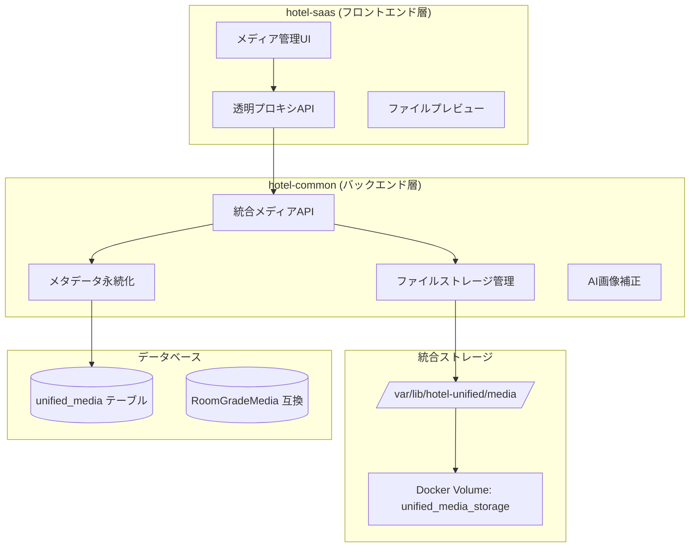

# 🖼️ 包括的メディア管理仕様書

**Doc-ID**: SPEC-2025-007  
**Version**: 1.0  
**Status**: 🔴 **CRITICAL** - 即座実装必須  
**Owner**: 金子裕司  
**作成日**: 2025年1月28日  
**関連**: SPEC-2025-005, SPEC-2025-006

---

## 📋 **概要**

hotel-saasにおけるメディア管理の包括的な仕様を定義し、現在動作していない客室ランクメディア管理機能の解決策を提供する。

## 🎯 **設計方針の明確化**

### **質問への回答**

#### **Q1: 「メディア API が hotel-common に既存し、それをプロキシする」のか「Nuxt 側で Prisma を直接叩く」のか？**

**A1: hotel-common APIプロキシ方式を採用**

```yaml
決定事項:
  永続化方針: hotel-common API経由のみ
  Prisma直接使用: 完全禁止
  理由:
    - 統合アーキテクチャの設計思想に準拠
    - データベースアクセスポリシー (ADR-2025-003) に準拠
    - メモリリーク・循環参照の回避
    - 保守性・拡張性の向上
```

#### **Q2: ファイル保存パス（public/uploads/... を使うのか、別の保存先を指示しているのか）に関する最終仕様**

**A2: 統一ストレージ `/var/lib/hotel-unified/media/` を採用**

```yaml
決定事項:
  物理パス: /var/lib/hotel-unified/media/
  論理パス: {system}/{entityType}/{tenantId}/{entityId}/{mediaType}/{category?}/{filename}
  公開URL: https://media.hotel-unified.com/media/{logical_path}
  理由:
    - Docker統合ストレージによる一元管理
    - テナント分離とセキュリティ確保
    - CDN配信対応
    - システム間共有対応
```

---

## 🏗️ **アーキテクチャ全体像**



---

## 🔧 **実装仕様詳細**

### **1. hotel-common統合メディアAPI**

#### **エンドポイント設計**

```typescript
// hotel-common/src/routes/api/v1/media/
interface UnifiedMediaAPI {
  // メディアアップロード
  'POST /api/v1/media/upload': {
    request: {
      files: File[]
      context: {
        system: 'saas' | 'pms' | 'member'
        entity_type: string
        entity_id: string
        tenant_id: string
        category?: string
        enable_ai_enhancement?: boolean
      }
    }
    response: {
      success: boolean
      media: MediaRecord[]
      urls: string[]
    }
  }

  // メディア一覧取得
  'GET /api/v1/media': {
    query: {
      system: string
      entity_type: string
      entity_id: string
      tenant_id: string
    }
    response: {
      media: MediaRecord[]
      total: number
    }
  }

  // メディア更新
  'PUT /api/v1/media/:id': {
    request: {
      title?: string
      description?: string
      display_order?: number
      is_primary?: boolean
    }
    response: MediaRecord
  }

  // メディア削除
  'DELETE /api/v1/media/:id': {
    response: { success: boolean }
  }
}
```

#### **データモデル**

```typescript
// hotel-common/prisma/schema.prisma
model UnifiedMedia {
  id                String   @id @default(cuid())
  tenantId         String   @map("tenant_id")
  
  // ファイル情報
  originalFilename String   @map("original_filename")
  storedFilename   String   @map("stored_filename")
  filePath         String   @map("file_path")
  fileSize         BigInt   @map("file_size")
  mimeType         String   @map("mime_type")
  
  // 画像情報
  width            Int?
  height           Int?
  format           String?
  
  // システム情報
  sourceSystem     String   @map("source_system") // 'saas', 'pms', 'member'
  entityType       String   @map("entity_type")   // 'room_grade', 'article', 'menu'
  entityId         String   @map("entity_id")
  
  // メタデータ
  title            String?
  description      String?
  displayOrder     Int      @default(1) @map("display_order")
  isPrimary        Boolean  @default(false) @map("is_primary")
  isActive         Boolean  @default(true) @map("is_active")
  
  // AI処理情報
  isAiEnhanced     Boolean  @default(false) @map("is_ai_enhanced")
  enhancementData  Json?    @map("enhancement_data")
  qualityScore     Decimal? @map("quality_score")
  
  createdAt        DateTime @default(now()) @map("created_at")
  updatedAt        DateTime @updatedAt @map("updated_at")
  deletedAt        DateTime? @map("deleted_at")

  @@map("unified_media")
  @@index([tenantId, sourceSystem, entityType, entityId])
  @@index([sourceSystem, entityType, isActive])
  @@index([tenantId, entityType, entityId, isPrimary])
}
```

### **2. hotel-saas透明プロキシ実装**

#### **客室ランクメディア管理API**

```typescript
// hotel-saas/server/api/v1/admin/room-grades/[id]/media/upload.post.ts
export default defineEventHandler(async (event) => {
  const roomGradeId = getRouterParam(event, 'id')
  const authUser = await verifyAuth(event)
  
  if (!authUser) {
    throw createError({ statusCode: 401, statusMessage: 'Unauthorized' })
  }

  try {
    const formData = await readMultipartFormData(event)
    const hotelCommonApiUrl = process.env.HOTEL_COMMON_API_URL || 'http://localhost:3400'
    
    const response = await $fetch(`${hotelCommonApiUrl}/api/v1/media/upload`, {
      method: 'POST',
      headers: {
        'Authorization': `Bearer ${authUser.token}`,
        'Content-Type': 'multipart/form-data'
      },
      body: {
        files: formData,
        context: {
          system: 'saas',
          entity_type: 'room_grade',
          entity_id: roomGradeId,
          tenant_id: authUser.tenantId,
          enable_ai_enhancement: true
        }
      }
    })

    return response
  } catch (error: any) {
    throw createError({
      statusCode: error.response?.status || 503,
      statusMessage: error.response?.data?.message || 'Media upload failed'
    })
  }
})

// hotel-saas/server/api/v1/admin/room-grades/[id]/media/index.get.ts
export default defineEventHandler(async (event) => {
  const roomGradeId = getRouterParam(event, 'id')
  const authUser = await verifyAuth(event)
  
  if (!authUser) {
    throw createError({ statusCode: 401, statusMessage: 'Unauthorized' })
  }

  try {
    const hotelCommonApiUrl = process.env.HOTEL_COMMON_API_URL || 'http://localhost:3400'
    
    const response = await $fetch(`${hotelCommonApiUrl}/api/v1/media`, {
      method: 'GET',
      headers: {
        'Authorization': `Bearer ${authUser.token}`
      },
      query: {
        system: 'saas',
        entity_type: 'room_grade',
        entity_id: roomGradeId,
        tenant_id: authUser.tenantId
      }
    })

    return response
  } catch (error: any) {
    throw createError({
      statusCode: error.response?.status || 503,
      statusMessage: error.response?.data?.message || 'Failed to fetch media'
    })
  }
})
```

### **3. フロントエンド統合**

#### **Composable実装**

```typescript
// hotel-saas/composables/useRoomGradeMedia.ts
export const useRoomGradeMedia = () => {
  const config = useRuntimeConfig()
  
  const uploadMedia = async (roomGradeId: string, files: File[]) => {
    const formData = new FormData()
    files.forEach((file, index) => {
      formData.append(`files[${index}]`, file)
    })
    
    try {
      const response = await $fetch(`/api/v1/admin/room-grades/${roomGradeId}/media/upload`, {
        method: 'POST',
        body: formData
      })
      
      return response
    } catch (error) {
      console.error('Media upload failed:', error)
      throw error
    }
  }
  
  const fetchMedia = async (roomGradeId: string) => {
    try {
      const response = await $fetch(`/api/v1/admin/room-grades/${roomGradeId}/media`)
      return response.media || []
    } catch (error) {
      console.error('Failed to fetch media:', error)
      return []
    }
  }
  
  const updateMedia = async (mediaId: string, updates: {
    title?: string
    description?: string
    display_order?: number
    is_primary?: boolean
  }) => {
    try {
      const response = await $fetch(`/api/v1/admin/media/${mediaId}`, {
        method: 'PUT',
        body: updates
      })
      
      return response
    } catch (error) {
      console.error('Media update failed:', error)
      throw error
    }
  }
  
  const deleteMedia = async (mediaId: string) => {
    try {
      await $fetch(`/api/v1/admin/media/${mediaId}`, {
        method: 'DELETE'
      })
    } catch (error) {
      console.error('Media deletion failed:', error)
      throw error
    }
  }
  
  return {
    uploadMedia,
    fetchMedia,
    updateMedia,
    deleteMedia
  }
}
```

---

## 🔄 **実装手順**

### **Phase 1: hotel-common基盤実装 (Week 1)**

1. **統合メディアテーブル作成**
```sql
-- hotel-common/prisma/migrations/add_unified_media.sql
CREATE TABLE "unified_media" (
  id TEXT PRIMARY KEY,
  tenant_id TEXT NOT NULL,
  original_filename TEXT NOT NULL,
  stored_filename TEXT NOT NULL,
  file_path TEXT NOT NULL,
  file_size BIGINT NOT NULL,
  mime_type TEXT NOT NULL,
  width INTEGER,
  height INTEGER,
  format TEXT,
  source_system TEXT NOT NULL,
  entity_type TEXT NOT NULL,
  entity_id TEXT NOT NULL,
  title TEXT,
  description TEXT,
  display_order INTEGER DEFAULT 1,
  is_primary BOOLEAN DEFAULT false,
  is_active BOOLEAN DEFAULT true,
  is_ai_enhanced BOOLEAN DEFAULT false,
  enhancement_data JSONB,
  quality_score DECIMAL(3,2),
  created_at TIMESTAMP DEFAULT NOW(),
  updated_at TIMESTAMP DEFAULT NOW(),
  deleted_at TIMESTAMP
);

CREATE INDEX idx_unified_media_tenant_system_entity ON "unified_media"(tenant_id, source_system, entity_type, entity_id);
CREATE INDEX idx_unified_media_system_entity_active ON "unified_media"(source_system, entity_type, is_active);
CREATE INDEX idx_unified_media_tenant_entity_primary ON "unified_media"(tenant_id, entity_type, entity_id, is_primary);
```

2. **統合メディアAPI実装**
```typescript
// hotel-common/src/services/MediaService.ts
export class MediaService {
  async uploadMedia(files: File[], context: MediaContext): Promise<MediaRecord[]> {
    // 1. ファイル検証
    await this.validateFiles(files)
    
    // 2. ファイル保存
    const savedFiles = await this.saveFiles(files, context)
    
    // 3. メタデータ永続化
    const mediaRecords = await this.createMediaRecords(savedFiles, context)
    
    // 4. AI画像補正（非同期）
    if (context.enableAiEnhancement) {
      this.scheduleAiEnhancement(mediaRecords)
    }
    
    return mediaRecords
  }
  
  async getMedia(filter: MediaFilter): Promise<MediaRecord[]> {
    return await this.prisma.unifiedMedia.findMany({
      where: {
        tenantId: filter.tenantId,
        sourceSystem: filter.system,
        entityType: filter.entityType,
        entityId: filter.entityId,
        isActive: true,
        deletedAt: null
      },
      orderBy: [
        { isPrimary: 'desc' },
        { displayOrder: 'asc' },
        { createdAt: 'desc' }
      ]
    })
  }
}
```

### **Phase 2: hotel-saas透明プロキシ実装 (Week 2)**

1. **既存Prisma使用箇所の削除**
```bash
# hotel-saas内のPrisma使用箇所を完全削除
find server/ -name "*.ts" -exec grep -l "PrismaClient\|prisma\." {} \; | xargs rm
```

2. **透明プロキシAPI実装**
```typescript
// 上記のAPI実装を適用
```

3. **環境変数設定**
```bash
# hotel-saas/.env
HOTEL_COMMON_API_URL=http://localhost:3400
MEDIA_BASE_URL=https://media.hotel-unified.com
```

### **Phase 3: Docker統合設定 (Week 2-3)**

```yaml
# docker-compose.unified.yml 更新
services:
  common:
    volumes:
      - unified_media_storage:/app/uploads
    environment:
      - UNIFIED_MEDIA_STORAGE_PATH=/app/uploads
      - MEDIA_BASE_URL=https://media.hotel-unified.com

  saas:
    volumes:
      - unified_media_storage:/app/uploads:ro  # 読み取り専用
    environment:
      - HOTEL_COMMON_API_URL=http://common:3400

volumes:
  unified_media_storage:
    driver: local
    driver_opts:
      type: none
      o: bind
      device: /var/lib/hotel-unified/media
```

---

## 🧪 **テスト仕様**

### **1. 統合テスト**

```typescript
// tests/integration/media-management.test.ts
describe('メディア管理統合テスト', () => {
  test('客室ランクメディアアップロード', async () => {
    const roomGradeId = 'test-room-grade-123'
    const testFile = new File(['test'], 'test-image.jpg', { type: 'image/jpeg' })
    
    const response = await uploadMedia(roomGradeId, [testFile])
    
    expect(response.success).toBe(true)
    expect(response.media).toHaveLength(1)
    expect(response.urls).toHaveLength(1)
    expect(response.urls[0]).toMatch(/^https:\/\/media\.hotel-unified\.com\/media\/saas\/room_grade\//)
  })
  
  test('メディア一覧取得', async () => {
    const roomGradeId = 'test-room-grade-123'
    
    const media = await fetchMedia(roomGradeId)
    
    expect(Array.isArray(media)).toBe(true)
    expect(media[0]).toHaveProperty('id')
    expect(media[0]).toHaveProperty('filePath')
    expect(media[0]).toHaveProperty('publicUrl')
  })
})
```

### **2. エラーハンドリングテスト**

```typescript
describe('エラーハンドリング', () => {
  test('hotel-common接続失敗時のフォールバック', async () => {
    // hotel-commonを停止した状態でテスト
    const response = await uploadMedia('test-id', [testFile])
    
    expect(response.error).toBeDefined()
    expect(response.error.statusCode).toBe(503)
    expect(response.error.message).toContain('Service unavailable')
  })
})
```

---

## 📊 **パフォーマンス仕様**

### **1. ファイルサイズ制限**

```typescript
const FILE_SIZE_LIMITS = {
  'image/jpeg': 5 * 1024 * 1024,    // 5MB
  'image/png': 5 * 1024 * 1024,     // 5MB
  'image/webp': 5 * 1024 * 1024,    // 5MB
  'video/mp4': 50 * 1024 * 1024,    // 50MB
  'video/webm': 50 * 1024 * 1024    // 50MB
}
```

### **2. 画像最適化**

```typescript
// hotel-common/src/services/ImageOptimizationService.ts
export class ImageOptimizationService {
  async optimizeImage(inputPath: string, outputPath: string): Promise<void> {
    await sharp(inputPath)
      .resize(1920, 1080, { 
        fit: 'inside',
        withoutEnlargement: true 
      })
      .jpeg({ quality: 85 })
      .webp({ quality: 80 })
      .toFile(outputPath)
  }
}
```

---

## 🔍 **実装確認チェックリスト**

### **hotel-common側**
- [ ] 統合メディアテーブル作成
- [ ] 統合メディアAPI実装 (`/api/v1/media/*`)
- [ ] ファイルストレージサービス実装
- [ ] AI画像補正機能統合
- [ ] Docker統合ストレージ設定

### **hotel-saas側**
- [ ] 既存Prisma使用箇所の完全削除
- [ ] 透明プロキシAPI実装 (`/api/v1/admin/room-grades/*/media/*`)
- [ ] useRoomGradeMedia composable実装
- [ ] 環境変数設定 (HOTEL_COMMON_API_URL)
- [ ] エラーハンドリング実装

### **統合テスト**
- [ ] メディアアップロード動作確認
- [ ] ファイルパス生成確認
- [ ] 公開URL生成確認
- [ ] テナント分離確認
- [ ] エラー時のフォールバック確認

### **パフォーマンステスト**
- [ ] 大容量ファイルアップロード
- [ ] 同時アップロード処理
- [ ] CDN配信確認
- [ ] 画像最適化確認

---

## 🚨 **緊急対応が必要な理由**

1. **現在の問題**: 客室ランクメディア管理が完全に動作していない
2. **原因**: 永続化方針とファイル保存パス仕様の不明確さ
3. **影響**: hotel-saasの主要機能が使用不可
4. **解決策**: 本仕様書に基づく即座の実装

**実装優先度**: 🔴 **CRITICAL** - 1週間以内の完了が必須

---

## 📞 **サポート・質問**

本仕様書に関する質問や実装支援が必要な場合は、統合管理者（金子裕司）まで連絡してください。

**連絡先**: 
- 仕様書: `docs/01_systems/saas/specifications/`
- 関連ADR: `docs/01_systems/saas/adr/2025-01-28_database-access-policy.v1.md`
- 移行計画: `docs/systems/common/MEDIA_MANAGEMENT_MIGRATION_PLAN.md`
