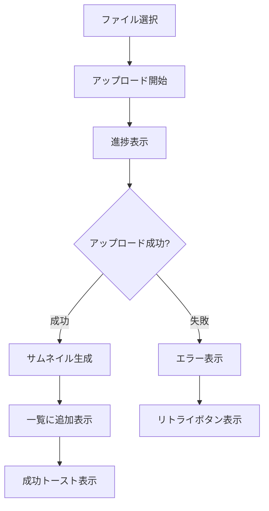
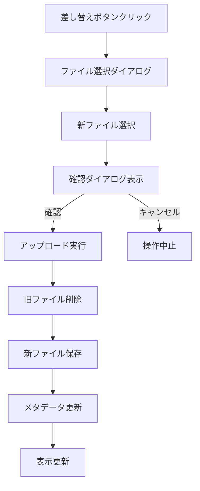
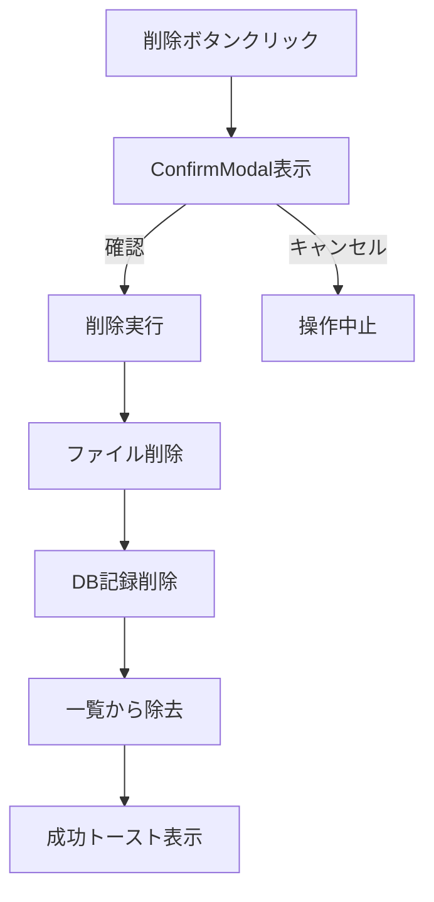

# 📱 メディア管理UI/UX仕様書

**Doc-ID**: SPEC-2025-008  
**Version**: 1.0  
**Status**: 🔴 **CRITICAL** - 実装必須  
**Owner**: 金子裕司  
**作成日**: 2025年1月28日  
**関連**: SPEC-2025-005, SPEC-2025-006, SPEC-2025-007

---

## 🎯 **基本方針**

### **UI/UX設計思想**
- **サムネイル一覧**: 直感的な視覚的管理
- **モーダル操作**: 全画面での詳細操作
- **段階的機能拡張**: AI補正機能は後付け対応
- **レスポンシブ対応**: デスクトップ・タブレット・モバイル

---

## 🖼️ **メディア一覧表示仕様**

### **1. サムネイル表示**

#### **グリッドレイアウト**
```typescript
interface ThumbnailGrid {
  layout: {
    columns: {
      desktop: 4    // 1行4列
      tablet: 3     // 1行3列  
      mobile: 2     // 1行2列
    }
    gap: '16px'     // アイテム間隔
    aspectRatio: '16:9' // サムネイル比率
  }
  
  thumbnailSize: {
    desktop: '240px × 135px'
    tablet: '200px × 112px'
    mobile: '160px × 90px'
  }
}
```

#### **サムネイル要素**
```vue
<template>
  <div class="media-thumbnail">
    <!-- メイン画像 -->
    <div class="thumbnail-image">
      
      
      <!-- プライマリバッジ -->
      <div v-if="media.isPrimary" class="primary-badge">
        <Icon name="heroicons:star-solid" class="text-yellow-400" />
      </div>
      
      <!-- メディアタイプアイコン -->
      <div class="media-type-icon">
        <Icon v-if="media.type === 'video'" name="heroicons:play-circle" />
        <Icon v-if="media.type === 'image'" name="heroicons:photo" />
      </div>
      
      <!-- ホバーオーバーレイ -->
      <div class="hover-overlay">
        <button @click="openModal(media)" class="view-button">
          <Icon name="heroicons:eye" />
        </button>
      </div>
    </div>
    
    <!-- メタ情報 -->
    <div class="thumbnail-meta">
      <p class="filename">{{ media.originalFilename }}</p>
      <p class="filesize">{{ formatFileSize(media.fileSize) }}</p>
      <p class="upload-date">{{ formatDate(media.createdAt) }}</p>
    </div>
  </div>
</template>
```

#### **状態表示**
```typescript
interface ThumbnailStates {
  loading: {
    showSkeleton: true
    showProgressBar: true
    disableClick: true
  }
  
  error: {
    showErrorIcon: true
    showRetryButton: true
    grayOut: true
  }
  
  processing: {
    showSpinner: true
    showProcessingBadge: true
    partiallyDisabled: true
  }
}
```

---

## 🔍 **モーダル全画面表示仕様**

### **1. モーダル構造**

#### **レイアウト設計**
```vue
<template>
  <div class="media-modal">
    <!-- ヘッダー -->
    <div class="modal-header">
      <h3>{{ currentMedia.originalFilename }}</h3>
      <div class="header-actions">
        <button @click="togglePrimary" :class="primaryButtonClass">
          <Icon name="heroicons:star" />
          {{ currentMedia.isPrimary ? 'プライマリ解除' : 'プライマリ設定' }}
        </button>
        <button @click="closeModal">
          <Icon name="heroicons:x-mark" />
        </button>
      </div>
    </div>
    
    <!-- メイン表示エリア -->
    <div class="modal-content">
      <!-- 左側: メディア表示 -->
      <div class="media-display">
        
        <video v-if="currentMedia.type === 'video'" 
               :src="currentMedia.fullUrl" 
               controls 
               class="full-video" />
      </div>
      
      <!-- 右側: 操作パネル -->
      <div class="action-panel">
        <!-- メタデータ編集 -->
        <div class="metadata-section">
          <h4>メタデータ</h4>
          <div class="form-group">
            <label>タイトル</label>
            <input v-model="editData.title" type="text" />
          </div>
          <div class="form-group">
            <label>説明</label>
            <textarea v-model="editData.description"></textarea>
          </div>
          <div class="form-group">
            <label>表示順</label>
            <input v-model="editData.displayOrder" type="number" />
          </div>
        </div>
        
        <!-- 操作ボタン -->
        <div class="action-buttons">
          <button @click="saveChanges" class="save-button">
            <Icon name="heroicons:check" />
            保存
          </button>
          
          <button @click="replaceFile" class="replace-button">
            <Icon name="heroicons:arrow-path" />
            差し替え
          </button>
          
          <!-- AI補正（将来実装） -->
          <button @click="enhanceWithAI" class="ai-enhance-button" disabled>
            <Icon name="heroicons:sparkles" />
            AI補正（準備中）
          </button>
          
          <button @click="deleteMedia" class="delete-button">
            <Icon name="heroicons:trash" />
            削除
          </button>
        </div>
        
        <!-- ファイル情報 -->
        <div class="file-info">
          <h4>ファイル情報</h4>
          <dl>
            <dt>ファイル名</dt>
            <dd>{{ currentMedia.originalFilename }}</dd>
            <dt>ファイルサイズ</dt>
            <dd>{{ formatFileSize(currentMedia.fileSize) }}</dd>
            <dt>形式</dt>
            <dd>{{ currentMedia.mimeType }}</dd>
            <dt v-if="currentMedia.width">解像度</dt>
            <dd v-if="currentMedia.width">{{ currentMedia.width }} × {{ currentMedia.height }}</dd>
            <dt>アップロード日時</dt>
            <dd>{{ formatDateTime(currentMedia.createdAt) }}</dd>
          </dl>
        </div>
      </div>
    </div>
    
    <!-- フッター: ナビゲーション -->
    <div class="modal-footer">
      <button @click="previousMedia" :disabled="!hasPrevious">
        <Icon name="heroicons:chevron-left" />
        前へ
      </button>
      <span class="media-counter">
        {{ currentIndex + 1 }} / {{ totalMedia }}
      </span>
      <button @click="nextMedia" :disabled="!hasNext">
        次へ
        <Icon name="heroicons:chevron-right" />
      </button>
    </div>
  </div>
</template>
```

### **2. モーダル操作仕様**

#### **キーボードショートカット**
```typescript
interface KeyboardShortcuts {
  'Escape': 'closeModal'
  'ArrowLeft': 'previousMedia'
  'ArrowRight': 'nextMedia'
  'Delete': 'deleteMedia'
  'Enter': 'saveChanges'
  'Space': 'togglePrimary'
}
```

#### **ジェスチャー対応（モバイル）**
```typescript
interface TouchGestures {
  swipeLeft: 'nextMedia'
  swipeRight: 'previousMedia'
  pinchZoom: 'zoomImage'
  doubleTap: 'toggleFullscreen'
}
```

---

## 🔄 **操作フロー仕様**

### **1. アップロード後フロー**



### **🚨 UI統一ルール準拠**

#### **禁止事項（厳守）**
```typescript
// ❌ 絶対に使用禁止
alert('アップロード完了')
confirm('削除しますか？')
prompt('ファイル名を入力')

// ✅ 必須使用
showSuccessToast('アップロード完了')
showErrorToast('アップロードに失敗しました')
ConfirmModal({ type: 'warning', message: '削除しますか？' })
```

#### **既存コンポーネント使用**
```vue
<template>
  <!-- ✅ 既存のトーストシステム使用 -->
  <UiToast />  <!-- app.vueで管理 -->
  
  <!-- ✅ 既存の確認モーダル使用 -->
  <ConfirmModal 
    :show="showDeleteConfirm"
    type="warning"
    title="メディア削除確認"
    message="このメディアを削除しますか？"
    @confirm="handleDelete"
    @cancel="showDeleteConfirm = false"
  />
  
  <!-- ✅ 既存のアイコンシステム使用 -->
  <Icon name="heroicons:star-solid" />
  <Icon name="heroicons:trash" />
  <Icon name="heroicons:pencil-square" />
</template>
```

#### **アップロード進捗表示**
```vue
<template>
  <div class="upload-progress">
    <div class="progress-item" v-for="file in uploadingFiles" :key="file.id">
      <div class="file-info">
        <Icon name="heroicons:document" />
        <span>{{ file.name }}</span>
        <span class="file-size">{{ formatFileSize(file.size) }}</span>
      </div>
      <div class="progress-bar">
        <div class="progress-fill" :style="{ width: file.progress + '%' }"></div>
      </div>
      <div class="progress-text">{{ file.progress }}%</div>
    </div>
  </div>
</template>
```

### **2. 差し替えフロー**



### **3. 削除フロー**



#### **削除確認の実装例**
```typescript
// ✅ 既存のConfirmModalを使用
const handleDeleteClick = (mediaId: string) => {
  showDeleteConfirm.value = true
  selectedMediaId.value = mediaId
}

const handleDeleteConfirm = async () => {
  try {
    await deleteMedia(selectedMediaId.value)
    showSuccessToast('メディアを削除しました')
    await refreshMediaList()
  } catch (error) {
    showErrorToast('削除に失敗しました')
  } finally {
    showDeleteConfirm.value = false
    selectedMediaId.value = null
  }
}
```

---

## 🤖 **AI補正機能仕様（将来実装）**

### **1. AI補正UI設計**

#### **補正オプション**
```typescript
interface AIEnhancementOptions {
  autoEnhance: {
    enabled: boolean
    description: '自動画質向上'
    processingTime: '30-60秒'
  }
  
  backgroundRemoval: {
    enabled: boolean
    description: '背景除去'
    processingTime: '15-30秒'
  }
  
  colorCorrection: {
    enabled: boolean
    description: '色調補正'
    processingTime: '10-20秒'
  }
  
  resizeOptimization: {
    enabled: boolean
    description: 'サイズ最適化'
    processingTime: '5-10秒'
  }
}
```

#### **補正プロセス表示**
```vue
<template>
  <div class="ai-enhancement-modal">
    <div class="enhancement-options">
      <h3>AI補正オプション</h3>
      <div class="option-list">
        <label v-for="option in enhancementOptions" :key="option.key">
          <input type="checkbox" v-model="selectedOptions[option.key]" />
          <span>{{ option.description }}</span>
          <small>処理時間: {{ option.processingTime }}</small>
        </label>
      </div>
    </div>
    
    <div class="preview-comparison" v-if="isProcessing">
      <div class="before-after">
        <div class="before">
          <h4>補正前</h4>
          
        </div>
        <div class="after">
          <h4>補正後</h4>
          
          <div v-else class="processing-placeholder">
            <Icon name="heroicons:cog-6-tooth" class="animate-spin" />
            <p>AI補正処理中...</p>
          </div>
        </div>
      </div>
    </div>
    
    <div class="action-buttons">
      <button @click="startEnhancement" :disabled="isProcessing">
        補正開始
      </button>
      <button @click="applyEnhancement" :disabled="!enhancedImage">
        適用
      </button>
      <button @click="cancelEnhancement">
        キャンセル
      </button>
    </div>
  </div>
</template>
```

---

## 📱 **レスポンシブ対応仕様**

### **1. ブレークポイント**
```scss
$breakpoints: (
  mobile: 320px,
  tablet: 768px,
  desktop: 1024px,
  large: 1440px
);
```

### **2. デバイス別調整**

#### **モバイル（320px-767px）**
```typescript
interface MobileAdjustments {
  thumbnailGrid: {
    columns: 2
    gap: '8px'
    thumbnailSize: '160px × 90px'
  }
  
  modal: {
    fullscreen: true
    actionPanel: 'bottom-sheet'
    navigation: 'swipe-only'
  }
  
  interactions: {
    touchOptimized: true
    minimumTouchTarget: '44px'
    swipeGestures: true
  }
}
```

#### **タブレット（768px-1023px）**
```typescript
interface TabletAdjustments {
  thumbnailGrid: {
    columns: 3
    gap: '12px'
    thumbnailSize: '200px × 112px'
  }
  
  modal: {
    width: '90vw'
    height: '80vh'
    actionPanel: 'side-panel'
  }
}
```

#### **デスクトップ（1024px+）**
```typescript
interface DesktopAdjustments {
  thumbnailGrid: {
    columns: 4
    gap: '16px'
    thumbnailSize: '240px × 135px'
  }
  
  modal: {
    width: '1200px'
    height: '800px'
    actionPanel: 'side-panel'
  }
  
  interactions: {
    keyboardShortcuts: true
    contextMenu: true
    dragDrop: true
  }
}
```

---

## 🎨 **デザインシステム（既存準拠）**

### **1. 既存カラーパレット使用**
```scss
// ✅ 既存のTailwindカラーシステム使用
.primary-button {
  @apply bg-blue-600 hover:bg-blue-700 text-white;
}

.success-toast {
  @apply bg-green-600 text-white;
}

.error-toast {
  @apply bg-red-600 text-white;
}

.warning-modal {
  @apply bg-yellow-50 border-yellow-200;
}
```

### **2. 既存コンポーネントスタイル準拠**
```vue
<!-- ✅ 既存のボタンスタイル使用 -->
<button class="px-4 py-2 bg-blue-600 hover:bg-blue-700 text-white rounded-lg shadow">
  メディアアップロード
</button>

<!-- ✅ 既存のカードスタイル使用 -->
<div class="bg-white rounded-xl shadow-md overflow-hidden">
  
  <div class="p-4">
    <h3 class="text-lg font-semibold">{{ media.title }}</h3>
  </div>
</div>
```

### **3. 既存アニメーション使用**
```scss
// ✅ 既存のTailwindアニメーション使用
.thumbnail-hover {
  @apply transition-all duration-200 hover:shadow-lg hover:-translate-y-1;
}

// ✅ 既存のモーダルトランジション使用
.modal-enter-active, .modal-leave-active {
  @apply transition-opacity duration-300;
}

.modal-enter-from, .modal-leave-to {
  @apply opacity-0;
}

// ✅ 既存のトーストアニメーション使用（slideIn）
.toast-notification {
  @apply animate-slideIn;
}
```

### **4. 既存レイアウトシステム準拠**
```scss
// ✅ 既存のレイアウトトークン使用
.media-container {
  @apply max-w-screen-xl mx-auto;  // Container Max-W
}

.media-grid {
  @apply gap-4;  // Grid Gap
}

.media-card {
  @apply p-4;  // Card Padding
}

.media-section {
  @apply py-8;  // Section padding
}
```

---

## 🔧 **実装優先度**

### **Phase 1: 基本機能（即座実装）**
- ✅ サムネイル一覧表示
- ✅ モーダル全画面表示
- ✅ 基本操作（表示、編集、削除）
- ✅ 差し替え機能

### **Phase 2: 拡張機能（1週間後）**
- 🟡 プライマリ設定機能
- 🟡 並び替え機能
- 🟡 一括操作
- 🟡 検索・フィルタ

### **Phase 3: AI機能（将来実装）**
- ⚪ AI画質補正
- ⚪ 背景除去
- ⚪ 色調補正
- ⚪ サイズ最適化

---

## 📋 **実装チェックリスト**

### **UI実装**
- [ ] サムネイルグリッドコンポーネント
- [ ] モーダルコンポーネント
- [ ] アップロード進捗表示
- [ ] 操作ボタン群
- [ ] レスポンシブ対応

### **UX実装**
- [ ] ホバーエフェクト
- [ ] ローディング状態
- [ ] エラーハンドリング
- [ ] キーボードショートカット
- [ ] タッチジェスチャー

### **機能実装**
- [ ] ファイルアップロード
- [ ] メタデータ編集
- [ ] ファイル差し替え
- [ ] ファイル削除
- [ ] プライマリ設定

---

**この仕様でsaasチームの高品質実装を最大限活用し、優れたユーザー体験を提供できます。AI補正機能は段階的に追加可能な設計となっています。**
