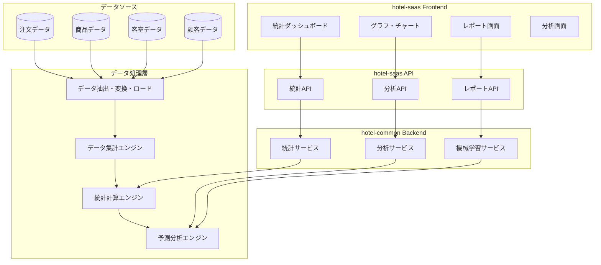
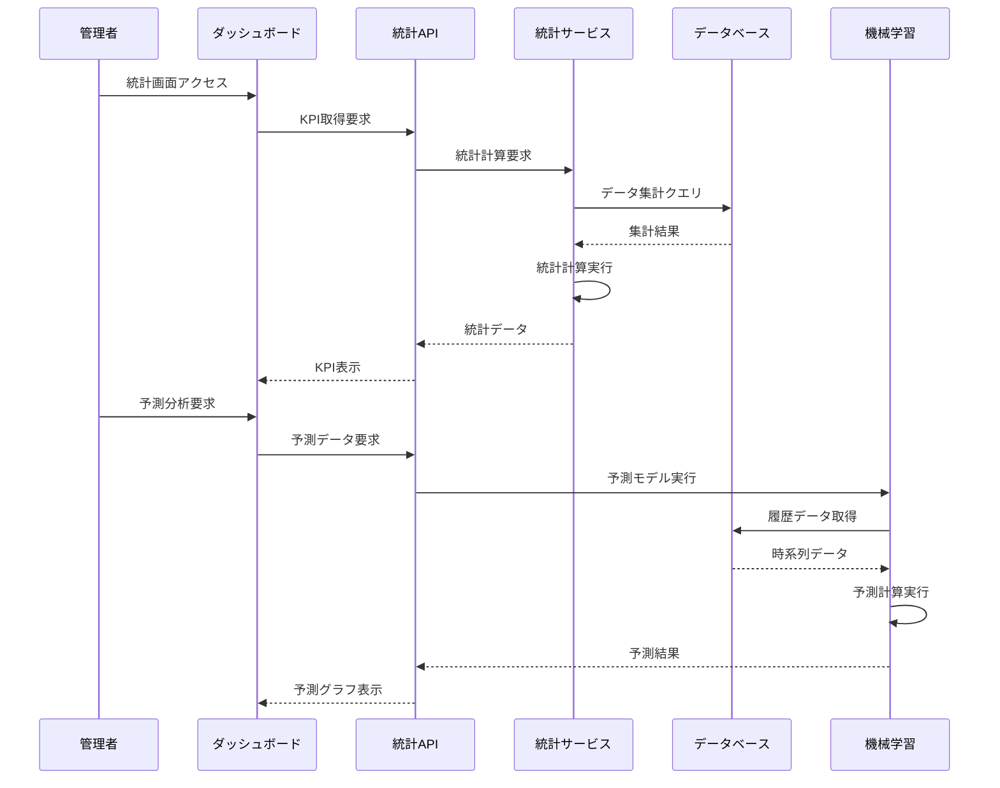

# 統計・分析システム統合仕様書

**Doc-ID**: SPEC-2025-009
**Version**: 1.0
**Status**: Active
**Owner**: 金子裕司
**Linked-Docs**: SPEC-2025-006, SPEC-2025-007, SPEC-2025-004

---

## 📋 **概要**

hotel-saasプロジェクトの統計・分析システムの包括的仕様書です。注文データの統計分析、商品パフォーマンス分析、客室・顧客行動分析、予測分析機能を統合的に定義します。

## 🎯 **システム目標**

### **基本方針**
- **データドリブン経営**: リアルタイムKPIによる経営判断支援
- **包括的分析**: 注文・商品・顧客・時間軸での多角的分析
- **予測分析**: 機械学習による需要予測・売上予測
- **直感的可視化**: グラフ・チャートによる分かりやすいデータ表現

### **ビジネス目標**
- 売上向上・コスト削減の実現
- 顧客理解・セグメンテーション強化
- 在庫最適化・需要予測精度向上
- マーケティング施策の効果最大化

## 🏗️ **システムアーキテクチャ**

### **統計・分析システム全体構成**


### **データフロー**


## 📊 **統計ダッシュボードシステム**

### **KPI管理**
```typescript
interface KPIMetrics {
  // 基本KPI
  total_orders: number
  total_revenue: number
  average_order_value: number
  active_rooms: number

  // 期間比較
  period_comparison: {
    current_period: DateRange
    previous_period: DateRange
    growth_rate: number
    trend: 'up' | 'down' | 'stable'
  }

  // リアルタイム指標
  real_time: {
    orders_today: number
    revenue_today: number
    peak_hour: string
    current_orders: number
  }

  // 目標達成率
  targets: {
    daily_target: number
    monthly_target: number
    achievement_rate: number
    remaining_to_target: number
  }
}
```

### **ダッシュボード構成**
```yaml
レイアウト構成:
  ヘッダー:
    - 期間選択（7日・30日・90日・カスタム）
    - リアルタイム更新ボタン
    - エクスポート機能

  KPIカード:
    - 総注文数（前期比較）
    - 総売上（前期比較）
    - 平均客単価（前期比較）
    - アクティブ客室数

  メインチャート:
    - 売上推移グラフ（日別・時間別）
    - 注文数推移グラフ
    - 客単価推移グラフ

  サイドパネル:
    - 人気商品ランキング
    - 客室別売上ランキング
    - 時間帯別注文分布
```

### **リアルタイム更新**
```typescript
interface RealTimeUpdate {
  // 更新設定
  auto_refresh: boolean
  refresh_interval: number  // seconds
  last_updated: string

  // WebSocket接続
  websocket_enabled: boolean
  connection_status: 'connected' | 'disconnected' | 'reconnecting'

  // 更新対象
  update_targets: {
    kpi_metrics: boolean
    charts: boolean
    rankings: boolean
    alerts: boolean
  }

  // 変更通知
  change_notifications: {
    significant_change_threshold: number
    notification_types: string[]
    alert_conditions: AlertCondition[]
  }
}
```

## 📈 **商品分析システム**

### **商品パフォーマンス分析**
```typescript
interface ProductAnalytics {
  // 基本指標
  product_id: string
  product_name: { ja: string, en: string }
  category: string

  // 売上指標
  metrics: {
    total_orders: number
    total_revenue: number
    average_price: number
    profit_margin: number
  }

  // 時系列データ
  time_series: {
    daily_orders: TimeSeriesData[]
    weekly_revenue: TimeSeriesData[]
    monthly_trends: TimeSeriesData[]
  }

  // ランキング
  rankings: {
    order_rank: number
    revenue_rank: number
    profit_rank: number
    growth_rank: number
  }

  // 関連分析
  correlations: {
    frequently_ordered_with: Product[]
    substitute_products: Product[]
    complementary_products: Product[]
  }
}

interface TimeSeriesData {
  date: string
  value: number
  change_rate?: number
}
```

### **商品ランキングシステム**
```yaml
ランキング種別:
  注文数ランキング:
    - 期間別集計（日・週・月・年）
    - カテゴリ別ランキング
    - 上昇・下降トレンド表示

  売上ランキング:
    - 売上金額順
    - 利益率順
    - 成長率順

  効率性ランキング:
    - 注文頻度
    - 在庫回転率
    - ROI（投資収益率）

表示機能:
  - トップ10・20・50表示
  - 前期比較（増減表示）
  - グラフ表示（棒グラフ・円グラフ）
  - 詳細ドリルダウン
```

### **ABC分析**
```typescript
interface ABCAnalysis {
  // 分類基準
  classification_basis: 'revenue' | 'orders' | 'profit'

  // 分類結果
  categories: {
    A: {
      products: Product[]
      percentage: number
      cumulative_percentage: number
      contribution: number
    }
    B: {
      products: Product[]
      percentage: number
      cumulative_percentage: number
      contribution: number
    }
    C: {
      products: Product[]
      percentage: number
      cumulative_percentage: number
      contribution: number
    }
  }

  // 分析結果
  insights: {
    key_products: Product[]
    optimization_opportunities: string[]
    recommendations: string[]
  }
}
```

## 🕐 **時間分析システム**

### **時間帯分析**
```typescript
interface TimeAnalytics {
  // 時間帯別データ
  hourly_data: Array<{
    hour: number
    orders: number
    revenue: number
    average_order_value: number
    peak_indicator: boolean
  }>

  // 曜日別データ
  daily_data: Array<{
    day_of_week: number
    day_name: string
    orders: number
    revenue: number
    patterns: string[]
  }>

  // 月別データ
  monthly_data: Array<{
    month: number
    month_name: string
    orders: number
    revenue: number
    seasonal_factor: number
  }>

  // ピーク分析
  peak_analysis: {
    peak_hours: number[]
    peak_days: string[]
    peak_months: string[]
    off_peak_opportunities: string[]
  }
}
```

### **季節性分析**
```yaml
季節性検出:
  年間パターン:
    - 月別売上変動
    - 季節指数計算
    - 前年同期比較

  週間パターン:
    - 曜日別変動
    - 平日・休日比較
    - イベント影響分析

  日内パターン:
    - 時間帯別変動
    - 食事時間帯分析
    - 深夜需要分析

可視化:
  - ヒートマップ表示
  - 季節性グラフ
  - パターン比較チャート
  - トレンド分解グラフ
```

## 🏨 **客室・顧客分析システム**

### **客室分析**
```typescript
interface RoomAnalytics {
  // 客室基本情報
  room_info: {
    room_number: string
    room_type: string
    floor: number
    capacity: number
  }

  // 注文実績
  order_metrics: {
    total_orders: number
    total_revenue: number
    average_order_value: number
    order_frequency: number
  }

  // 宿泊関連
  occupancy_metrics: {
    occupancy_rate: number
    average_stay_duration: number
    revenue_per_occupied_night: number
  }

  // 顧客行動
  guest_behavior: {
    order_timing_patterns: string[]
    preferred_categories: string[]
    spending_patterns: string[]
  }

  // パフォーマンス
  performance: {
    revenue_rank: number
    efficiency_score: number
    satisfaction_score?: number
  }
}
```

### **顧客セグメンテーション**
```typescript
interface CustomerSegmentation {
  // セグメント定義
  segments: {
    high_value: {
      criteria: string
      customer_count: number
      average_ltv: number
      characteristics: string[]
    }
    frequent_users: {
      criteria: string
      customer_count: number
      order_frequency: number
      characteristics: string[]
    }
    price_sensitive: {
      criteria: string
      customer_count: number
      price_sensitivity: number
      characteristics: string[]
    }
    occasional_users: {
      criteria: string
      customer_count: number
      engagement_level: number
      characteristics: string[]
    }
  }

  // セグメント分析
  segment_analysis: {
    migration_patterns: SegmentMigration[]
    lifetime_value: LTVAnalysis[]
    churn_risk: ChurnAnalysis[]
  }
}
```

### **リピーター分析**
```yaml
リピーター判定:
  判定基準:
    - 2回以上の注文履歴
    - 30日以内の再注文
    - 同一客室からの注文

  分析指標:
    - リピート率
    - 平均リピート間隔
    - リピート時の注文パターン変化
    - 顧客生涯価値（LTV）

離反分析:
  離反定義:
    - 60日以上注文なし
    - 宿泊頻度の大幅減少

  離反予測:
    - 機械学習モデル
    - リスクスコア算出
    - 早期警告システム
```

## 🤖 **予測分析システム**

### **需要予測**
```typescript
interface DemandForecast {
  // 予測設定
  forecast_config: {
    model_type: 'arima' | 'lstm' | 'prophet'
    forecast_horizon: number  // days
    confidence_interval: number
    seasonality_components: string[]
  }

  // 予測結果
  predictions: Array<{
    date: string
    predicted_orders: number
    predicted_revenue: number
    confidence_lower: number
    confidence_upper: number
    factors: string[]
  }>

  // モデル性能
  model_performance: {
    accuracy: number
    mae: number  // Mean Absolute Error
    rmse: number  // Root Mean Square Error
    last_trained: string
    training_data_size: number
  }

  // ビジネス影響
  business_impact: {
    inventory_recommendations: InventoryRecommendation[]
    staffing_recommendations: StaffingRecommendation[]
    pricing_recommendations: PricingRecommendation[]
  }
}
```

### **売上予測**
```yaml
予測モデル:
  時系列予測:
    - ARIMA モデル
    - 季節性ARIMA（SARIMA）
    - Prophet（Facebook製）
    - LSTM（深層学習）

  外部要因考慮:
    - 天気データ
    - イベント情報
    - 祝日・連休
    - 宿泊予約状況

予測精度向上:
  - アンサンブル学習
  - 特徴量エンジニアリング
  - ハイパーパラメータ最適化
  - 継続学習システム
```

### **レコメンデーション**
```typescript
interface RecommendationEngine {
  // レコメンド種別
  recommendation_types: {
    product_recommendations: ProductRecommendation[]
    cross_sell_opportunities: CrossSellRecommendation[]
    upsell_opportunities: UpsellRecommendation[]
    inventory_optimization: InventoryRecommendation[]
  }

  // アルゴリズム
  algorithms: {
    collaborative_filtering: boolean
    content_based_filtering: boolean
    market_basket_analysis: boolean
    association_rules: boolean
  }

  // パフォーマンス
  performance_metrics: {
    click_through_rate: number
    conversion_rate: number
    revenue_lift: number
    customer_satisfaction: number
  }
}
```

## 📊 **可視化・レポートシステム**

### **チャート・グラフ仕様**
```typescript
interface ChartConfiguration {
  // チャート種別
  chart_types: {
    line_chart: LineChartConfig
    bar_chart: BarChartConfig
    pie_chart: PieChartConfig
    heatmap: HeatmapConfig
    scatter_plot: ScatterPlotConfig
  }

  // インタラクティブ機能
  interactive_features: {
    zoom: boolean
    pan: boolean
    tooltip: boolean
    drill_down: boolean
    filter: boolean
  }

  // レスポンシブ対応
  responsive: {
    breakpoints: ResponsiveBreakpoint[]
    mobile_optimized: boolean
    touch_gestures: boolean
  }
}
```

### **レポート生成**
```yaml
レポート種別:
  定期レポート:
    - 日次売上レポート
    - 週次分析レポート
    - 月次経営レポート
    - 四半期トレンドレポート

  アドホックレポート:
    - カスタム期間分析
    - 特定商品分析
    - 客室パフォーマンス
    - キャンペーン効果測定

出力形式:
  - PDF（印刷用）
  - Excel（データ分析用）
  - CSV（データエクスポート）
  - PowerPoint（プレゼン用）

自動配信:
  - メール配信
  - Slack通知
  - ダッシュボード更新
  - API連携
```

## 🔄 **API仕様**

### **統計API**
```yaml
GET /api/v1/analytics/kpi
  説明: KPI指標取得
  認証: 管理者認証
  クエリ:
    period: string (7d, 30d, 90d, custom)
    start_date?: string
    end_date?: string
    compare_previous?: boolean
  レスポンス:
    kpi_metrics: KPIMetrics
    period_comparison: PeriodComparison

GET /api/v1/analytics/products/ranking
  説明: 商品ランキング取得
  認証: 管理者認証
  クエリ:
    type: string (orders, revenue, profit)
    period: string
    category?: string
    limit?: number
  レスポンス:
    rankings: ProductRanking[]
    total_count: number

GET /api/v1/analytics/time-analysis
  説明: 時間分析データ取得
  認証: 管理者認証
  クエリ:
    analysis_type: string (hourly, daily, monthly)
    period: string
    granularity?: string
  レスポンス:
    time_data: TimeAnalytics
    patterns: Pattern[]
```

### **予測分析API**
```yaml
GET /api/v1/analytics/forecast/demand
  説明: 需要予測取得
  認証: 管理者認証
  クエリ:
    horizon: number (days)
    model?: string
    confidence?: number
  レスポンス:
    predictions: DemandForecast
    model_info: ModelInfo

POST /api/v1/analytics/forecast/retrain
  説明: 予測モデル再学習
  認証: 管理者認証
  リクエスト:
    model_type: string
    parameters: ModelParameters
  レスポンス:
    training_status: string
    model_performance: ModelPerformance

GET /api/v1/analytics/recommendations
  説明: レコメンデーション取得
  認証: 管理者認証
  クエリ:
    type: string (product, cross_sell, upsell)
    target?: string
    limit?: number
  レスポンス:
    recommendations: Recommendation[]
    confidence_scores: number[]
```

## 🧪 **テスト仕様**

### **統計計算テスト**
```yaml
単体テスト:
  KPI計算:
    - 総注文数計算
    - 売上合計計算
    - 平均客単価計算
    - 成長率計算

  ランキング計算:
    - 商品ランキング算出
    - 客室ランキング算出
    - 時間帯ランキング算出

  予測計算:
    - 需要予測精度
    - 売上予測精度
    - モデル性能評価

統合テスト:
  API連携:
    - フロントエンド・バックエンド連携
    - データベース連携
    - 外部API連携

  リアルタイム更新:
    - WebSocket通信
    - 自動更新機能
    - 通知システム
```

### **パフォーマンステスト**
```yaml
負荷テスト:
  - 同時アクセス: 100ユーザー
  - 大量データ処理: 100万件注文
  - 複雑クエリ実行: 10秒以内
  - メモリ使用量: 制限内

ストレステスト:
  - 長期間データ処理
  - 予測モデル学習時間
  - レポート生成時間
  - システム安定性
```

## 📈 **運用・監視**

### **監視項目**
```yaml
システム監視:
  - API レスポンス時間
  - データベース負荷
  - メモリ使用量
  - CPU使用率
  - ディスク使用量

ビジネス監視:
  - データ精度
  - 予測精度
  - ユーザー利用状況
  - レポート生成状況
  - アラート発生状況

品質監視:
  - データ整合性
  - 計算結果検証
  - モデル性能劣化
  - 異常値検出
```

### **アラート設定**
```yaml
緊急アラート:
  - システム障害
  - データ不整合
  - 予測精度大幅低下
  - セキュリティ異常

警告アラート:
  - パフォーマンス低下
  - データ遅延
  - モデル性能低下
  - 異常値検出
```

## 🚀 **今後の拡張計画**

### **Phase 1拡張**
```yaml
機能追加:
  - リアルタイムストリーミング分析
  - 高度な機械学習モデル
  - 自動レポート生成
  - アラート・通知システム

UI/UX改善:
  - インタラクティブダッシュボード
  - モバイル最適化
  - カスタマイズ可能レイアウト
  - 音声による分析結果読み上げ
```

### **Phase 2拡張**
```yaml
高度な分析:
  - 深層学習による需要予測
  - 自然言語処理による感情分析
  - 画像認識による商品分析
  - IoTデータ統合分析

外部連携:
  - BI ツール連携
  - CRM システム連携
  - 会計システム連携
  - マーケティングオートメーション連携
```

---

## 📋 **関連ドキュメント**

- **SPEC-2025-006**: システムアーキテクチャ設計仕様書
- **SPEC-2025-007**: 注文管理システム統合仕様書
- **SPEC-2025-004**: 統合API仕様書
