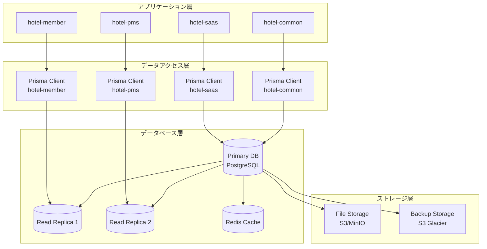

# データベースアーキテクチャ設計仕様書

**Doc-ID**: SPEC-2025-012
**Version**: 1.0
**Status**: Active
**Owner**: 金子裕司
**Linked-Docs**: SPEC-2025-006, ADR-2025-003, ADR-2025-004

---

## 📋 **概要**

hotel-saasプロジェクトのデータベースアーキテクチャ設計の包括的仕様書です。PostgreSQL移行戦略、マルチテナント設計、スキーマ設計、パフォーマンス最適化、セキュリティ設計を統合的に定義します。

## 🎯 **設計目標**

### **基本方針**
- **スケーラビリティ**: 大規模データ・高負荷対応
- **マルチテナンシー**: テナント間の完全データ分離
- **パフォーマンス**: 高速クエリ・最適化されたインデックス
- **セキュリティ**: Row Level Security・データ暗号化

### **技術目標**
- 同時接続数: 10,000接続対応
- クエリ応答時間: 100ms以内（95%ile）
- データ整合性: ACID準拠
- 可用性: 99.99%稼働率

## 🏗️ **データベースアーキテクチャ**

### **全体構成**


### **マルチテナント設計**
```typescript
interface MultiTenantArchitecture {
  // テナント分離戦略
  isolation_strategy: 'row_level_security'

  // テナント識別
  tenant_identification: {
    tenant_id: string        // UUID形式
    tenant_slug: string      // 人間可読識別子
    domain: string          // サブドメイン
  }

  // データ分離
  data_isolation: {
    method: 'rls_policies'
    enforcement: 'database_level'
    bypass_prevention: true
  }

  // スキーマ設計
  schema_design: {
    tenant_column: 'tenant_id'
    nullable: false
    indexed: true
    foreign_key: 'tenants.id'
  }
}
```

## 🗄️ **PostgreSQL移行戦略**

### **段階的移行計画**
```yaml
Phase 1: SQLite基盤構築 (完了)
  期間: Week 1-2
  目的: スキーマ設計の安定化
  実装内容:
    - 基本スキーマ設計
    - プロトタイプ開発
    - 機能検証
    - データモデル最適化

Phase 2: PostgreSQL移行 (進行中)
  期間: Week 3-4
  目的: 本番環境準備
  実装内容:
    - PostgreSQL環境構築
    - スキーマ・データ移行
    - 接続設定変更
    - 性能テスト実行

Phase 3: PostgreSQL最適化 (計画中)
  期間: Week 5以降
  目的: 高性能・高可用性実現
  実装内容:
    - Row Level Security実装
    - インデックス最適化
    - レプリケーション設定
    - 監視・アラート設定
```

### **移行手順**
```typescript
interface MigrationProcedure {
  // 事前準備
  preparation: {
    backup_creation: 'full_sqlite_backup'
    schema_validation: 'prisma_schema_check'
    dependency_analysis: 'application_impact_assessment'
  }

  // 移行実行
  execution: {
    postgresql_setup: 'docker_compose_environment'
    schema_migration: 'prisma_migrate_deploy'
    data_migration: 'custom_migration_scripts'
    connection_update: 'database_url_change'
  }

  // 検証・テスト
  validation: {
    data_integrity: 'checksum_validation'
    functionality_test: 'automated_test_suite'
    performance_test: 'load_testing'
    rollback_test: 'disaster_recovery_test'
  }
}
```

## 📊 **データベーススキーマ設計**

### **コアテーブル設計**

#### **テナント管理**
```sql
-- テナント基本情報
CREATE TABLE tenants (
  id UUID PRIMARY KEY DEFAULT gen_random_uuid(),
  name VARCHAR(255) NOT NULL,
  slug VARCHAR(100) UNIQUE NOT NULL,
  domain VARCHAR(255) UNIQUE,

  -- プラン情報
  plan_type VARCHAR(50) NOT NULL,
  plan_features JSONB DEFAULT '{}',
  billing_cycle VARCHAR(20) DEFAULT 'monthly',

  -- 制限情報
  room_limit INTEGER DEFAULT 50,
  user_limit INTEGER DEFAULT 5,
  storage_limit BIGINT DEFAULT 1073741824, -- 1GB

  -- 連絡先情報
  contact_name VARCHAR(255) NOT NULL,
  contact_email VARCHAR(255) NOT NULL,
  contact_phone VARCHAR(20),

  -- 住所情報
  address JSONB DEFAULT '{}',

  -- 契約情報
  contract_start_date DATE NOT NULL,
  contract_end_date DATE,
  status VARCHAR(20) DEFAULT 'active',

  -- メタデータ
  settings JSONB DEFAULT '{}',
  created_at TIMESTAMP WITH TIME ZONE DEFAULT NOW(),
  updated_at TIMESTAMP WITH TIME ZONE DEFAULT NOW()
);

-- インデックス
CREATE INDEX idx_tenants_slug ON tenants(slug);
CREATE INDEX idx_tenants_domain ON tenants(domain);
CREATE INDEX idx_tenants_status ON tenants(status);
```

#### **ユーザー・認証管理**
```sql
-- スタッフ情報（統合認証）
CREATE TABLE staff (
  id UUID PRIMARY KEY DEFAULT gen_random_uuid(),
  tenant_id UUID NOT NULL REFERENCES tenants(id) ON DELETE CASCADE,

  -- 基本情報
  email VARCHAR(255) NOT NULL,
  password_hash VARCHAR(255) NOT NULL,
  name VARCHAR(255) NOT NULL,

  -- 権限情報
  role VARCHAR(50) NOT NULL DEFAULT 'staff',
  permissions JSONB DEFAULT '[]',

  -- アカウント状態
  is_active BOOLEAN DEFAULT true,
  email_verified BOOLEAN DEFAULT false,
  last_login_at TIMESTAMP WITH TIME ZONE,

  -- セキュリティ
  failed_login_attempts INTEGER DEFAULT 0,
  locked_until TIMESTAMP WITH TIME ZONE,
  password_changed_at TIMESTAMP WITH TIME ZONE DEFAULT NOW(),

  -- メタデータ
  profile JSONB DEFAULT '{}',
  created_at TIMESTAMP WITH TIME ZONE DEFAULT NOW(),
  updated_at TIMESTAMP WITH TIME ZONE DEFAULT NOW()
);

-- RLS ポリシー
ALTER TABLE staff ENABLE ROW LEVEL SECURITY;
CREATE POLICY staff_tenant_isolation ON staff
  FOR ALL TO authenticated
  USING (tenant_id = current_setting('app.current_tenant_id')::UUID);

-- インデックス
CREATE UNIQUE INDEX idx_staff_tenant_email ON staff(tenant_id, email);
CREATE INDEX idx_staff_tenant_id ON staff(tenant_id);
CREATE INDEX idx_staff_role ON staff(role);
```

#### **注文管理**
```sql
-- 注文情報
CREATE TABLE orders (
  id UUID PRIMARY KEY DEFAULT gen_random_uuid(),
  tenant_id UUID NOT NULL REFERENCES tenants(id) ON DELETE CASCADE,

  -- 注文基本情報
  order_number VARCHAR(50) NOT NULL,
  room_number VARCHAR(20) NOT NULL,
  status VARCHAR(20) NOT NULL DEFAULT 'received',

  -- 金額情報
  subtotal_amount INTEGER NOT NULL DEFAULT 0,
  tax_amount INTEGER NOT NULL DEFAULT 0,
  total_amount INTEGER NOT NULL DEFAULT 0,

  -- 配送情報
  delivery_type VARCHAR(20) DEFAULT 'room_service',
  delivery_address TEXT,
  estimated_delivery_time TIMESTAMP WITH TIME ZONE,
  actual_delivery_time TIMESTAMP WITH TIME ZONE,

  -- 顧客情報
  guest_name VARCHAR(255),
  guest_phone VARCHAR(20),
  special_requests TEXT,

  -- メタデータ
  metadata JSONB DEFAULT '{}',
  created_at TIMESTAMP WITH TIME ZONE DEFAULT NOW(),
  updated_at TIMESTAMP WITH TIME ZONE DEFAULT NOW()
);

-- 注文アイテム
CREATE TABLE order_items (
  id UUID PRIMARY KEY DEFAULT gen_random_uuid(),
  tenant_id UUID NOT NULL REFERENCES tenants(id) ON DELETE CASCADE,
  order_id UUID NOT NULL REFERENCES orders(id) ON DELETE CASCADE,

  -- アイテム情報
  menu_item_id UUID,
  name VARCHAR(255) NOT NULL,
  description TEXT,

  -- 価格・数量
  unit_price INTEGER NOT NULL,
  quantity INTEGER NOT NULL DEFAULT 1,
  total_price INTEGER NOT NULL,

  -- ステータス
  status VARCHAR(20) NOT NULL DEFAULT 'pending',
  notes TEXT,

  -- メタデータ
  metadata JSONB DEFAULT '{}',
  created_at TIMESTAMP WITH TIME ZONE DEFAULT NOW(),
  updated_at TIMESTAMP WITH TIME ZONE DEFAULT NOW()
);

-- RLS ポリシー
ALTER TABLE orders ENABLE ROW LEVEL SECURITY;
CREATE POLICY orders_tenant_isolation ON orders
  FOR ALL TO authenticated
  USING (tenant_id = current_setting('app.current_tenant_id')::UUID);

ALTER TABLE order_items ENABLE ROW LEVEL SECURITY;
CREATE POLICY order_items_tenant_isolation ON order_items
  FOR ALL TO authenticated
  USING (tenant_id = current_setting('app.current_tenant_id')::UUID);

-- インデックス
CREATE UNIQUE INDEX idx_orders_tenant_number ON orders(tenant_id, order_number);
CREATE INDEX idx_orders_tenant_status ON orders(tenant_id, status);
CREATE INDEX idx_orders_room_number ON orders(tenant_id, room_number);
CREATE INDEX idx_orders_created_at ON orders(created_at);
CREATE INDEX idx_order_items_order_id ON order_items(order_id);
```

#### **メニュー管理**
```sql
-- メニューアイテム
CREATE TABLE menu_items (
  id UUID PRIMARY KEY DEFAULT gen_random_uuid(),
  tenant_id UUID NOT NULL REFERENCES tenants(id) ON DELETE CASCADE,

  -- 基本情報
  name_ja VARCHAR(255) NOT NULL,
  name_en VARCHAR(255),
  description_ja TEXT,
  description_en TEXT,

  -- 価格情報
  price INTEGER NOT NULL,
  cost INTEGER DEFAULT 0,

  -- カテゴリ・タグ
  category VARCHAR(100),
  tags JSONB DEFAULT '[]',

  -- 販売制御
  is_available BOOLEAN DEFAULT true,
  start_time TIME,
  end_time TIME,
  age_restricted BOOLEAN DEFAULT false,

  -- 表示制御
  display_order INTEGER DEFAULT 0,
  is_featured BOOLEAN DEFAULT false,
  is_hidden BOOLEAN DEFAULT false,

  -- メディア
  image_url VARCHAR(500),
  images JSONB DEFAULT '[]',

  -- 在庫管理
  stock_quantity INTEGER,
  low_stock_threshold INTEGER DEFAULT 5,

  -- メタデータ
  nutritional_info JSONB DEFAULT '{}',
  allergens JSONB DEFAULT '[]',
  metadata JSONB DEFAULT '{}',
  created_at TIMESTAMP WITH TIME ZONE DEFAULT NOW(),
  updated_at TIMESTAMP WITH TIME ZONE DEFAULT NOW()
);

-- RLS ポリシー
ALTER TABLE menu_items ENABLE ROW LEVEL SECURITY;
CREATE POLICY menu_items_tenant_isolation ON menu_items
  FOR ALL TO authenticated
  USING (tenant_id = current_setting('app.current_tenant_id')::UUID);

-- インデックス
CREATE INDEX idx_menu_items_tenant_id ON menu_items(tenant_id);
CREATE INDEX idx_menu_items_category ON menu_items(tenant_id, category);
CREATE INDEX idx_menu_items_available ON menu_items(tenant_id, is_available);
CREATE INDEX idx_menu_items_featured ON menu_items(tenant_id, is_featured);
```

#### **デバイス管理**
```sql
-- デバイス・客室管理
CREATE TABLE device_rooms (
  id UUID PRIMARY KEY DEFAULT gen_random_uuid(),
  tenant_id UUID NOT NULL REFERENCES tenants(id) ON DELETE CASCADE,

  -- デバイス情報
  device_name VARCHAR(255) NOT NULL,
  device_type VARCHAR(50) NOT NULL DEFAULT 'tablet',
  mac_address VARCHAR(17),
  ip_address INET,

  -- 客室情報
  room_number VARCHAR(20) NOT NULL,
  room_type VARCHAR(50),
  floor INTEGER,
  building VARCHAR(50),

  -- ステータス
  status VARCHAR(20) DEFAULT 'active',
  last_seen_at TIMESTAMP WITH TIME ZONE,

  -- 設定
  settings JSONB DEFAULT '{}',

  -- メタデータ
  metadata JSONB DEFAULT '{}',
  created_at TIMESTAMP WITH TIME ZONE DEFAULT NOW(),
  updated_at TIMESTAMP WITH TIME ZONE DEFAULT NOW()
);

-- RLS ポリシー
ALTER TABLE device_rooms ENABLE ROW LEVEL SECURITY;
CREATE POLICY device_rooms_tenant_isolation ON device_rooms
  FOR ALL TO authenticated
  USING (tenant_id = current_setting('app.current_tenant_id')::UUID);

-- インデックス
CREATE UNIQUE INDEX idx_device_rooms_tenant_room ON device_rooms(tenant_id, room_number);
CREATE INDEX idx_device_rooms_mac_address ON device_rooms(mac_address);
CREATE INDEX idx_device_rooms_ip_address ON device_rooms(ip_address);
```

### **CMS・コンテンツ管理**
```sql
-- ページ管理
CREATE TABLE pages (
  id UUID PRIMARY KEY DEFAULT gen_random_uuid(),
  tenant_id UUID NOT NULL REFERENCES tenants(id) ON DELETE CASCADE,

  -- ページ情報
  slug VARCHAR(255) NOT NULL,
  title VARCHAR(500) NOT NULL,
  description TEXT,

  -- コンテンツ
  html_content TEXT,
  css_content TEXT,
  js_content TEXT,
  json_content JSONB DEFAULT '{}',

  -- 公開設定
  is_published BOOLEAN DEFAULT false,
  published_at TIMESTAMP WITH TIME ZONE,
  expires_at TIMESTAMP WITH TIME ZONE,

  -- バージョン管理
  version INTEGER DEFAULT 1,
  parent_version_id UUID REFERENCES pages(id),

  -- SEO
  meta_title VARCHAR(255),
  meta_description TEXT,
  og_image VARCHAR(500),

  -- メタデータ
  template VARCHAR(100),
  settings JSONB DEFAULT '{}',
  created_at TIMESTAMP WITH TIME ZONE DEFAULT NOW(),
  updated_at TIMESTAMP WITH TIME ZONE DEFAULT NOW()
);

-- ページ履歴
CREATE TABLE page_histories (
  id UUID PRIMARY KEY DEFAULT gen_random_uuid(),
  tenant_id UUID NOT NULL REFERENCES tenants(id) ON DELETE CASCADE,
  page_id UUID NOT NULL REFERENCES pages(id) ON DELETE CASCADE,

  -- 変更情報
  action VARCHAR(50) NOT NULL,
  changed_by UUID REFERENCES staff(id),
  changes JSONB DEFAULT '{}',

  -- スナップショット
  content_snapshot JSONB,

  -- メタデータ
  created_at TIMESTAMP WITH TIME ZONE DEFAULT NOW()
);

-- RLS ポリシー
ALTER TABLE pages ENABLE ROW LEVEL SECURITY;
CREATE POLICY pages_tenant_isolation ON pages
  FOR ALL TO authenticated
  USING (tenant_id = current_setting('app.current_tenant_id')::UUID);

ALTER TABLE page_histories ENABLE ROW LEVEL SECURITY;
CREATE POLICY page_histories_tenant_isolation ON page_histories
  FOR ALL TO authenticated
  USING (tenant_id = current_setting('app.current_tenant_id')::UUID);

-- インデックス
CREATE UNIQUE INDEX idx_pages_tenant_slug ON pages(tenant_id, slug);
CREATE INDEX idx_pages_published ON pages(tenant_id, is_published);
CREATE INDEX idx_page_histories_page_id ON page_histories(page_id);
```

## 🚀 **パフォーマンス最適化**

### **インデックス戦略**
```sql
-- 複合インデックス（クエリパターン最適化）
CREATE INDEX idx_orders_tenant_status_created ON orders(tenant_id, status, created_at DESC);
CREATE INDEX idx_orders_tenant_room_status ON orders(tenant_id, room_number, status);
CREATE INDEX idx_order_items_tenant_status ON order_items(tenant_id, status);

-- 部分インデックス（条件付きクエリ最適化）
CREATE INDEX idx_orders_active ON orders(tenant_id, created_at DESC)
  WHERE status IN ('received', 'cooking', 'ready', 'delivering');

CREATE INDEX idx_menu_items_available_featured ON menu_items(tenant_id, display_order)
  WHERE is_available = true AND is_hidden = false;

-- JSONB インデックス（メタデータ検索最適化）
CREATE INDEX idx_menu_items_tags ON menu_items USING GIN(tags);
CREATE INDEX idx_tenants_settings ON tenants USING GIN(settings);
CREATE INDEX idx_pages_json_content ON pages USING GIN(json_content);
```

### **クエリ最適化**
```yaml
最適化戦略:
  接続プール:
    - 最大接続数: 100
    - アイドルタイムアウト: 300秒
    - 接続ライフタイム: 3600秒

  クエリキャッシュ:
    - Redis統合
    - TTL設定: 300秒
    - キャッシュキー戦略: tenant_id + query_hash

  読み取り分散:
    - マスター: 書き込み専用
    - リードレプリカ: 読み取り専用
    - 負荷分散: ラウンドロビン

パフォーマンス監視:
  - スロークエリログ: 100ms以上
  - インデックス使用率監視
  - 接続数・CPU・メモリ監視
  - 自動アラート設定
```

## 🔒 **セキュリティ設計**

### **Row Level Security (RLS)**
```sql
-- RLS有効化とポリシー設定例
ALTER TABLE tenants ENABLE ROW LEVEL SECURITY;
ALTER TABLE staff ENABLE ROW LEVEL SECURITY;
ALTER TABLE orders ENABLE ROW LEVEL SECURITY;
ALTER TABLE menu_items ENABLE ROW LEVEL SECURITY;

-- テナント分離ポリシー
CREATE POLICY tenant_isolation_policy ON orders
  FOR ALL TO authenticated
  USING (tenant_id = current_setting('app.current_tenant_id')::UUID);

-- 管理者権限ポリシー
CREATE POLICY admin_full_access ON staff
  FOR ALL TO authenticated
  USING (
    tenant_id = current_setting('app.current_tenant_id')::UUID
    OR current_setting('app.user_role') = 'super_admin'
  );

-- 読み取り専用ポリシー
CREATE POLICY read_only_access ON menu_items
  FOR SELECT TO authenticated
  USING (tenant_id = current_setting('app.current_tenant_id')::UUID);
```

### **データ暗号化**
```yaml
暗号化戦略:
  保存時暗号化:
    - PostgreSQL TDE (Transparent Data Encryption)
    - 機密データ列レベル暗号化
    - バックアップ暗号化

  転送時暗号化:
    - TLS 1.3強制
    - 証明書ピンニング
    - HSTS設定

  アプリケーション暗号化:
    - パスワード: bcrypt (cost=12)
    - 個人情報: AES-256-GCM
    - API通信: JWT署名検証
```

### **監査・ログ**
```sql
-- 監査ログテーブル
CREATE TABLE audit_logs (
  id UUID PRIMARY KEY DEFAULT gen_random_uuid(),
  tenant_id UUID REFERENCES tenants(id),

  -- 操作情報
  table_name VARCHAR(100) NOT NULL,
  operation VARCHAR(20) NOT NULL, -- INSERT, UPDATE, DELETE
  record_id UUID,

  -- ユーザー情報
  user_id UUID REFERENCES staff(id),
  user_email VARCHAR(255),
  user_role VARCHAR(50),

  -- 変更内容
  old_values JSONB,
  new_values JSONB,
  changed_fields JSONB,

  -- メタデータ
  ip_address INET,
  user_agent TEXT,
  request_id VARCHAR(100),

  created_at TIMESTAMP WITH TIME ZONE DEFAULT NOW()
);

-- 監査トリガー関数
CREATE OR REPLACE FUNCTION audit_trigger_function()
RETURNS TRIGGER AS $$
BEGIN
  INSERT INTO audit_logs (
    tenant_id, table_name, operation, record_id,
    user_id, old_values, new_values, created_at
  ) VALUES (
    COALESCE(NEW.tenant_id, OLD.tenant_id),
    TG_TABLE_NAME,
    TG_OP,
    COALESCE(NEW.id, OLD.id),
    current_setting('app.current_user_id', true)::UUID,
    CASE WHEN TG_OP = 'DELETE' THEN to_jsonb(OLD) ELSE NULL END,
    CASE WHEN TG_OP = 'INSERT' THEN to_jsonb(NEW) ELSE to_jsonb(NEW) END,
    NOW()
  );
  RETURN COALESCE(NEW, OLD);
END;
$$ LANGUAGE plpgsql;
```

## 🔄 **バックアップ・災害復旧**

### **バックアップ戦略**
```yaml
バックアップ種別:
  フルバックアップ:
    - 頻度: 毎日 3:00 AM
    - 保持期間: 30日
    - 圧縮: gzip
    - 暗号化: AES-256

  増分バックアップ:
    - 頻度: 6時間毎
    - 保持期間: 7日
    - WALアーカイブ連携

  Point-in-Time Recovery:
    - WAL継続アーカイブ
    - 1秒単位復旧可能
    - 保持期間: 7日

ストレージ:
  プライマリ: S3 Standard
  アーカイブ: S3 Glacier Deep Archive
  地理的分散: 3リージョン
```

### **災害復旧計画**
```yaml
RTO/RPO目標:
  RTO (Recovery Time Objective): 4時間
  RPO (Recovery Point Objective): 1時間

復旧手順:
  1. 障害検知・通知 (5分以内)
  2. 影響範囲特定 (15分以内)
  3. 復旧作業開始 (30分以内)
  4. サービス復旧 (4時間以内)

フェイルオーバー:
  自動フェイルオーバー: リードレプリカ
  手動フェイルオーバー: マスター切り替え
  データ整合性チェック: 必須
```

## 📊 **監視・メトリクス**

### **データベース監視**
```yaml
パフォーマンス監視:
  - 接続数・アクティブクエリ数
  - CPU・メモリ・ディスク使用率
  - クエリ実行時間・スループット
  - インデックス使用率・テーブルサイズ

可用性監視:
  - データベース接続性
  - レプリケーション遅延
  - バックアップ成功率
  - ディスク容量・IOPS

セキュリティ監視:
  - 不正アクセス試行
  - 権限昇格試行
  - 異常なクエリパターン
  - データ漏洩検知
```

### **アラート設定**
```yaml
緊急アラート:
  - データベース接続不可
  - レプリケーション停止
  - ディスク使用率90%超
  - 大量の接続エラー

警告アラート:
  - スロークエリ増加
  - 接続数80%超
  - レプリケーション遅延
  - バックアップ失敗
```

## 🚀 **今後の拡張計画**

### **Phase 1拡張**
```yaml
機能追加:
  - 分散データベース対応
  - 自動スケーリング
  - 高度な分析機能
  - リアルタイムレプリケーション

パフォーマンス向上:
  - クエリ最適化エンジン
  - 自動インデックス作成
  - パーティショニング
  - 接続プール最適化
```

### **Phase 2拡張**
```yaml
高度な機能:
  - 機械学習統合
  - 時系列データ対応
  - グラフデータベース統合
  - ブロックチェーン連携

運用自動化:
  - 自動バックアップ最適化
  - 予測的メンテナンス
  - 自動チューニング
  - 異常検知・自動復旧
```

---

## 📋 **関連ドキュメント**

- **SPEC-2025-006**: システムアーキテクチャ設計仕様書
- **ADR-2025-003**: データベースアクセスポリシーの決定
- **ADR-2025-004**: Prisma統合アーキテクチャ移行戦略の決定
