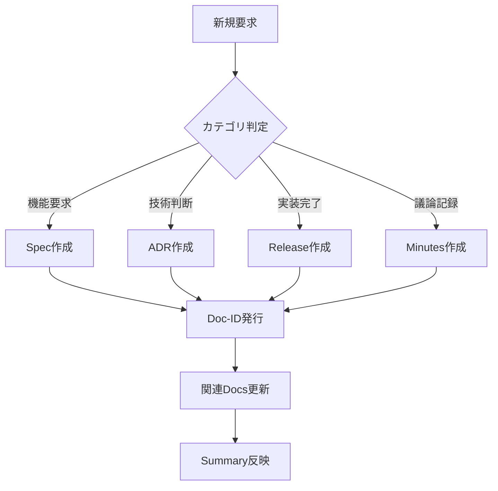

# Hotel-SaaS プロジェクト管理フレームワーク

**Doc-ID**: SPEC-2025-001
**Version**: 1.0
**Status**: Active
**Owner**: 金子裕司
**Linked-Docs**: ADR-2025-001, SUMMARY-2025-W05

---

## 📋 **概要**

hotel-saasプロジェクトの統一的なドキュメント管理とプロジェクト運営を実現するためのフレームワーク仕様書です。

## 🗂️ **ドキュメント分類体系**

### **新しいディレクトリ構造**
```
docs/
├── specs/           # 仕様書（要件・設計・技術仕様）
├── adr/            # Architecture Decision Records
├── minutes/        # 会議議事録・議論記録
├── release/        # リリースノート・成果物記録
├── summary/        # 週次・月次サマリ
└── legacy/         # 既存ドキュメント（移行対象）
```

### **ファイル命名規則**
- **Format**: `YYYY-MM-DD_topic.vX.md`
- **Examples**:
  - `2025-01-28_checkin-device-control.v1.md`
  - `2025-01-28_websocket-architecture.v2.md`
  - `2025-01-28_weekly-summary.v1.md`

## 📝 **ドキュメントテンプレート**

### **共通ヘッダー（必須）**
```markdown
# タイトル

**Doc-ID**: [CATEGORY]-YYYY-NNN
**Version**: X.Y
**Status**: [Draft|Active|Superseded|Archived]
**Owner**: 担当者名
**Linked-Docs**: 関連ドキュメントのDoc-ID

---
```

### **Doc-ID命名規則**
- **SPEC-YYYY-NNN**: 仕様書
- **ADR-YYYY-NNN**: アーキテクチャ決定記録
- **MIN-YYYY-NNN**: 議事録
- **REL-YYYY-NNN**: リリースノート
- **SUM-YYYY-WNN**: 週次サマリ

## 🔄 **運用フロー**

### **1. 新規要求処理**


### **2. ドキュメント更新フロー**
1. **新Version作成**: 既存ドキュメントを更新する場合
2. **Status更新**: 旧Versionを`Superseded`に変更
3. **Linked-Docs更新**: 関連ドキュメントのリンクを更新
4. **Summary反映**: 週次サマリに変更を記録

## 🎯 **hotel-saas特化運用ルール**

### **技術判断の記録**
- **統合アーキテクチャ決定** → ADR必須
- **hotel-common連携仕様** → Spec + ADR
- **認証・セキュリティ変更** → ADR必須
- **データベース変更** → ADR + Migration記録

### **実装成果の記録**
- **API実装完了** → Release + Spec更新
- **UI機能追加** → Release + 関連Spec更新
- **バグ修正** → Release（軽微な場合はMinutes）

### **定期レビュー**
- **週次**: Summary作成（進捗・決定事項・次週タスク）
- **月次**: アーキテクチャレビュー（ADR整合性確認）
- **四半期**: ドキュメント整理（Archived移行）

## 📊 **品質管理指標**

### **ドキュメント品質**
- [ ] 全ドキュメントにDoc-ID付与
- [ ] Linked-Docsの整合性確認
- [ ] Status管理の適切性
- [ ] 週次Summary更新率

### **プロジェクト進捗**
- [ ] 仕様書と実装の同期率
- [ ] ADRによる技術判断記録率
- [ ] リリース成果物の文書化率

## 🚀 **移行計画**

### **Phase 1: 基盤整備（1週間）**
- [ ] 新ディレクトリ構造作成
- [ ] テンプレート整備
- [ ] Doc-ID管理システム構築

### **Phase 2: 既存ドキュメント整理（2週間）**
- [ ] 重要ドキュメントの新形式移行
- [ ] 重複・古いドキュメントのArchived移行
- [ ] Linked-Docs関係整理

### **Phase 3: 運用開始（継続）**
- [ ] 新規ドキュメント作成の新ルール適用
- [ ] 週次Summary作成開始
- [ ] 品質管理指標の監視開始

## 🎊 **期待効果**

### **開発効率向上**
- 仕様書の一元管理による実装効率向上
- 技術判断の透明性向上
- 進捗の可視化

### **品質向上**
- ドキュメントの整合性確保
- 技術負債の早期発見
- ナレッジの体系化

### **チーム協調**
- 決定事項の共有促進
- 議論の記録による振り返り改善
- 新メンバーのオンボーディング効率化
