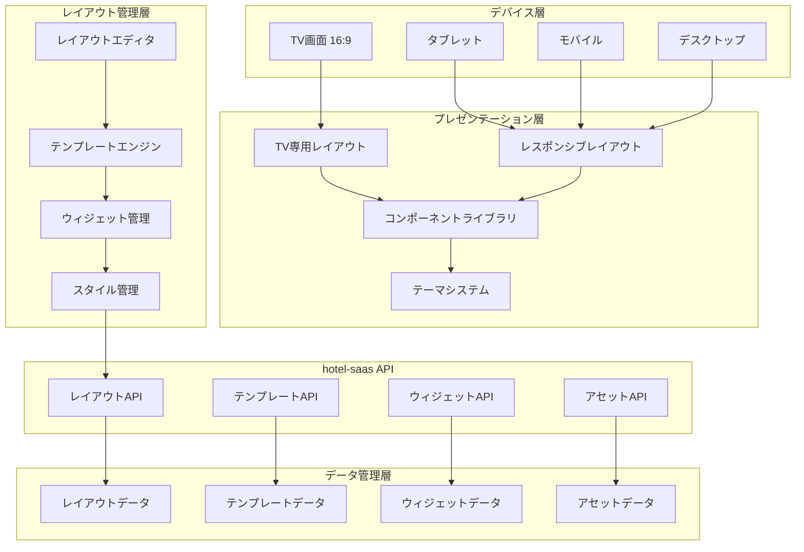
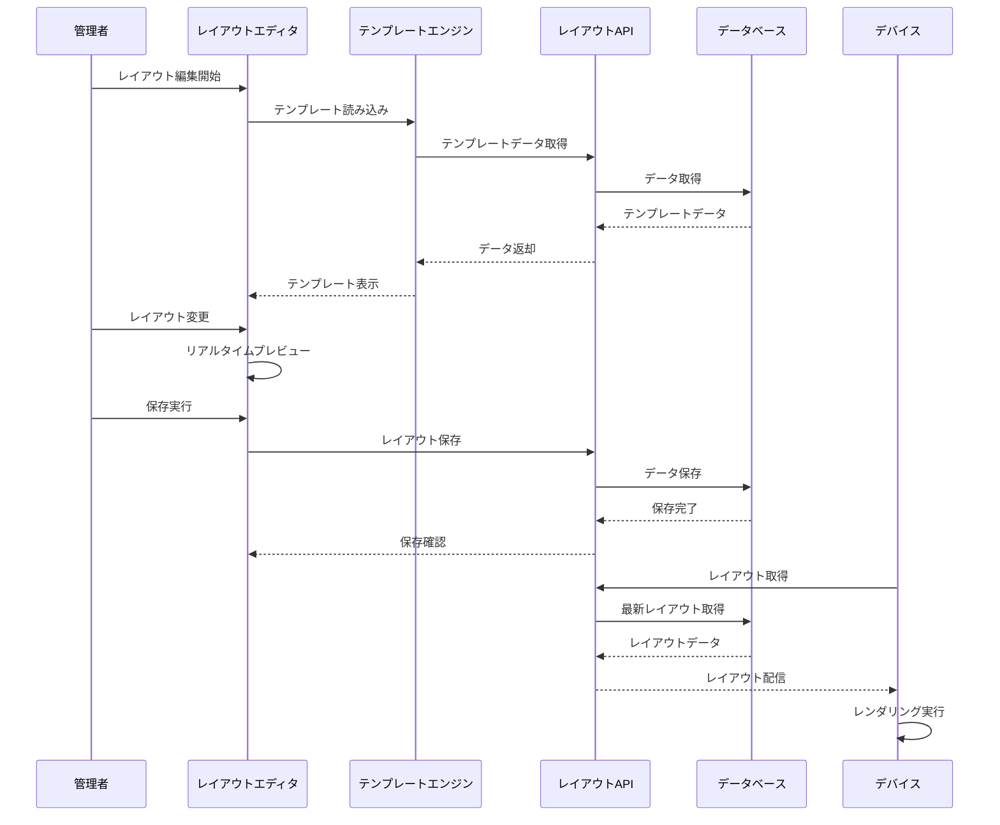

# UI・レイアウト管理システム統合仕様書

**Doc-ID**: SPEC-2025-010
**Version**: 1.0
**Status**: Active
**Owner**: 金子裕司
**Linked-Docs**: SPEC-2025-006, SPEC-2025-008, SPEC-2025-004

---

## 📋 **概要**

hotel-saasプロジェクトのUI・レイアウト管理システムの包括的仕様書です。TV画面レイアウト、ドラッグ&ドロップエディタ、レスポンシブデザイン、テンプレートシステム、ウィジェット管理を統合的に定義します。

## 🎯 **システム目標**

### **基本方針**
- **統一UI/UX**: 全デバイス対応の一貫したユーザー体験
- **柔軟なレイアウト**: ドラッグ&ドロップによる直感的編集
- **レスポンシブ対応**: デスクトップ・タブレット・TV・モバイル対応
- **テンプレート化**: 再利用可能なレイアウトテンプレート

### **ユーザー体験目標**
- 管理者の効率的なレイアウト管理
- 宿泊客の直感的な操作体験
- デバイス特性を活かした最適表示
- 高速・軽量な画面描画

## 🏗️ **システムアーキテクチャ**

### **UI・レイアウトシステム全体構成**


### **レイアウト処理フロー**


## 📺 **TV画面レイアウトシステム**

### **TV画面仕様**
```typescript
interface TVLayoutSpec {
  // 画面仕様
  screen: {
    aspect_ratio: '16:9'
    resolutions: ['1920x1080', '1366x768', '1280x720']
    safe_area: {
      margin_top: number
      margin_bottom: number
      margin_left: number
      margin_right: number
    }
  }

  // レイアウト構造
  layout_structure: {
    header: HeaderSection
    main_content: MainContentSection
    sidebar?: SidebarSection
    footer: FooterSection
  }

  // インタラクション
  interaction: {
    input_methods: ['remote_control', 'touch', 'voice']
    navigation: 'focus_based' | 'cursor_based'
    gesture_support: boolean
  }

  // パフォーマンス
  performance: {
    max_components: number
    animation_budget: number  // ms
    memory_limit: number      // MB
  }
}

interface HeaderSection {
  height: number
  components: {
    logo: LogoComponent
    weather?: WeatherComponent
    language_selector?: LanguageComponent
    navigation?: NavigationComponent
  }
}

interface MainContentSection {
  layout_type: 'grid' | 'carousel' | 'split' | 'custom'
  sections: {
    primary: {
      width_percentage: number
      content_type: string
      components: Component[]
    }
    secondary?: {
      width_percentage: number
      content_type: string
      components: Component[]
    }
  }
}
```

### **TV専用コンポーネント**
```yaml
基本コンポーネント:
  ヘッダー:
    - ホテルロゴ（左上固定）
    - 天気情報（右上）
    - 言語切替（右上）
    - 時計表示（右上）

  メインエリア:
    - キャンペーン表示（左65%）
    - AIコンシェルジュ（右35%）
    - 画像カルーセル
    - 動画プレイヤー

  フッター:
    - ルームサービスボタン
    - 館内施設ボタン
    - 観光案内ボタン
    - アンケートボタン
    - WiFi接続案内ボタン

高度なコンポーネント:
  インタラクティブ要素:
    - フォーカス可能ボタン
    - カルーセルナビゲーション
    - モーダルダイアログ
    - 音声コントロール対応

  メディア要素:
    - 自動再生動画
    - 画像スライドショー
    - 音声ガイド
    - QRコード表示
```

### **リモコン操作対応**
```typescript
interface RemoteControlSupport {
  // キーマッピング
  key_mapping: {
    up: 'focus_previous_vertical'
    down: 'focus_next_vertical'
    left: 'focus_previous_horizontal'
    right: 'focus_next_horizontal'
    enter: 'activate_focused_element'
    back: 'navigate_back'
    home: 'navigate_home'
    menu: 'show_context_menu'
  }

  // フォーカス管理
  focus_management: {
    focus_ring_style: CSSProperties
    focus_animation: AnimationConfig
    focus_sound: boolean
    auto_focus: boolean
  }

  // ナビゲーション
  navigation: {
    circular_navigation: boolean
    skip_disabled_elements: boolean
    focus_trap: boolean
    spatial_navigation: boolean
  }
}
```

## 🎨 **レイアウトエディタシステム**

### **ドラッグ&ドロップエディタ**
```typescript
interface LayoutEditor {
  // エディタ設定
  editor_config: {
    framework: 'grapesjs' | 'builder_io' | 'custom'
    mode: 'visual' | 'code' | 'hybrid'
    auto_save: boolean
    version_control: boolean
  }

  // コンポーネントパレット
  component_palette: {
    basic: BasicComponent[]
    layout: LayoutComponent[]
    media: MediaComponent[]
    interactive: InteractiveComponent[]
    custom: CustomComponent[]
  }

  // キャンバス設定
  canvas: {
    device_preview: DevicePreview[]
    grid_system: GridSystem
    snap_to_grid: boolean
    rulers: boolean
    guides: boolean
  }

  // プロパティパネル
  properties_panel: {
    style_editor: StyleEditor
    content_editor: ContentEditor
    behavior_editor: BehaviorEditor
    responsive_editor: ResponsiveEditor
  }
}

interface BasicComponent {
  id: string
  name: string
  category: string
  icon: string
  template: string
  default_props: Record<string, any>
  style_props: StyleProperty[]
  responsive_props: ResponsiveProperty[]
}
```

### **ビジュアルエディタ機能**
```yaml
基本編集機能:
  要素操作:
    - ドラッグ&ドロップ
    - リサイズ
    - 回転
    - 複製・削除
    - グループ化

  レイアウト:
    - グリッドシステム
    - フレックスボックス
    - 絶対配置
    - 相対配置
    - Z-index管理

  スタイリング:
    - 色・フォント設定
    - 余白・パディング
    - ボーダー・影
    - アニメーション
    - レスポンシブ対応

高度な機能:
  コンポーネント管理:
    - カスタムコンポーネント作成
    - コンポーネントライブラリ
    - テンプレート保存・読み込み
    - バージョン管理

  プレビュー機能:
    - リアルタイムプレビュー
    - デバイス別プレビュー
    - インタラクションテスト
    - パフォーマンス測定
```

### **コードエディタ統合**
```typescript
interface CodeEditor {
  // エディタ設定
  editor_type: 'monaco' | 'codemirror' | 'ace'

  // 言語サポート
  languages: {
    html: boolean
    css: boolean
    javascript: boolean
    typescript: boolean
    vue: boolean
  }

  // 機能
  features: {
    syntax_highlighting: boolean
    auto_completion: boolean
    error_checking: boolean
    code_formatting: boolean
    emmet_support: boolean
  }

  // 統合機能
  integration: {
    visual_sync: boolean
    live_preview: boolean
    component_extraction: boolean
    style_injection: boolean
  }
}
```

## 📱 **レスポンシブデザインシステム**

### **ブレークポイント設計**
```typescript
interface ResponsiveBreakpoints {
  // デバイス別ブレークポイント
  breakpoints: {
    mobile: {
      min_width: 0
      max_width: 767
      columns: 4
      gutter: 16
    }
    tablet: {
      min_width: 768
      max_width: 1023
      columns: 8
      gutter: 20
    }
    desktop: {
      min_width: 1024
      max_width: 1439
      columns: 12
      gutter: 24
    }
    tv: {
      min_width: 1440
      max_width: 9999
      columns: 16
      gutter: 32
    }
  }

  // レスポンシブルール
  responsive_rules: {
    font_scaling: FontScalingRule[]
    spacing_scaling: SpacingScalingRule[]
    component_behavior: ComponentBehaviorRule[]
  }
}
```

### **アダプティブレイアウト**
```yaml
レイアウト適応:
  モバイル:
    - 単一カラム
    - タッチ最適化
    - スワイプジェスチャー
    - 縦スクロール中心

  タブレット:
    - 2カラムレイアウト
    - タッチ・マウス両対応
    - ピンチズーム対応
    - 横向き・縦向き対応

  デスクトップ:
    - マルチカラム
    - マウス・キーボード最適化
    - ホバー効果
    - 右クリックメニュー

  TV:
    - 16:9固定レイアウト
    - リモコン操作最適化
    - フォーカス管理
    - 大画面表示最適化

コンテンツ適応:
  - 画像の自動リサイズ
  - テキストの動的調整
  - ナビゲーションの変更
  - インタラクション方式の切り替え
```

## 🧩 **コンポーネントシステム**

### **コンポーネントライブラリ**
```typescript
interface ComponentLibrary {
  // 基本コンポーネント
  basic: {
    text: TextComponent
    image: ImageComponent
    button: ButtonComponent
    link: LinkComponent
    divider: DividerComponent
  }

  // レイアウトコンポーネント
  layout: {
    container: ContainerComponent
    grid: GridComponent
    flexbox: FlexboxComponent
    card: CardComponent
    modal: ModalComponent
  }

  // メディアコンポーネント
  media: {
    video: VideoComponent
    audio: AudioComponent
    gallery: GalleryComponent
    carousel: CarouselComponent
    slideshow: SlideshowComponent
  }

  // インタラクティブコンポーネント
  interactive: {
    form: FormComponent
    search: SearchComponent
    navigation: NavigationComponent
    tabs: TabsComponent
    accordion: AccordionComponent
  }

  // ビジネスコンポーネント
  business: {
    menu_display: MenuDisplayComponent
    order_cart: OrderCartComponent
    facility_info: FacilityInfoComponent
    weather_widget: WeatherWidgetComponent
    qr_code: QRCodeComponent
  }
}
```

### **カスタムコンポーネント作成**
```yaml
作成プロセス:
  1. コンポーネント設計:
     - 機能要件定義
     - プロパティ設計
     - スタイル設計
     - インタラクション設計

  2. 実装:
     - Vue.js コンポーネント作成
     - TypeScript型定義
     - CSS/SCSS スタイル
     - テストコード作成

  3. 登録:
     - コンポーネントライブラリ登録
     - エディタパレット追加
     - ドキュメント作成
     - サンプル作成

品質保証:
  - 単体テスト
  - 統合テスト
  - アクセシビリティテスト
  - パフォーマンステスト
  - クロスブラウザテスト
```

## 🎨 **テーマ・スタイルシステム**

### **デザインシステム**
```typescript
interface DesignSystem {
  // カラーパレット
  colors: {
    primary: ColorPalette
    secondary: ColorPalette
    neutral: ColorPalette
    semantic: SemanticColors
  }

  // タイポグラフィ
  typography: {
    font_families: FontFamily[]
    font_sizes: FontSizeScale
    line_heights: LineHeightScale
    font_weights: FontWeightScale
  }

  // スペーシング
  spacing: {
    scale: SpacingScale
    component_spacing: ComponentSpacing
    layout_spacing: LayoutSpacing
  }

  // シャドウ・エフェクト
  effects: {
    shadows: ShadowScale
    borders: BorderScale
    border_radius: BorderRadiusScale
    animations: AnimationLibrary
  }
}

interface ColorPalette {
  50: string   // lightest
  100: string
  200: string
  300: string
  400: string
  500: string  // base
  600: string
  700: string
  800: string
  900: string  // darkest
}
```

### **テーマ管理**
```yaml
テーマ種別:
  デフォルトテーマ:
    - ライトテーマ
    - ダークテーマ
    - ハイコントラストテーマ

  ブランドテーマ:
    - ホテルブランド別
    - 季節限定テーマ
    - イベント特別テーマ

  デバイス別テーマ:
    - TV専用テーマ
    - モバイル最適化テーマ
    - タブレット専用テーマ

テーマ切り替え:
  - 動的テーマ変更
  - ユーザー設定保存
  - システム設定連動
  - 時間帯自動切り替え
```

## 🔧 **テンプレートシステム**

### **テンプレート管理**
```typescript
interface TemplateSystem {
  // テンプレート分類
  categories: {
    page_templates: PageTemplate[]
    section_templates: SectionTemplate[]
    component_templates: ComponentTemplate[]
    layout_templates: LayoutTemplate[]
  }

  // テンプレート属性
  template_attributes: {
    id: string
    name: { ja: string, en: string }
    description: { ja: string, en: string }
    category: string
    tags: string[]
    preview_image: string
    device_support: DeviceSupport[]
    created_at: string
    updated_at: string
    version: string
  }

  // テンプレートデータ
  template_data: {
    structure: TemplateStructure
    styles: TemplateStyles
    scripts: TemplateScripts
    assets: TemplateAssets
  }
}

interface PageTemplate {
  layout_structure: LayoutStructure
  default_content: DefaultContent
  customizable_areas: CustomizableArea[]
  required_data: DataRequirement[]
}
```

### **テンプレート作成・編集**
```yaml
作成プロセス:
  1. テンプレート設計:
     - レイアウト構造設計
     - コンテンツエリア定義
     - カスタマイズ可能領域設定
     - データ要件定義

  2. 実装:
     - HTML/Vue テンプレート作成
     - CSS スタイル定義
     - JavaScript 機能実装
     - レスポンシブ対応

  3. 検証:
     - デバイス別表示確認
     - パフォーマンス測定
     - アクセシビリティ確認
     - ユーザビリティテスト

管理機能:
  - テンプレート一覧・検索
  - プレビュー機能
  - 複製・編集機能
  - バージョン管理
  - 公開・非公開設定
```

## 📊 **ウィジェットシステム**

### **ウィジェット管理**
```typescript
interface WidgetSystem {
  // ウィジェット種別
  widget_types: {
    information: InformationWidget[]
    interactive: InteractiveWidget[]
    media: MediaWidget[]
    business: BusinessWidget[]
    third_party: ThirdPartyWidget[]
  }

  // ウィジェット設定
  widget_config: {
    id: string
    type: string
    title: { ja: string, en: string }
    description: { ja: string, en: string }
    icon: string
    size_constraints: SizeConstraints
    position_constraints: PositionConstraints
    data_sources: DataSource[]
    update_frequency: number
  }

  // ウィジェット状態
  widget_state: {
    is_active: boolean
    is_visible: boolean
    is_loading: boolean
    last_updated: string
    error_state?: ErrorState
  }
}

interface InformationWidget {
  weather: WeatherWidgetConfig
  clock: ClockWidgetConfig
  news: NewsWidgetConfig
  announcements: AnnouncementWidgetConfig
}

interface InteractiveWidget {
  search: SearchWidgetConfig
  language_selector: LanguageSelectorConfig
  feedback: FeedbackWidgetConfig
  survey: SurveyWidgetConfig
}
```

### **ウィジェット開発**
```yaml
開発フレームワーク:
  Vue.js コンポーネント:
    - 単一ファイルコンポーネント
    - Composition API使用
    - TypeScript対応
    - プロパティ型定義

ウィジェットAPI:
  - データ取得API
  - 設定保存API
  - 状態管理API
  - イベント通知API

配布・インストール:
  - ウィジェットパッケージ
  - 依存関係管理
  - 自動インストール
  - アップデート機能
```

## 🔄 **API仕様**

### **レイアウト管理API**
```yaml
GET /api/v1/layouts
  説明: レイアウト一覧取得
  認証: 管理者認証
  クエリ:
    category?: string
    device?: string
    template?: boolean
  レスポンス:
    layouts: Layout[]
    templates: Template[]
    total: number

POST /api/v1/layouts
  説明: レイアウト作成
  認証: 管理者認証
  リクエスト:
    name: string
    description?: string
    structure: LayoutStructure
    styles: LayoutStyles
    device_support: string[]
  レスポンス:
    layout: Layout

PUT /api/v1/layouts/{layout_id}
  説明: レイアウト更新
  認証: 管理者認証
  リクエスト:
    name?: string
    structure?: LayoutStructure
    styles?: LayoutStyles
  レスポンス:
    layout: Layout

GET /api/v1/layouts/{layout_id}/preview
  説明: レイアウトプレビュー
  認証: 管理者認証
  クエリ:
    device?: string
    theme?: string
  レスポンス:
    preview_url: string
    expires_at: string
```

### **コンポーネント管理API**
```yaml
GET /api/v1/components
  説明: コンポーネント一覧取得
  認証: 管理者認証
  クエリ:
    category?: string
    custom?: boolean
  レスポンス:
    components: Component[]
    categories: ComponentCategory[]

POST /api/v1/components
  説明: カスタムコンポーネント作成
  認証: 管理者認証
  リクエスト:
    name: string
    category: string
    template: string
    props: ComponentProps
    styles: ComponentStyles
  レスポンス:
    component: Component

GET /api/v1/templates
  説明: テンプレート一覧取得
  認証: 管理者認証
  クエリ:
    category?: string
    device?: string
  レスポンス:
    templates: Template[]
    categories: TemplateCategory[]
```

### **ウィジェット管理API**
```yaml
GET /api/v1/widgets
  説明: ウィジェット一覧取得
  認証: 管理者認証
  レスポンス:
    widgets: Widget[]
    categories: WidgetCategory[]

POST /api/v1/widgets/{widget_id}/install
  説明: ウィジェットインストール
  認証: 管理者認証
  リクエスト:
    config: WidgetConfig
  レスポンス:
    installation: WidgetInstallation

PUT /api/v1/widgets/{widget_id}/config
  説明: ウィジェット設定更新
  認証: 管理者認証
  リクエスト:
    config: WidgetConfig
  レスポンス:
    widget: Widget
```

## 🧪 **テスト仕様**

### **UI・レイアウトテスト**
```yaml
ビジュアルテスト:
  - レイアウト表示確認
  - レスポンシブ動作確認
  - デバイス別表示確認
  - テーマ切り替え確認

インタラクションテスト:
  - ドラッグ&ドロップ動作
  - リモコン操作確認
  - タッチジェスチャー確認
  - キーボード操作確認

パフォーマンステスト:
  - 描画速度測定
  - メモリ使用量測定
  - アニメーション性能
  - 大量コンポーネント処理

アクセシビリティテスト:
  - WCAG 2.1 AA準拠確認
  - スクリーンリーダー対応
  - キーボードナビゲーション
  - 色覚異常対応
```

### **クロスブラウザテスト**
```yaml
対象ブラウザ:
  デスクトップ:
    - Chrome (最新版)
    - Firefox (最新版)
    - Safari (最新版)
    - Edge (最新版)

  モバイル:
    - Chrome Mobile
    - Safari Mobile
    - Samsung Internet
    - Firefox Mobile

  TV:
    - Android TV Browser
    - WebOS Browser
    - Tizen Browser

テスト項目:
  - レイアウト表示
  - CSS対応状況
  - JavaScript動作
  - パフォーマンス
```

## 📈 **運用・監視**

### **監視項目**
```yaml
パフォーマンス監視:
  - ページ読み込み時間
  - 描画完了時間
  - インタラクション応答時間
  - メモリ使用量
  - CPU使用率

ユーザー体験監視:
  - エラー発生率
  - 操作完了率
  - 離脱率
  - 滞在時間
  - デバイス別利用状況

システム監視:
  - API レスポンス時間
  - データベース負荷
  - ファイル配信状況
  - キャッシュヒット率
```

### **最適化戦略**
```yaml
パフォーマンス最適化:
  - 画像最適化・遅延読み込み
  - CSS・JavaScript最小化
  - キャッシュ戦略最適化
  - CDN活用

ユーザー体験最適化:
  - A/Bテスト実施
  - ユーザーフィードバック収集
  - 操作ログ分析
  - 継続的改善
```

## 🚀 **今後の拡張計画**

### **Phase 1拡張**
```yaml
機能追加:
  - AI支援レイアウト生成
  - 音声コントロール対応
  - AR/VR対応準備
  - 高度なアニメーション

UI/UX改善:
  - マイクロインタラクション
  - パーソナライゼーション
  - アクセシビリティ強化
  - 多言語UI対応
```

### **Phase 2拡張**
```yaml
高度な機能:
  - 機械学習による最適化
  - リアルタイムコラボレーション
  - クラウドベースエディタ
  - プラグインシステム

外部連携:
  - デザインツール連携
  - CMS統合
  - マーケティングツール連携
  - 分析ツール統合
```

---

## 📋 **関連ドキュメント**

- **SPEC-2025-006**: システムアーキテクチャ設計仕様書
- **SPEC-2025-008**: インフォメーション管理システム統合仕様書
- **SPEC-2025-004**: 統合API仕様書
