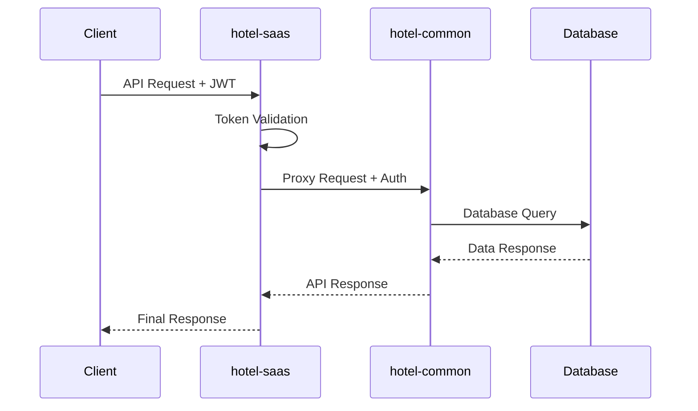

# 統合API仕様書

**Doc-ID**: SPEC-2025-004
**Version**: 1.0
**Status**: Active
**Owner**: 金子裕司
**Linked-Docs**: ADR-2025-003, SPEC-2025-003

---

## 📋 **概要**

hotel-saasプロジェクトにおける統合API仕様書です。hotel-common APIとの連携仕様、認証方式、エラーハンドリング、レスポンス形式を統一的に定義します。

## 🏗️ **API アーキテクチャ**

### **基本構成**
```
Client (Browser/App)
    ↓ HTTP Request
hotel-saas API (Proxy Layer)
    ↓ HTTP Request with Auth
hotel-common API (Business Logic Layer)
    ↓ Database Query
Unified Database (PostgreSQL)
```

### **認証フロー**


## 🔐 **認証仕様**

### **認証方式（最終）**
- **方式**: JWT（Cookie運用/サーバ間はBearer）
- **ブラウザ**: 認証Cookie（httpOnly+Secure+SameSite=strict）で `access_token`/`refresh_token` 保存（localStorage不可）
- **サーバ間**: `Authorization: Bearer <token>`（saas→common のみ）
- **トークン形式**: hotel-common標準JWT（iss/aud/sub/exp/iat/nbf/jti/kid + namespaced custom）

### **認証レベル**
```typescript
enum AuthLevel {
  NONE = 'none',        // 認証不要
  DEVICE = 'device',    // デバイス認証
  STAFF = 'staff',      // スタッフ認証
  ADMIN = 'admin'       // 管理者認証
}
```

### **認証エラー（最終）**
```json
{
  "success": false,
  "error": {
    "code": "UNAUTHORIZED",
    "message": "認証が必要です",
    "statusCode": 401
  }
}
```

```json
{
  "success": false,
  "error": {
    "code": "FORBIDDEN",
    "message": "テナントが一致しません (TENANT_MISMATCH)",
    "statusCode": 403
  }
}
```

```json
{
  "success": false,
  "error": {
    "code": "TOKEN_EXPIRED",
    "message": "トークンの有効期限が切れています",
    "statusCode": 419
  }
}
```

## 📡 **共通仕様**

### **ベースURL**
```
Development: http://localhost:3100/api/v1
Production: https://hotel-saas.example.com/api/v1
```

### **リクエストヘッダー（最終）**
```http
Content-Type: application/json
X-Tenant-ID: <tenant-id>
Authorization: Bearer <jwt-token>  # サーバ間通信のみ
Accept: application/json
```

### **レスポンス形式**

#### **成功レスポンス**
```json
{
  "success": true,
  "data": {
    // レスポンスデータ
  },
  "pagination": {
    "page": 1,
    "limit": 100,
    "total": 250,
    "hasNext": true
  },
  "timestamp": "2025-01-28T10:00:00.000Z",
  "request_id": "req-1234567890"
}
```

#### **エラーレスポンス**
```json
{
  "success": false,
  "error": {
    "code": "ERROR_CODE",
    "message": "エラーメッセージ",
    "details": {
      // 詳細情報（オプション）
    }
  },
  "timestamp": "2025-01-28T10:00:00.000Z",
  "request_id": "req-1234567890"
}
```

## 🔄 **API エンドポイント仕様**

### **認証API**

#### **POST /api/v1/auth/login**
ユーザーログイン処理

**リクエスト**
```json
{
  "email": "admin@omotenasuai.com",
  "password": "password",
  "roomNumber": "101" // オプション
}
```

**レスポンス**
```json
{
  "success": true,
  "data": {
    "accessToken": "eyJhbGciOiJIUzI1NiIsInR5cCI6IkpXVCJ9...",
    "user": {
      "id": "staff-1",
      "email": "admin@omotenasuai.com",
      "tenantId": "tenant-1",
      "role": "admin",
      "permissions": ["admin:read", "admin:write"]
    },
    "availableTenants": [
      {
        "id": "tenant-1",
        "name": "ホテル東京",
        "role": "admin"
      }
    ]
  }
}
```

#### **POST /api/v1/integration/validate-token**
トークン検証処理

**リクエスト**
```json
{
  "token": "eyJhbGciOiJIUzI1NiIsInR5cCI6IkpXVCJ9..."
}
```

**レスポンス**
```json
{
  "success": true,
  "data": {
    "user": {
      "id": "staff-1",
      "email": "admin@omotenasuai.com",
      "tenantId": "tenant-1",
      "role": "admin"
    },
    "isValid": true
  }
}
```

### **管理API**

#### **GET /api/v1/admin/front-desk/rooms**
客室一覧取得

**認証レベル**: ADMIN
**プロキシ先**: `hotel-common:/api/v1/admin/front-desk/rooms`

**クエリパラメータ**
```
status?: string     // 客室状態フィルタ
floor?: number      // 階数フィルタ
limit?: number      // 取得件数（デフォルト: 100）
offset?: number     // オフセット（デフォルト: 0）
```

**レスポンス**
```json
{
  "success": true,
  "data": {
    "rooms": [
      {
        "id": "room-1",
        "room_number": "101",
        "room_type": "standard",
        "status": "available",
        "floor": 1,
        "capacity": 2,
        "notes": "清掃完了"
      }
    ]
  },
  "pagination": {
    "page": 1,
    "limit": 100,
    "total": 50,
    "hasNext": false
  }
}
```

#### **GET /api/v1/admin/front-desk/accounting**
会計履歴取得

**認証レベル**: ADMIN
**プロキシ先**: `hotel-common:/api/v1/admin/front-desk/accounting`

**クエリパラメータ**
```
start_date: string  // 開始日（YYYY-MM-DD）
end_date: string    // 終了日（YYYY-MM-DD）
limit?: number      // 取得件数（デフォルト: 100、最大: 1000）
offset?: number     // オフセット（デフォルト: 0）
```

**レスポンス**
```json
{
  "success": true,
  "data": {
    "transactions": [
      {
        "id": "billing-1",
        "room_number": "101",
        "total_amount": 5280,
        "tax_amount": 480,
        "created_at": "2025-01-28T10:00:00.000Z",
        "items": [
          {
            "name": "コーヒー",
            "quantity": 2,
            "unit_price": 500,
            "total_price": 1000
          }
        ]
      }
    ],
    "summary": {
      "total_transactions": 10,
      "total_amount": 52800,
      "total_tax": 4800
    }
  }
}
```

#### **GET /api/v1/admin/operation-logs**
操作ログ取得

> **📋 更新履歴 (2025年1月27日)**
> **客室状態変更ログの詳細化対応** - hotel-common統合管理による更新
> 詳細仕様: [客室状態変更ログ統合仕様書](/Users/kaneko/hotel-common/docs/integration/specifications/room-operation-log-specification.md)

**認証レベル**: ADMIN
**プロキシ先**: `hotel-common:/api/v1/admin/operation-logs`

**クエリパラメータ**
```
limit?: number      // 取得件数（デフォルト: 10）
period?: string     // 期間（week, month）
offset?: number     // オフセット
action?: string     // v2.0: 詳細アクションでフィルタ可能
operation_category?: string // v2.0: 'cleaning' | 'maintenance' | 'guest_service' | 'system' | 'emergency'
room_id?: string    // v2.0: 客室IDでフィルタ
staff_id?: string   // v2.0: スタッフIDでフィルタ
```

**レスポンス**
```json
{
  "success": true,
  "data": {
    "logs": [
      {
        "id": "log-1",
        "action": "ROOM_CLEANING_COMPLETE",
        "action_label": "清掃完了",
        "user": "admin@omotenasuai.com",
        "room_number": "101",
        "timestamp": "2025-01-28T10:00:00.000Z",
        "system": "hotel-saas",
        "details": {
          "room_id": "room-123",
          "operation_category": "cleaning",
          "quality_check": "passed",
          "actual_duration": 45,
          "staff_id": "staff-456",
          "department": "housekeeping"
        }
      }
    ],
    "summary": {
      "total_logs": 1,
      "by_action": {
        "ROOM_CLEANING_COMPLETE": 1
      },
      "by_category": {
        "cleaning": 1
      }
    }
  }
}
```

#### **v2.0対応アクション一覧 (2025年1月27日追加)**
```typescript
// 客室清掃関連
'ROOM_CLEANING_START' | 'ROOM_CLEANING_COMPLETE' | 'ROOM_CLEANING_INSPECTION' | 'ROOM_CLEANING_FAILED'

// メンテナンス関連
'ROOM_MAINTENANCE_START' | 'ROOM_MAINTENANCE_COMPLETE' | 'ROOM_REPAIR_REQUEST' | 'ROOM_REPAIR_COMPLETE'

// 客室ブロック関連
'ROOM_BLOCK' | 'ROOM_UNBLOCK' | 'ROOM_OUT_OF_ORDER' | 'ROOM_BACK_IN_SERVICE'

// 業務操作関連
'ROOM_INSPECTION' | 'ROOM_SETUP_COMPLETE' | 'ROOM_AMENITY_RESTOCK' | 'ROOM_DEEP_CLEANING'

// v1.0継続サポート
'CHECKIN' | 'CHECKOUT' | 'UPDATE_STATUS' | 'RESERVATION_CREATE' | 'RESERVATION_UPDATE' | 'RESERVATION_CANCEL'
```

### **テナント管理API**

#### **GET /api/v1/admin/tenant/current**
現在のテナント情報取得

**認証レベル**: STAFF
**プロキシ先**: `hotel-common:/api/v1/tenants/{tenantId}`

**レスポンス**
```json
{
  "success": true,
  "data": {
    "tenant": {
      "id": "tenant-1",
      "name": "ホテル東京",
      "plan": "LEISURE_STANDARD",
      "features": {
        "max_rooms": 100,
        "ai_concierge": true,
        "multilingual": false,
        "analytics": true
      },
      "settings": {
        "timezone": "Asia/Tokyo",
        "currency": "JPY",
        "language": "ja"
      }
    }
  }
}
```

#### **POST /api/v1/auth/switch-tenant**
テナント切り替え

**認証レベル**: STAFF
**プロキシ先**: `hotel-common:/api/v1/auth/switch-tenant`

**リクエスト**
```json
{
  "tenantId": "tenant-2"
}
```

**レスポンス**
```json
{
  "success": true,
  "data": {
    "accessToken": "eyJhbGciOiJIUzI1NiIsInR5cCI6IkpXVCJ9...",
    "user": {
      "id": "staff-1",
      "tenantId": "tenant-2",
      "role": "staff"
    }
  }
}
```

### **フロントデスクAPI**

#### **POST /api/v1/admin/front-desk/checkin**
チェックイン処理

**認証レベル**: ADMIN
**プロキシ先**: `hotel-common:/api/v1/admin/front-desk/checkin`（将来実装）

**リクエスト**
```json
{
  "roomNumber": "101",
  "roomId": "room-1", // オプション
  "checkinDate": "2025-01-28T06:00:00.000Z",
  "guestCount": 2,
  "guests": [
    {
      "guestNumber": 1,
      "ageGroup": "adult",
      "gender": "male",
      "name": "テスト太郎"
    }
  ],
  "notes": "特別リクエストなし"
}
```

**レスポンス**
```json
{
  "success": true,
  "message": "チェックイン処理が完了しました",
  "data": {
    "roomId": "room-1",
    "roomNumber": "101",
    "checkinAt": "2025-01-28T06:00:00.000Z",
    "guestCount": 2,
    "status": "occupied",
    "deviceControlSent": true
  }
}
```

## 🚨 **エラーハンドリング**

### **エラーコード一覧**
```typescript
enum ErrorCode {
  // 認証エラー
  UNAUTHORIZED = 'UNAUTHORIZED',
  FORBIDDEN = 'FORBIDDEN',
  TOKEN_EXPIRED = 'TOKEN_EXPIRED',

  // バリデーションエラー
  VALIDATION_ERROR = 'VALIDATION_ERROR',
  MISSING_PARAMETER = 'MISSING_PARAMETER',
  INVALID_PARAMETER = 'INVALID_PARAMETER',

  // ビジネスロジックエラー
  RESOURCE_NOT_FOUND = 'RESOURCE_NOT_FOUND',
  RESOURCE_CONFLICT = 'RESOURCE_CONFLICT',
  BUSINESS_RULE_VIOLATION = 'BUSINESS_RULE_VIOLATION',

  // システムエラー
  INTERNAL_SERVER_ERROR = 'INTERNAL_SERVER_ERROR',
  SERVICE_UNAVAILABLE = 'SERVICE_UNAVAILABLE',
  HOTEL_COMMON_ERROR = 'HOTEL_COMMON_ERROR'
}
```

### **HTTPステータスコード**
```
200 OK              - 正常処理
201 Created         - リソース作成成功
400 Bad Request     - リクエストエラー
401 Unauthorized    - 認証エラー
403 Forbidden       - 権限エラー
404 Not Found       - リソース未発見
409 Conflict        - リソース競合
422 Unprocessable   - バリデーションエラー
500 Internal Error  - サーバーエラー
502 Bad Gateway     - hotel-common APIエラー
503 Service Unavailable - hotel-common接続エラー
```

## 🔧 **プロキシ実装パターン**

### **標準プロキシパターン**
```typescript
export default defineEventHandler(async (event) => {
  // 認証チェック
  const authUser = await verifyAuth(event)
  if (!authUser) {
    throw createError({
      statusCode: 401,
      statusMessage: 'Unauthorized'
    })
  }

  // クエリパラメータ取得
  const query = getQuery(event)

  try {
    // hotel-common API呼び出し
    const hotelCommonApiUrl = process.env.HOTEL_COMMON_API_URL || 'http://localhost:3400'
    const response = await $fetch(`${hotelCommonApiUrl}/api/v1/admin/example`, {
      method: 'GET',
      headers: {
        'Authorization': `Bearer ${authUser.token}`,
        'Content-Type': 'application/json'
      },
      query
    })

    return response
  } catch (error: any) {
    // エラーハンドリング
    if (error.response?.status) {
      throw createError({
        statusCode: error.response.status,
        statusMessage: error.response.data?.error?.message || 'hotel-common API error'
      })
    }

    throw createError({
      statusCode: 503,
      statusMessage: 'Service unavailable. Please ensure hotel-common is running.'
    })
  }
})
```

## 📊 **パフォーマンス仕様**

### **レスポンス時間目標**
- 認証API: 500ms以内
- 一般API: 1000ms以内
- 大量データAPI: 3000ms以内

### **スループット目標**
- 同時接続数: 1000接続
- リクエスト処理: 100req/sec
- データ転送: 10MB/sec

### **キャッシュ戦略**
- 静的データ: 1時間キャッシュ
- 動的データ: キャッシュなし
- 認証情報: 15分キャッシュ

## 🧪 **テスト仕様**

### **APIテスト項目**
- 正常系レスポンス確認
- 異常系エラーハンドリング確認
- 認証・認可テスト
- パフォーマンステスト
- セキュリティテスト

### **テスト環境**
```yaml
Development:
  hotel-saas: http://localhost:3100
  hotel-common: http://localhost:3400
  database: localhost:5432

Staging:
  hotel-saas: https://staging-saas.example.com
  hotel-common: https://staging-common.example.com
  database: staging-db.example.com:5432
```

## 📈 **監視・ログ**

### **ログ出力項目**
- リクエスト/レスポンスログ
- エラーログ
- パフォーマンスログ
- 認証ログ

### **メトリクス監視**
- レスポンス時間
- エラー率
- スループット
- リソース使用率

---

## 📋 **関連ドキュメント**

- **SPEC-2025-003**: JWT認証システム統合仕様書
- **ADR-2025-003**: データベースアクセスポリシーの決定
- **REL-2025-001**: チェックイン端末制御機能リリースノート
