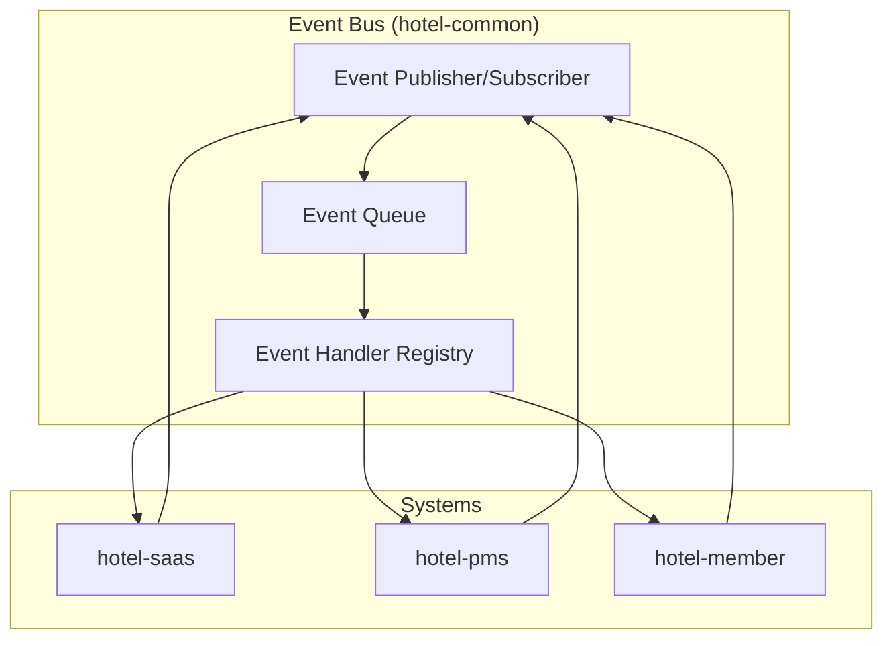

# イベント駆動アーキテクチャ

## 概要
本ドキュメントは、omotenasuai.comプロジェクトにおけるイベント駆動アーキテクチャの設計と実装を定義します。

## 🏗️ アーキテクチャ概要



## 📋 イベント定義

### hotel-member 発行イベント

#### customer.created
```typescript
interface CustomerCreatedEvent {
  eventType: 'customer.created';
  eventId: string;
  timestamp: Date;
  tenantId: string;
  data: {
    customerId: string;
    name: string;
    email: string;
    phone: string;
    membershipLevel: string;
    registrationSource: string;
  };
}
```

#### customer.updated
```typescript
interface CustomerUpdatedEvent {
  eventType: 'customer.updated';
  eventId: string;
  timestamp: Date;
  tenantId: string;
  data: {
    customerId: string;
    updatedFields: string[];
    oldValues: Record<string, any>;
    newValues: Record<string, any>;
    updatedBy: string;
  };
}
```

#### points.added
```typescript
interface PointsAddedEvent {
  eventType: 'points.added';
  eventId: string;
  timestamp: Date;
  tenantId: string;
  data: {
    customerId: string;
    points: number;
    reason: string;
    transactionId: string;
    currentBalance: number;
  };
}
```

#### points.used
```typescript
interface PointsUsedEvent {
  eventType: 'points.used';
  eventId: string;
  timestamp: Date;
  tenantId: string;
  data: {
    customerId: string;
    points: number;
    reason: string;
    transactionId: string;
    currentBalance: number;
    usedFor: string;
  };
}
```

### hotel-pms 発行イベント

#### reservation.created
```typescript
interface ReservationCreatedEvent {
  eventType: 'reservation.created';
  eventId: string;
  timestamp: Date;
  tenantId: string;
  data: {
    reservationId: string;
    customerId: string;
    checkinDate: string;
    checkoutDate: string;
    roomType: string;
    roomNumber?: string;
    totalAmount: number;
    guestCount: number;
  };
}
```

#### reservation.canceled
```typescript
interface ReservationCanceledEvent {
  eventType: 'reservation.canceled';
  eventId: string;
  timestamp: Date;
  tenantId: string;
  data: {
    reservationId: string;
    customerId: string;
    canceledBy: string;
    cancelReason: string;
    refundAmount: number;
  };
}
```

#### checkin.completed
```typescript
interface CheckinCompletedEvent {
  eventType: 'checkin.completed';
  eventId: string;
  timestamp: Date;
  tenantId: string;
  data: {
    reservationId: string;
    customerId: string;
    roomNumber: string;
    checkinTime: Date;
    expectedCheckoutTime: Date;
    staffId: string;
  };
}
```

#### checkout.completed
```typescript
interface CheckoutCompletedEvent {
  eventType: 'checkout.completed';
  eventId: string;
  timestamp: Date;
  tenantId: string;
  data: {
    reservationId: string;
    customerId: string;
    roomNumber: string;
    checkoutTime: Date;
    finalAmount: number;
    paymentStatus: string;
    staffId: string;
  };
}
```

### hotel-saas 発行イベント

#### service.ordered
```typescript
interface ServiceOrderedEvent {
  eventType: 'service.ordered';
  eventId: string;
  timestamp: Date;
  tenantId: string;
  data: {
    orderId: string;
    customerId: string;
    serviceType: string;
    serviceItems: Array<{
      itemId: string;
      name: string;
      quantity: number;
      price: number;
    }>;
    totalAmount: number;
    deliveryTime?: Date;
    specialRequests?: string;
  };
}
```

#### feedback.submitted
```typescript
interface FeedbackSubmittedEvent {
  eventType: 'feedback.submitted';
  eventId: string;
  timestamp: Date;
  tenantId: string;
  data: {
    feedbackId: string;
    customerId: string;
    reservationId?: string;
    rating: number;
    category: string;
    comment: string;
    submittedVia: string;
  };
}
```

## 🔄 イベント処理パターン

### イベント発行
```typescript
// hotel-common EventPublisher
class EventPublisher {
  async publish<T extends BaseEvent>(event: T): Promise<void> {
    // 1. イベント検証
    this.validateEvent(event);
    
    // 2. イベントID生成
    event.eventId = generateEventId();
    event.timestamp = new Date();
    
    // 3. イベント永続化
    await this.persistEvent(event);
    
    // 4. イベント配信
    await this.distributeEvent(event);
    
    // 5. 配信確認
    await this.confirmDelivery(event.eventId);
  }
  
  private validateEvent(event: BaseEvent): void {
    if (!event.tenantId) {
      throw new Error('tenantId is required');
    }
    if (!event.eventType) {
      throw new Error('eventType is required');
    }
  }
}
```

### イベント購読
```typescript
// hotel-member EventSubscriber
class CustomerEventHandler {
  @Subscribe('reservation.created')
  async handleReservationCreated(event: ReservationCreatedEvent): Promise<void> {
    try {
      // 1. 顧客情報更新
      await this.updateCustomerReservationHistory(
        event.data.customerId,
        event.data.reservationId
      );
      
      // 2. ポイント予約
      await this.reservePoints(
        event.data.customerId,
        this.calculateReservationPoints(event.data.totalAmount)
      );
      
      // 3. 会員ステータス更新
      await this.updateMembershipStatus(event.data.customerId);
      
    } catch (error) {
      // エラーハンドリング
      await this.handleEventProcessingError(event, error);
    }
  }
  
  @Subscribe('checkout.completed')
  async handleCheckoutCompleted(event: CheckoutCompletedEvent): Promise<void> {
    try {
      // 1. ポイント付与
      const points = this.calculateEarnedPoints(event.data.finalAmount);
      await this.addPoints(event.data.customerId, points, 'checkout_bonus');
      
      // 2. 宿泊履歴更新
      await this.updateStayHistory(event.data.customerId, event.data.reservationId);
      
      // 3. 会員ランク評価
      await this.evaluateMembershipRank(event.data.customerId);
      
    } catch (error) {
      await this.handleEventProcessingError(event, error);
    }
  }
}
```

## 🛡️ エラーハンドリング・リトライ

### デッドレターキュー
```typescript
interface DeadLetterEvent {
  originalEvent: BaseEvent;
  failureReason: string;
  failureCount: number;
  lastFailureTime: Date;
  nextRetryTime: Date;
}

class DeadLetterHandler {
  async handleFailedEvent(event: BaseEvent, error: Error): Promise<void> {
    const deadLetterEvent: DeadLetterEvent = {
      originalEvent: event,
      failureReason: error.message,
      failureCount: 1,
      lastFailureTime: new Date(),
      nextRetryTime: this.calculateNextRetry(1)
    };
    
    await this.deadLetterQueue.enqueue(deadLetterEvent);
  }
  
  private calculateNextRetry(failureCount: number): Date {
    // 指数バックオフ: 2^failureCount 分後
    const delayMinutes = Math.pow(2, failureCount);
    return new Date(Date.now() + delayMinutes * 60 * 1000);
  }
}
```

### リトライ戦略
```typescript
class RetryableEventHandler {
  @Retry({
    maxAttempts: 3,
    backoffStrategy: 'exponential',
    retryableErrors: [NetworkError, TemporaryError]
  })
  async processEvent(event: BaseEvent): Promise<void> {
    // イベント処理ロジック
  }
}
```

## 📊 イベント監視・メトリクス

### イベントメトリクス
```typescript
interface EventMetrics {
  eventType: string;
  publishCount: number;
  successCount: number;
  failureCount: number;
  averageProcessingTime: number;
  lastProcessedTime: Date;
}

class EventMonitor {
  async recordEventMetrics(event: BaseEvent, processingTime: number, success: boolean): Promise<void> {
    const metrics = await this.getMetrics(event.eventType);
    
    metrics.publishCount++;
    if (success) {
      metrics.successCount++;
    } else {
      metrics.failureCount++;
    }
    
    metrics.averageProcessingTime = this.calculateAverageProcessingTime(
      metrics.averageProcessingTime,
      processingTime,
      metrics.publishCount
    );
    
    metrics.lastProcessedTime = new Date();
    
    await this.saveMetrics(metrics);
  }
}
```

### アラート設定
```typescript
const alertRules = [
  {
    condition: 'failure_rate > 0.1',
    message: 'イベント処理失敗率が10%を超えています',
    severity: 'warning'
  },
  {
    condition: 'processing_time > 5000',
    message: 'イベント処理時間が5秒を超えています',
    severity: 'critical'
  },
  {
    condition: 'dead_letter_queue_size > 100',
    message: 'デッドレターキューのサイズが100を超えています',
    severity: 'critical'
  }
];
```

## 🧪 テスト戦略

### イベント統合テスト
```typescript
describe('Event Integration Tests', () => {
  test('customer.updated event flow', async () => {
    // 1. イベント発行
    const event: CustomerUpdatedEvent = {
      eventType: 'customer.updated',
      eventId: 'test-event-123',
      timestamp: new Date(),
      tenantId: 'tenant-123',
      data: {
        customerId: 'customer-456',
        updatedFields: ['name', 'phone'],
        oldValues: { name: 'Old Name', phone: '090-0000-0000' },
        newValues: { name: 'New Name', phone: '090-1111-1111' },
        updatedBy: 'user-789'
      }
    };
    
    await eventPublisher.publish(event);
    
    // 2. イベント処理待機
    await waitForEventProcessing(event.eventId);
    
    // 3. 各システムでの処理確認
    const pmsCustomer = await pmsAPI.getCustomer('customer-456');
    expect(pmsCustomer.name).toBe('New Name');
    expect(pmsCustomer.phone).toBe('090-1111-1111');
    
    const saasCustomer = await saasAPI.getCustomer('customer-456');
    expect(saasCustomer.name).toBe('New Name');
  });
});
```

---

**最終更新**: 2025-09-12
**適用範囲**: hotel-saas, hotel-pms, hotel-member, hotel-common
**関連ドキュメント**: 
- [システム間API連携仕様](../apis/system-api-integration.md)
- [統一開発ルール](../../00_shared/standards/unified-development-rules.md)
