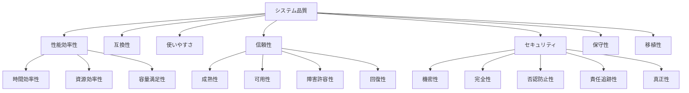

# 🎯 NFR-QAS（Non-Functional Requirements - Quality Attribute Scenarios）

**Doc-ID**: SSOT-FOUNDATION-NFR-001  
**バージョン**: 1.0.0  
**作成日**: 2025-10-21  
**最終更新**: 2025-10-21  
**ステータス**: ✅ 完成  
**所有者**: Iza（統合管理者）  
**準拠基準**: ISO/IEC 25010:2011（システム品質モデル）

---

## 📋 目次

1. [概要](#概要)
2. [QASとは](#qasとは)
3. [QAS記述方法](#qas記述方法)
4. [性能（Performance）](#性能performance)
5. [可用性（Availability）](#可用性availability)
6. [セキュリティ（Security）](#セキュリティsecurity)
7. [使いやすさ（Usability）](#使いやすさusability)
8. [保守性（Maintainability）](#保守性maintainability)
9. [移植性（Portability）](#移植性portability)
10. [トレーサビリティ](#トレーサビリティ)

---

## 概要

### 目的

非機能要件（NFR: Non-Functional Requirements）を**ISO 25010**に基づいて定義し、測定可能な品質属性シナリオ（QAS: Quality Attribute Scenario）として記録します。

### ISO 25010 品質特性



---

## QASとは

### QAS（Quality Attribute Scenario）の構成要素

```
Stimulus（刺激）
    ↓
Source（発生源）
    ↓
Environment（環境）
    ↓
Artifact（対象）
    ↓
Response（応答）
    ↓
Measure（測定）
```

### 記述テンプレート

```markdown
## QAS-<カテゴリ>-<連番>: <タイトル>

**Stimulus（刺激）**:
- [何が起こるのか]

**Source（発生源）**:
- [誰が/何が引き起こすのか]

**Environment（環境）**:
- [どのような状態で発生するのか]

**Artifact（対象）**:
- [システムのどの部分に影響するのか]

**Response（応答）**:
- [システムはどう反応すべきか]

**Measure（測定）**:
- [どのように測定するのか]
- [合格基準（閾値）]

**検証方法**:
- [計測ポイント]
- [メトリクス名]
- [ツール]

**関連要件**:
- FR-xxx
- ADR-xxx

**TODO**:
- [ ] [不足情報]
```

---

## 性能（Performance）

### QAS-PERF-001: API応答時間

**Stimulus（刺激）**:
- ユーザーがAPIリクエストを送信

**Source（発生源）**:
- hotel-saasのフロントエンド
- hotel-pmsのフロントエンド
- 外部システム（OTA連携等）

**Environment（環境）**:
- 通常負荷時（同時接続100ユーザー以下）
- ピーク時（同時接続500ユーザー）

**Artifact（対象）**:
- hotel-commonの全APIエンドポイント
- hotel-saasのプロキシAPI

**Response（応答）**:
- APIが正常にレスポンスを返す
- エラー時は適切なエラーメッセージとステータスコードを返す

**Measure（測定）**:
- **P50（中央値）**: 200ms以下
- **P95（95パーセンタイル）**: 500ms以下
- **P99（99パーセンタイル）**: 1000ms以下
- **エラー率**: 0.1%以下

**検証方法**:
- 計測ポイント: Expressミドルウェア（hotel-common）、Nuxt Serverミドルウェア（hotel-saas）
- メトリクス: `http_request_duration_ms`
- ツール: `prom-client`（Prometheus）、`console.time/timeEnd`（開発時）
- 負荷テスト: Apache JMeter、k6

**関連要件**:
- FR-xxx: 全API機能
- ADR-xxx: API設計方針

**TODO**:
- [ ] Prometheus/Grafanaの導入
- [ ] 負荷テストシナリオの作成

---

### QAS-PERF-002: データベースクエリ

**Stimulus（刺激）**:
- APIがデータベースクエリを実行

**Source（発生源）**:
- hotel-commonのPrismaクエリ

**Environment（環境）**:
- データ量: 10万レコード以上

**Artifact（対象）**:
- PostgreSQLデータベース
- Prismaクエリ

**Response（応答）**:
- クエリが正常に完了
- N+1クエリが発生しない

**Measure（測定）**:
- **単一クエリ**: 100ms以下
- **複雑なJOIN**: 500ms以下
- **N+1クエリ**: 0件（禁止）

**検証方法**:
- 計測ポイント: Prismaログ、PostgreSQL `pg_stat_statements`
- メトリクス: `query_duration_ms`、`query_count`
- ツール: Prisma Query Log、`EXPLAIN ANALYZE`

**関連要件**:
- FR-xxx: データベース操作を含む全機能
- ADR-xxx: Prisma使用方針

**TODO**:
- [ ] Prismaクエリログの有効化
- [ ] スロークエリの監視

---

### QAS-PERF-003: フロントエンド初回表示

**Stimulus（刺激）**:
- ユーザーがページにアクセス

**Source（発生源）**:
- ブラウザ（PC/スマートフォン/タブレット）

**Environment（環境）**:
- ネットワーク: 3G/4G/Wi-Fi
- 初回アクセス（キャッシュなし）

**Artifact（対象）**:
- hotel-saasの全ページ
- hotel-pmsの全ページ

**Response（応答）**:
- ページが表示される
- First Contentful Paint（FCP）が完了

**Measure（測定）**:
- **FCP（First Contentful Paint）**: 1.8秒以下
- **LCP（Largest Contentful Paint）**: 2.5秒以下
- **TTI（Time to Interactive）**: 3.0秒以下
- **CLS（Cumulative Layout Shift）**: 0.1以下

**検証方法**:
- 計測ポイント: ブラウザ Performance API
- メトリクス: Core Web Vitals
- ツール: Lighthouse、Google PageSpeed Insights

**関連要件**:
- FR-xxx: 全UI機能
- ADR-xxx: フロントエンド技術選定

**TODO**:
- [ ] Lighthouseの定期実行
- [ ] Core Web Vitalsの監視

---

## 可用性（Availability）

### QAS-AVAIL-001: システム稼働率

**Stimulus（刺激）**:
- システムが24時間365日稼働

**Source（発生源）**:
- 全システム（hotel-saas/common/pms/member）

**Environment（環境）**:
- 本番環境
- 通常運用時

**Artifact（対象）**:
- 全システム

**Response（応答）**:
- システムが正常に稼働
- ダウンタイムが最小化

**Measure（測定）**:
- **稼働率**: 99.9%以上（月間ダウンタイム43.2分以内）
- **MTBF（平均故障間隔）**: 720時間以上（30日）
- **MTTR（平均復旧時間）**: 1時間以内

**検証方法**:
- 計測ポイント: ヘルスチェックエンドポイント（`/health`）
- メトリクス: `uptime_seconds`、`health_check_status`
- ツール: UptimeRobot、Pingdom、Prometheus Alertmanager

**関連要件**:
- FR-xxx: 全機能
- ADR-xxx: インフラストラクチャ設計

**TODO**:
- [ ] ヘルスチェックエンドポイントの実装
- [ ] 監視システムの構築

---

### QAS-AVAIL-002: データベース障害時の自動フェイルオーバー

**Stimulus（刺激）**:
- PostgreSQLマスターDBが障害

**Source（発生源）**:
- ハードウェア障害
- ソフトウェア障害

**Environment（環境）**:
- 本番環境
- ピーク時

**Artifact（対象）**:
- PostgreSQL（マスター/スタンバイ構成）

**Response（応答）**:
- 自動的にスタンバイDBに切り替わる
- データ損失なし
- ユーザーへの影響最小化

**Measure（測定）**:
- **切り替え時間**: 30秒以内
- **データ損失**: 0件
- **ユーザーへの影響**: エラー率5%以内（リトライ成功）

**検証方法**:
- 計測ポイント: PostgreSQLレプリケーションラグ
- メトリクス: `replication_lag_seconds`
- ツール: pg_stat_replication、Patroni

**関連要件**:
- FR-xxx: 全機能
- ADR-xxx: データベース冗長化

**TODO**:
- [ ] PostgreSQLレプリケーション構成
- [ ] 障害シミュレーション

---

## セキュリティ（Security）

### QAS-SEC-001: 不正ログイン試行の検知・ブロック

**Stimulus（刺激）**:
- 攻撃者がブルートフォース攻撃を試みる

**Source（発生源）**:
- 外部からの不正アクセス

**Environment（環境）**:
- 本番環境
- インターネット経由

**Artifact（対象）**:
- hotel-saasログイン画面
- hotel-commonログインAPI

**Response（応答）**:
- 5回失敗で15分間アカウントロック
- 管理者に通知
- IPアドレスを記録

**Measure（測定）**:
- **検知率**: 100%（5回失敗を確実に検知）
- **ロック時間**: 15分間
- **通知遅延**: 1分以内

**検証方法**:
- 計測ポイント: ログイン失敗カウント（`staff.failed_login_count`）
- メトリクス: `login_failure_count`、`account_lock_count`
- ツール: Redis（カウント保存）、ログ監視

**関連要件**:
- FR-AUTH-001: ログイン機能
- ADR-xxx: Session認証
- OWASP ASVS L2: V2.2（セッション管理）

**TODO**:
- [ ] ログイン失敗カウントの実装
- [ ] 管理者通知の実装

---

### QAS-SEC-002: SQLインジェクション対策

**Stimulus（刺激）**:
- 攻撃者がSQLインジェクション攻撃を試みる

**Source（発生源）**:
- 外部からの不正リクエスト

**Environment（環境）**:
- 全環境

**Artifact（対象）**:
- 全APIエンドポイント

**Response（応答）**:
- SQLインジェクションが成功しない
- 不正なリクエストを拒否

**Measure（測定）**:
- **攻撃成功率**: 0%
- **検知率**: 100%

**検証方法**:
- 計測ポイント: Prisma使用（プレースホルダー）
- メトリクス: `sql_injection_attempt_count`
- ツール: OWASP ZAP、Burp Suite、sqlmap

**関連要件**:
- FR-xxx: 全API機能
- ADR-xxx: Prisma使用方針
- OWASP ASVS L2: V5.3（データベースセキュリティ）

**TODO**:
- [ ] セキュリティテストの実施
- [ ] 脆弱性スキャンの定期実行

---

## 使いやすさ（Usability）

### QAS-USAB-001: 多言語切り替え

**Stimulus（刺激）**:
- ユーザーが言語を切り替える

**Source（発生源）**:
- ゲスト（客室端末）
- スタッフ（管理画面）

**Environment（環境）**:
- 全画面

**Artifact（対象）**:
- hotel-saasの全UI
- hotel-pmsの全UI

**Response（応答）**:
- 即座に言語が切り替わる
- セッション中、言語設定が保持される

**Measure（測定）**:
- **切り替え時間**: 500ms以内
- **翻訳カバレッジ**: 95%以上

**検証方法**:
- 計測ポイント: i18n切り替えイベント
- メトリクス: `language_switch_duration_ms`
- ツール: 手動テスト、E2Eテスト

**関連要件**:
- FR-I18N-001: 多言語対応
- ADR-xxx: 多言語化戦略

**TODO**:
- [ ] 全言語の翻訳完了確認
- [ ] 言語切り替えのパフォーマンステスト

---

## 保守性（Maintainability）

### QAS-MAINT-001: コードレビュー時間

**Stimulus（刺激）**:
- 開発者がPRを作成

**Source（発生源）**:
- 開発チーム

**Environment（環境）**:
- GitHub/Linear

**Artifact（対象）**:
- 全コード

**Response（応答）**:
- レビュアーがコードレビューを実施
- 品質基準を満たしているか確認

**Measure（測定）**:
- **レビュー完了時間**: 24時間以内
- **品質スコア**: 90点以上（SSOT準拠、命名規則、テスト等）

**検証方法**:
- 計測ポイント: PR作成時刻とマージ時刻の差
- メトリクス: `pr_review_duration_hours`
- ツール: GitHub Actions、Linear

**関連要件**:
- ADR-xxx: 開発プロセス

**TODO**:
- [ ] レビュー時間の計測自動化
- [ ] 品質スコア算出の自動化

---

## 移植性（Portability）

### QAS-PORT-001: 新環境へのデプロイ時間

**Stimulus（刺激）**:
- 新しいテナント/環境を構築

**Source（発生源）**:
- 運用チーム

**Environment（環境）**:
- Dokku/VPS

**Artifact（対象）**:
- 全システム

**Response（応答）**:
- 自動デプロイスクリプトで環境構築
- データベースマイグレーション実行
- 動作確認

**Measure（測定）**:
- **構築時間**: 30分以内
- **成功率**: 95%以上

**検証方法**:
- 計測ポイント: デプロイスクリプト実行時間
- メトリクス: `deployment_duration_minutes`
- ツール: Dokku、シェルスクリプト

**関連要件**:
- ADR-xxx: デプロイメント戦略

**TODO**:
- [ ] デプロイスクリプトの自動化
- [ ] デプロイ時間の計測

---

## トレーサビリティ

### QAS → FR/ADR → 実装 → テスト

| QAS | 関連FR | 関連ADR | 実装 | テスト |
|:----|:------|:--------|:-----|:------|
| QAS-PERF-001 | FR-xxx | ADR-xxx | hotel-common | TC-xxx |
| QAS-PERF-002 | FR-xxx | ADR-xxx | Prisma | TC-xxx |
| QAS-AVAIL-001 | FR-xxx | ADR-xxx | 全システム | TC-xxx |
| QAS-SEC-001 | FR-AUTH-001 | ADR-xxx | hotel-saas/common | TC-xxx |

---

ここまで読み込んだらまず「NFR-QAS.md 読了」と表示すること


