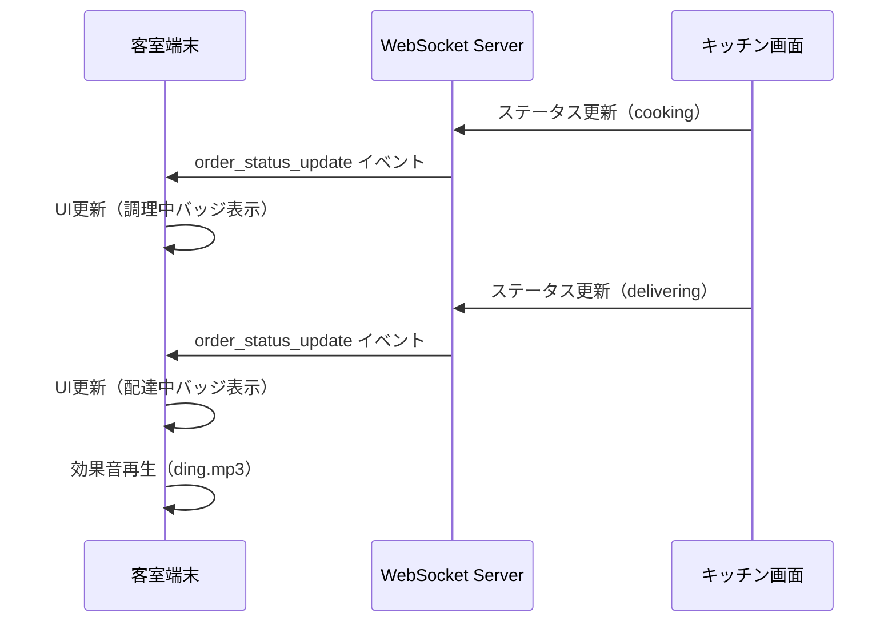

# SSOT: 客室端末注文フロー（GUEST_ORDER_FLOW）

**作成日**: 2025-10-14  
**最終更新**: 2025-10-14  
**バージョン**: v1.0.0  
**ステータス**: ✅ 確定  
**優先度**: 🔴 最高（Phase 2 Week 5）

**関連SSOT**:
- [SSOT_SAAS_ORDER_MANAGEMENT.md](../01_admin_features/SSOT_SAAS_ORDER_MANAGEMENT.md) - 管理画面の注文管理（必読）
- [SSOT_SAAS_MENU_MANAGEMENT.md](../01_admin_features/SSOT_SAAS_MENU_MANAGEMENT.md) - メニュー管理
- [SSOT_SAAS_DATABASE_SCHEMA.md](../00_foundation/SSOT_SAAS_DATABASE_SCHEMA.md) - DBスキーマ
- [SSOT_SAAS_MULTITENANT.md](../00_foundation/SSOT_SAAS_MULTITENANT.md) - マルチテナント基盤
- [SSOT_MULTILINGUAL_SYSTEM.md](../00_foundation/SSOT_MULTILINGUAL_SYSTEM.md) - 多言語化システム

**注**: 本SSOTは**客室端末からの注文フロー**を定義します。管理画面の注文管理とは明確に分離しています。

---

## 📋 目次

1. [概要](#概要)
2. [システム境界](#システム境界)
3. [画面構成](#画面構成)
4. [データベース設計](#データベース設計)
5. [API設計](#api設計)
6. [レコメンデーション機能](#レコメンデーション機能)
7. [リアルタイム更新](#リアルタイム更新)
8. [実装ガイド](#実装ガイド)
9. [セキュリティ](#セキュリティ)
10. [実装状況](#実装状況)

---

## 📖 概要

### 目的

ホテル客室に設置されたタブレット・TV等の端末から、宿泊客が**ルームサービスを注文するための一連のUI/UX**を提供する。

### 基本方針

- **ゲスト中心設計**: 直感的で使いやすいUI/UX
- **デバイス自動認証**: IPベース認証でログイン不要
- **リアルタイム進捗**: WebSocketで配達状況を即時表示
- **レコメンデーション充実**: ランキング、急上昇、アップセル機能
- **多言語対応**: 15言語対応（Phase 3以降）
- **オフライン対応**: 将来的にIndexedDB対応（Phase 5）

### アーキテクチャ概要

```
[客室端末: タブレット/TV]
  ↓ ブラウザ（WebViewアプリ）
[hotel-saas Pages (Vue 3/Nuxt 3)]
  ↓ /order, /order/cart, /order/history
[hotel-saas API (Proxy)]
  ↓ GET/POST /api/v1/order/*
[hotel-common API (Core)]
  ↓ Prisma ORM
[PostgreSQL (統一DB)]
  ├─ orders テーブル
  ├─ order_items テーブル
  ├─ menu_items テーブル
  └─ checkin_sessions テーブル
[Redis]
  └─ WebSocket接続管理
```

---

## 🎯 システム境界

### 対象システム

| システム | 役割 | 実装範囲 |
|:---------|:-----|:--------|
| **hotel-saas** | 客室端末UI + プロキシAPI | ✅ Pages, Components, Stores, Middleware |
| **hotel-common** | コアAPI実装 | ✅ 注文作成・取得・更新API |
| **hotel-pms** | 将来連携 | 🔄 料金計算・請求連携（Phase 4） |
| **hotel-member** | 将来連携 | 🔄 会員情報・ポイント（Phase 4） |

### 機能範囲

#### ✅ 本SSOTの対象

- 客室端末の7画面（メニュー、カート、注文完了、注文履歴等）
- 注文作成・確認・履歴取得API
- リアルタイム進捗表示（WebSocket）
- レコメンデーション機能（ランキング、急上昇、アップセル）
- デバイス自動認証

#### ❌ 本SSOTの対象外

- 管理画面の注文管理 → [SSOT_SAAS_ORDER_MANAGEMENT.md](../01_admin_features/SSOT_SAAS_ORDER_MANAGEMENT.md)
- キッチン画面 → 別SSOT（未作成）
- 配膳管理画面 → 別SSOT（未作成）
- メニュー管理画面 → [SSOT_SAAS_MENU_MANAGEMENT.md](../01_admin_features/SSOT_SAAS_MENU_MANAGEMENT.md)

---

## 🖥️ 画面構成

### 画面一覧（7画面）

| # | 画面パス | 画面名 | 主要機能 | 実装状況 |
|:-:|:---------|:-------|:--------|:--------|
| 1 | `/` | ゲストホーム | ルームサービスへの入口、館内情報 | ✅ 完成 |
| 2 | `/order` | メニュー一覧 | カテゴリタブ、ソート、ランキング、急上昇 | ✅ 完成 |
| 3 | `/menu/index` | カテゴリ別メニュー | カテゴリ別の商品表示 | ✅ 完成 |
| 4 | `/menu/category/[id]` | 詳細カテゴリ | 子カテゴリ表示、商品一覧 | ✅ 完成 |
| 5 | `/order/cart` | カート | 数量変更、削除、注文確定 | ✅ 完成 |
| 6 | `/order/complete` | 注文完了 | 注文番号表示、自動リダイレクト | ✅ 完成 |
| 7 | `/order/history` | 注文履歴 | 過去注文、ステータス確認、合計金額 | ✅ 完成 |

### 画面遷移フロー

```mermaid
graph TD
    A[/ TOP] --> B[/order メニュー一覧]
    B --> C[商品詳細モーダル]
    C --> D[カートに追加]
    D --> E[アップセル提案モーダル]
    E --> B
    D --> F[/order/cart カート]
    F --> G[注文確認モーダル]
    G --> H[/order/complete 注文完了]
    H --> B
    B --> I[/order/history 注文履歴]
    I --> B
```

---

## 📊 データベース設計

### 既存テーブル活用

**本SSOTでは新規テーブルを追加しません。** すべて既存テーブルを活用します。

#### 主要テーブル

| テーブル名 | 用途 | 参照SSOT |
|:----------|:-----|:---------|
| `orders` | 運用中の注文管理 | ORDER_MANAGEMENT |
| `order_items` | 注文明細 | ORDER_MANAGEMENT |
| `menu_items` | メニュー商品マスタ | MENU_MANAGEMENT |
| `checkin_sessions` | チェックインセッション（部屋とデバイスの紐づけ） | DATABASE_SCHEMA |
| `sales_summaries` | 売上集計履歴（急上昇機能用） | 本SSOT（Phase 2で新規追加） |

### Phase 2追加テーブル: sales_summaries

**目的**: 急上昇メニュー機能のための売上集計履歴を保存

```prisma
model SalesSummary {
  id              String   @id @default(cuid())
  tenantId        String   @map("tenant_id")
  menuItemId      Int      @map("menu_item_id")
  periodStart     DateTime @map("period_start")
  periodEnd       DateTime @map("period_end")
  periodType      String   @map("period_type") // 'day', 'week', 'month'
  salesCount      Int      @map("sales_count")
  totalRevenue    Float    @map("total_revenue")
  createdAt       DateTime @default(now()) @map("created_at")
  
  @@map("sales_summaries")
  @@index([tenantId, menuItemId, periodType])
  @@index([periodStart])
}
```

**命名規則準拠**:
- ✅ テーブル名: `sales_summaries` (snake_case)
- ✅ カラム名: すべてsnake_case
- ✅ Prismaモデル名: `SalesSummary` (PascalCase)
- ✅ Prismaフィールド名: camelCase + `@map`
- ✅ `@@map`ディレクティブ使用

### Phase 2拡張: menu_items テーブル

**目的**: 急上昇機能用のフィールド追加

```prisma
model MenuItem {
  // 既存フィールド（省略）
  
  // Phase 2追加フィールド
  trendingScore   Float?   @map("trending_score")    // 急上昇スコア
  lastWeekSales   Int      @default(0) @map("last_week_sales") // 前週売上数
  thisWeekSales   Int      @default(0) @map("this_week_sales") // 今週売上数
  growthRate      Float?   @map("growth_rate")       // 増加率（%）
  
  // Phase 2追加フィールド（アレルギー・栄養情報）
  allergens       String[] @default([]) // アレルゲン配列
  calories        Int?     // カロリー（kcal）
  protein         Float?   // タンパク質（g）
  fat             Float?   // 脂質（g）
  carbs           Float?   // 炭水化物（g）
  sodium          Float?   // 塩分（g）
  
  @@map("menu_items")
}
```

---

## 🔌 API設計

### API一覧（4エンドポイント）

| # | メソッド | パス | 機能 | 実装状況 |
|:-:|:--------|:-----|:-----|:--------|
| 1 | GET | `/api/v1/order/menu` | メニュー一覧取得 | ✅ 完成 |
| 2 | POST | `/api/v1/order/place` | 注文作成 | ✅ 完成 |
| 3 | GET | `/api/v1/orders/history` | 注文履歴取得 | ✅ 完成 |
| 4 | GET | `/api/v1/menus/top` | ランキング取得 | ✅ 完成 |
| 5 | GET | `/api/v1/menus/trending` | 急上昇メニュー取得 | ❌ Phase 2実装 |

### API詳細仕様

#### 1. メニュー一覧取得

**エンドポイント**: `GET /api/v1/order/menu`

**リクエスト**:
```http
GET /api/v1/order/menu HTTP/1.1
Host: localhost:3100
Cookie: hotel_session=<session_id>
```

**レスポンス**:
```json
{
  "tags": [
    { "path": "food", "name": "食べ物", "nameJa": "食べ物", "nameEn": "Food" },
    { "path": "drinks", "name": "飲み物", "nameJa": "飲み物", "nameEn": "Drinks" }
  ],
  "items": [
    {
      "id": 1,
      "nameJa": "ハンバーガーセット",
      "nameEn": "Hamburger Set",
      "price": 1200,
      "imageUrl": "/uploads/hamburger.jpg",
      "tags": ["food", "food/western-food"],
      "isFeatured": true,
      "isSet": true,
      "description": "ジューシーなパティとフレッシュな野菜",
      "timeRestrictions": [
        { "start": "10:00", "end": "22:00" }
      ],
      "allergens": ["wheat", "egg", "milk"],
      "calories": 850,
      "stockAvailable": true,
      "trendingScore": 95.5,
      "growthRate": 120.5
    }
  ]
}
```

#### 2. 注文作成

**エンドポイント**: `POST /api/v1/order/place`

**リクエスト**:
```json
{
  "items": [
    {
      "menuItemId": 1,
      "name": "ハンバーガーセット",
      "quantity": 2,
      "price": 1200,
      "notes": "{\"drink\":\"コーラ\",\"side\":\"ポテト\"}"
    }
  ],
  "roomId": "301",
  "placeId": 15,
  "specialRequests": "希望提供時間: 12:30"
}
```

**レスポンス**:
```json
{
  "order": {
    "id": "ord_123abc",
    "status": "received",
    "total": 2400,
    "estimatedDeliveryTime": "12:45",
    "items": [...]
  }
}
```

#### 3. 注文履歴取得

**エンドポイント**: `GET /api/v1/orders/history`

**レスポンス**:
```json
{
  "orders": [
    {
      "id": "ord_123abc",
      "createdAt": "2025-10-14T12:15:00Z",
      "status": "delivering",
      "items": [...],
      "total": 2400
    }
  ]
}
```

#### 4. ランキング取得

**エンドポイント**: `GET /api/v1/menus/top?period={week|month|year}&category={path}`

**Phase 2実装済み（バックアップから復元予定）**

---

## 🎯 レコメンデーション機能

### 実装済み機能（3つ）

#### A. ランキング表示

**機能**: 週間・月間・年間の売上ランキングを表示

**実装場所**:
- UI: `components/category/SortTabs.vue`
- API: `/api/v1/menus/top?period={week|month|year}`

**タブ構成**:
```typescript
const tabs = [
  { label: '商品一覧', value: 'recommended' },
  { label: '週間ランキング', value: 'top-week' },
  { label: '月間ランキング', value: 'top-month' },
  { label: '年間ランキング', value: 'top-year' }
]
```

**集計ロジック**:
1. 期間内の`orders`テーブルから注文データを抽出
2. `order_items`から商品別売上数を集計
3. キャンセル注文は除外
4. 売上数降順でソート
5. 上位10件を返却

#### B. おすすめ商品表示

**機能**: 管理画面で設定された`isFeatured=true`商品を「おすすめ」として強調表示する

**実装（rebuild）**:
- UI: `hotel-saas-rebuild/components/MenuItemCard.vue`
  - `isFeatured` のとき「おすすめ」バッジを表示
- 一覧ページ: `hotel-saas-rebuild/pages/menu/index.vue`（URL: `/menu`）

> 注: 旧実装（hotel-saas）の `pages/order/index.vue` への参照は混乱の原因になるため削除しました。

#### C. アップセル提案

**機能**: カート追加時に関連商品を自動提案（最大3件）

**実装状況（rebuild）**: 未実装（将来タスク）

> 注: 旧実装参照（`components/order/UpsellModal.vue`, `pages/order/index.vue` 等）はrebuildには存在しないため削除しました。

### Phase 2追加機能（2つ）

#### D. 急上昇メニュー

**目的**: 前週比・前月比で売上が急増している商品を表示

**実装工数**: 3日

**タブ追加**:
```typescript
const tabs = [
  { label: '商品一覧', value: 'recommended' },
  { label: '🔥 急上昇', value: 'trending' }, // ★新規追加
  { label: '週間ランキング', value: 'top-week' },
  { label: '月間ランキング', value: 'top-month' },
  { label: '年間ランキング', value: 'top-year' }
]
```

**API仕様**:
```typescript
// GET /api/v1/menus/trending?period={day|week}
Response: {
  items: [
    {
      id: 1,
      nameJa: "ハンバーガーセット",
      price: 1200,
      thisWeekSales: 150,
      lastWeekSales: 60,
      growthRate: 150.0, // 増加率（%）
      trendBadge: "hot" // "hot" or "rising"
    }
  ]
}
```

**バッジ表示ルール**:
- 増加率 > 100%: 🔥 急上昇（赤色バッジ、アニメーション付き）
- 増加率 > 50%: 📈 人気上昇中（オレンジ色バッジ）
- それ以外: バッジなし

**Cronジョブ**: 毎日1回実行
```bash
# scripts/cron/calculate-trending.ts
# 前週と今週の売上を比較して増加率を計算
# menu_itemsテーブルの急上昇フィールドを更新
```

#### E. 関連商品レコメンド

**目的**: 「この商品を見ている人は、こちらも注文しています」

**実装工数**: 5日（Phase 2後半）

**API仕様**:
```typescript
// GET /api/v1/menus/{id}/related
Response: {
  items: [
    {
      id: 2,
      nameJa: "フライドポテト",
      price: 400,
      coOrderCount: 85 // 同時注文回数
    }
  ]
}
```

**表示場所**: 商品詳細モーダル下部

---

## 🔄 リアルタイム更新

### WebSocket接続

**エンドポイント**: `ws://localhost:3100/ws/orders`

**実装場所**: `stores/order.ts`

**接続フロー**:
```typescript
// 1. ページマウント時にWebSocket接続
orderStore.initializeWebSocket()

// 2. セッションIDを使用して接続
const sessionId = getCookie('hotel_session')
ws = new WebSocket(`ws://localhost:3100/ws/orders?session=${sessionId}`)

// 3. メッセージ受信時にステータス更新
ws.onmessage = (event) => {
  const data = JSON.parse(event.data)
  if (data.type === 'order_status_update') {
    orderStore.updateOrderStatus(data.orderId, data.status)
  }
}
```

### ステータス更新フロー



### 進捗トラッカー

**コンポーネント**: `components/order/OrderStepTracker.vue`

**表示内容**:
```
[✓] 受付済み → [⏳] 準備中 → [ ] 準備完了 → [ ] 配達中 → [ ] 完了
```

**ステータス定義**:
| ステータス | 表示 | カラー | 効果音 |
|:----------|:-----|:-------|:-------|
| `received` | 受付済み | `bg-gray-500` | - |
| `cooking` | 準備中 | `bg-amber-500` | `cook.mp3` |
| `ready` | 準備完了 | `bg-green-600` | - |
| `delivering` | 配達中 | `bg-blue-500` | `ding.mp3` |
| `done` | 配達完了 | `bg-green-600` | `done.mp3` |

---

## 🛠️ 実装ガイド

### Phase 1: 基本実装確認（完了）

**実装内容**:
- ✅ 7画面の実装
- ✅ 8コンポーネントの実装
- ✅ 3 Storeの実装
- ✅ 4 APIの実装

### Phase 2: レコメンデーション強化（2週間）

**Week 1: 急上昇メニュー機能**

1. **データベース拡張**（1日）
   ```bash
   # マイグレーション作成
   cd /Users/kaneko/hotel-common
   npx prisma migrate dev --name add_trending_fields_to_menu_items
   ```

2. **API実装**（1日）
   - `server/api/v1/menus/trending.get.ts` 作成
   - 集計ロジック実装

3. **UI実装**（1日）
   - `SortTabs.vue` にタブ追加
   - `MenuCard.vue` にバッジ表示追加

**Week 2: アレルギー・栄養情報**

4. **データベース拡張**（0.5日）
   ```bash
   npx prisma migrate dev --name add_allergen_nutrition_fields
   ```

5. **管理画面対応**（1日）
   - メニュー登録/編集画面にフィールド追加

6. **客室端末UI対応**（1日）
   - アレルゲンバッジ表示
   - 栄養情報表示
   - フィルタ機能追加

### Phase 3: 配達時間予測（1週間）

7. **kitchen_settings テーブル追加**（0.5日）
8. **管理画面でキッチン設定**（1日）
9. **予測ロジック実装**（2日）
10. **UI表示**（0.5日）

### Phase 4: Member連携（hotel-member完成後）

11. **AIレコメンデーション実装**
12. **会員ランク別価格実装**
13. **リピート注文実装**

### Phase 5: 高度な機能（将来）

14. **オフライン対応（IndexedDB）**
15. **音声注文**
16. **季節・イベント連動レコメンド**

---

## 🔐 セキュリティ

### デバイス自動認証

**実装場所**: `middleware/01-device-auth.ts`

**認証フロー**:
```typescript
// 1. IPアドレス取得
const clientIp = getClientIp(event)

// 2. checkin_sessionsテーブルから部屋情報取得
const session = await prisma.checkinSessions.findFirst({
  where: {
    deviceIp: clientIp,
    status: 'active'
  }
})

// 3. セッション検証
if (!session || !session.roomId) {
  throw createError({
    statusCode: 401,
    message: 'デバイス認証が必要です'
  })
}

// 4. コンテキストに部屋情報を設定
event.context.session = session
event.context.roomId = session.roomId
event.context.placeId = session.placeId
```

### XSS対策

- ✅ Vue 3のデフォルトエスケープ機能
- ✅ `v-html`使用時はサニタイズ必須
- ✅ ユーザー入力は常にバリデーション

### CSRF対策

- ✅ SameSite Cookie属性設定
- ✅ Nuxt 3のCSRF保護機能

### データ保護

- ✅ テナントID必須フィルタ
- ✅ セッションベースのデータ分離
- ✅ 個人情報の最小限アクセス

---

## 📊 実装状況

### Phase 1-3: 基本機能（完了率: 90%）

| 機能 | 実装状況 | 完成度 | 備考 |
|:-----|:--------|:-----:|:-----|
| メニュー一覧 | ✅ 完成 | 100% | - |
| カート機能 | ✅ 完成 | 100% | - |
| 注文作成 | ✅ 完成 | 100% | - |
| 注文履歴 | ✅ 完成 | 100% | - |
| リアルタイム進捗 | ✅ 完成 | 100% | WebSocket |
| ランキング表示 | ✅ 完成 | 100% | 週間・月間・年間 |
| おすすめ表示 | ✅ 完成 | 100% | isFeatured |
| アップセル | ✅ 完成 | 100% | 関連商品3件 |
| 配達時間指定 | 🟡 部分実装 | 60% | UI未完成 |

### Phase 2: レコメンデーション強化（完了率: 0%）

| 機能 | 実装状況 | 完成度 | 工数 |
|:-----|:--------|:-----:|:-----|
| 急上昇メニュー | ❌ 未実装 | 0% | 3日 |
| アレルギー情報 | ❌ 未実装 | 0% | 3日 |
| 食事制限対応 | ❌ 未実装 | 0% | 2日 |
| カロリー表示 | ❌ 未実装 | 0% | 1日 |
| 配達時間予測 | ❌ 未実装 | 0% | 5日 |
| チャットボット連携 | ❌ 未実装 | 0% | 2週間 |

**Phase 2完了率**: 0/16タスク = **0%**

### Phase 4-5: Member連携後（完了率: 0%）

| 機能 | 実装状況 | 依存関係 |
|:-----|:--------|:--------|
| AIレコメンデーション | ❌ 未実装 | hotel-member API |
| 会員ランク別価格 | ❌ 未実装 | hotel-member API |
| リピート注文 | ❌ 未実装 | hotel-member API |
| 季節・イベント連動 | ❌ 未実装 | - |

---

## 🎯 関連SSOT

### 必読SSOT
- [SSOT_SAAS_ORDER_MANAGEMENT.md](../01_admin_features/SSOT_SAAS_ORDER_MANAGEMENT.md)
- [SSOT_SAAS_MENU_MANAGEMENT.md](../01_admin_features/SSOT_SAAS_MENU_MANAGEMENT.md)
- [SSOT_SAAS_DATABASE_SCHEMA.md](../00_foundation/SSOT_SAAS_DATABASE_SCHEMA.md)

### 関連SSOT
- [SSOT_MULTILINGUAL_SYSTEM.md](../00_foundation/SSOT_MULTILINGUAL_SYSTEM.md)
- [SSOT_SAAS_MULTITENANT.md](../00_foundation/SSOT_SAAS_MULTITENANT.md)

---

**バージョン履歴**:
- v1.0.0 (2025-10-14): 初版作成。既存実装の完全文書化、Phase 2機能詳細仕様追加。


