# SSOT: 客室端末注文フロー（GUEST_ORDER_FLOW）

**作成日**: 2025-10-14  
**最終更新**: 2025-11-04  
**バージョン**: v2.0.0  
**ステータス**: ✅ 確定  
**優先度**: 🔴 最高（Phase 2 Week 5）

**関連SSOT**:
- [SSOT_SAAS_ORDER_MANAGEMENT.md](../01_admin_features/SSOT_SAAS_ORDER_MANAGEMENT.md) - 管理画面の注文管理（必読）
- [SSOT_SAAS_MENU_MANAGEMENT.md](../01_admin_features/SSOT_SAAS_MENU_MANAGEMENT.md) - メニュー管理
- [SSOT_SAAS_DATABASE_SCHEMA.md](../00_foundation/SSOT_SAAS_DATABASE_SCHEMA.md) - DBスキーマ
- [SSOT_SAAS_MULTITENANT.md](../00_foundation/SSOT_SAAS_MULTITENANT.md) - マルチテナント基盤
- [SSOT_MULTILINGUAL_SYSTEM.md](../00_foundation/SSOT_MULTILINGUAL_SYSTEM.md) - 多言語化システム

**注**: 本SSOTは**客室端末からの注文フロー**を定義します。管理画面の注文管理とは明確に分離しています。

---

## 📋 目次

1. [概要](#概要)
2. [システム境界](#システム境界)
3. [画面構成](#画面構成)
4. [データベース設計](#データベース設計)
5. [API設計](#api設計)
6. [レコメンデーション機能](#レコメンデーション機能)
7. [リアルタイム更新](#リアルタイム更新)
8. [実装ガイド](#実装ガイド)
9. [セキュリティ](#セキュリティ)
10. [実装状況](#実装状況)

---

## 📖 概要

### 目的

ホテル客室に設置されたタブレット・TV等の端末から、宿泊客が**ルームサービスを注文するための一連のUI/UX**を提供する。

### 基本方針

- **ゲスト中心設計**: 直感的で使いやすいUI/UX
- **デバイス自動認証**: IPベース認証でログイン不要
- **リアルタイム進捗**: WebSocketで配達状況を即時表示
- **レコメンデーション充実**: ランキング、急上昇、アップセル機能
- **多言語対応**: 15言語対応（Phase 3以降）
- **オフライン対応**: 将来的にIndexedDB対応（Phase 5）

### アーキテクチャ概要

```
[客室端末: タブレット/TV]
  ↓ ブラウザ（WebViewアプリ）
[hotel-saas Pages (Vue 3/Nuxt 3)]
  ↓ /order, /order/cart, /order/history
[hotel-saas API (Proxy)]
  ↓ GET/POST /api/v1/order/*
[hotel-common API (Core)]
  ↓ Prisma ORM
[PostgreSQL (統一DB)]
  ├─ orders テーブル
  ├─ order_items テーブル
  ├─ menu_items テーブル
  └─ checkin_sessions テーブル
[Redis]
  └─ WebSocket接続管理
```

---

## 🎯 システム境界

### 対象システム

| システム | 役割 | 実装範囲 |
|:---------|:-----|:--------|
| **hotel-saas** | 客室端末UI + プロキシAPI | ✅ Pages, Components, Stores, Middleware |
| **hotel-common** | コアAPI実装 | ✅ 注文作成・取得・更新API |
| **hotel-pms** | 将来連携 | 🔄 料金計算・請求連携（Phase 4） |
| **hotel-member** | 将来連携 | 🔄 会員情報・ポイント（Phase 4） |

### 機能範囲

#### ✅ 本SSOTの対象

- 客室端末の7画面（メニュー、カート、注文完了、注文履歴等）
- 注文作成・確認・履歴取得API
- リアルタイム進捗表示（WebSocket）
- レコメンデーション機能（ランキング、急上昇、アップセル）
- デバイス自動認証

#### ❌ 本SSOTの対象外

- 管理画面の注文管理 → [SSOT_SAAS_ORDER_MANAGEMENT.md](../01_admin_features/SSOT_SAAS_ORDER_MANAGEMENT.md)
- キッチン画面 → 別SSOT（未作成）
- 配膳管理画面 → 別SSOT（未作成）
- メニュー管理画面 → [SSOT_SAAS_MENU_MANAGEMENT.md](../01_admin_features/SSOT_SAAS_MENU_MANAGEMENT.md)

---

## 🖥️ 画面構成

### 画面一覧（7画面）

| # | 画面パス | 画面名 | 主要機能 | 実装状況 |
|:-:|:---------|:-------|:--------|:--------|
| 1 | `/` | ゲストホーム | ルームサービスへの入口、館内情報 | ✅ 完成 |
| 2 | `/order` | メニュー一覧 | カテゴリタブ、ソート、ランキング、急上昇 | ✅ 完成 |
| 3 | `/menu/index` | カテゴリ別メニュー | カテゴリ別の商品表示 | ✅ 完成 |
| 4 | `/menu/category/[id]` | 詳細カテゴリ | 子カテゴリ表示、商品一覧 | ✅ 完成 |
| 5 | `/order/cart` | カート | 数量変更、削除、注文確定 | ✅ 完成 |
| 6 | `/order/complete` | 注文完了 | 注文番号表示、自動リダイレクト | ✅ 完成 |
| 7 | `/order/history` | 注文履歴 | 過去注文、ステータス確認、合計金額 | ✅ 完成 |

### 画面遷移フロー

```mermaid
graph TD
    A[/ TOP] --> B[/order メニュー一覧]
    B --> C[商品詳細モーダル]
    C --> D[カートに追加]
    D --> E[アップセル提案モーダル]
    E --> B
    D --> F[/order/cart カート]
    F --> G[注文確認モーダル]
    G --> H[/order/complete 注文完了]
    H --> B
    B --> I[/order/history 注文履歴]
    I --> B
```

---

## 📊 データベース設計

### 既存テーブル活用

**本SSOTでは新規テーブルを追加しません。** すべて既存テーブルを活用します。

#### 主要テーブル

| テーブル名 | 用途 | 参照SSOT |
|:----------|:-----|:---------|
| `orders` | 運用中の注文管理 | ORDER_MANAGEMENT |
| `order_items` | 注文明細 | ORDER_MANAGEMENT |
| `menu_items` | メニュー商品マスタ | MENU_MANAGEMENT |
| `checkin_sessions` | チェックインセッション（部屋とデバイスの紐づけ） | DATABASE_SCHEMA |
| `sales_summaries` | 売上集計履歴（急上昇機能用） | 本SSOT（Phase 2で新規追加） |

### Phase 2追加テーブル: sales_summaries

**目的**: 急上昇メニュー機能のための売上集計履歴を保存

```prisma
model SalesSummary {
  id              String   @id @default(cuid())
  tenantId        String   @map("tenant_id")
  menuItemId      Int      @map("menu_item_id")
  periodStart     DateTime @map("period_start")
  periodEnd       DateTime @map("period_end")
  periodType      String   @map("period_type") // 'day', 'week', 'month'
  salesCount      Int      @map("sales_count")
  totalRevenue    Float    @map("total_revenue")
  createdAt       DateTime @default(now()) @map("created_at")
  
  @@map("sales_summaries")
  @@index([tenantId, menuItemId, periodType])
  @@index([periodStart])
}
```

**命名規則準拠**:
- ✅ テーブル名: `sales_summaries` (snake_case)
- ✅ カラム名: すべてsnake_case
- ✅ Prismaモデル名: `SalesSummary` (PascalCase)
- ✅ Prismaフィールド名: camelCase + `@map`
- ✅ `@@map`ディレクティブ使用

### Phase 2拡張: menu_items テーブル

**目的**: 急上昇機能用のフィールド追加

```prisma
model MenuItem {
  // 既存フィールド（省略）
  
  // Phase 2追加フィールド
  trendingScore   Float?   @map("trending_score")    // 急上昇スコア
  lastWeekSales   Int      @default(0) @map("last_week_sales") // 前週売上数
  thisWeekSales   Int      @default(0) @map("this_week_sales") // 今週売上数
  growthRate      Float?   @map("growth_rate")       // 増加率（%）
  
  // Phase 2追加フィールド（アレルギー・栄養情報）
  allergens       String[] @default([]) // アレルゲン配列
  calories        Int?     // カロリー（kcal）
  protein         Float?   // タンパク質（g）
  fat             Float?   // 脂質（g）
  carbs           Float?   // 炭水化物（g）
  sodium          Float?   // 塩分（g）
  
  // v2.0.0追加フィールド（在庫管理強化）
  stockManagementEnabled Boolean @default(false) @map("stock_management_enabled")
  currentStock           Int?    @map("current_stock")
  lowStockThreshold      Int?    @map("low_stock_threshold")
  stockStatus            String  @default("available") @map("stock_status") // 'available', 'low', 'out_of_stock'
  
  @@map("menu_items")
}

### v2.0.0拡張: orders テーブル

**目的**: AI統合・冪等性対応

```prisma
model Order {
  // 既存フィールド（省略）
  
  // v2.0.0追加フィールド
  idempotencyKey String?  @unique @map("idempotency_key")
  sourceType     String   @default("manual") @map("source_type") // 'manual' | 'ai_recommendation'
  sourceMetadata Json?    @map("source_metadata")
  
  @@map("orders")
}
```

**マイグレーション手順**:
```bash
cd /Users/kaneko/hotel-common
npx prisma migrate dev --name add_idempotency_and_stock_management_v2
```

---

## 🔌 API設計

### API一覧（4エンドポイント）

| # | メソッド | パス | 機能 | 実装状況 |
|:-:|:--------|:-----|:-----|:--------|
| 1 | GET | `/api/v1/order/menu` | メニュー一覧取得 | ✅ 完成 |
| 2 | POST | `/api/v1/order/place` | 注文作成 | ✅ 完成 |
| 3 | GET | `/api/v1/orders/history` | 注文履歴取得 | ✅ 完成 |
| 4 | GET | `/api/v1/menus/top` | ランキング取得 | ✅ 完成 |
| 5 | GET | `/api/v1/menus/trending` | 急上昇メニュー取得 | ❌ Phase 2実装 |

### API詳細仕様

#### 1. メニュー一覧取得

**エンドポイント**: `GET /api/v1/order/menu`

**リクエスト**:
```http
GET /api/v1/order/menu HTTP/1.1
Host: localhost:3100
Cookie: hotel_session=<session_id>
```

**レスポンス**:
```json
{
  "tags": [
    { "path": "food", "name": "食べ物", "nameJa": "食べ物", "nameEn": "Food" },
    { "path": "drinks", "name": "飲み物", "nameJa": "飲み物", "nameEn": "Drinks" }
  ],
  "items": [
    {
      "id": 1,
      "nameJa": "ハンバーガーセット",
      "nameEn": "Hamburger Set",
      "price": 1200,
      "imageUrl": "/uploads/hamburger.jpg",
      "tags": ["food", "food/western-food"],
      "isFeatured": true,
      "isSet": true,
      "description": "ジューシーなパティとフレッシュな野菜",
      "timeRestrictions": [
        { "start": "10:00", "end": "22:00" }
      ],
      "allergens": ["wheat", "egg", "milk"],
      "calories": 850,
      "stockAvailable": true,
      "trendingScore": 95.5,
      "growthRate": 120.5
    }
  ]
}
```

#### 2. 注文作成

**エンドポイント**: `POST /api/v1/order/place`

**v2.0.0拡張**: Idempotency-Keyヘッダー対応

**リクエストヘッダー**:
```http
POST /api/v1/order/place HTTP/1.1
Host: localhost:3100
Cookie: hotel_session=<session_id>
Idempotency-Key: order_abc123def456_1699012345678
```

**リクエストボディ**:
```json
{
  "items": [
    {
      "menuItemId": 1,
      "name": "ハンバーガーセット",
      "quantity": 2,
      "price": 1200,
      "notes": "{\"drink\":\"コーラ\",\"side\":\"ポテト\"}"
    }
  ],
  "roomId": "301",
  "placeId": 15,
  "specialRequests": "希望提供時間: 12:30",
  
  "sourceType": "ai_recommendation",
  "sourceMetadata": {
    "conversationId": "conv_abc123",
    "recommendationId": "rec_def456",
    "aiProvider": "openai"
  }
}
```

**レスポンス（成功時）**:
```json
{
  "order": {
    "id": "ord_123abc",
    "status": "received",
    "total": 2400,
    "estimatedDeliveryTime": "12:45",
    "items": [...]
  }
}
```

**レスポンス（重複注文検知時: 409 Conflict）**:
```json
{
  "error": "duplicate_order",
  "message": "この注文は既に処理されています",
  "existingOrder": {
    "id": "ord_123abc",
    "status": "received",
    "total": 2400
  }
}
```

#### 3. 注文履歴取得

**エンドポイント**: `GET /api/v1/orders/history`

**レスポンス**:
```json
{
  "orders": [
    {
      "id": "ord_123abc",
      "createdAt": "2025-10-14T12:15:00Z",
      "status": "delivering",
      "items": [...],
      "total": 2400
    }
  ]
}
```

#### 4. ランキング取得

**エンドポイント**: `GET /api/v1/menus/top?period={week|month|year}&category={path}`

**Phase 2実装済み（バックアップから復元予定）**

---

## 🎯 レコメンデーション機能

### 実装済み機能（3つ）

#### A. ランキング表示

**機能**: 週間・月間・年間の売上ランキングを表示

**実装場所**:
- UI: `components/category/SortTabs.vue`
- API: `/api/v1/menus/top?period={week|month|year}`

**タブ構成**:
```typescript
const tabs = [
  { label: '商品一覧', value: 'recommended' },
  { label: '週間ランキング', value: 'top-week' },
  { label: '月間ランキング', value: 'top-month' },
  { label: '年間ランキング', value: 'top-year' }
]
```

**集計ロジック**:
1. 期間内の`orders`テーブルから注文データを抽出
2. `order_items`から商品別売上数を集計
3. キャンセル注文は除外
4. 売上数降順でソート
5. 上位10件を返却

#### B. おすすめ商品表示

**機能**: 管理画面で設定された`isFeatured=true`商品を「おすすめ」として強調表示する

**実装（rebuild）**:
- UI: `hotel-saas-rebuild/components/MenuItemCard.vue`
  - `isFeatured` のとき「おすすめ」バッジを表示
- 一覧ページ: `hotel-saas-rebuild/pages/menu/index.vue`（URL: `/menu`）

> 注: 旧実装（hotel-saas）の `pages/order/index.vue` への参照は混乱の原因になるため削除しました。

#### C. アップセル提案

**機能**: カート追加時に関連商品を自動提案（最大3件）

**実装状況（rebuild）**: 未実装（将来タスク）

> 注: 旧実装参照（`components/order/UpsellModal.vue`, `pages/order/index.vue` 等）はrebuildには存在しないため削除しました。

### Phase 2追加機能（2つ）

#### D. 急上昇メニュー

**目的**: 前週比・前月比で売上が急増している商品を表示

**実装工数**: 3日

**タブ追加**:
```typescript
const tabs = [
  { label: '商品一覧', value: 'recommended' },
  { label: '🔥 急上昇', value: 'trending' }, // ★新規追加
  { label: '週間ランキング', value: 'top-week' },
  { label: '月間ランキング', value: 'top-month' },
  { label: '年間ランキング', value: 'top-year' }
]
```

**API仕様**:
```typescript
// GET /api/v1/menus/trending?period={day|week}
Response: {
  items: [
    {
      id: 1,
      nameJa: "ハンバーガーセット",
      price: 1200,
      thisWeekSales: 150,
      lastWeekSales: 60,
      growthRate: 150.0, // 増加率（%）
      trendBadge: "hot" // "hot" or "rising"
    }
  ]
}
```

**バッジ表示ルール**:
- 増加率 > 100%: 🔥 急上昇（赤色バッジ、アニメーション付き）
- 増加率 > 50%: 📈 人気上昇中（オレンジ色バッジ）
- それ以外: バッジなし

**Cronジョブ**: 毎日1回実行
```bash
# scripts/cron/calculate-trending.ts
# 前週と今週の売上を比較して増加率を計算
# menu_itemsテーブルの急上昇フィールドを更新
```

#### E. 関連商品レコメンド

**目的**: 「この商品を見ている人は、こちらも注文しています」

**実装工数**: 5日（Phase 2後半）

**API仕様**:
```typescript
// GET /api/v1/menus/{id}/related
Response: {
  items: [
    {
      id: 2,
      nameJa: "フライドポテト",
      price: 400,
      coOrderCount: 85 // 同時注文回数
    }
  ]
}
```

**表示場所**: 商品詳細モーダル下部

---

## 🤖 AI統合機能（v2.0.0新規）

### A. AI回答内ワンタップ追加

**要件ID**: ORD-AI-001

**機能概要**:
AIコンシェルジュの商品提案から直接カート追加

**実装コンポーネント**:
- `components/ai/AIProductCard.vue`（新規作成、150行）
- `components/ai/MiniCart.vue`（新規作成、100行）

**AI応答形式**:
```typescript
interface AIProductRecommendation {
  menuItemId: number
  name: string
  price: number
  imageUrl: string
  quickAddEnabled: boolean
  options?: MenuOption[]
}

interface MenuOption {
  id: number
  name: string
  choices: string[]
  required: boolean
  priceModifier?: number
}

// AI応答例
{
  type: 'product_recommendation',
  products: [
    {
      menuItemId: 123,
      name: 'ハンバーガーセット',
      price: 1200,
      imageUrl: '/uploads/hamburger.jpg',
      quickAddEnabled: true,
      options: [
        { id: 1, name: 'ドリンク', choices: ['コーラ', 'オレンジ', '水'], required: true }
      ]
    }
  ],
  actionButtons: [
    { label: 'カートに追加', action: 'add_to_cart', menuItemId: 123 }
  ]
}
```

**UI仕様**:
- カート追加ボタン（CTA: "カートに追加"）
- 数量選択（1-5、ステッパーUI）
- オプション選択モーダル
- 追加成功トースト（2秒表示）

---

### B. ディープリンク対応

**要件ID**: ORD-AI-002

**URL形式**:
`/menu/category/{categoryId}?item={itemId}&highlight=true`

**実装方法**:
```typescript
// pages/menu/category/[id].vue
const route = useRoute()
const highlightItemId = computed(() => route.query.item)

onMounted(() => {
  if (highlightItemId.value) {
    scrollToItem(highlightItemId.value) // スムーススクロール
    highlightItem(highlightItemId.value, 3000) // 3秒間ハイライト
  }
})
```

**ハイライト効果**:
- 背景色: `bg-amber-100` → フェードアウト（3秒）
- ボーダー: `ring-2 ring-amber-400` → フェードアウト
- アニメーション: `animate-pulse`（2回）

---

### C. 在庫・時間帯コンテキスト連携

**要件ID**: ORD-AI-003

**実装場所**: `hotel-common/src/services/ai-context-builder.ts`（新規作成）

**機能**:
```typescript
class MenuItemAvailabilityChecker {
  async buildContext(tenantId: string): Promise<AIContext> {
    const menuItems = await prisma.menuItem.findMany({
      where: { tenantId }
    })
    
    const availableItems = menuItems.filter(item => {
      // 在庫チェック
      if (item.stockManagementEnabled && item.currentStock <= 0) {
        return false
      }
      
      // 時間帯チェック
      if (!this.isWithinTimeRestrictions(item.timeRestrictions)) {
        return false
      }
      
      return true
    })
    
    return {
      currentTime: new Date().toLocaleTimeString('ja-JP'),
      availableMenuItems: availableItems,
      unavailableItems: menuItems.filter(item => !availableItems.includes(item)),
      alternativeSuggestions: await this.findAlternatives(unavailableItems)
    }
  }
  
  private async findAlternatives(items: MenuItem[]): Promise<MenuItem[]> {
    // カテゴリ・価格帯が近い商品を2件提案
    // 実装詳細は ORD-AI-003 参照
  }
}
```

**AIコンテキスト拡張例**:
```typescript
const aiContext = {
  currentTime: '19:30',
  availableMenuItems: [...], // 提供可能商品リスト
  unavailableItems: [
    { id: 123, name: 'チーズバーガー', reason: 'out_of_stock' }
  ],
  alternativeSuggestions: [
    { id: 124, name: 'ベーコンバーガー', reason: 'similar_category' },
    { id: 125, name: 'マルゲリータ', reason: 'similar_price' }
  ]
}
```

---

### D. 冪等性・リトライ制御

**要件ID**: ORD-REL-001, ORD-REL-002

**Idempotency-Key実装**:

```typescript
// クライアント側（hotel-saas）
const placeOrder = async (orderData: OrderPayload) => {
  const idempotencyKey = `order_${generateHash(orderData)}_${Date.now()}`
  
  const response = await $fetch('/api/v1/order/place', {
    method: 'POST',
    headers: {
      'Idempotency-Key': idempotencyKey
    },
    body: orderData
  })
  
  return response
}

// サーバー側（hotel-common）
const processOrder = async (orderData, idempotencyKey) => {
  // 既存注文チェック
  const existing = await redis.get(`idempotency:${idempotencyKey}`)
  if (existing) {
    return JSON.parse(existing) // 既存注文を返却
  }
  
  // 新規注文作成
  const order = await createOrder(orderData)
  
  // 24時間キャッシュ
  await redis.setex(`idempotency:${idempotencyKey}`, 86400, JSON.stringify(order))
  
  return order
}
```

**自動リトライロジック**:

```typescript
// hotel-saas/composables/useOrderWithRetry.ts
const placeOrderWithRetry = async (
  orderData: OrderPayload,
  maxRetries = 3
): Promise<Order> => {
  let lastError: Error
  
  for (let attempt = 0; attempt < maxRetries; attempt++) {
    try {
      return await placeOrder(orderData)
    } catch (error) {
      lastError = error
      
      // リトライ可能なエラーか判定
      if (!isRetryableError(error)) {
        throw error
      }
      
      // 指数バックオフ（1秒、2秒、4秒）
      const delay = Math.pow(2, attempt) * 1000
      await sleep(delay)
      
      console.log(`リトライ ${attempt + 1}/${maxRetries}...`)
    }
  }
  
  throw lastError
}
```

---

## 🔄 リアルタイム更新

### WebSocket接続

**エンドポイント**: `ws://localhost:3100/ws/orders`

**実装場所**: `stores/order.ts`

**接続フロー**:
```typescript
// 1. ページマウント時にWebSocket接続
orderStore.initializeWebSocket()

// 2. セッションIDを使用して接続
const sessionId = getCookie('hotel_session')
ws = new WebSocket(`ws://localhost:3100/ws/orders?session=${sessionId}`)

// 3. メッセージ受信時にステータス更新
ws.onmessage = (event) => {
  const data = JSON.parse(event.data)
  if (data.type === 'order_status_update') {
    orderStore.updateOrderStatus(data.orderId, data.status)
  }
}
```

### ステータス更新フロー

```mermaid
sequenceDiagram
    participant Guest as 客室端末
    participant WS as WebSocket Server
    participant Kitchen as キッチン画面
    
    Kitchen->>WS: ステータス更新（cooking）
    WS->>Guest: order_status_update イベント
    Guest->>Guest: UI更新（調理中バッジ表示）
    
    Kitchen->>WS: ステータス更新（delivering）
    WS->>Guest: order_status_update イベント
    Guest->>Guest: UI更新（配達中バッジ表示）
    Guest->>Guest: 効果音再生（ding.mp3）
```



### 進捗トラッカー

**コンポーネント**: `components/order/OrderStepTracker.vue`

**表示内容**:
```
[✓] 受付済み → [⏳] 準備中 → [ ] 準備完了 → [ ] 配達中 → [ ] 完了
```

**ステータス定義**:
| ステータス | 表示 | カラー | 効果音 |
|:----------|:-----|:-------|:-------|
| `received` | 受付済み | `bg-gray-500` | - |
| `cooking` | 準備中 | `bg-amber-500` | `cook.mp3` |
| `ready` | 準備完了 | `bg-green-600` | - |
| `delivering` | 配達中 | `bg-blue-500` | `ding.mp3` |
| `done` | 配達完了 | `bg-green-600` | `done.mp3` |

---

## 🛠️ 実装ガイド

### Phase 1: 基本実装確認（完了）

**実装内容**:
- ✅ 7画面の実装
- ✅ 8コンポーネントの実装
- ✅ 3 Storeの実装
- ✅ 4 APIの実装

### Phase 2: レコメンデーション強化（2週間）

**Week 1: 急上昇メニュー機能**

1. **データベース拡張**（1日）
   ```bash
   # マイグレーション作成
   cd /Users/kaneko/hotel-common
   npx prisma migrate dev --name add_trending_fields_to_menu_items
   ```

2. **API実装**（1日）
   - `server/api/v1/menus/trending.get.ts` 作成
   - 集計ロジック実装

3. **UI実装**（1日）
   - `SortTabs.vue` にタブ追加
   - `MenuCard.vue` にバッジ表示追加

**Week 2: アレルギー・栄養情報**

4. **データベース拡張**（0.5日）
   ```bash
   npx prisma migrate dev --name add_allergen_nutrition_fields
   ```

5. **管理画面対応**（1日）
   - メニュー登録/編集画面にフィールド追加

6. **客室端末UI対応**（1日）
   - アレルゲンバッジ表示
   - 栄養情報表示
   - フィルタ機能追加

### Phase 2 Week 3-4: AI統合・冪等性実装（2週間）- v2.0.0

#### Week 3: AI統合機能

**Day 1: AIコンテキスト拡張（在庫・時間帯）**

実装場所: `hotel-common/src/services/ai-context-builder.ts`（新規作成）

タスク:
- [ ] `MenuItemAvailabilityChecker` クラス作成
- [ ] 在庫チェックロジック実装
- [ ] 時間帯チェックロジック実装
- [ ] 代替商品提案ロジック実装
- [ ] テスト作成（Jest）

成果物:
- `ai-context-builder.ts`（200行）
- `ai-context-builder.test.ts`（100行）

**Day 2: AIコンテキスト統合**

タスク:
- [ ] AI API（`/api/v1/ai/chat`）への統合
- [ ] プロンプト拡張（システムメッセージ）
- [ ] 動作確認

**Day 3-4: AI回答内カート追加UI**

実装場所: `hotel-saas/components/ai/`

タスク:
- [ ] `AIProductCard.vue` 作成（150行）
- [ ] `MiniCart.vue` 作成（100行）
- [ ] カート追加API呼び出し実装
- [ ] トースト通知実装
- [ ] スタイリング（Tailwind CSS）
- [ ] レスポンシブ対応

**Day 5: ディープリンク実装**

実装場所: `hotel-saas/pages/menu/category/[id].vue`

タスク:
- [ ] クエリパラメータ取得
- [ ] スクロール処理実装（smooth scroll）
- [ ] ハイライト処理実装（3秒間）
- [ ] アニメーション追加（fade-out）

---

#### Week 4: 冪等性・信頼性

**Day 1: Idempotency-Key実装（データベース）**

タスク:
- [ ] Prismaスキーマ更新（orders, menu_items）
- [ ] マイグレーション実行
- [ ] 既存データ対応（source_type = 'manual'）

**Day 2: Idempotency-Key実装（API）**

実装場所: `hotel-common/src/services/order-service.ts`

タスク:
- [ ] `checkIdempotency` 関数実装
- [ ] Redis キャッシュ実装（TTL: 24h）
- [ ] 重複検知ロジック実装
- [ ] エラーハンドリング（409 Conflict）

成果物:
- `order-service.ts` 拡張（+80行）

**Day 3: クライアント側リトライロジック**

実装場所: `hotel-saas/composables/useOrderWithRetry.ts`（新規作成）

タスク:
- [ ] `placeOrderWithRetry` 関数実装
- [ ] 指数バックオフ実装（1s, 2s, 4s）
- [ ] リトライ可能エラー判定
- [ ] ローディング状態管理

成果物:
- `useOrderWithRetry.ts`（80行）
- `useOrderWithRetry.test.ts`（60行）

**Day 4: テスト（単体）**

タスク:
- [ ] API テスト（Idempotency-Key）
- [ ] リトライロジック テスト
- [ ] エラーケース テスト
- [ ] 在庫管理 テスト

**Day 5: QA（統合テスト）**

タスク:
- [ ] AI → カート追加フロー確認
- [ ] 重複注文防止確認
- [ ] ネットワークエラー時のリトライ確認
- [ ] 性能テスト（CR₁測定）
- [ ] 在庫切れ時の代替提案確認

### Phase 3: 配達時間予測（1週間）

7. **kitchen_settings テーブル追加**（0.5日）
8. **管理画面でキッチン設定**（1日）
9. **予測ロジック実装**（2日）
10. **UI表示**（0.5日）

### Phase 4: Member連携（hotel-member完成後）

11. **AIレコメンデーション実装**
12. **会員ランク別価格実装**
13. **リピート注文実装**

### Phase 5: 高度な機能（将来）

14. **オフライン対応（IndexedDB）**
15. **音声注文**
16. **季節・イベント連動レコメンド**

---

## 🔐 セキュリティ

### デバイス自動認証

**実装場所**: `middleware/device-guard.ts`

**認証フロー**:
```typescript
// 1. IPアドレス取得
const clientIp = getClientIp(event)

// 2. device_roomsテーブルでデバイス検証
const response = await callHotelCommonAPI(event, '/api/v1/devices/check-status', {
  method: 'POST',
  body: {
    ipAddress: clientIp,
    userAgent: event.node.req.headers['user-agent'],
    pagePath: event.path
  }
})

// 3. デバイス検証
if (!response.found || !response.isActive) {
  return sendRedirect(event, '/unauthorized-device', 302)
}

// 4. コンテキストに部屋情報を設定
event.context.roomId = response.roomId
event.context.tenantId = response.tenantId
```

### XSS対策

- ✅ Vue 3のデフォルトエスケープ機能
- ✅ `v-html`使用時はサニタイズ必須
- ✅ ユーザー入力は常にバリデーション

### CSRF対策

- ✅ SameSite Cookie属性設定
- ✅ Nuxt 3のCSRF保護機能

### データ保護

- ✅ テナントID必須フィルタ
- ✅ セッションベースのデータ分離
- ✅ 個人情報の最小限アクセス

---

## 📊 実装状況

### Phase 1-3: 基本機能（完了率: 90%）

| 機能 | 実装状況 | 完成度 | 備考 |
|:-----|:--------|:-----:|:-----|
| メニュー一覧 | ✅ 完成 | 100% | - |
| カート機能 | ✅ 完成 | 100% | - |
| 注文作成 | ✅ 完成 | 100% | - |
| 注文履歴 | ✅ 完成 | 100% | - |
| リアルタイム進捗 | ✅ 完成 | 100% | WebSocket |
| ランキング表示 | ✅ 完成 | 100% | 週間・月間・年間 |
| おすすめ表示 | ✅ 完成 | 100% | isFeatured |
| アップセル | ✅ 完成 | 100% | 関連商品3件 |
| 配達時間指定 | 🟡 部分実装 | 60% | UI未完成 |

### Phase 2: レコメンデーション強化（完了率: 0%）

| 機能 | 実装状況 | 完成度 | 工数 |
|:-----|:--------|:-----:|:-----|
| 急上昇メニュー | ❌ 未実装 | 0% | 3日 |
| アレルギー情報 | ❌ 未実装 | 0% | 3日 |
| 食事制限対応 | ❌ 未実装 | 0% | 2日 |
| カロリー表示 | ❌ 未実装 | 0% | 1日 |
| 配達時間予測 | ❌ 未実装 | 0% | 5日 |
| チャットボット連携 | ❌ 未実装 | 0% | 2週間 |

**Phase 2完了率**: 0/16タスク = **0%**

### Phase 2 v2.0.0: AI統合・冪等性（完了率: 0%）

| 機能 | 要件ID | 実装状況 | 完成度 | 工数 | 成果物 |
|:-----|:------|:--------|:-----:|:-----|:-------|
| AI回答内カート追加 | ORD-AI-001 | ❌ 未実装 | 0% | 4日 | AIProductCard.vue, MiniCart.vue |
| ディープリンク | ORD-AI-002 | ❌ 未実装 | 0% | 1日 | category/[id].vue拡張 |
| 在庫コンテキスト連携 | ORD-AI-003 | ❌ 未実装 | 0% | 2日 | ai-context-builder.ts |
| Idempotency-Key | ORD-REL-001 | ❌ 未実装 | 0% | 2日 | order-service.ts拡張 |
| 自動リトライ | ORD-REL-002 | ❌ 未実装 | 0% | 1日 | useOrderWithRetry.ts |

**Phase 2 v2.0.0完了率**: 0/5タスク = **0%**

**成功指標**:
| 指標 | 目標値 | 測定方法 |
|:-----|:------|:--------|
| CR₁（回答→注文開始） | ≥ 35% | AI商品提案→カート追加率 |
| 在庫NGカート拒否率 | ≤ 1% | 在庫切れによる拒否数 / 総注文試行数 |
| 二重注文発生率 | 0% | 同一Idempotency-Keyの重複課金 |
| 自動再送成功率 | ≥ 95% | リトライ成功数 / リトライ試行数 |

**既存要件との関連**:
- ORD-FLOW-003（カート機能）に依存
- ORD-FLOW-005（注文作成API）を拡張

### Phase 4-5: Member連携後（完了率: 0%）

| 機能 | 実装状況 | 依存関係 |
|:-----|:--------|:--------|
| AIレコメンデーション | ❌ 未実装 | hotel-member API |
| 会員ランク別価格 | ❌ 未実装 | hotel-member API |
| リピート注文 | ❌ 未実装 | hotel-member API |
| 季節・イベント連動 | ❌ 未実装 | - |

---

## 🆕 MVP機能対応（追記）

### F01: AI商品提案→カート追加（ミニカート）
- 関連COM: COM-242（[MVP] 注文・決済）
- 概要: AI回答内の「カートに追加」から直接`/api/v1/order/place`へ送信
- Accept:
  - [ ] 1タップでカート追加できる（数量既定=1、オプションはモーダル経由で選択可能）
  - [ ] 追加成功トーストを2秒表示
  - [ ] 失敗時はリトライ案内（詳細はF09参照）

### F09: 冪等性・リトライ
- 関連COM: COM-242, COM-243（[MVP] 注文状況）
- 概要: Idempotency-Key必須、409重複検知、指数バックオフ（1s/2s/4s）で自動再送
- Accept:
  - [ ] 二重注文発生率 = 0%（同一Idempotency-Keyで409返却）
  - [ ] 自動リトライ成功率 ≥ 95%
  - [ ] 重複検知時は既存注文情報を返却

---

## 🎯 関連SSOT

### 必読SSOT
- [SSOT_SAAS_ORDER_MANAGEMENT.md](../01_admin_features/SSOT_SAAS_ORDER_MANAGEMENT.md)
- [SSOT_SAAS_MENU_MANAGEMENT.md](../01_admin_features/SSOT_SAAS_MENU_MANAGEMENT.md)
- [SSOT_SAAS_DATABASE_SCHEMA.md](../00_foundation/SSOT_SAAS_DATABASE_SCHEMA.md)

### 関連SSOT
- [SSOT_MULTILINGUAL_SYSTEM.md](../00_foundation/SSOT_MULTILINGUAL_SYSTEM.md)
- [SSOT_SAAS_MULTITENANT.md](../00_foundation/SSOT_SAAS_MULTITENANT.md)

---

**バージョン履歴**:
- v2.0.0 (2025-11-04): AI統合・冪等性機能追加。AI回答内カート追加、在庫・時間帯コンテキスト連携、Idempotency-Key、自動リトライ機能。
- v1.0.0 (2025-10-14): 初版作成。既存実装の完全文書化、Phase 2機能詳細仕様追加。


