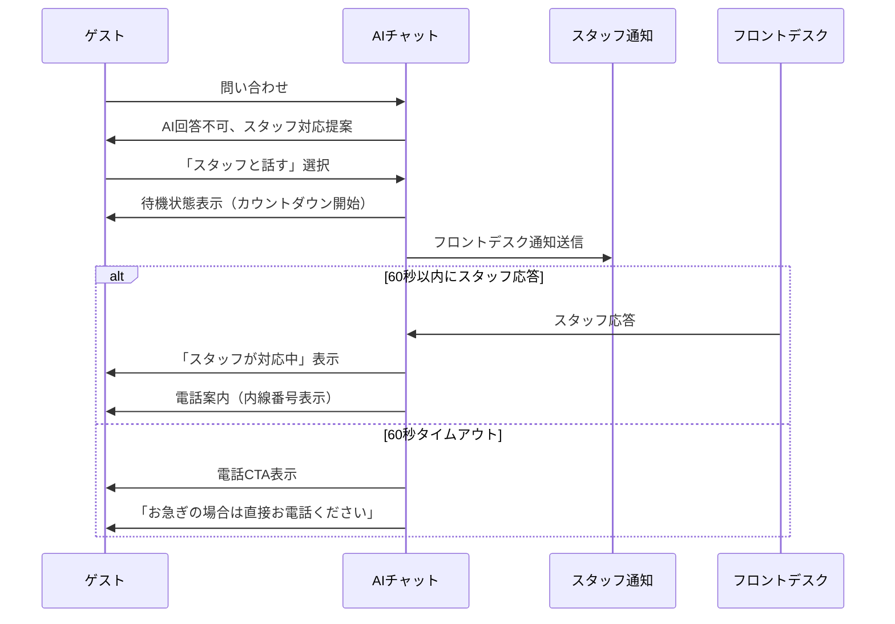

# 有人ハンドオフ機能設計書

## ゲスト側ユーザーフロー



### 詳細ステップ
1. **ハンドオフ提案**: AIが回答困難と判断時、「スタッフにおつなぎしますか？」を表示
2. **待機状態**: 「スタッフに確認中です...」メッセージ + 60秒カウントダウン
3. **応答時**: 「フロントスタッフが対応いたします。お電話（内線○○）でお話しください」
4. **タイムアウト時**: 電話ボタン + 「申し訳ございません。フロントデスク（内線○○）まで直接お電話ください」

## スタッフ側ユーザーフロー

1. **通知受信**: フロントデスクPC/タブレットにポップアップ通知
2. **内容確認**: ゲスト情報（部屋番号、氏名）+ 問い合わせ履歴を表示
3. **応答選択**: 
   - 「対応中」ボタン → ゲスト側に電話案内表示
   - 「後で対応」ボタン → 通知を5分後に再表示
   - 無応答 → 60秒でタイムアウト

## エラーハンドリング

| エラーケース | 対処方法 | ユーザーへの表示 |
|--------------|----------|------------------|
| 通知送信失敗 | 即座に電話CTAを表示 | 「申し訳ございません。フロントデスク（内線○○）まで直接お電話ください」 |
| スタッフ端末オフライン | 30秒でタイムアウト短縮 | 「スタッフが離席中のようです。お急ぎの場合は直接お電話ください」 |
| システム障害 | フォールバック画面 | 「システムに一時的な問題が発生しています。フロントデスクまでお越しください」 |
| 深夜時間帯 | 自動的に電話CTA表示 | 「深夜のため、緊急時は内線○○までお電話ください」 |

## 運用設計

### 夜間対応（23:00-07:00）
- ハンドオフ機能を自動無効化
- 「夜間のため、緊急時のみフロントデスクまでお電話ください」を表示
- 非緊急の問い合わせは「朝7時以降に改めてご利用ください」

### 繁忙期対応
- チェックイン/アウト時間帯（14:00-16:00, 10:00-12:00）はタイムアウトを30秒に短縮
- 「混雑のため、お電話での対応が早い場合がございます」メッセージ追加

### 障害時対応
- API応答2秒以内なし → フォールバック画面
- 通知履歴をログ保存（対応漏れ防止）
- 管理画面で未対応ハンドオフ一覧表示

## UI/UX要件

### 必須画面一覧

**ゲスト側（hotel-saas）**
1. ハンドオフ提案画面（チャット内）
2. 待機状態画面（カウントダウン付き）
3. 電話CTA画面（内線番号強調表示）
4. エラー時フォールバック画面

**スタッフ側（新規開発必要）**
1. 通知ポップアップ
2. ゲスト情報・履歴表示モーダル
3. 管理画面（未対応一覧）

### 多言語対応
- 日本語、英語、中国語（簡体字）、韓国語
- 内線番号は数字のため言語問わず統一
- エラーメッセージも多言語化

### アクセシビリティ
- **音声読み上げ**: 待機状態とタイムアウトをaria-liveで通知
- **キーボード操作**: 電話ボタンにフォーカス可能
- **色覚対応**: 緑（応答中）、赤（エラー）以外にアイコンも併用
- **文字サイズ**: 内線番号は大きめフォント（24px以上）
- **コントラスト**: WCAG AA準拠（4.5:1以上）

### 技術実装ポイント
```javascript
// handleHandoff() 実装例
async handleHandoff(channel = 'front_desk') {
  this.handoffState = 'waiting';
  this.countdown = 60;
  
  try {
    const response = await this.$api.requestHandoff({
      channel,
      guestInfo: this.guestInfo,
      chatHistory: this.messages
    });
    
    this.startCountdown();
    
  } catch (error) {
    this.showFallbackCTA();
  }
}
```