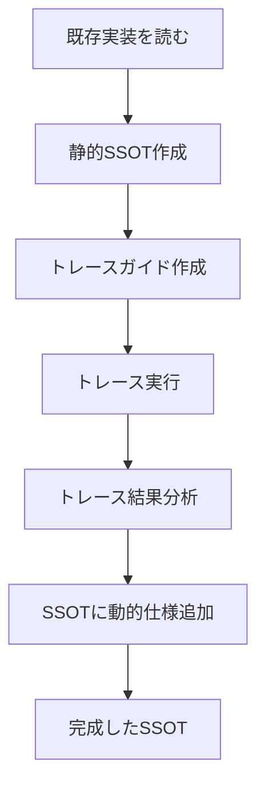
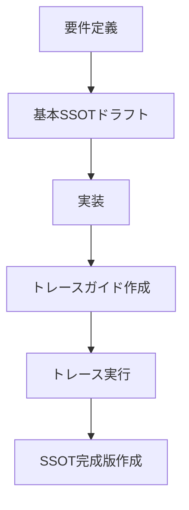

# 📐 SSOT作成ワークフロー - トレースガイド vs SSOT、どちらを先に？

**作成日**: 2025年10月2日  
**質問**: トレースガイドの作成とSSOTの作成はどちらを先にしたらいいの？  
**結論**: **状況に応じて2つのアプローチがあります**

---

## 🎯 結論：2つのアプローチ

### アプローチA: 「既存機能の改善」
```
1. SSOT作成（静的仕様）
2. トレースガイド作成
3. トレース実行
4. SSOTに反映（動的仕様追加）
```
**適用**: ダッシュボード、注文管理など**既に実装済みの機能**

---

### アプローチB: 「新規機能の開発」
```
1. 基本SSOTドラフト作成（API設計のみ）
2. 実装
3. トレースガイド作成
4. トレース実行
5. SSOT完成版作成（実測ベース）
```
**適用**: これから開発する**新規機能**

---

## 📊 詳細比較

### アプローチA: 既存機能の改善（推奨：ダッシュボード等）

#### ワークフロー



#### Step 1: 静的SSOT作成（2-4時間）

**内容**:
- API仕様
- 画面構成
- データベーススキーマ
- 実装チェックリスト

**方法**:
```bash
# 既存実装を読む
cat /Users/kaneko/hotel-saas/pages/admin/index.vue
cat /Users/kaneko/hotel-common/src/routes/systems/saas/admin-dashboard.routes.ts

# SSOT作成
vi /Users/kaneko/hotel-kanri/docs/03_ssot/01_core_features/SSOT_SAAS_DASHBOARD.md
```

**成果物**: 静的な仕様書（推測ベース）

---

#### Step 2: トレースガイド作成（30分）

**内容**:
- トレースログ追加箇所の特定
- サンプルコードの作成
- 実行手順の明記

**方法**:
```bash
# テンプレートをコピー
cp /Users/kaneko/hotel-kanri/docs/implementation/DASHBOARD_TRACE_GUIDE.md \
   /Users/kaneko/hotel-kanri/docs/implementation/[機能名]_TRACE_GUIDE.md

# 機能に合わせてカスタマイズ
```

**成果物**: トレース実装ガイド

---

#### Step 3: トレース実行（30分）

**内容**:
- ログコード追加
- トレース記録
- ログ統合

**方法**:
```bash
# クイックスタートガイドに従う
cat /Users/kaneko/hotel-kanri/docs/implementation/TRACE_QUICK_START.md
```

**成果物**: 時系列トレースログ

---

#### Step 4: SSOTに反映（1-2時間）

**追加内容**:
- 実測フロー
- パフォーマンス分析
- ボトルネック特定
- 最適化提案

**成果物**: **完成版SSOT（実測ベース）**

---

### アプローチB: 新規機能の開発

#### ワークフロー



#### Step 1: 基本SSOTドラフト（1時間）

**内容**（最小限）:
- API設計（エンドポイント・リクエスト・レスポンス）
- データベーススキーマ
- 基本フロー（推測）

**目的**: 実装の指針を提供

---

#### Step 2: 実装（X時間）

基本SSOTに従って実装

---

#### Step 3: トレースガイド作成（30分）

---

#### Step 4: トレース実行（30分）

---

#### Step 5: SSOT完成版作成（2-3時間）

**追加内容**:
- 実測フロー（推測ではなく実測）
- 実際の変数変化
- パフォーマンス分析
- 問題点・落とし穴

**成果物**: **完成版SSOT（実測ベース）**

---

## 🎯 どちらを使うべきか？

### ケース1: ダッシュボード機能（今回）

**状況**: 既に実装済み

**推奨**: **アプローチA**

**理由**:
1. 既に実装があるので、それを読んでSSOT作成可能
2. 静的SSOTを先に作成することで、機能の全体像を把握できる
3. トレースで実測値を追加し、SSOTの完成度を向上

**実際のフロー**:
```
✅ 既存実装読む → 静的SSOT作成（完了）
⏳ トレースガイド作成（完了）
⏳ トレース実行
⏳ SSOTに動的仕様追加
```

---

### ケース2: 新規AI機能開発

**状況**: まだ実装がない

**推奨**: **アプローチB**

**理由**:
1. 実装がないので、詳細なSSOTは作れない
2. 基本SSOTドラフトで設計方針を決める
3. 実装後にトレースで実測し、完成版SSOTを作成

**実際のフロー**:
```
⏳ 基本SSOTドラフト（API設計のみ）
⏳ 実装
⏳ トレースガイド作成
⏳ トレース実行
⏳ SSOT完成版作成（実測ベース）
```

---

## 📋 今後の標準ワークフロー

### 既存機能のSSO作成（推奨ワークフロー）

#### Phase 0-3: 情報収集（SSOT_CREATION_RULES.md参照）
- [ ] 既存SSOT読み込み
- [ ] 既存ドキュメント読み込み
- [ ] 実装ファイル読み込み
- [ ] 差異分析

#### Phase 4: 静的SSOT作成
- [ ] API仕様
- [ ] 画面構成
- [ ] データベーススキーマ
- [ ] 基本フロー（推測ベース）
- [ ] 実装チェックリスト

#### Phase 5: トレースガイド作成
- [ ] トレース箇所特定
- [ ] サンプルコード作成
- [ ] 実行手順明記

#### Phase 6: トレース実行
- [ ] ログコード追加
- [ ] トレース記録
- [ ] ログ統合

#### Phase 7: SSOTに動的仕様追加
- [ ] 実測フロー追加
- [ ] パフォーマンス分析追加
- [ ] ボトルネック特定
- [ ] 最適化提案追加

#### Phase 8: 最終チェック
- [ ] 実測ベースのSSOT完成
- [ ] 問題点・落とし穴明記
- [ ] レビュー

---

### 新規機能のSSO作成（推奨ワークフロー）

#### Phase 1: 基本SSOTドラフト
- [ ] API設計（最小限）
- [ ] データベーススキーマ
- [ ] 基本フロー（推測）

#### Phase 2: 実装
- [ ] 基本SSOTに従って実装

#### Phase 3: トレースガイド作成
- [ ] トレース箇所特定
- [ ] サンプルコード作成

#### Phase 4: トレース実行
- [ ] トレース記録
- [ ] ログ統合

#### Phase 5: SSOT完成版作成
- [ ] 実測フロー
- [ ] パフォーマンス分析
- [ ] 問題点・落とし穴
- [ ] 最適化提案

---

## 💡 重要なポイント

### 1. 静的SSOT vs 動的SSOT

**静的SSOT（Phase 4まで）**:
- API仕様
- 画面構成
- データベーススキーマ
- 基本フロー（推測ベース）

**動的SSOT（Phase 7追加後）**:
- 上記すべて
- **実測フロー**（推測ではなく実測）
- **パフォーマンス分析**
- **ボトルネック特定**
- **最適化提案**

### 2. トレースの価値

トレースなしのSSO**（推測ベース）**:
```markdown
## 処理フロー

1. ブラウザがAPIを呼び出す
2. hotel-saasがhotel-commonに中継する
3. hotel-commonがDBにクエリする
4. 結果を返す

（所要時間不明、ボトルネック不明）
```

トレースありのSSO**（実測ベース）**:
```markdown
## 処理フロー（実行トレース結果）

**実測値**:
- T+0ms: ブラウザがAPIを呼び出す
- T+10ms: hotel-saasがhotel-commonに中継（10ms）
- T+20ms: hotel-commonがDBにクエリ（10ms）
- T+55ms: DBクエリ完了（35ms ← ボトルネック）
- T+65ms: 結果を返す（10ms）

**合計**: 65ms
**ボトルネック**: PostgreSQLクエリ（35ms）
**最適化**: インデックス追加で20msに短縮可能
```

### 3. SSOTの進化

```
基本SSOTドラフト（推測）
  ↓
静的SSOT（実装ベース）
  ↓
動的SSOT（実測ベース） ← 最終目標
```

---

## 🎯 まとめ

### 質問: トレースガイドとSSOT、どちらを先に？

**回答**:

#### 既存機能の場合（ダッシュボード等）
```
SSOT（静的） → トレースガイド → トレース実行 → SSOT（動的）
```

#### 新規機能の場合
```
SSOTドラフト → 実装 → トレースガイド → トレース実行 → SSOT完成版
```

### 最終目標

**実測ベースの動的SSOT** = 最高品質のSSO

- ✅ 推測ではなく実測
- ✅ パフォーマンス分析
- ✅ ボトルネック特定
- ✅ 最適化の方向性明確

---

**最終更新**: 2025年10月2日  
**作成者**: AI Assistant (Luna)  
**ステータス**: 完成

