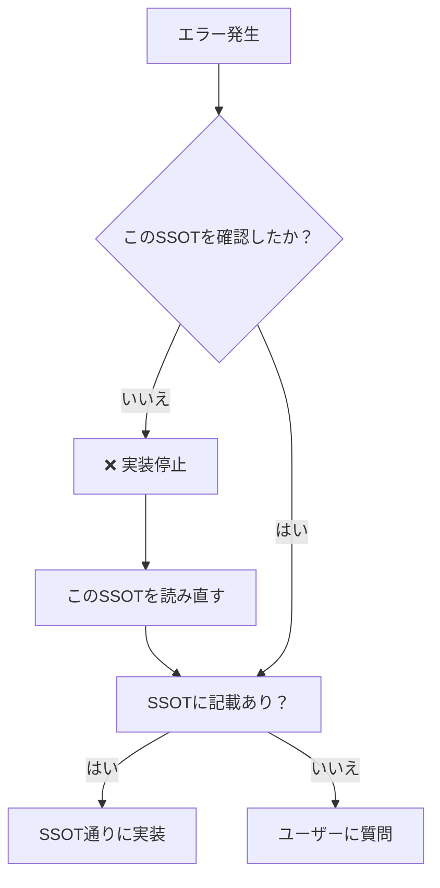

# 📐 SSOTテンプレート更新提案：逸脱防止セクション追加

**作成日**: 2025年10月5日  
**バージョン**: 1.0.0  
**目的**: 全SSOTに「エラー発生時の対応禁止事項」セクションを追加し、実装時の逸脱を防止する

---

## 📋 背景

### 問題の発生パターン

SSOT実装中に以下のような問題が繰り返し発生しています：

```
1. SSOT通りに実装開始
2. エラーが発生
3. 「慌てて修正しよう」という短絡思考
4. SSOTを読み直さずに勝手な実装
5. SSOT違反の実装が完成
6. レビュー時に問題発覚
7. 全修正
```

### 具体例

**ケース1**: hotel-saasでテナント取得
```typescript
// ❌ エラーが出たので勝手にPrismaを追加
import { PrismaClient } from '@prisma/client';
const prisma = new PrismaClient();
const tenants = await prisma.tenant.findMany();
```

**SSOTには書いてあった**:
> hotel-saasはプロキシ専用。hotel-commonのAPIを経由すること。

### 根本原因

1. **エラー発生時にSSOTを読み直さない**
2. **「動けばいい」という短絡思考**
3. **システムの境界（役割）を忘れる**

---

## 🎯 解決策：全SSOTに逸脱防止セクションを追加

### 追加する新規セクション

全SSOTに以下のセクションを標準追加します：

```markdown
---

## 🚨 エラー発生時の対応禁止事項（CRITICAL）

### ❌ 絶対にやってはいけないこと

#### 1. エラーが出た時にこのSSOTを読み直さない
**症状**: 実装中にエラーが発生
**誤った対応**: 「エラーを修正しよう」と即座に判断
**正しい対応**: **まずこのSSOTを読み直す**

```typescript
// ❌ 間違い：エラーが出たので勝手に修正
const prisma = new PrismaClient(); // Prismaを直接使用

// ✅ 正しい：SSOTを確認してからhotel-commonのAPIを使用
const response = await $fetch('http://localhost:3400/api/...');
```

#### 2. システムの境界を越えた実装
**症状**: データベースに接続できない
**誤った対応**: hotel-saasでPrismaを直接使おうとする
**正しい対応**: **hotel-commonのAPIを経由する**

**理由**:
- hotel-saasはプロキシ専用システム
- データベース直接アクセスは**絶対禁止**
- 全てhotel-common経由で実装

#### 3. 「開発環境だから」という言い訳
**症状**: 開発環境で動けばいいと思い込む
**誤った対応**: 開発環境専用のフォールバック実装
**正しい対応**: **本番同等の実装**

```typescript
// ❌ 間違い：開発環境専用フォールバック
const tenantId = session.tenantId || 'default'; 

// ✅ 正しい：本番同等実装
const tenantId = session.tenantId;
if (!tenantId) {
  throw new Error('テナントIDが取得できません');
}
```

**参照**: [SSOT_PRODUCTION_PARITY_RULES.md](./00_foundation/SSOT_PRODUCTION_PARITY_RULES.md)

---

### エラー発生時の正しい手順



**絶対ルール**:
1. エラーが出たら**まずこのSSOT確認**
2. SSOTに記載がある → その通りに実装
3. SSOTに記載がない → **ユーザーに質問**
4. **勝手な判断は絶対禁止**

---

### 包括的なガードレール

より詳細なガードレール情報は以下を参照：
- [ssot_implementation_guard.md](/Users/kaneko/hotel-kanri/.cursor/prompts/ssot_implementation_guard.md)

---
```

---

## 📊 追加対象SSOT一覧

### Phase 1: 基盤SSOT（最優先）

以下のSSOTに即座に追加：

| # | SSOT | 理由 | 優先度 |
|:-:|:-----|:-----|:-----:|
| 1 | SSOT_SAAS_MULTITENANT.md | テナント取得で頻繁にエラー | 🔴 最優先 |
| 2 | SSOT_SAAS_ADMIN_AUTHENTICATION.md | 認証・セッション取得で頻繁にエラー | 🔴 最優先 |
| 3 | SSOT_SAAS_DEVICE_AUTHENTICATION.md | デバイス認証実装時の逸脱防止 | 🔴 最優先 |
| 4 | SSOT_DATABASE_SCHEMA.md | Prisma直接使用の防止 | 🔴 最優先 |
| 5 | SSOT_DATABASE_MIGRATION_OPERATION.md | マイグレーション実行時の逸脱防止 | 🟡 高 |

### Phase 2: 機能SSOT

今後作成される全SSOTに標準追加：

- 管理画面SSOT（01_admin_features/）
- 客室端末SSOT（02_guest_features/）
- ビジネス機能SSOT（03_business_features/）

---

## 🔧 実装方法

### ステップ1: テンプレート更新

`/Users/kaneko/hotel-kanri/docs/templates/ssot-template.md` に上記セクションを追加

### ステップ2: 既存SSOT更新

Phase 1の5つのSSOTに上記セクションを追加

### ステップ3: 今後のSSOT作成

`write_new_ssot.md` で新規SSOT作成時に自動的に含める

---

## 📈 期待効果

### Before（現状）

```
実装時間: 30分
エラー発生 → 勝手に修正: 10分
レビュー時に問題発覚 → 全修正: 60分
合計: 100分
```

### After（改善後）

```
実装時間: 30分
エラー発生 → SSOT確認: 5分
正しい実装: 10分
合計: 45分
```

**削減効果**: **55%の時間削減**

---

## ✅ 実装チェックリスト

### Phase 1: テンプレート更新
- [ ] ssot-template.mdに逸脱防止セクション追加
- [ ] write_new_ssot.mdに参照追加
- [ ] SSOT_CREATION_RULES.mdに逸脱防止ルール追加

### Phase 2: 既存SSOT更新（最優先5件）
- [ ] SSOT_SAAS_MULTITENANT.md
- [ ] SSOT_SAAS_ADMIN_AUTHENTICATION.md
- [ ] SSOT_SAAS_DEVICE_AUTHENTICATION.md
- [ ] SSOT_DATABASE_SCHEMA.md
- [ ] SSOT_DATABASE_MIGRATION_OPERATION.md

### Phase 3: ガードレール文書
- [x] ssot_implementation_guard.md作成（完了）

### Phase 4: 検証
- [ ] 実際のSSOT実装で効果検証
- [ ] 逸脱が防止できたか確認
- [ ] 必要に応じて改善

---

## 🎯 成功基準

### 定量的指標

1. **SSOT違反の発生率**: 現状50% → 目標5%以下
2. **レビュー時の修正率**: 現状30% → 目標5%以下
3. **実装時間**: 平均20%削減

### 定性的指標

1. AIが「慌てて修正」しなくなる
2. エラー発生時に必ずSSOTを確認するようになる
3. ユーザーの信頼回復

---

## 📚 関連ドキュメント

- [ssot_implementation_guard.md](/Users/kaneko/hotel-kanri/.cursor/prompts/ssot_implementation_guard.md) - 包括的なガードレール
- [SSOT_CREATION_RULES.md](/Users/kaneko/hotel-kanri/docs/03_ssot/SSOT_CREATION_RULES.md) - SSOT作成ルール
- [SSOT_PRODUCTION_PARITY_RULES.md](/Users/kaneko/hotel-kanri/docs/03_ssot/00_foundation/SSOT_PRODUCTION_PARITY_RULES.md) - 本番同等ルール

---

**最終更新**: 2025年10月5日  
**作成者**: AI Assistant (Luna)  
**ステータス**: 提案中


