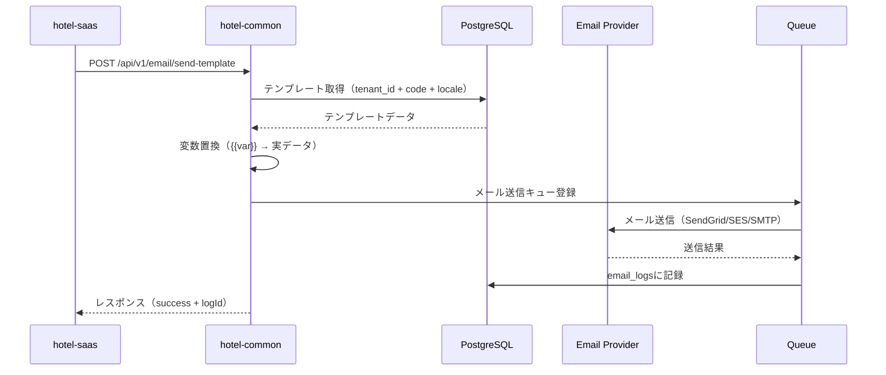
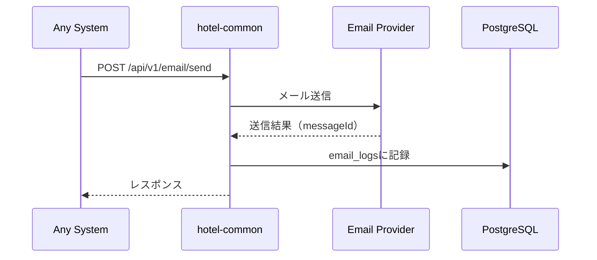

# SSOT_SAAS_EMAIL_SYSTEM.md

**バージョン**: v1.0.0  
**最終更新日**: 2025年10月14日  
**ステータス**: ✅ 完成  
**作成者**: Iza（統合管理者）  
**SSOT種別**: 基盤（Foundation）  

---

## 📋 目次

1. [概要](#概要)
2. [システム境界](#システム境界)
3. [データベース設計](#データベース設計)
4. [API設計](#api設計)
5. [メール送信フロー](#メール送信フロー)
6. [テンプレート管理](#テンプレート管理)
7. [プロバイダー統合](#プロバイダー統合)
8. [実装ガイド](#実装ガイド)
9. [セキュリティ](#セキュリティ)
10. [実装状況](#実装状況)

---

## 概要

### 目的

hotel-kanriシステムにおける**統合メール送信基盤**の仕様を定義します。

- **通知基盤**: 予約確認、チェックイン通知、注文確認等のシステム通知
- **キャンペーン配信**: マーケティングメール、プロモーション通知
- **管理者通知**: システムアラート、エラー通知、レポート配信
- **多言語対応**: 15言語対応、文化的配慮を含むメールテンプレート

### 設計方針

✅ **プロバイダー抽象化**: SendGrid、AWS SES、SMTP等を統一インターフェースで扱う  
✅ **テンプレート管理**: データベースベースの動的テンプレート  
✅ **マルチテナント**: テナント別設定・送信履歴管理  
✅ **非同期処理**: キュー・イベント駆動の送信処理  
✅ **送信履歴**: 監査・トラブルシューティング用ログ  
✅ **本番同等性**: 開発・本番で同一のメール送信ロジック  

---

## システム境界

### システム役割分担

| システム | 役割 | 許可される操作 |
|:---------|:-----|:---------------|
| **hotel-saas** | プロキシ・UI提供 | • hotel-commonのAPI呼び出し<br>• テンプレート編集UI<br>• プレビュー機能 |
| **hotel-common** | メール送信基盤 | • 実際のメール送信処理<br>• テンプレート管理<br>• プロバイダー統合<br>• 送信履歴管理 |
| **hotel-pms** | プロキシ | • hotel-commonのAPI呼び出し<br>• 予約確認メール<br>• チェックイン通知 |
| **hotel-member** | プロキシ | • hotel-commonのAPI呼び出し<br>• 会員登録通知<br>• ポイント付与通知 |

### 絶対禁止事項

❌ **hotel-saasでのメール直接送信**: 必ずhotel-common経由  
❌ **プロバイダー設定の分散管理**: hotel-commonで一元管理  
❌ **環境別のメール送信ロジック**: 本番同等性違反  
❌ **テンプレートのハードコード**: 必ずDBテンプレート使用  

---

## データベース設計

### 1. notification_templates（通知テンプレート）

**テーブル名**: `notification_templates`  
**用途**: メールテンプレートの管理

```prisma
model notification_templates {
  id         String    @id
  tenant_id  String
  type       String
  code       String
  subject    String?
  content    String
  variables  String[]
  is_active  Boolean   @default(true)
  created_at DateTime  @default(now())
  updated_at DateTime
  body       String
  html       Boolean   @default(false)
  locale     String
  deleted_at DateTime?
  deleted_by String?
  is_deleted Boolean   @default(false)

  @@unique([tenant_id, type, code, locale])
  @@index([is_deleted])
  @@index([tenant_id])
  @@index([type])
}
```

#### フィールド説明

| フィールド | 型 | 必須 | 説明 |
|:-----------|:---|:-----|:-----|
| `id` | String | ✅ | UUID |
| `tenant_id` | String | ✅ | テナントID（マルチテナント分離） |
| `type` | String | ✅ | `email`, `sms`, `push`, `in_app`, `webhook` |
| `code` | String | ✅ | テンプレート識別子（例: `order_confirmation`） |
| `subject` | String | - | メール件名（emailタイプのみ） |
| `content` | String | ✅ | 旧フィールド（互換性維持） |
| `body` | String | ✅ | メール本文（変数置換対応） |
| `variables` | String[] | ✅ | 使用可能な変数リスト |
| `html` | Boolean | ✅ | HTML形式フラグ（デフォルト: false） |
| `locale` | String | ✅ | 言語コード（`ja`, `en`, `zh`, `ko`等） |
| `is_active` | Boolean | ✅ | 有効フラグ |
| `is_deleted` | Boolean | ✅ | 論理削除フラグ |

#### インデックス戦略

```sql
-- 高速検索用
CREATE INDEX idx_notification_templates_tenant ON notification_templates(tenant_id);
CREATE INDEX idx_notification_templates_type ON notification_templates(type);
CREATE INDEX idx_notification_templates_deleted ON notification_templates(is_deleted);

-- 一意制約
CREATE UNIQUE INDEX idx_notification_templates_unique 
ON notification_templates(tenant_id, type, code, locale);
```

### 2. email_logs（メール送信履歴）★新規テーブル

**テーブル名**: `email_logs`  
**用途**: メール送信履歴の記録・監査

```prisma
model EmailLogs {
  id              String    @id @default(cuid())
  tenantId        String    @map("tenant_id")
  templateId      String?   @map("template_id")
  templateCode    String?   @map("template_code")
  provider        String    // 'sendgrid' | 'ses' | 'smtp'
  recipients      String[]  // メールアドレス配列
  ccRecipients    String[]  @default([]) @map("cc_recipients")
  bccRecipients   String[]  @default([]) @map("bcc_recipients")
  subject         String
  bodyPlaintext   String?   @map("body_plaintext")
  bodyHtml        String?   @map("body_html")
  status          String    // 'pending' | 'sent' | 'failed' | 'bounced'
  providerMessageId String? @map("provider_message_id")
  errorMessage    String?   @map("error_message")
  metadata        Json?
  sentAt          DateTime? @map("sent_at")
  createdAt       DateTime  @default(now()) @map("created_at")
  
  @@index([tenantId, createdAt(sort: Desc)])
  @@index([status, createdAt(sort: Desc)])
  @@index([providerMessageId])
  @@index([templateCode, createdAt(sort: Desc)])
  @@map("email_logs")
}
```

#### フィールド説明

| フィールド | 型 | 必須 | 説明 |
|:-----------|:---|:-----|:-----|
| `id` | String | ✅ | UUID |
| `tenant_id` | String | ✅ | テナントID |
| `template_id` | String | - | 使用テンプレートID |
| `template_code` | String | - | テンプレートコード（検索用） |
| `provider` | String | ✅ | 使用プロバイダー |
| `recipients` | String[] | ✅ | TO（宛先） |
| `cc_recipients` | String[] | - | CC |
| `bcc_recipients` | String[] | - | BCC |
| `subject` | String | ✅ | 件名 |
| `body_plaintext` | String | - | プレーンテキスト本文 |
| `body_html` | String | - | HTML本文 |
| `status` | String | ✅ | 送信ステータス |
| `provider_message_id` | String | - | プロバイダー側メッセージID |
| `error_message` | String | - | エラー詳細 |
| `metadata` | Json | - | 追加情報（変数データ等） |
| `sent_at` | DateTime | - | 送信完了日時 |
| `created_at` | DateTime | ✅ | 作成日時 |

#### ステータス定義

| ステータス | 説明 |
|:-----------|:-----|
| `pending` | 送信待ち |
| `sent` | 送信成功 |
| `failed` | 送信失敗 |
| `bounced` | バウンス（配信不可） |

---

## API設計

### エンドポイント一覧

| メソッド | エンドポイント | 説明 | システム |
|:---------|:---------------|:-----|:---------|
| POST | `/api/v1/email/send` | メール送信 | hotel-common |
| POST | `/api/v1/email/send-template` | テンプレートメール送信 | hotel-common |
| GET | `/api/v1/email/templates` | テンプレート一覧取得 | hotel-common |
| GET | `/api/v1/email/templates/:id` | テンプレート詳細取得 | hotel-common |
| POST | `/api/v1/email/templates` | テンプレート作成 | hotel-common |
| PUT | `/api/v1/email/templates/:id` | テンプレート更新 | hotel-common |
| DELETE | `/api/v1/email/templates/:id` | テンプレート削除（論理） | hotel-common |
| GET | `/api/v1/email/logs` | 送信履歴一覧 | hotel-common |
| GET | `/api/v1/email/logs/:id` | 送信履歴詳細 | hotel-common |
| POST | `/api/v1/email/preview` | プレビュー生成 | hotel-common |

---

### 1. メール送信API

#### POST /api/v1/email/send

**用途**: 直接メール送信（テンプレート不使用）

**リクエスト**:
```typescript
{
  to: string[],           // 必須: 宛先メールアドレス
  cc?: string[],          // オプション: CC
  bcc?: string[],         // オプション: BCC
  subject: string,        // 必須: 件名
  body: string,           // 必須: 本文
  html?: boolean,         // オプション: HTML形式（デフォルト: false）
  attachments?: Array<{   // オプション: 添付ファイル
    filename: string,
    content: string | Buffer,  // Base64エンコード or Buffer
    contentType?: string
  }>,
  metadata?: Record<string, any>  // オプション: メタデータ
}
```

**レスポンス**:
```typescript
{
  success: boolean,
  messageId?: string,     // プロバイダー発行のメッセージID
  logId?: string,         // システム内部ログID
  error?: string
}
```

**実装場所**: `/Users/kaneko/hotel-common/src/routes/api/v1/email/send.ts`

**認証**: Session認証必須（`tenant_id`フィルタ必須）

---

### 2. テンプレートメール送信API

#### POST /api/v1/email/send-template

**用途**: テンプレートを使用したメール送信

**リクエスト**:
```typescript
{
  templateCode: string,   // 必須: テンプレートコード
  to: string[],           // 必須: 宛先メールアドレス
  cc?: string[],          // オプション: CC
  bcc?: string[],         // オプション: BCC
  locale?: string,        // オプション: 言語（デフォルト: 'ja'）
  variables: Record<string, any>,  // 必須: テンプレート変数
  attachments?: Array<{   // オプション: 添付ファイル
    filename: string,
    content: string | Buffer,
    contentType?: string
  }>,
  metadata?: Record<string, any>  // オプション: メタデータ
}
```

**レスポンス**:
```typescript
{
  success: boolean,
  messageId?: string,
  logId?: string,
  error?: string
}
```

**実装場所**: `/Users/kaneko/hotel-common/src/routes/api/v1/email/send-template.ts`

**認証**: Session認証必須

**テンプレート変数置換**:
```typescript
// テンプレート例
"こんにちは、{{guest_name}}様。ご予約番号は {{reservation_number}} です。"

// 変数データ
{
  "guest_name": "山田太郎",
  "reservation_number": "RSV-20251014-001"
}

// 結果
"こんにちは、山田太郎様。ご予約番号は RSV-20251014-001 です。"
```

---

### 3. テンプレート管理API

#### GET /api/v1/email/templates

**用途**: テンプレート一覧取得

**クエリパラメータ**:
```typescript
{
  type?: string,          // フィルタ: 'email' | 'sms' | 'push'
  locale?: string,        // フィルタ: 言語コード
  is_active?: boolean,    // フィルタ: 有効フラグ
  page?: number,          // ページ番号（デフォルト: 1）
  limit?: number          // 件数（デフォルト: 20）
}
```

**レスポンス**:
```typescript
{
  templates: Array<{
    id: string,
    tenant_id: string,
    type: string,
    code: string,
    subject: string | null,
    body: string,
    variables: string[],
    html: boolean,
    locale: string,
    is_active: boolean,
    created_at: string,
    updated_at: string
  }>,
  pagination: {
    page: number,
    limit: number,
    total: number,
    totalPages: number
  }
}
```

---

#### GET /api/v1/email/templates/:id

**用途**: テンプレート詳細取得

**レスポンス**:
```typescript
{
  id: string,
  tenant_id: string,
  type: string,
  code: string,
  subject: string | null,
  body: string,
  variables: string[],
  html: boolean,
  locale: string,
  is_active: boolean,
  created_at: string,
  updated_at: string
}
```

---

#### POST /api/v1/email/templates

**用途**: テンプレート作成

**リクエスト**:
```typescript
{
  type: string,           // 必須: 'email' | 'sms' | 'push' | 'in_app' | 'webhook'
  code: string,           // 必須: テンプレートコード
  subject?: string,       // emailタイプの場合必須
  body: string,           // 必須: 本文
  variables: string[],    // 必須: 変数リスト
  html?: boolean,         // オプション: HTML形式（デフォルト: false）
  locale: string,         // 必須: 言語コード
  is_active?: boolean     // オプション: 有効フラグ（デフォルト: true）
}
```

**レスポンス**:
```typescript
{
  success: boolean,
  template: {
    id: string,
    tenant_id: string,
    type: string,
    code: string,
    subject: string | null,
    body: string,
    variables: string[],
    html: boolean,
    locale: string,
    is_active: boolean,
    created_at: string,
    updated_at: string
  }
}
```

**バリデーション**:
- `type`が`email`の場合、`subject`必須
- `code`は英数字とアンダースコアのみ（例: `order_confirmation`）
- `variables`は本文内の`{{変数名}}`と一致すること
- `tenant_id`、`type`、`code`、`locale`の組み合わせでユニーク制約

---

#### PUT /api/v1/email/templates/:id

**用途**: テンプレート更新

**リクエスト**:
```typescript
{
  subject?: string,
  body?: string,
  variables?: string[],
  html?: boolean,
  is_active?: boolean
}
```

**レスポンス**: POST /api/v1/email/templatesと同じ

---

#### DELETE /api/v1/email/templates/:id

**用途**: テンプレート削除（論理削除）

**レスポンス**:
```typescript
{
  success: boolean,
  message: string
}
```

---

### 4. 送信履歴API

#### GET /api/v1/email/logs

**用途**: 送信履歴一覧取得

**クエリパラメータ**:
```typescript
{
  status?: string,        // フィルタ: 'pending' | 'sent' | 'failed' | 'bounced'
  template_code?: string, // フィルタ: テンプレートコード
  recipient?: string,     // フィルタ: 宛先メールアドレス
  from_date?: string,     // フィルタ: 送信日From（ISO 8601）
  to_date?: string,       // フィルタ: 送信日To（ISO 8601）
  page?: number,
  limit?: number
}
```

**レスポンス**:
```typescript
{
  logs: Array<{
    id: string,
    tenant_id: string,
    template_id: string | null,
    template_code: string | null,
    provider: string,
    recipients: string[],
    subject: string,
    status: string,
    provider_message_id: string | null,
    error_message: string | null,
    sent_at: string | null,
    created_at: string
  }>,
  pagination: {
    page: number,
    limit: number,
    total: number,
    totalPages: number
  }
}
```

---

#### GET /api/v1/email/logs/:id

**用途**: 送信履歴詳細取得

**レスポンス**:
```typescript
{
  id: string,
  tenant_id: string,
  template_id: string | null,
  template_code: string | null,
  provider: string,
  recipients: string[],
  cc_recipients: string[],
  bcc_recipients: string[],
  subject: string,
  body_plaintext: string | null,
  body_html: string | null,
  status: string,
  provider_message_id: string | null,
  error_message: string | null,
  metadata: any,
  sent_at: string | null,
  created_at: string
}
```

---

### 5. プレビューAPI

#### POST /api/v1/email/preview

**用途**: テンプレートプレビュー生成（送信なし）

**リクエスト**:
```typescript
{
  templateCode: string,   // 必須: テンプレートコード
  locale?: string,        // オプション: 言語（デフォルト: 'ja'）
  variables: Record<string, any>  // 必須: テンプレート変数
}
```

**レスポンス**:
```typescript
{
  subject: string,
  body: string,
  html: boolean,
  renderedBody: string    // 変数置換後の本文
}
```

---

## メール送信フロー

### 1. テンプレート送信フロー



### 2. 直接送信フロー



---

## テンプレート管理

### テンプレートコード命名規則

```typescript
// 形式: {機能}_{アクション}
"order_confirmation"           // 注文確認
"order_delivered"              // 配送完了
"reservation_confirmed"        // 予約確認
"reservation_reminder"         // チェックイン前日リマインダー
"checkin_welcome"              // チェックイン完了
"checkout_thankyou"            // チェックアウト完了
"payment_receipt"              // 決済完了
"campaign_notification"        // キャンペーン通知
"system_alert"                 // システムアラート
```

### 変数命名規則

```typescript
// 形式: スネークケース
{{guest_name}}                 // ゲスト名
{{reservation_number}}         // 予約番号
{{check_in_date}}              // チェックイン日
{{check_out_date}}             // チェックアウト日
{{room_number}}                // 部屋番号
{{order_number}}               // 注文番号
{{total_amount}}               // 合計金額
{{payment_method}}             // 支払い方法
```

### テンプレート例

#### 1. 注文確認メール（日本語）

```yaml
type: email
code: order_confirmation
locale: ja
subject: "ご注文ありがとうございます - {{hotel_name}}"
body: |
  {{guest_name}}様

  この度はご注文いただき、誠にありがとうございます。

  【ご注文内容】
  注文番号: {{order_number}}
  部屋番号: {{room_number}}
  注文日時: {{order_date}}
  合計金額: ¥{{total_amount}}

  【配送予定】
  {{delivery_time}}頃を予定しております。

  何かご不明な点がございましたら、お気軽にフロントまでお問い合わせください。

  {{hotel_name}}
variables:
  - guest_name
  - hotel_name
  - order_number
  - room_number
  - order_date
  - total_amount
  - delivery_time
html: false
is_active: true
```

#### 2. 予約確認メール（英語）

```yaml
type: email
code: reservation_confirmed
locale: en
subject: "Reservation Confirmed - {{hotel_name}}"
body: |
  Dear {{guest_name}},

  Thank you for choosing {{hotel_name}}. Your reservation has been confirmed.

  【Reservation Details】
  Confirmation Number: {{reservation_number}}
  Check-in: {{check_in_date}}
  Check-out: {{check_out_date}}
  Room Type: {{room_type}}
  Number of Guests: {{guest_count}}

  We look forward to welcoming you.

  Best regards,
  {{hotel_name}}
variables:
  - guest_name
  - hotel_name
  - reservation_number
  - check_in_date
  - check_out_date
  - room_type
  - guest_count
html: false
is_active: true
```

---

## プロバイダー統合

### サポートプロバイダー

| プロバイダー | 説明 | 推奨用途 |
|:-------------|:-----|:---------|
| **SendGrid** | クラウドメールサービス | 大量配信・トランザクションメール |
| **AWS SES** | AWSメールサービス | AWSインフラ統合・コスト重視 |
| **SMTP** | 標準SMTPサーバー | 自社サーバー・レガシー統合 |

### プロバイダー設定

#### SendGrid

```typescript
{
  provider: 'sendgrid',
  from: 'noreply@hotel-example.com',
  apiKey: process.env.SENDGRID_API_KEY
}
```

#### AWS SES

```typescript
{
  provider: 'ses',
  from: 'noreply@hotel-example.com',
  region: 'ap-northeast-1',  // 東京リージョン
  // AWS認証情報は環境変数から自動取得
}
```

#### SMTP

```typescript
{
  provider: 'smtp',
  from: 'noreply@hotel-example.com',
  host: 'smtp.example.com',
  port: 587,
  secure: false,  // TLS使用
  username: process.env.SMTP_USERNAME,
  password: process.env.SMTP_PASSWORD
}
```

### プロバイダー切り替え

**実装場所**: `/Users/kaneko/hotel-common/src/notifications/notification-service.ts`

```typescript
// 環境変数による切り替え
const emailConfig = {
  provider: process.env.EMAIL_PROVIDER || 'smtp',
  from: process.env.EMAIL_FROM || 'noreply@hotel-kanri.com',
  apiKey: process.env.SENDGRID_API_KEY,
  region: process.env.AWS_REGION,
  host: process.env.SMTP_HOST,
  port: parseInt(process.env.SMTP_PORT || '587'),
  username: process.env.SMTP_USERNAME,
  password: process.env.SMTP_PASSWORD
}
```

---

## 実装ガイド

### hotel-saas実装例

#### 1. テンプレートメール送信

```typescript
// composables/useEmailApi.ts
export const useEmailApi = () => {
  const sendTemplateEmail = async (
    templateCode: string,
    to: string[],
    variables: Record<string, any>,
    options: {
      cc?: string[]
      bcc?: string[]
      locale?: string
      attachments?: any[]
    } = {}
  ) => {
    return await $fetch('http://localhost:3400/api/v1/email/send-template', {
      method: 'POST',
      headers: {
        'Content-Type': 'application/json',
        'Cookie': useCookie('hotel_session').value
      },
      body: {
        templateCode,
        to,
        variables,
        ...options
      }
    })
  }

  return {
    sendTemplateEmail
  }
}
```

#### 2. 使用例（注文確認メール）

```typescript
// pages/admin/orders/[id].vue
const { sendTemplateEmail } = useEmailApi()

const sendOrderConfirmation = async (order: Order) => {
  const result = await sendTemplateEmail(
    'order_confirmation',
    [order.guestEmail],
    {
      guest_name: order.guestName,
      hotel_name: 'プランタンホテル新宿',
      order_number: order.orderNumber,
      room_number: order.roomNumber,
      order_date: new Date(order.createdAt).toLocaleString('ja-JP'),
      total_amount: order.totalAmount.toLocaleString(),
      delivery_time: '30分'
    },
    {
      locale: 'ja'
    }
  )

  if (result.success) {
    console.log('メール送信成功:', result.messageId)
  } else {
    console.error('メール送信失敗:', result.error)
  }
}
```

### hotel-common実装例

#### 1. メール送信サービス

**実装場所**: `/Users/kaneko/hotel-common/src/notifications/notification-service.ts`

```typescript
/**
 * テンプレートメール送信
 */
public async sendEmail(
  to: string | string[],
  templateId: string,
  data: Record<string, any>,
  options: NotificationOptions = {}
): Promise<boolean> {
  try {
    if (!this.config.email) {
      throw new Error('メール設定が構成されていません')
    }
    
    // テンプレート取得
    const template = await this.getTemplate(templateId, options.locale || 'ja')
    
    if (!template || template.type !== 'email') {
      throw new Error(`有効なメールテンプレートが見つかりません: ${templateId}`)
    }
    
    // テンプレート変数置換
    const subject = this.replaceVariables(template.subject || '', data)
    const body = this.replaceVariables(template.body, data)
    
    // メール送信（プロバイダー別）
    const result = await this.sendEmailByProvider(
      this.config.email.provider,
      {
        from: this.config.email.from,
        to: Array.isArray(to) ? to : [to],
        cc: options.cc,
        bcc: options.bcc,
        subject,
        body,
        html: template.html,
        attachments: options.attachments
      },
      this.config.email.config
    )
    
    // ログ記録
    await this.logEmailSent({
      tenantId: getTenantManager().getCurrentTenantId(),
      templateId,
      recipients: Array.isArray(to) ? to : [to],
      subject,
      body,
      status: result ? 'sent' : 'failed',
      provider: this.config.email.provider
    })
    
    // イベント発行
    await this.publishNotificationEvent('email', {
      template_id: templateId,
      recipient: to,
      success: result,
      metadata: options.metadata
    })
    
    return result
  } catch (error) {
    this.logger.error('メール送信エラー', {
      templateId,
      to,
      error: new Error(error instanceof Error ? error.message : String(error))
    })
    return false
  }
}
```

#### 2. ログ記録処理

```typescript
/**
 * メール送信ログ記録
 */
private async logEmailSent(data: {
  tenantId: string
  templateId: string
  recipients: string[]
  subject: string
  body: string
  status: string
  provider: string
  errorMessage?: string
  providerMessageId?: string
}): Promise<void> {
  const db = await import('../database').then(m => m.hotelDb.getAdapter())
  
  await db.emailLogs.create({
    data: {
      id: `email_${Date.now()}_${Math.random().toString(36).substring(2, 10)}`,
      tenantId: data.tenantId,
      templateId: data.templateId,
      recipients: data.recipients,
      subject: data.subject,
      bodyPlaintext: data.body,
      status: data.status,
      provider: data.provider,
      errorMessage: data.errorMessage,
      providerMessageId: data.providerMessageId,
      sentAt: data.status === 'sent' ? new Date() : null
    }
  })
}
```

---

## セキュリティ

### 1. 認証・認可

✅ **Session認証必須**: 全てのAPIエンドポイントでSession認証  
✅ **テナント分離**: `tenant_id`フィルタ必須  
✅ **権限チェック**: テンプレート編集・送信は適切な権限が必要  

### 2. データ保護

✅ **メールアドレス検証**: 送信前にメールアドレス形式検証  
✅ **スパム対策**: 送信レート制限（1テナントあたり1分間100通まで）  
✅ **個人情報保護**: ログデータは90日後に自動削除  

### 3. プロバイダー認証情報

❌ **ハードコード禁止**: APIキー等は環境変数管理  
✅ **暗号化保存**: DB保存時はAES-256暗号化  
✅ **権限制限**: プロバイダー設定はSUPER_ADMIN専用  

### 4. インジェクション対策

✅ **テンプレート変数サニタイゼーション**: XSS対策  
✅ **Prismaクエリ**: SQLインジェクション対策  
✅ **HTML検証**: HTMLメール送信時のサニタイズ  

---

## 実装状況

### Phase 1: データベース実装 ✅ 完了

- [x] `notification_templates`テーブル実装済み
- [x] マイグレーション実行済み
- [ ] `email_logs`テーブル作成必要（新規）

### Phase 2: API実装 🔄 一部完了

**実装済み**:
- [x] `NotificationService`クラス（`notification-service.ts`）
- [x] `EmailProvider`抽象クラス（`email-provider.ts`）
- [x] SendGridプロバイダー実装
- [x] AWS SESプロバイダー実装
- [x] SMTPプロバイダー実装

**未実装**:
- [ ] `/api/v1/email/send`エンドポイント
- [ ] `/api/v1/email/send-template`エンドポイント
- [ ] `/api/v1/email/templates`エンドポイント（CRUD）
- [ ] `/api/v1/email/logs`エンドポイント
- [ ] `/api/v1/email/preview`エンドポイント

### Phase 3: フロントエンド実装 ❌ 未実装

- [ ] テンプレート管理画面（`/admin/settings/email-templates`）
- [ ] テンプレート編集画面
- [ ] プレビュー機能
- [ ] 送信履歴画面

### Phase 4: テスト 未実装

- [ ] ユニットテスト
- [ ] 統合テスト
- [ ] E2Eテスト

### Phase 5: SSOT準拠確認 ❌ 未実施

- [ ] データベース命名規則準拠確認
- [ ] API routing制約準拠確認
- [ ] 本番同等性確認

### 実装完了率

**Phase完了数**: 1 / 5  
**完了率**: 20%

---

## 多言語対応統合

### SSOT_MULTILINGUAL_SYSTEM.md統合

**統合状況**: 🟡 中影響（UIテキストのみ）

#### 影響範囲

1. **テンプレート本文**: 既にlocaleフィールドで多言語対応済み
2. **UIテキスト**: 管理画面のラベル・メッセージ
3. **システムメッセージ**: エラーメッセージ等

#### 実装アプローチ

**Phase 1-3**: translationsテーブル活用（UIテキストのみ）  
**Phase 4-5**: テンプレート本文はnotification_templatesで管理（既存構造維持）

詳細は`SSOT_MULTILINGUAL_SYSTEM.md`参照。

---

## 関連SSOT

- `SSOT_SAAS_MULTITENANT.md` - マルチテナント設計
- `SSOT_SAAS_ADMIN_AUTHENTICATION.md` - Session認証
- `SSOT_DATABASE_MIGRATION_OPERATION.md` - マイグレーション手順
- `DATABASE_NAMING_STANDARD.md` - 命名規則
- `API_ROUTING_GUIDELINES.md` - APIルーティング制約
- `SSOT_MULTILINGUAL_SYSTEM.md` - 多言語化統合
- `SSOT_OPERATIONAL_LOG_ARCHITECTURE.md` - ログアーキテクチャ

---

## 変更履歴

| バージョン | 日付 | 変更内容 | 作成者 |
|:-----------|:-----|:---------|:-------|
| v1.0.0 | 2025-10-14 | 初版作成 | Iza |

---

**ドキュメント終了**

