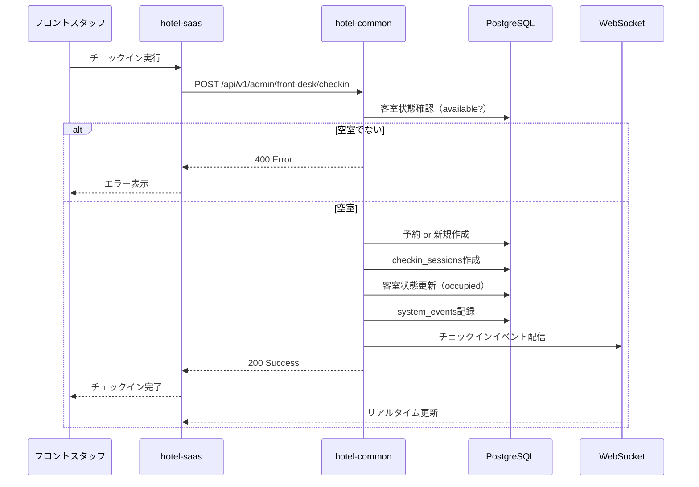
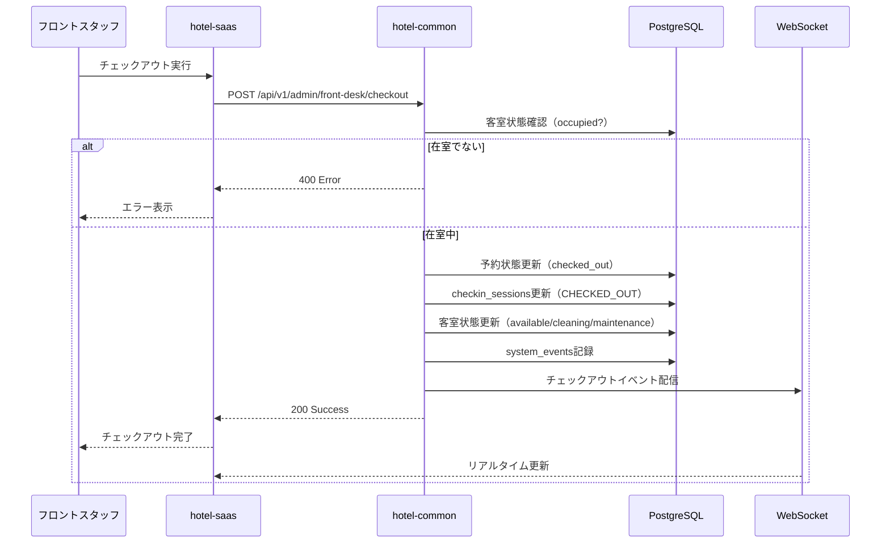
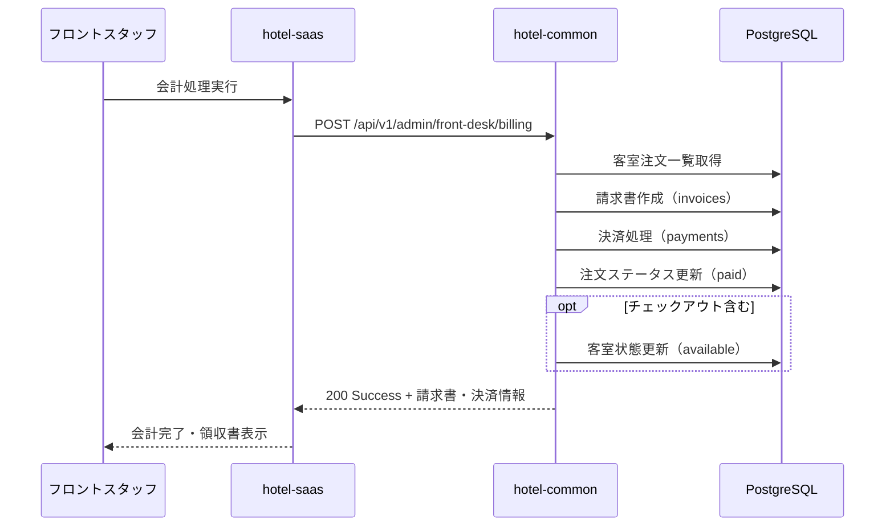

# 📋 SSOT: hotel-saas フロント業務機能

**作成日**: 2025年10月3日  
**バージョン**: 1.0.0  
**ステータス**: ✅ 実装済み  
**関連システム**: hotel-saas (フロントエンド) + hotel-common (バックエンドAPI)

---

## 📚 関連ドキュメント

- [SSOT_SAAS_ADMIN_AUTHENTICATION.md](/Users/kaneko/hotel-kanri/docs/03_ssot/00_foundation/SSOT_SAAS_ADMIN_AUTHENTICATION.md) - 管理画面認証
- [SSOT_SAAS_AUTHENTICATION.md](/Users/kaneko/hotel-kanri/docs/03_ssot/00_foundation/SSOT_SAAS_AUTHENTICATION.md) - 認証システム全体
- [SSOT_SAAS_DATABASE_SCHEMA.md](/Users/kaneko/hotel-kanri/docs/03_ssot/00_foundation/SSOT_SAAS_DATABASE_SCHEMA.md) - データベーススキーマ
- [DATABASE_NAMING_STANDARD.md](/Users/kaneko/hotel-kanri/docs/standards/DATABASE_NAMING_STANDARD.md) - DB命名規則
- `/Users/kaneko/hotel-saas/pages/admin/front-desk/` - フロント業務UI実装
- `/Users/kaneko/hotel-common/src/routes/systems/common/front-desk-*.routes.ts` - API実装

---

## 📋 概要

### 目的

ホテルフロントスタッフが行う以下の業務をデジタル化し、効率的な客室管理・会計処理を実現する：

1. **チェックイン処理**：予約ベース・ウォークイン対応
2. **チェックアウト処理**：会計・客室状態管理
3. **会計処理**：注文集計・請求書作成・決済処理
4. **客室メモ管理**：フロントスタッフ間の情報共有
5. **領収書発行**：Web領収書・PDF出力
6. **運用モード**：大型ディスプレイ向けUI

### 適用範囲

- **フロント業務ダッシュボード**：`/admin/front-desk/`
- **会計管理画面**：`/admin/front-desk/accounting-list`
- **会計処理画面**：`/admin/front-desk/billing`
- **客室メモ管理**：`/admin/front-desk/room-notes`
- **領収書発行**：`/admin/front-desk/accounting/receipt/`
- **運用モード**：`/admin/front-desk/operation`

### 技術スタック

- **フロントエンド**: Nuxt 3 + Vue 3 + TypeScript
- **バックエンドAPI**: hotel-common (Express + TypeScript)
- **認証方式**: Session認証（Redis + HttpOnly Cookie）
  - 詳細: [SSOT_SAAS_ADMIN_AUTHENTICATION.md](/Users/kaneko/hotel-kanri/docs/03_ssot/00_foundation/SSOT_SAAS_ADMIN_AUTHENTICATION.md)
- **データベース**: PostgreSQL（Prisma経由・hotel-common管理）
- **状態管理**: Composables (`useApiClient`, `useSessionAuth`)
- **リアルタイム通知**: WebSocket（チェックイン/アウト時）

### 命名規則統一

- **データベース**: `snake_case` (例: `tenant_id`, `created_at`)
- **API/JSON**: `camelCase` (例: `tenantId`, `createdAt`)
- **変数名**: `camelCase` (JavaScript/TypeScript標準)

**重要**: 同じ概念は必ず同じ名称を使用
- テナントID: DB=`tenant_id`, API/JSON=`tenantId`
- 客室番号: DB=`room_number`, API/JSON=`roomNumber`
- セッションID: DB=`session_id`, API/JSON=`sessionId`

---

## ⚠️ 必須要件（CRITICAL）

### 1. 認証統一要件
**フロント業務機能は必ず認証済みスタッフのみアクセス可能**

- **認証方式**: Session認証（Redis + HttpOnly Cookie）
- **ミドルウェア**: `01.admin-auth.ts` による自動認証チェック
- **権限**: 管理者権限必須（`requireAdmin()`）
- **未認証時**: 自動的に `/admin/login` へリダイレクト

### 2. API呼び出し統一要件
**全てのAPI呼び出しはhotel-commonを経由すること**

- **hotel-saas**: UIとAPI中継のみ
- **hotel-common**: 実際のデータ取得・更新処理
- **直接DB接続禁止**: hotel-saas内で直接Prismaを使用してはいけない

### 3. データ整合性要件
**客室状態の一貫性を保証すること**

- チェックイン時：`available` → `occupied`（空室チェック必須）
- チェックアウト時：`occupied` → `available` / `cleaning` / `maintenance`（在室チェック必須）
- 状態遷移ログ記録必須（`system_events`テーブル）

### 4. エラーハンドリング要件
**エラー発生時も画面は表示を継続する**

- **原則**: エラーが発生してもログアウトしない
- **表示**: 統計値は0またはデフォルト値を表示
- **ユーザーへの通知**: コンソールログ + トースト通知（将来実装予定）
- **禁止**: 401エラーで即座にログアウトさせる実装

---

## 🎯 機能仕様

### 1. フロント業務ダッシュボード

#### 画面パス
```
/admin/front-desk/  (pages/admin/front-desk/index.vue)
```

#### レイアウト
```yaml
layout: admin
  - ヘッダー: ナビゲーションバー、ログアウトボタン
  - サイドバー: AdminSidebar.vue（機能メニュー）
  - メインコンテンツ: ダッシュボード本体
```

#### 表示要素

##### 統計サマリー（4カードレイアウト）
```typescript
interface TodayStats {
  billingCount: number        // 今日の会計件数
  totalRevenue: number         // 今日の売上（円）
  activeMemos: number          // アクティブな客室メモ件数
  orderCount: number           // 今日の注文件数
}
```

**データソース**:
- 会計件数：`/api/v1/admin/front-desk/accounting` のcount
- 売上：`/api/v1/admin/front-desk/accounting` のtotal_amount集計
- 客室メモ：客室メモAPI（実装予定）
- 注文件数：注文管理API（別SSOT参照）

##### 機能カード
1. **会計管理カード**
   - アイコン: `heroicons:banknotes`
   - リンク: `/admin/front-desk/accounting-list`
   - 説明: 料金計算・決済処理・領収書発行

2. **客室メモカード**
   - アイコン: `heroicons:document-text`
   - リンク: `/admin/front-desk/room-notes`
   - 説明: スタッフ間の情報共有・引き継ぎ事項

3. **運用モードカード**
   - アイコン: `heroicons:view-columns`
   - リンク: `/admin/front-desk/operation`
   - 説明: 大型ディスプレイ向けUI

##### 最近のアクティビティ
- 最近の会計処理履歴
- 最近の客室メモ投稿
- 最近のチェックイン/アウト

#### API連携

```typescript
// hotel-saas APIルート
GET /api/v1/admin/front-desk/rooms
  ↓ 中継
// hotel-common APIエンドポイント
GET /api/v1/admin/front-desk/rooms
```

#### 実装ファイル

**フロントエンド**:
- `/Users/kaneko/hotel-saas/pages/admin/front-desk/index.vue`

**バックエンド**:
- `/Users/kaneko/hotel-saas/server/api/v1/admin/front-desk/rooms.get.ts` （中継API）
- `/Users/kaneko/hotel-common/src/routes/systems/common/front-desk-rooms.routes.ts` （実装）

---

### 2. チェックイン処理

#### 概要
予約ベース・ウォークイン両方に対応する統合チェックイン機能。

#### 処理フロー



#### リクエストスキーマ

```typescript
interface CheckinRequest {
  // 予約ベースチェックイン用
  reservationId?: string

  // ウォークインチェックイン用
  roomNumber?: string
  roomId?: string

  // 共通項目
  checkinDate: string         // ISO 8601形式
  checkoutDate?: string        // ISO 8601形式
  guestCount: number          // 1-10
  guests: GuestInfo[]         // 最低1名必須
  notes?: string
  specialRequests?: string

  // 料金情報（ウォークイン用）
  roomRate?: number
  totalAmount?: number
}

interface GuestInfo {
  name: string                // 必須
  email?: string
  phone?: string
  nationality?: string
  idType?: 'passport' | 'license' | 'id_card'
  idNumber?: string
}
```

#### レスポンススキーマ

```typescript
interface CheckinResponse {
  success: boolean
  message: string
  data: {
    checkin: {
      id: string                    // 予約ID
      reservation_id?: string
      room_number: string
      room_id: string
      guest_name: string
      checkin_at: string
      checkout_date: string
      guest_count: number
      status: 'checked_in'
      session: {
        id: string
        session_number: string      // 例: R101-20251003-001
        status: 'ACTIVE'
      }
    }
    type: 'reservation-based' | 'walk-in'
  }
}
```

#### バリデーション

1. **必須項目チェック**
   - `checkinDate`, `guestCount`, `guests` は必須
   - `reservationId` または `roomNumber` / `roomId` のいずれかが必須

2. **客室状態チェック**
   - 客室が `available` 状態であること
   - 既にチェックイン中の予約がないこと

3. **ゲスト情報チェック**
   - `guestCount` と `guests.length` が一致すること
   - 各ゲストに `name` が存在すること

#### データベース更新

##### 1. 予約テーブル（`reservations`）
```sql
-- 予約ベースの場合: 既存予約を更新
UPDATE reservations
SET 
  status = 'checked_in',
  guest_name = $1,
  guest_email = $2,
  guest_phone = $3,
  internal_notes = $4,
  updated_at = NOW()
WHERE id = $5;

-- ウォークインの場合: 新規予約作成
INSERT INTO reservations (
  id, tenant_id, room_number, room_type, guest_name, guest_email, guest_phone,
  checkin_date, checkout_date, adult_count, status, confirmation_number,
  total_amount, origin, updated_at
) VALUES (
  $1, $2, $3, $4, $5, $6, $7, $8, $9, $10, 'checked_in', $11, $12, 'hotel-common', NOW()
);
```

##### 2. チェックインセッションテーブル（`checkin_sessions`）
```sql
INSERT INTO checkin_sessions (
  id, tenant_id, session_number, reservation_id, room_id,
  guest_info, adults, children, check_in_at, planned_check_out,
  status, notes, special_requests, updated_at
) VALUES (
  $1, $2, $3, $4, $5, $6, $7, 0, $8, $9, 'ACTIVE', $10, $11, NOW()
);
```

**テーブル構造**（レガシーテーブル・現状維持）:
```prisma
model checkin_sessions {
  id                String    @id
  tenant_id         String
  session_number    String    @unique
  reservation_id    String?
  room_id           String
  guest_info        Json
  adults            Int       @default(1)
  children          Int       @default(0)
  check_in_at       DateTime
  check_out_at      DateTime?
  planned_check_out DateTime
  status            String    @default("ACTIVE")
  special_requests  String?
  notes             String?
  created_at        DateTime  @default(now())
  updated_at        DateTime
  orders            Order[]

  @@index([tenant_id])
  @@index([room_id])
  @@index([status])
}
```

##### 3. 客室テーブル（`rooms`）
```sql
UPDATE rooms
SET 
  status = 'occupied',
  updated_at = NOW()
WHERE id = $1 AND tenant_id = $2;
```

**テーブル構造**（新規テーブル・snake_case準拠）:
```prisma
model Room {
  id          String    @id @default(uuid())
  tenantId    String    @map("tenant_id")
  roomNumber  String    @map("room_number")
  roomType    String    @map("room_type")
  floor       Int?
  status      String    @default("available") // available, occupied, maintenance, cleaning
  capacity    Int       @default(2)
  amenities   Json?
  notes       String?
  lastCleaned DateTime? @map("last_cleaned")
  isDeleted   Boolean   @default(false) @map("is_deleted")
  createdAt   DateTime  @default(now()) @map("created_at")
  updatedAt   DateTime  @updatedAt @map("updated_at")
  
  @@map("rooms")
  @@unique([tenantId, roomNumber], map: "unique_tenant_room")
  @@index([tenantId])
  @@index([status])
}
```

##### 4. システムイベントログ（`system_events`）
```sql
INSERT INTO system_events (
  id, tenant_id, user_id, event_type, source_system, target_system,
  entity_type, entity_id, action, event_data, status
) VALUES (
  $1, $2, $3, 'ROOM_MANAGEMENT', 'hotel-common', 'hotel-common',
  'room', $4, 'CHECKIN', $5, 'COMPLETED'
);
```

#### WebSocketイベント配信

```typescript
// hotel-saas側でWebSocketイベントを送信
const checkinEvent = {
  type: 'GUEST_CHECKIN',
  data: {
    roomNumber: string
    roomId: string
    guestCount: number
    checkinDate: string
    timestamp: string
    welcomeVideo: {
      shouldPlay: true
      videoUrl: '/videos/welcome.mp4'
      duration: 30000
      autoSkip: true
    }
  }
}

// 客室デバイスへ送信
wss.sendToRoom(roomNumber, checkinEvent)

// 管理画面へブロードキャスト
wss.sendToType('admin', checkinEvent)
```

#### 実装ファイル

**フロントエンド**:
- `/Users/kaneko/hotel-saas/pages/admin/front-desk/operation.vue` （チェックインUI・実装予定）

**バックエンド**:
- `/Users/kaneko/hotel-saas/server/api/v1/admin/front-desk/checkin.post.ts` （中継・客室状態更新）
- `/Users/kaneko/hotel-common/src/routes/systems/common/front-desk-checkin.routes.ts` （実装）

---

### 3. チェックアウト処理

#### 概要
予約ベース・直接チェックアウト両方に対応する統合チェックアウト機能。

#### 処理フロー



#### リクエストスキーマ

```typescript
interface CheckoutRequest {
  // 予約ベースチェックアウト用
  reservationId?: string

  // 直接チェックアウト用
  roomNumber?: string
  roomId?: string

  // 共通項目
  checkoutDate?: string           // ISO 8601形式
  additionalCharges?: AdditionalCharge[]
  finalAmount?: number
  paymentMethod?: 'cash' | 'card' | 'transfer' | 'credit'
  notes?: string

  // 客室状態
  roomCondition?: 'clean' | 'needs_cleaning' | 'maintenance_required'
  forceCheckout?: boolean         // 強制チェックアウト（管理者用）
}

interface AdditionalCharge {
  description: string
  amount: number
  category: 'minibar' | 'laundry' | 'phone' | 'parking' | 'other'
}
```

#### レスポンススキーマ

```typescript
interface CheckoutResponse {
  success: boolean
  message: string
  data: {
    checkout: {
      id: string                    // 予約ID
      room_number: string
      room_id: string
      guest_name: string
      checkout_at: string
      total_amount: number
      final_amount: number
      additional_charges_total: number
      payment_method: string
      status: 'checked_out'
    }
    type: 'reservation-based' | 'direct'
  }
}
```

#### バリデーション

1. **必須項目チェック**
   - `reservationId` または `roomNumber` / `roomId` のいずれかが必須

2. **客室状態チェック**
   - 客室が `occupied` 状態であること
   - チェックイン中の予約が存在すること

3. **会計チェック（将来実装）**
   - 未払い注文がないこと
   - 会計処理が完了していること

#### データベース更新

##### 1. 予約テーブル（`reservations`）
```sql
UPDATE reservations
SET 
  status = 'checked_out',
  total_amount = $1,
  deposit_amount = $1,  -- 全額支払い済み
  internal_notes = $2,
  updated_at = NOW()
WHERE id = $3;
```

##### 2. チェックインセッションテーブル（`checkin_sessions`）
```sql
UPDATE checkin_sessions
SET 
  status = 'CHECKED_OUT',
  check_out_at = NOW(),
  updated_at = NOW()
WHERE reservation_id = $1 AND status = 'ACTIVE';
```

##### 3. 客室テーブル（`rooms`）
```sql
-- 客室状態の決定ロジック
-- roomCondition = 'clean' → 'available'
-- roomCondition = 'needs_cleaning' → 'cleaning'
-- roomCondition = 'maintenance_required' → 'maintenance'

UPDATE rooms
SET 
  status = $1,  -- available / cleaning / maintenance
  updated_at = NOW()
WHERE id = $2 AND tenant_id = $3;
```

##### 4. システムイベントログ（`system_events`）
```sql
INSERT INTO system_events (
  id, tenant_id, user_id, event_type, source_system, target_system,
  entity_type, entity_id, action, event_data, status
) VALUES (
  $1, $2, $3, 'ROOM_MANAGEMENT', 'hotel-common', 'hotel-common',
  'room', $4, 'CHECKOUT', $5, 'COMPLETED'
);
```

#### WebSocketイベント配信

```typescript
const checkoutEvent = {
  type: 'GUEST_CHECKOUT',
  data: {
    roomNumber: string
    roomId: string
    timestamp: string
  }
}

// 客室デバイスへ送信
wss.sendToRoom(roomNumber, checkoutEvent)

// 管理画面へブロードキャスト
wss.sendToType('admin', checkoutEvent)
```

#### 実装ファイル

**フロントエンド**:
- `/Users/kaneko/hotel-saas/pages/admin/front-desk/operation.vue` （チェックアウトUI・実装予定）

**バックエンド**:
- `/Users/kaneko/hotel-saas/server/api/v1/admin/front-desk/checkout.post.ts` （中継・客室状態更新）
- `/Users/kaneko/hotel-common/src/routes/systems/common/front-desk-checkin.routes.ts` （実装）

---

### 4. 会計処理

#### 概要
客室の注文明細を集計し、請求書作成・決済処理・領収書発行を行う機能。

#### 処理フロー



#### リクエストスキーマ

```typescript
interface BillingRequest {
  roomNumber: string              // 必須
  orders: OrderItem[]             // 必須・最低1件
  totalAmount: number             // 必須
  discounts?: Discount[]
  paymentMethod?: 'cash' | 'card' | 'transfer' | 'credit'
  receivedAmount?: number         // 現金受領額
  change?: number                 // お釣り
  includeCheckout?: boolean       // チェックアウト同時実行
}

interface OrderItem {
  id: number
  name: string
  quantity: number
  price: number
  notes?: string
}

interface Discount {
  name: string
  amount: number
  type: 'fixed' | 'percentage'
}
```

#### レスポンススキーマ

```typescript
interface BillingResponse {
  success: boolean
  message: string
  data: {
    invoice: {
      id: string
      invoice_number: string
      customer_name: string
      items: InvoiceItem[]
      subtotal: number
      tax_amount: number
      discount_amount: number
      total_amount: number
      status: 'PAID'
      issued_at: string
    }
    payment: {
      id: string
      invoice_id: string
      amount: number
      payment_method: string
      payment_reference: string
      status: 'completed'
      processed_at: string
    }
    roomNumber: string
    checkoutCompleted: boolean
  }
}
```

#### データベース更新

##### 1. 請求書テーブル（`invoices`）
```sql
INSERT INTO invoices (
  id, tenantId, invoiceNumber, customerId, customerName, customerEmail,
  billingAddress, items, subtotal, taxAmount, totalAmount,
  status, issuedAt, paidAt, notes, metadata, createdAt, updatedAt, createdBy
) VALUES (
  $1, $2, $3, $4, $5, $6, $7, $8, $9, $10, $11, 'PAID', NOW(), NOW(), $12, $13, NOW(), NOW(), $14
);
```

**テーブル構造**（レガシーテーブル・camelCase）:
```prisma
model invoices {
  id             String         @id
  tenantId       String
  invoiceNumber  String         @unique
  customerId     String?
  customerName   String
  customerEmail  String?
  billingAddress Json?
  items          Json
  subtotal       Int
  taxAmount      Int
  totalAmount    Int
  status         String         @default("DRAFT")
  dueDate        DateTime?
  issuedAt       DateTime?
  paidAt         DateTime?
  notes          String?
  metadata       Json?
  createdAt      DateTime       @default(now())
  updatedAt      DateTime
  createdBy      String?
  isDeleted      Boolean        @default(false)
  deletedAt      DateTime?
  deletedBy      String?
  payments       payments[]
  transactions   transactions[]

  @@index([tenantId])
  @@index([invoiceNumber])
  @@index([status])
  @@index([isDeleted])
}
```

##### 2. 決済テーブル（`payments`）
```sql
INSERT INTO payments (
  id, tenantId, invoiceId, transactionId, amount, paymentMethod, paymentReference,
  status, processedAt, processedBy, notes, metadata, createdAt, updatedAt
) VALUES (
  $1, $2, $3, NULL, $4, $5, $6, 'completed', NOW(), $7, $8, $9, NOW(), NOW()
);
```

**テーブル構造**（レガシーテーブル・camelCase）:
```prisma
model payments {
  id               String        @id
  tenantId         String
  invoiceId        String
  transactionId    String?
  amount           Int
  paymentMethod    String
  paymentReference String?
  status           String        @default("pending")
  processedAt      DateTime?
  processedBy      String?
  notes            String?
  metadata         Json?
  createdAt        DateTime      @default(now())
  updatedAt        DateTime
  isDeleted        Boolean       @default(false)
  deletedAt        DateTime?
  deletedBy        String?
  invoices         invoices      @relation(fields: [invoiceId], references: [id])
  transactions     transactions? @relation(fields: [transactionId], references: [id])

  @@index([tenantId])
  @@index([invoiceId])
  @@index([transactionId])
  @@index([status])
  @@index([isDeleted])
}
```

##### 3. 注文テーブル（`orders`）
```sql
-- 注文を「支払い済み」に更新
UPDATE orders
SET 
  status = 'paid',
  paidAt = NOW(),
  updatedAt = NOW()
WHERE id IN ($1, $2, ...);
```

#### 会計設定取得API

```typescript
// GET /api/v1/admin/front-desk/billing-settings

interface BillingSettingsResponse {
  success: boolean
  data: {
    settings: {
      tax_rate: number              // 消費税率（例: 0.10 = 10%）
      service_charge_rate: number   // サービス料率（例: 0.10 = 10%）
      currency: string              // 通貨（例: "JPY"）
      payment_methods: string[]     // 利用可能決済方法
      invoice_prefix: string        // 請求書番号プレフィックス
    }
  }
}
```

#### 実装ファイル

**フロントエンド**:
- `/Users/kaneko/hotel-saas/pages/admin/front-desk/billing.vue` （会計処理UI・開発中）
- `/Users/kaneko/hotel-saas/pages/admin/front-desk/accounting-list.vue` （会計管理UI）

**バックエンド**:
- `/Users/kaneko/hotel-saas/server/api/v1/admin/front-desk/billing.post.ts` （会計処理実装）
- `/Users/kaneko/hotel-saas/server/api/v1/admin/front-desk/accounting.get.ts` （会計データ取得）
- `/Users/kaneko/hotel-saas/server/api/v1/admin/front-desk/billing-settings.get.ts` （会計設定取得）
- `/Users/kaneko/hotel-common/src/routes/systems/common/front-desk-accounting.routes.ts` （実装）

---

### 5. 客室メモ管理

#### 概要
フロントスタッフ間で客室に関する情報を共有する機能。引き継ぎ事項・忘れ物・メンテナンス・清掃・ゲストリクエスト等を記録・管理。

#### 画面パス
```
/admin/front-desk/room-notes  (pages/admin/front-desk/room-notes.vue)
```

#### 機能要素

##### 1. メモ一覧表示
- **検索・フィルター**:
  - 客室番号検索
  - プレイスタイプフィルター
  - カテゴリフィルター（引き継ぎ、忘れ物、メンテナンス、清掃、ゲストリクエスト、その他）
  - 優先度フィルター（緊急、重要、通常）
  - ステータスフィルター（未対応、対応中、完了）

- **表示レイアウト**: 2カラムグリッド（モバイル: 1カラム）

##### 2. メモ詳細
```typescript
interface RoomNote {
  id: string
  tenantId: string
  placeId: string
  roomNumber: string
  category: 'handover' | 'lost_item' | 'maintenance' | 'cleaning' | 'guest_request' | 'other'
  priority: 'urgent' | 'high' | 'normal'
  status: 'pending' | 'in_progress' | 'completed'
  title: string
  content: string
  createdBy: string           // スタッフ名
  createdAt: string
  updatedAt: string
  replies: Reply[]
}

interface Reply {
  id: string
  noteId: string
  content: string
  createdBy: string
  createdAt: string
}
```

##### 3. メモ作成・編集
- カテゴリ選択
- 優先度選択
- タイトル・本文入力
- 客室選択

##### 4. メモ返信・対応状況更新
- 返信機能
- ステータス変更（未対応 → 対応中 → 完了）

#### データベーステーブル（実装予定）

**新規テーブル**:
```prisma
model RoomNote {
  id          String    @id @default(uuid())
  tenantId    String    @map("tenant_id")
  placeId     String    @map("place_id")
  roomNumber  String    @map("room_number")
  category    String                          // handover, lost_item, maintenance, cleaning, guest_request, other
  priority    String    @default("normal")    // urgent, high, normal
  status      String    @default("pending")   // pending, in_progress, completed
  title       String
  content     String
  createdBy   String    @map("created_by")    // スタッフID
  createdAt   DateTime  @default(now()) @map("created_at")
  updatedAt   DateTime  @updatedAt @map("updated_at")
  isDeleted   Boolean   @default(false) @map("is_deleted")
  deletedAt   DateTime? @map("deleted_at")
  
  replies     RoomNoteReply[]
  
  @@map("room_notes")
  @@index([tenantId])
  @@index([placeId])
  @@index([category])
  @@index([priority])
  @@index([status])
  @@index([isDeleted])
}

model RoomNoteReply {
  id          String    @id @default(uuid())
  tenantId    String    @map("tenant_id")
  noteId      String    @map("note_id")
  content     String
  createdBy   String    @map("created_by")
  createdAt   DateTime  @default(now()) @map("created_at")
  isDeleted   Boolean   @default(false) @map("is_deleted")
  deletedAt   DateTime? @map("deleted_at")
  
  note        RoomNote  @relation(fields: [noteId], references: [id], onDelete: Cascade)
  
  @@map("room_note_replies")
  @@index([tenantId])
  @@index([noteId])
  @@index([isDeleted])
}
```

#### 実装ファイル

**フロントエンド**:
- `/Users/kaneko/hotel-saas/pages/admin/front-desk/room-notes.vue` （UI実装済み）

**バックエンド**:
- `/Users/kaneko/hotel-saas/server/api/v1/admin/front-desk/room-notes.get.ts` （実装予定）
- `/Users/kaneko/hotel-saas/server/api/v1/admin/front-desk/room-notes.post.ts` （実装予定）
- `/Users/kaneko/hotel-common/src/routes/systems/common/room-notes.routes.ts` （実装予定）

---

### 6. 領収書発行

#### 概要
Web領収書の表示・PDF出力機能。会計処理完了後に自動生成。

#### 画面パス
```
/admin/front-desk/accounting/receipt/:id  (pages/admin/front-desk/accounting/receipt/[id].vue)
```

#### 表示要素

```typescript
interface Receipt {
  id: string
  invoiceNumber: string
  issuedAt: string
  tenantName: string              // ホテル名
  tenantAddress: string
  tenantPhone: string
  customerName: string
  roomNumber: string
  items: ReceiptItem[]
  subtotal: number
  taxAmount: number
  totalAmount: number
  paymentMethod: string
  notes?: string
}

interface ReceiptItem {
  name: string
  quantity: number
  unitPrice: number
  amount: number
}
```

#### 機能

1. **Web表示**
   - 領収書情報の整形表示
   - 印刷用CSS適用

2. **PDF出力**（将来実装）
   - PDFライブラリ（jsPDF等）を使用
   - 印刷・ダウンロード機能

3. **QRコード表示**（将来実装）
   - 領収書URLのQRコード生成
   - 客室端末からのアクセス用

#### 実装ファイル

**フロントエンド**:
- `/Users/kaneko/hotel-saas/pages/admin/front-desk/accounting/receipt/[id].vue` （実装予定）
- `/Users/kaneko/hotel-saas/pages/admin/front-desk/accounting/receipt/test.vue` （テストページ）

**バックエンド**:
- `/Users/kaneko/hotel-saas/server/api/v1/admin/front-desk/receipts/[id].get.ts` （実装予定）

---

### 7. 運用モード

#### 概要
大型ディスプレイ向けのフルスクリーン表示UI。客室状態一覧・チェックイン/アウト操作を効率的に行う。

#### 画面パス
```
/admin/front-desk/operation  (pages/admin/front-desk/operation.vue)
```

#### 表示要素

##### 1. 客室状態一覧（タイルビュー）
```typescript
interface RoomTile {
  id: string
  roomNumber: string
  roomType: string
  floor: number
  status: 'available' | 'occupied' | 'cleaning' | 'maintenance'
  guestName?: string
  checkinDate?: string
  checkoutDate?: string
  orderCount?: number
  totalAmount?: number
}
```

**表示レイアウト**:
- グリッドレイアウト（4-6カラム）
- 色分け表示:
  - 空室（available）: 緑
  - 在室（occupied）: 青
  - 清掃中（cleaning）: 黄
  - メンテナンス（maintenance）: 赤

##### 2. クイック操作
- タイルクリック → チェックイン/アウト操作
- 客室状態変更
- 会計処理へ遷移

##### 3. リアルタイム更新
- WebSocketによる自動更新
- 他スタッフの操作を即座に反映

#### 実装ファイル

**フロントエンド**:
- `/Users/kaneko/hotel-saas/pages/admin/front-desk/operation.vue` （実装済み）
- `/Users/kaneko/hotel-saas/pages/admin/front-desk/operation-minimal.vue` （ミニマル版）

---

## 🔗 API仕様

### hotel-saas → hotel-common API連携

#### 基本構成

```
hotel-saas (Nuxt API Route)
    ↓ 中継
hotel-common (Express API)
    ↓ 実装
PostgreSQL
```

#### 認証ヘッダー

```typescript
const headers = {
  'Authorization': `Bearer ${authUser.token}`,
  'Content-Type': 'application/json',
  'X-Tenant-ID': tenantId
}
```

### 1. 客室一覧取得

#### hotel-saas API
```
GET /api/v1/admin/front-desk/rooms?page=1&limit=20&status=available
```

#### hotel-common API
```
GET /api/v1/admin/front-desk/rooms
```

**クエリパラメータ**:
```typescript
interface RoomQueryParams {
  page?: number          // デフォルト: 1
  limit?: number         // デフォルト: 20、最大: 1000
  status?: 'available' | 'occupied' | 'maintenance' | 'cleaning'
  room_type?: string
  floor?: number
}
```

**レスポンス**:
```typescript
interface RoomListResponse {
  success: boolean
  data: {
    rooms: Room[]
    summary: {
      total_rooms: number
      by_status: {
        available: number
        occupied: number
        maintenance: number
        cleaning: number
      }
      by_type: {
        standard: number
        deluxe: number
        suite: number
      }
    }
  }
  pagination: {
    page: number
    limit: number
    total: number
    totalPages: number
  }
}
```

**実装ファイル**:
- hotel-saas: `/Users/kaneko/hotel-saas/server/api/v1/admin/front-desk/rooms.get.ts`
- hotel-common: `/Users/kaneko/hotel-common/src/routes/systems/common/front-desk-rooms.routes.ts`

---

### 2. 客室詳細取得

#### hotel-saas API
```
GET /api/v1/admin/front-desk/rooms/:id
```

#### hotel-common API
```
GET /api/v1/admin/front-desk/rooms/:id
```

**レスポンス**:
```typescript
interface RoomDetailResponse {
  success: boolean
  data: {
    room: {
      id: string
      room_number: string
      room_type: string
      floor: number
      status: string
      capacity: number
      amenities: Json
      notes: string
      last_cleaned: string
      maintenance_history: MaintenanceRecord[]
      current_guest: GuestInfo | null
      created_at: string
      updatedAt: string
    }
  }
}
```

---

### 3. 客室状態更新

#### hotel-saas API
```
PUT /api/v1/admin/front-desk/rooms/:id
```

#### hotel-common API
```
PUT /api/v1/admin/front-desk/rooms/:id
```

**リクエスト**:
```typescript
interface RoomUpdateRequest {
  status: 'available' | 'occupied' | 'maintenance' | 'cleaning'
  notes?: string
  maintenance_reason?: string
}
```

**レスポンス**:
```typescript
interface RoomUpdateResponse {
  success: boolean
  data: {
    room: Room
    message: string
  }
}
```

**実装ファイル**:
- hotel-common: `/Users/kaneko/hotel-common/src/routes/systems/common/front-desk-rooms.routes.ts` (lines 207-324)

---

### 4. チェックイン処理

#### hotel-saas API
```
POST /api/v1/admin/front-desk/checkin
```

#### hotel-common API
```
POST /api/v1/admin/front-desk/checkin
```

**リクエスト**: [「2. チェックイン処理」参照](#2-チェックイン処理)

**レスポンス**: [「2. チェックイン処理」参照](#2-チェックイン処理)

**実装ファイル**:
- hotel-saas: `/Users/kaneko/hotel-saas/server/api/v1/admin/front-desk/checkin.post.ts`
- hotel-common: `/Users/kaneko/hotel-common/src/routes/systems/common/front-desk-checkin.routes.ts`

---

### 5. チェックアウト処理

#### hotel-saas API
```
POST /api/v1/admin/front-desk/checkout
```

#### hotel-common API
```
POST /api/v1/admin/front-desk/checkout
```

**リクエスト**: [「3. チェックアウト処理」参照](#3-チェックアウト処理)

**レスポンス**: [「3. チェックアウト処理」参照](#3-チェックアウト処理)

**実装ファイル**:
- hotel-saas: `/Users/kaneko/hotel-saas/server/api/v1/admin/front-desk/checkout.post.ts`
- hotel-common: `/Users/kaneko/hotel-common/src/routes/systems/common/front-desk-checkin.routes.ts`

---

### 6. 会計処理

#### hotel-saas API
```
POST /api/v1/admin/front-desk/billing
```

#### hotel-common API
```
POST /api/v1/accounting/invoices  (請求書作成)
POST /api/v1/accounting/payments  (決済処理)
```

**リクエスト**: [「4. 会計処理」参照](#4-会計処理)

**レスポンス**: [「4. 会計処理」参照](#4-会計処理)

**実装ファイル**:
- hotel-saas: `/Users/kaneko/hotel-saas/server/api/v1/admin/front-desk/billing.post.ts`
- hotel-common: `/Users/kaneko/hotel-common/src/routes/systems/common/accounting.routes.ts`

---

### 7. 会計データ取得

#### hotel-saas API
```
GET /api/v1/admin/front-desk/accounting?page=1&limit=20&start_date=2025-10-01&end_date=2025-10-03
```

#### hotel-common API
```
GET /api/v1/admin/front-desk/accounting
```

**クエリパラメータ**:
```typescript
interface AccountingQueryParams {
  page?: number
  limit?: number
  type?: 'invoice' | 'payment' | 'refund'
  status?: 'pending' | 'completed' | 'cancelled'
  start_date?: string
  end_date?: string
  guest_id?: string
  room_number?: string
}
```

**レスポンス**:
```typescript
interface AccountingListResponse {
  success: boolean
  data: {
    transactions: Transaction[]
    summary: {
      total_transactions: number
      total_revenue: number
      total_refunds: number
      pending_amount: number
      by_status: {
        pending: number
        completed: number
        cancelled: number
      }
      by_payment_method: {
        cash: number
        credit_card: number
        bank_transfer: number
      }
    }
  }
  pagination: Pagination
}
```

**実装ファイル**:
- hotel-saas: `/Users/kaneko/hotel-saas/server/api/v1/admin/front-desk/accounting.get.ts`
- hotel-common: `/Users/kaneko/hotel-common/src/routes/systems/common/front-desk-accounting.routes.ts`

---

### 8. 客室注文一覧取得

#### hotel-saas API
```
GET /api/v1/admin/front-desk/room-orders?roomNumber=101
```

**クエリパラメータ**:
```typescript
interface RoomOrdersQueryParams {
  roomNumber: string       // 必須
  status?: string
  includeDeleted?: boolean
}
```

**レスポンス**:
```typescript
interface RoomOrdersResponse {
  success: boolean
  data: {
    orders: Order[]
    summary: {
      total_count: number
      total_amount: number
      unpaid_count: number
      unpaid_amount: number
    }
  }
}
```

**実装ファイル**:
- hotel-saas: `/Users/kaneko/hotel-saas/server/api/v1/admin/front-desk/room-orders.get.ts`

---

### 9. 会計設定取得

#### hotel-saas API
```
GET /api/v1/admin/front-desk/billing-settings
```

**レスポンス**:
```typescript
interface BillingSettingsResponse {
  success: boolean
  data: {
    settings: {
      tax_rate: number
      service_charge_rate: number
      currency: string
      payment_methods: string[]
      invoice_prefix: string
    }
  }
}
```

**実装ファイル**:
- hotel-saas: `/Users/kaneko/hotel-saas/server/api/v1/admin/front-desk/billing-settings.get.ts`

---

### 10. 操作ログ記録

#### hotel-common API（内部使用）
```
POST /api/v1/admin/operation-logs
```

**リクエスト**:
```typescript
interface OperationLogRequest {
  type: 'CHECKIN' | 'CHECKOUT' | 'BILLING' | 'ROOM_STATUS_UPDATE'
  entity: 'room' | 'reservation' | 'invoice'
  roomNumber?: string
  fromStatus?: string
  toStatus?: string
  staffName: string
  description: string
  notes?: string
}
```

---

## 🗄️ データベーススキーマ

### 関連テーブル一覧

| テーブル名 | 命名規則 | 状態 | 用途 |
|----------|---------|------|------|
| `rooms` | snake_case | ✅ 新規 | 客室マスタ |
| `reservations` | snake_case | ⚠️ レガシー | 予約管理 |
| `checkin_sessions` | snake_case | ⚠️ レガシー | チェックインセッション |
| `orders` | camelCase | ⚠️ レガシー | 注文管理 |
| `invoices` | camelCase | ⚠️ レガシー | 請求書 |
| `payments` | camelCase | ⚠️ レガシー | 決済 |
| `transactions` | camelCase | ⚠️ レガシー | 会計取引 |
| `system_events` | snake_case | ⚠️ レガシー | システムイベントログ |
| `room_notes` | snake_case | ❌ 未作成 | 客室メモ（実装予定） |
| `room_note_replies` | snake_case | ❌ 未作成 | 客室メモ返信（実装予定） |

### 1. rooms（客室マスタ）

**新規テーブル・snake_case準拠**

```prisma
model Room {
  id          String    @id @default(uuid())
  tenantId    String    @map("tenant_id")
  roomNumber  String    @map("room_number")
  roomType    String    @map("room_type")        // standard, deluxe, suite
  floor       Int?
  status      String    @default("available")     // available, occupied, maintenance, cleaning
  capacity    Int       @default(2)
  amenities   Json?
  notes       String?
  lastCleaned DateTime? @map("last_cleaned")
  isDeleted   Boolean   @default(false) @map("is_deleted")
  deletedAt   DateTime? @map("deleted_at")
  deletedBy   String?   @map("deleted_by")
  createdAt   DateTime  @default(now()) @map("created_at")
  updatedAt   DateTime  @updatedAt @map("updated_at")
  
  @@map("rooms")
  @@unique([tenantId, roomNumber], name: "unique_tenant_room")
  @@index([tenantId])
  @@index([status])
  @@index([isDeleted])
}
```

**DDL**:
```sql
CREATE TABLE rooms (
  id              TEXT PRIMARY KEY,
  tenant_id       TEXT NOT NULL,
  room_number     TEXT NOT NULL,
  room_type       TEXT NOT NULL,
  floor           INTEGER,
  status          TEXT DEFAULT 'available',
  capacity        INTEGER DEFAULT 2,
  amenities       JSONB,
  notes           TEXT,
  last_cleaned    TIMESTAMP,
  is_deleted      BOOLEAN DEFAULT false,
  deleted_at      TIMESTAMP,
  deleted_by      TEXT,
  created_at      TIMESTAMP DEFAULT NOW(),
  updated_at      TIMESTAMP DEFAULT NOW(),
  
  CONSTRAINT unique_tenant_room UNIQUE (tenant_id, room_number),
  CONSTRAINT fk_rooms_tenant FOREIGN KEY (tenant_id) REFERENCES tenants(id)
);

CREATE INDEX idx_rooms_tenant_id ON rooms(tenant_id);
CREATE INDEX idx_rooms_status ON rooms(status);
CREATE INDEX idx_rooms_is_deleted ON rooms(is_deleted);
```

---

### 2. reservations（予約）

**レガシーテーブル・snake_case混在**

```prisma
model reservations {
  id                   String    @id
  tenant_id            String
  room_number          String
  room_type            String?
  guest_name           String
  guest_email          String?
  guest_phone          String?
  checkin_date         DateTime
  checkout_date        DateTime
  adult_count          Int       @default(1)
  child_count          Int       @default(0)
  status               String    @default("confirmed")  // confirmed, checked_in, checked_out, cancelled
  confirmation_number  String    @unique
  total_amount         Decimal?  @db.Decimal(10, 2)
  deposit_amount       Decimal?  @db.Decimal(10, 2)
  payment_status       String?
  special_requests     String?
  internal_notes       String?
  origin               String    @default("hotel-common")
  created_at           DateTime  @default(now())
  updated_at           DateTime
  is_deleted           Boolean   @default(false)
  deleted_at           DateTime?
  deleted_by           String?

  @@index([tenant_id])
  @@index([room_number])
  @@index([status])
  @@index([checkin_date])
  @@index([is_deleted])
}
```

---

### 3. checkin_sessions（チェックインセッション）

**レガシーテーブル・snake_case**

```prisma
model checkin_sessions {
  id                String    @id
  tenant_id         String
  session_number    String    @unique
  reservation_id    String?
  room_id           String
  guest_info        Json
  adults            Int       @default(1)
  children          Int       @default(0)
  check_in_at       DateTime
  check_out_at      DateTime?
  planned_check_out DateTime
  status            String    @default("ACTIVE")  // ACTIVE, CHECKED_OUT
  special_requests  String?
  notes             String?
  created_at        DateTime  @default(now())
  updated_at        DateTime
  orders            Order[]

  @@index([tenant_id])
  @@index([room_id])
  @@index([status])
  @@index([session_number])
}
```

---

### 4. invoices（請求書）

**レガシーテーブル・camelCase**

```prisma
model invoices {
  id             String         @id
  tenantId       String
  invoiceNumber  String         @unique
  customerId     String?
  customerName   String
  customerEmail  String?
  billingAddress Json?
  items          Json
  subtotal       Int
  taxAmount      Int
  totalAmount    Int
  status         String         @default("DRAFT")  // DRAFT, ISSUED, PAID, CANCELLED
  dueDate        DateTime?
  issuedAt       DateTime?
  paidAt         DateTime?
  notes          String?
  metadata       Json?
  createdAt      DateTime       @default(now())
  updatedAt      DateTime
  createdBy      String?
  isDeleted      Boolean        @default(false)
  deletedAt      DateTime?
  deletedBy      String?
  payments       payments[]
  transactions   transactions[]

  @@index([tenantId])
  @@index([invoiceNumber])
  @@index([status])
  @@index([isDeleted])
}
```

---

### 5. payments（決済）

**レガシーテーブル・camelCase**

```prisma
model payments {
  id               String        @id
  tenantId         String
  invoiceId        String
  transactionId    String?
  amount           Int
  paymentMethod    String         // cash, credit_card, debit_card, bank_transfer, digital_wallet
  paymentReference String?
  status           String        @default("pending")  // pending, completed, failed, refunded
  processedAt      DateTime?
  processedBy      String?
  notes            String?
  metadata         Json?
  createdAt        DateTime      @default(now())
  updatedAt        DateTime
  isDeleted        Boolean       @default(false)
  deletedAt        DateTime?
  deletedBy        String?
  invoices         invoices      @relation(fields: [invoiceId], references: [id])
  transactions     transactions? @relation(fields: [transactionId], references: [id])

  @@index([tenantId])
  @@index([invoiceId])
  @@index([status])
  @@index([isDeleted])
}
```

---

### 6. system_events（システムイベントログ）

**レガシーテーブル・snake_case**

```prisma
model system_events {
  id            String   @id
  tenant_id     String
  user_id       String?
  event_type    String
  source_system String
  target_system String
  entity_type   String
  entity_id     String
  action        String
  event_data    Json
  status        String
  error_message String?
  created_at    DateTime @default(now())

  @@index([tenant_id])
  @@index([event_type])
  @@index([entity_type])
  @@index([action])
  @@index([created_at])
}
```

**用途**: チェックイン/アウト、客室状態更新、会計処理等の操作ログを記録

---

### 7. room_notes（客室メモ）

**新規テーブル・snake_case準拠・実装予定**

```prisma
model RoomNote {
  id          String    @id @default(uuid())
  tenantId    String    @map("tenant_id")
  placeId     String    @map("place_id")
  roomNumber  String    @map("room_number")
  category    String                          // handover, lost_item, maintenance, cleaning, guest_request, other
  priority    String    @default("normal")    // urgent, high, normal
  status      String    @default("pending")   // pending, in_progress, completed
  title       String
  content     String
  createdBy   String    @map("created_by")
  createdAt   DateTime  @default(now()) @map("created_at")
  updatedAt   DateTime  @updatedAt @map("updated_at")
  isDeleted   Boolean   @default(false) @map("is_deleted")
  deletedAt   DateTime? @map("deleted_at")
  
  replies     RoomNoteReply[]
  
  @@map("room_notes")
  @@index([tenantId])
  @@index([placeId])
  @@index([category])
  @@index([priority])
  @@index([status])
  @@index([isDeleted])
}
```

---

### 8. room_note_replies（客室メモ返信）

**新規テーブル・snake_case準拠・実装予定**

```prisma
model RoomNoteReply {
  id          String    @id @default(uuid())
  tenantId    String    @map("tenant_id")
  noteId      String    @map("note_id")
  content     String
  createdBy   String    @map("created_by")
  createdAt   DateTime  @default(now()) @map("created_at")
  isDeleted   Boolean   @default(false) @map("is_deleted")
  deletedAt   DateTime? @map("deleted_at")
  
  note        RoomNote  @relation(fields: [noteId], references: [id], onDelete: Cascade)
  
  @@map("room_note_replies")
  @@index([tenantId])
  @@index([noteId])
  @@index([isDeleted])
}
```

---

## 🔄 システム間連携

### hotel-saas ↔ hotel-common

#### 連携方式
- **通信**: HTTP REST API
- **認証**: JWT Token（Bearer認証）
- **テナント識別**: X-Tenant-IDヘッダー

#### データフロー

```
hotel-saas (UI)
    ↓ REST API
hotel-common (Business Logic)
    ↓ Prisma ORM
PostgreSQL (Data Storage)
```

#### エラーハンドリング

**hotel-common側**:
```typescript
try {
  // 処理実行
  return ResponseHelper.sendSuccess(res, data, 200)
} catch (error) {
  logger.error('エラー', error)
  return ResponseHelper.sendInternalError(res, 'エラーメッセージ')
}
```

**hotel-saas側**:
```typescript
try {
  const response = await $fetch(url, { ... })
  return response
} catch (error: any) {
  console.error('APIエラー:', error)
  throw createError({
    statusCode: error?.statusCode || 500,
    statusMessage: error?.message || 'Internal Server Error'
  })
}
```

---

### WebSocket連携

#### 用途
- チェックイン/アウト時のリアルタイム通知
- 客室状態変更の即時反映
- 管理画面の自動更新

#### イベントタイプ

```typescript
type WebSocketEventType = 
  | 'GUEST_CHECKIN'
  | 'GUEST_CHECKOUT'
  | 'ROOM_STATUS_UPDATE'
  | 'ORDER_UPDATE'
```

#### イベント配信

```typescript
// hotel-saas側のWebSocketサーバー
import { useWebSocketServer } from '~/server/utils/webSocketServer'

const wss = useWebSocketServer()

// 特定の客室へ送信
wss.sendToRoom(roomNumber, event)

// 管理画面へブロードキャスト
wss.sendToType('admin', event)
```

---

## 🔐 セキュリティ・認証

### 認証フロー

1. **ログイン**: `/api/v1/auth/login` でSession認証
2. **セッション検証**: `01.admin-auth.ts` ミドルウェア
3. **権限チェック**: 管理者権限必須
4. **API呼び出し**: JWTトークン付与

### 権限設定

- **フロント業務機能**: 管理者権限必須
- **客室メモ閲覧**: すべてのスタッフ
- **客室メモ作成・編集**: すべてのスタッフ
- **チェックイン/アウト**: フロントスタッフ以上
- **会計処理**: フロントスタッフ以上

---

## 📊 エラーハンドリング

### エラー種別

| ステータスコード | エラー種別 | 対処方法 |
|---------------|----------|---------|
| 400 | バリデーションエラー | 入力値を修正 |
| 401 | 認証エラー | 再ログイン |
| 403 | 権限エラー | 権限不足を通知 |
| 404 | リソース未検出 | 対象が存在しないことを通知 |
| 409 | 状態競合 | 客室状態の不整合を通知 |
| 500 | サーバーエラー | エラー内容をログ記録 |

### クライアント側エラーハンドリング

```typescript
try {
  const response = await apiClient.post('/api/v1/admin/front-desk/checkin', data)
  // 成功処理
} catch (error: any) {
  if (error.statusCode === 400) {
    // バリデーションエラー表示
    showToast('error', error.message)
  } else if (error.statusCode === 409) {
    // 状態競合エラー表示
    showToast('warning', '客室状態を確認してください')
  } else {
    // その他エラー
    showToast('error', 'エラーが発生しました')
  }
}
```

---

## 🧪 テスト仕様

### 単体テスト

#### チェックイン処理
- [ ] 空室へのチェックイン成功
- [ ] 在室客室へのチェックイン失敗
- [ ] バリデーションエラー（必須項目不足）
- [ ] ゲスト人数と属性情報の不一致エラー

#### チェックアウト処理
- [ ] 在室客室からのチェックアウト成功
- [ ] 空室からのチェックアウト失敗
- [ ] 追加料金計算の正確性
- [ ] 客室状態の正しい遷移

#### 会計処理
- [ ] 請求書作成の正確性
- [ ] 決済処理の成功
- [ ] 税計算の正確性
- [ ] 注文ステータス更新

### 統合テスト

- [ ] hotel-saas → hotel-common API連携
- [ ] データベース更新の一貫性
- [ ] WebSocketイベント配信
- [ ] エラー時のロールバック

---

## 📈 パフォーマンス要件

### レスポンスタイム目標

| API | 目標時間 |
|-----|---------|
| 客室一覧取得 | < 500ms |
| チェックイン処理 | < 1000ms |
| チェックアウト処理 | < 1000ms |
| 会計処理 | < 2000ms |

### 最適化施策

1. **データベースインデックス**: 必須フィールドに適切なインデックス設定
2. **キャッシュ戦略**: 客室一覧・設定情報のキャッシュ（Redis）
3. **ページネーション**: 大量データ取得時のページング実装
4. **非同期処理**: WebSocket通知・ログ記録の非同期化

---

## 🚀 今後の拡張予定

### Phase 2（短期）
- [ ] 領収書PDF出力機能
- [ ] QRコード生成機能
- [ ] 客室メモAPI実装
- [ ] 客室メモ通知機能

### Phase 3（中期）
- [ ] 予約システムとの完全統合
- [ ] 自動チェックイン機能
- [ ] モバイルアプリ対応
- [x] 多言語対応 **← v2.0.0で追加完了**

### Phase 4（長期）
- [ ] AIによる客室状態予測
- [ ] 自動清掃スケジューリング
- [ ] ビジネスインテリジェンス機能

---

## 🌐 多言語対応

### 概要

フロント業務機能は**管理画面専用**であり、UIテキストのみ多言語化が必要です。

**対応パターン**: 🟡 **軽量対応**（UIテキストのみ）

**定義**:
- ✅ 静的UIテキスト（ボタン、ラベル、メッセージ等）を多言語化
- ✅ `@nuxtjs/i18n`を使用
- ❌ `translations`テーブルは使用しない
- ❌ 自動翻訳は実行しない
- ❌ データベースのデータフィールドは多言語化しない

**適用理由**: 
- 管理画面専用であり、スタッフが使用する機能
- スタッフ入力データ（客室メモ、宿泊者名等）は日本語のみで運用
- チェックイン・アウト処理、会計処理等のデータは翻訳不要

**対象範囲**:
- ✅ UIテキスト（ボタン、ラベル、メッセージ、エラー等） - `@nuxtjs/i18n`で対応
- ❌ データフィールド（客室番号、客室メモ、会計記録等） - 日本語のみで運用

**重要**: フロント業務は**スタッフ専用機能**であり、ゲスト向け多言語化は不要です。

---

### 対象フィールド

#### **UIテキストの多言語化**

| 対象 | 対応方法 | 優先度 |
|------|---------|--------|
| 画面タイトル（「フロント業務ダッシュボード」「会計管理」等） | `@nuxtjs/i18n` | ⭐⭐⭐ |
| ボタンラベル（「チェックイン」「チェックアウト」「会計処理」等） | `@nuxtjs/i18n` | ⭐⭐⭐ |
| 客室状態ラベル（「空室」「在室」「清掃中」等） | `@nuxtjs/i18n` | ⭐⭐⭐ |
| テーブルヘッダー（「客室番号」「状態」「宿泊者名」等） | `@nuxtjs/i18n` | ⭐⭐⭐ |
| エラー・成功メッセージ | `@nuxtjs/i18n` | ⭐⭐⭐ |
| 確認ダイアログ（「本当にチェックアウトしますか？」等） | `@nuxtjs/i18n` | ⭐⭐⭐ |

**データの多言語化は不要**:
- ❌ 客室番号（101, 102等）
- ❌ 宿泊者名（スタッフ入力データ）
- ❌ 客室メモ（スタッフ間の情報共有）
- ❌ 会計金額（数値）

---

### 実装方法

#### ✅ **UIテキストの多言語化**

**実装パターン**: `@nuxtjs/i18n`を使用

```vue
<script setup lang="ts">
const { t } = useI18n();
</script>

<template>
  <div class="front-desk-dashboard">
    <!-- ヘッダー -->
    <h1 class="text-3xl font-bold mb-8">
      {{ t('admin.frontDesk.title') }}
    </h1>

    <!-- 客室状態カード -->
    <div class="grid grid-cols-3 gap-6 mb-8">
      <StatusCard
        :title="t('admin.frontDesk.status.available')"
        :count="availableRooms"
        color="green"
      />
      
      <StatusCard
        :title="t('admin.frontDesk.status.occupied')"
        :count="occupiedRooms"
        color="blue"
      />
      
      <StatusCard
        :title="t('admin.frontDesk.status.cleaning')"
        :count="cleaningRooms"
        color="yellow"
      />
    </div>

    <!-- クイックアクション -->
    <div class="flex gap-4 mb-8">
      <button @click="handleCheckIn" class="btn btn-primary">
        {{ t('admin.frontDesk.actions.checkIn') }}
      </button>
      
      <button @click="handleCheckOut" class="btn btn-secondary">
        {{ t('admin.frontDesk.actions.checkOut') }}
      </button>
      
      <button @click="goToAccounting" class="btn btn-info">
        {{ t('admin.frontDesk.actions.accounting') }}
      </button>
    </div>

    <!-- 客室一覧テーブル -->
    <table class="w-full">
      <thead>
        <tr>
          <th>{{ t('admin.frontDesk.table.roomNumber') }}</th>
          <th>{{ t('admin.frontDesk.table.status') }}</th>
          <th>{{ t('admin.frontDesk.table.guestName') }}</th>
          <th>{{ t('admin.frontDesk.table.checkInDate') }}</th>
          <th>{{ t('admin.frontDesk.table.actions') }}</th>
        </tr>
      </thead>
      <tbody>
        <tr v-for="room in rooms" :key="room.id">
          <td>{{ room.roomNumber }}</td>
          <td>
            <RoomStatusBadge :status="room.status" />
          </td>
          <td>{{ room.guestName || '-' }}</td>
          <td>{{ formatDate(room.checkInDate) }}</td>
          <td>
            <button @click="handleAction(room)">
              {{ t('admin.frontDesk.table.details') }}
            </button>
          </td>
        </tr>
      </tbody>
    </table>

    <!-- チェックアウト確認ダイアログ -->
    <ConfirmDialog
      v-model="showCheckOutDialog"
      :title="t('admin.frontDesk.dialogs.checkOut.title')"
      :message="t('admin.frontDesk.dialogs.checkOut.message', { roomNumber: selectedRoom?.roomNumber })"
      :confirm-text="t('admin.frontDesk.dialogs.checkOut.confirm')"
      :cancel-text="t('admin.frontDesk.dialogs.checkOut.cancel')"
      @confirm="confirmCheckOut"
    />
  </div>
</template>
```

**翻訳ファイル例** (`locales/ja.json`):

```json
{
  "admin": {
    "frontDesk": {
      "title": "フロント業務ダッシュボード",
      "status": {
        "available": "空室",
        "occupied": "在室",
        "cleaning": "清掃中",
        "maintenance": "メンテナンス中",
        "outOfService": "利用不可"
      },
      "actions": {
        "checkIn": "チェックイン",
        "checkOut": "チェックアウト",
        "accounting": "会計処理",
        "roomNotes": "客室メモ",
        "operation": "運用モード"
      },
      "table": {
        "roomNumber": "客室番号",
        "status": "状態",
        "guestName": "宿泊者名",
        "checkInDate": "チェックイン日",
        "checkOutDate": "チェックアウト日",
        "actions": "操作",
        "details": "詳細"
      },
      "dialogs": {
        "checkOut": {
          "title": "チェックアウト確認",
          "message": "客室 {roomNumber} をチェックアウトしますか？",
          "confirm": "チェックアウト",
          "cancel": "キャンセル"
        },
        "accounting": {
          "title": "会計処理確認",
          "message": "合計金額: ¥{total}。支払いを確定しますか？",
          "confirm": "確定",
          "cancel": "キャンセル"
        }
      },
      "messages": {
        "checkInSuccess": "チェックインが完了しました",
        "checkOutSuccess": "チェックアウトが完了しました",
        "accountingSuccess": "会計処理が完了しました",
        "error": "エラーが発生しました: {message}"
      }
    }
  }
}
```

**翻訳ファイル例** (`locales/en.json`):

```json
{
  "admin": {
    "frontDesk": {
      "title": "Front Desk Dashboard",
      "status": {
        "available": "Available",
        "occupied": "Occupied",
        "cleaning": "Cleaning",
        "maintenance": "Maintenance",
        "outOfService": "Out of Service"
      },
      "actions": {
        "checkIn": "Check In",
        "checkOut": "Check Out",
        "accounting": "Accounting",
        "roomNotes": "Room Notes",
        "operation": "Operation Mode"
      },
      "table": {
        "roomNumber": "Room Number",
        "status": "Status",
        "guestName": "Guest Name",
        "checkInDate": "Check-in Date",
        "checkOutDate": "Check-out Date",
        "actions": "Actions",
        "details": "Details"
      },
      "dialogs": {
        "checkOut": {
          "title": "Confirm Check-out",
          "message": "Check out room {roomNumber}?",
          "confirm": "Check Out",
          "cancel": "Cancel"
        },
        "accounting": {
          "title": "Confirm Payment",
          "message": "Total amount: ¥{total}. Confirm payment?",
          "confirm": "Confirm",
          "cancel": "Cancel"
        }
      },
      "messages": {
        "checkInSuccess": "Check-in completed",
        "checkOutSuccess": "Check-out completed",
        "accountingSuccess": "Payment processed",
        "error": "Error: {message}"
      }
    }
  }
}
```

---

### マイグレーション計画

#### **Phase 1: UIテキストの多言語化（優先度: 高）**

**対象**: `hotel-saas` フロントエンド

**タスク**:
- [ ] `@nuxtjs/i18n`のセットアップ確認
- [ ] 翻訳ファイルの作成（`locales/ja.json`, `locales/en.json`）
- [ ] フロント業務画面の翻訳キー置き換え
  - [ ] `pages/admin/front-desk/index.vue` - ダッシュボード
  - [ ] `pages/admin/front-desk/accounting-list.vue` - 会計管理
  - [ ] `pages/admin/front-desk/billing.vue` - 会計処理
  - [ ] `pages/admin/front-desk/room-notes.vue` - 客室メモ
  - [ ] `pages/admin/front-desk/operation.vue` - 運用モード
- [ ] コンポーネントの翻訳キー置き換え
  - [ ] `StatusCard.vue` - 状態カード
  - [ ] `RoomStatusBadge.vue` - 状態バッジ
  - [ ] `ConfirmDialog.vue` - 確認ダイアログ
- [ ] 言語切り替え機能の動作確認

**工数**: 1-2日

---

### 実装チェックリスト

#### **Phase 1: UIテキスト多言語化**

**hotel-saas（フロントエンド）**:
- [ ] `@nuxtjs/i18n`セットアップ確認
- [ ] 翻訳ファイル作成
  - [ ] `locales/ja.json` - フロント業務セクション追加
  - [ ] `locales/en.json` - フロント業務セクション追加
- [ ] ページコンポーネント更新
  - [ ] `pages/admin/front-desk/index.vue`
  - [ ] `pages/admin/front-desk/accounting-list.vue`
  - [ ] `pages/admin/front-desk/billing.vue`
  - [ ] `pages/admin/front-desk/room-notes.vue`
  - [ ] `pages/admin/front-desk/operation.vue`
  - [ ] `pages/admin/front-desk/accounting/receipt/[id].vue`
- [ ] 共通コンポーネント更新
  - [ ] 客室状態バッジ
  - [ ] 確認ダイアログ
  - [ ] エラートースト
- [ ] 言語切り替えUIの実装（ヘッダー）
- [ ] 動作確認（日本語 ↔ 英語）

**テスト**:
- [ ] 日本語表示の確認
- [ ] 英語表示の確認
- [ ] 言語切り替えの動作確認
- [ ] チェックイン・アウト処理の動作確認
- [ ] 会計処理の動作確認
- [ ] 客室メモの表示確認（日本語データのまま）
- [ ] エラーメッセージの多言語表示確認

---

### 注意事項

#### ✅ **やるべきこと**

1. **軽量な実装**
   - `@nuxtjs/i18n`のみ使用
   - `translations`テーブルは使用しない

2. **スタッフ入力データの保持**
   - 客室メモは日本語のまま（翻訳しない）
   - 宿泊者名は入力されたまま（翻訳しない）
   - 会計記録は日本語のまま（翻訳しない）

3. **確認ダイアログの多言語化**
   - チェックアウト確認
   - 会計処理確認
   - 削除確認

#### ❌ **やってはいけないこと**

1. **データフィールドの翻訳**
   - 客室メモを自動翻訳しない
   - 宿泊者名を翻訳しない
   - スタッフ入力データを翻訳しない

2. **既存仕様との矛盾**
   - APIの構造を変更しない
   - データベーススキーマを変更しない
   - 会計処理ロジックを変更しない

3. **パフォーマンス劣化**
   - 翻訳キーの取得でレンダリングが遅くならないよう注意
   - リアルタイム通知の遅延を発生させない

---

### 影響範囲

| システム | 影響度 | 内容 |
|---------|--------|------|
| **hotel-saas** | 🟡 中 | フロント業務画面（5ページ + コンポーネント）の翻訳キー置き換え |
| **hotel-common** | ✅ なし | API仕様変更なし |
| **hotel-pms** | ✅ なし | 依存なし |
| **hotel-member** | ✅ なし | 依存なし |

---

## 📝 変更履歴

| 日付 | バージョン | 変更内容 | 担当 |
|------|----------|---------|------|
| 2025-10-10 | 2.0.0 | 多言語対応追加<br>- 軽量対応（UIテキストのみ）<br>- `@nuxtjs/i18n`による管理画面UI多言語化<br>- マイグレーション計画（Phase 1）<br>- 既存仕様との完全な整合性確保<br>- Phase 3「多言語対応」を完了扱いに変更 | AI |
| 2025-10-03 | 1.0.0 | 初版作成 | Iza |

---

## 📞 問い合わせ・サポート

- **技術的な質問**: Iza（統合管理者）
- **実装相談**: Sun（hotel-saas担当AI）
- **ドキュメント修正提案**: GitHub Issue / Pull Request

---

**🔖 このドキュメントは確定版です。フロント業務機能の実装・運用時は必ず参照してください。**

