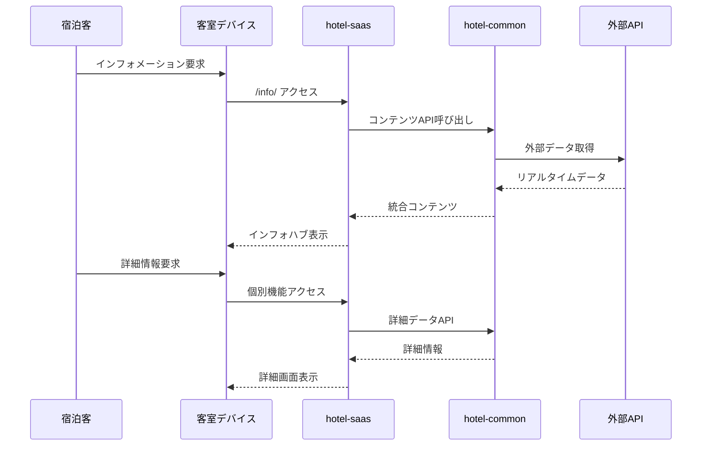

# インフォメーション管理システム統合仕様書

**Doc-ID**: SPEC-2025-008
**Version**: 1.0
**Status**: Active
**Owner**: 金子裕司
**Linked-Docs**: SPEC-2025-006, SPEC-2025-007, SPEC-2025-004

---

## 📋 **概要**

hotel-saasプロジェクトのインフォメーション管理システムの包括的仕様書です。館内情報、観光案内、WiFi案内、記事管理システム、ドラッグ&ドロップレイアウトエディタを統合的に定義します。

## 🎯 **システム目標**

### **基本方針**
- **統合ハブ設計**: 全インフォメーション機能への統一アクセスポイント
- **多言語対応**: 日英対応の完全なコンテンツ管理
- **リアルタイム更新**: 営業状況・イベント情報の動的表示
- **直感的編集**: ドラッグ&ドロップによるレイアウト管理

### **ユーザー体験目標**
- 宿泊客の情報アクセス効率化
- 統一されたUI/UXによる操作性向上
- 外部サービス連携による利便性向上
- 管理者の効率的なコンテンツ管理

## 🏗️ **システムアーキテクチャ**

### **インフォメーション全体構成**
```mermaid
graph TB
    subgraph "客室デバイス"
        Device[STB/タブレット]
        InfoHub[統合ハブ画面]
        DetailView[詳細表示画面]
    end

    subgraph "hotel-saas Frontend"
        Hub[インフォハブ /info/]
        WiFi[WiFi案内 /info/wifi]
        Facilities[館内施設 /info/facilities]
        Tourism[観光案内 /info/tourism]
        Articles[記事システム /info/[slug]]
    end

    subgraph "管理画面"
        ContentMgmt[コンテンツ管理]
        LayoutEditor[レイアウトエディタ]
        MediaMgmt[メディア管理]
        Translation[翻訳管理]
    end

    subgraph "hotel-saas API"
        InfoAPI[インフォAPI]
        MediaAPI[メディアAPI]
        LayoutAPI[レイアウトAPI]
    end

    subgraph "hotel-common Backend"
        ContentService[コンテンツサービス]
        TranslationService[翻訳サービス]
        MediaService[メディアサービス]
    end

    subgraph "外部サービス"
        Maps[Google Maps API]
        Translation_API[DeepL API]
        Weather[天気API]
    end

    Device --> InfoHub
    InfoHub --> Hub
    Hub --> WiFi
    Hub --> Facilities
    Hub --> Tourism
    Hub --> Articles

    ContentMgmt --> InfoAPI
    LayoutEditor --> LayoutAPI
    MediaMgmt --> MediaAPI

    InfoAPI --> ContentService
    MediaAPI --> MediaService
    LayoutAPI --> ContentService

    ContentService --> Maps
    TranslationService --> Translation_API
    ContentService --> Weather
```

### **データフロー**


## 📱 **統合ハブシステム**

### **ハブページ仕様**
```typescript
interface InfoHub {
  // ナビゲーション
  navigation: {
    wifi: InfoSection
    facilities: InfoSection
    tourism: InfoSection
    articles: InfoSection
  }

  // 検索機能
  search: {
    query: string
    filters: string[]
    results: SearchResult[]
  }

  // 多言語対応
  language: {
    current: 'ja' | 'en'
    available: string[]
    auto_detect: boolean
  }

  // レイアウト設定
  layout: {
    template: string
    sections: LayoutSection[]
    responsive: ResponsiveConfig
  }
}

interface InfoSection {
  id: string
  title: { ja: string, en: string }
  description: { ja: string, en: string }
  icon: string
  url: string
  status: 'active' | 'maintenance' | 'disabled'
  badge?: string
  external_link?: boolean
}
```

### **統合検索システム**
```yaml
検索対象:
  - WiFi接続情報
  - 館内施設情報
  - 観光スポット
  - 記事コンテンツ
  - イベント情報

検索機能:
  - キーワード検索（日英対応）
  - カテゴリフィルタリング
  - 位置情報フィルタ
  - 営業時間フィルタ
  - 人気度ソート

検索結果:
  - 統一フォーマット表示
  - プレビュー機能
  - 直接アクセスリンク
  - 関連情報表示
```

## 📶 **WiFi案内システム**

### **WiFi情報管理**
```typescript
interface WiFiInfo {
  // 基本情報
  network_name: string
  password: string
  security_type: 'WPA2' | 'WPA3' | 'Open'

  // QRコード
  qr_code: {
    data: string
    image_url: string
    auto_generate: boolean
  }

  // 接続ガイド
  connection_guide: {
    steps: Array<{
      step: number
      title: { ja: string, en: string }
      description: { ja: string, en: string }
      image?: string
    }>
    troubleshooting: Array<{
      problem: { ja: string, en: string }
      solution: { ja: string, en: string }
    }>
  }

  // 利用規約
  terms_of_use: {
    ja: string
    en: string
    required_acceptance: boolean
  }
}
```

### **WiFi接続支援機能**
```yaml
QRコード機能:
  - 自動生成（SSID・パスワード・セキュリティ設定）
  - ワンタップ接続対応
  - 高解像度画像生成
  - 印刷用フォーマット

パスワード管理:
  - 自動コピー機能
  - 表示/非表示切り替え
  - セキュリティ考慮した表示制御
  - 定期更新対応

接続ガイド:
  - デバイス別手順
  - 画像付き説明
  - トラブルシューティング
  - 多言語対応
```

## 🏨 **館内施設システム**

### **施設情報管理**
```typescript
interface Facility {
  id: string
  name: { ja: string, en: string }
  category: FacilityCategory
  description: { ja: string, en: string }

  // 営業情報
  operating_hours: {
    monday: TimeSlot[]
    tuesday: TimeSlot[]
    wednesday: TimeSlot[]
    thursday: TimeSlot[]
    friday: TimeSlot[]
    saturday: TimeSlot[]
    sunday: TimeSlot[]
    holidays: TimeSlot[]
  }

  // 位置情報
  location: {
    floor: number
    room_number?: string
    coordinates?: { x: number, y: number }
    map_image?: string
  }

  // 連絡先・予約
  contact: {
    phone?: string
    email?: string
    reservation_url?: string
    reservation_required: boolean
  }

  // メディア
  images: string[]
  videos?: string[]

  // ステータス
  status: 'open' | 'closed' | 'maintenance' | 'full'
  real_time_status: boolean
  last_updated: string
}

interface TimeSlot {
  start: string  // HH:mm
  end: string    // HH:mm
  note?: { ja: string, en: string }
}

enum FacilityCategory {
  RESTAURANT = 'restaurant',
  BAR = 'bar',
  SPA = 'spa',
  FITNESS = 'fitness',
  POOL = 'pool',
  BUSINESS = 'business',
  MEETING = 'meeting',
  SHOP = 'shop',
  SERVICE = 'service'
}
```

### **リアルタイム営業状況**
```yaml
ステータス管理:
  - 営業中/営業時間外の自動判定
  - 満席/空席状況（手動更新）
  - メンテナンス情報
  - 臨時休業対応

表示機能:
  - ステータスバッジ
  - 営業時間カウントダウン
  - 混雑度表示
  - 予約可能状況

通知機能:
  - 営業開始通知
  - 満席解除通知
  - 特別イベント通知
  - メンテナンス予告
```

## 🗺️ **観光案内システム**

### **観光スポット管理**
```typescript
interface TourismSpot {
  id: string
  name: { ja: string, en: string }
  category: TourismCategory
  description: { ja: string, en: string }

  // 位置情報
  location: {
    address: { ja: string, en: string }
    coordinates: { lat: number, lng: number }
    distance_from_hotel: number  // km
    travel_time: {
      walking?: number    // minutes
      driving?: number    // minutes
      public_transport?: number  // minutes
    }
  }

  // 営業情報
  operating_info: {
    hours: { ja: string, en: string }
    closed_days: string[]
    seasonal_info?: { ja: string, en: string }
  }

  // 料金情報
  pricing: {
    adult?: number
    child?: number
    senior?: number
    group_discount?: number
    currency: 'JPY' | 'USD'
    notes?: { ja: string, en: string }
  }

  // 外部連携
  external_links: {
    official_website?: string
    google_maps_url?: string
    booking_url?: string
    review_url?: string
  }

  // メディア
  images: string[]
  videos?: string[]

  // 評価・推奨
  rating: number  // 1-5
  recommendation_level: 'high' | 'medium' | 'low'
  seasonal_recommendation: string[]  // ['spring', 'summer', 'autumn', 'winter']

  // タグ
  tags: string[]
  accessibility: string[]
}

enum TourismCategory {
  TEMPLE = 'temple',
  MUSEUM = 'museum',
  PARK = 'park',
  SHOPPING = 'shopping',
  RESTAURANT = 'restaurant',
  ENTERTAINMENT = 'entertainment',
  NATURE = 'nature',
  CULTURE = 'culture',
  SPORTS = 'sports'
}
```

### **地図連携機能**
```yaml
Google Maps統合:
  - 位置表示・ルート検索
  - ストリートビュー連携
  - 交通情報・所要時間
  - 周辺スポット表示

フィルタリング機能:
  - 距離フィルタ（1km, 3km, 5km, 10km）
  - カテゴリフィルタ
  - 評価フィルタ
  - 営業時間フィルタ
  - アクセシビリティフィルタ

ソート機能:
  - 距離順
  - 評価順
  - 人気順
  - 料金順
  - 営業時間順
```

## 📰 **記事管理システム**

### **記事データモデル**
```typescript
interface Article {
  id: string
  slug: string
  title: { ja: string, en: string }
  content: { ja: string, en: string }
  excerpt: { ja: string, en: string }

  // メタデータ
  category: ArticleCategory
  tags: string[]
  author: string

  // 公開設定
  status: 'draft' | 'published' | 'archived'
  published_at?: string
  expires_at?: string
  featured: boolean

  // SEO
  seo: {
    meta_title?: { ja: string, en: string }
    meta_description?: { ja: string, en: string }
    og_image?: string
  }

  // メディア
  featured_image?: string
  gallery?: string[]

  // 表示制御
  display_settings: {
    show_on_hub: boolean
    priority: number
    target_audience: string[]
  }

  // 統計
  view_count: number
  last_viewed: string

  // 日時
  created_at: string
  updated_at: string
}

enum ArticleCategory {
  NEWS = 'news',
  EVENT = 'event',
  CAMPAIGN = 'campaign',
  MENU = 'menu',
  FACILITY = 'facility',
  TOURISM = 'tourism',
  GUIDE = 'guide'
}
```

### **コンテンツ管理機能**
```yaml
記事作成・編集:
  - リッチテキストエディタ
  - 画像・動画アップロード
  - プレビュー機能
  - 自動保存
  - バージョン管理

公開管理:
  - 公開日時設定
  - 有効期限設定
  - 公開状態管理
  - 承認ワークフロー

多言語管理:
  - 日英同時編集
  - 翻訳支援機能
  - 言語別プレビュー
  - 翻訳状況管理
```

## 🎨 **レイアウトエディタシステム**

### **エディタ機能仕様**
```typescript
interface LayoutEditor {
  // エディタ設定
  editor: {
    type: 'grapesjs' | 'builder_io'
    mode: 'visual' | 'code' | 'hybrid'
    responsive_breakpoints: ResponsiveBreakpoint[]
  }

  // コンポーネント
  components: {
    basic: BasicComponent[]
    advanced: AdvancedComponent[]
    custom: CustomComponent[]
  }

  // レイアウト管理
  layout: {
    id: string
    name: string
    template: string
    sections: LayoutSection[]
    css: string
    js?: string
  }

  // プレビュー
  preview: {
    device: 'desktop' | 'tablet' | 'mobile'
    real_time: boolean
    url: string
  }
}

interface LayoutSection {
  id: string
  type: 'header' | 'content' | 'sidebar' | 'footer'
  components: Component[]
  styles: CSSProperties
  responsive: ResponsiveStyles
}

interface Component {
  id: string
  type: string
  content: any
  styles: CSSProperties
  attributes: Record<string, any>
  children?: Component[]
}
```

### **ドラッグ&ドロップ機能**
```yaml
基本操作:
  - 要素の並び替え
  - セクション間移動
  - 複製・削除
  - グループ化

高度な機能:
  - ネストした要素の管理
  - レスポンシブ対応
  - アニメーション設定
  - 条件表示設定

コンポーネントライブラリ:
  - テキスト・画像・動画
  - ボタン・リンク・フォーム
  - カード・リスト・グリッド
  - カスタムコンポーネント
```

## 🔄 **API仕様**

### **インフォメーション関連API**
```yaml
GET /api/v1/info/hub
  説明: インフォハブデータ取得
  認証: デバイス認証
  レスポンス:
    sections: InfoSection[]
    featured_articles: Article[]
    announcements: Announcement[]

GET /api/v1/info/wifi
  説明: WiFi情報取得
  認証: デバイス認証
  レスポンス:
    wifi_info: WiFiInfo
    qr_code: string
    connection_guide: ConnectionGuide

GET /api/v1/info/facilities
  説明: 館内施設一覧取得
  認証: デバイス認証
  クエリ:
    category?: string
    status?: string
    floor?: number
  レスポンス:
    facilities: Facility[]
    categories: FacilityCategory[]

GET /api/v1/info/tourism
  説明: 観光スポット一覧取得
  認証: デバイス認証
  クエリ:
    category?: string
    distance?: number
    rating?: number
    open_now?: boolean
  レスポンス:
    spots: TourismSpot[]
    categories: TourismCategory[]
```

### **記事管理API**
```yaml
GET /api/v1/articles
  説明: 記事一覧取得
  認証: デバイス認証
  クエリ:
    category?: string
    tag?: string
    featured?: boolean
    limit?: number
    offset?: number
  レスポンス:
    articles: Article[]
    total: number
    categories: ArticleCategory[]

GET /api/v1/articles/{slug}
  説明: 記事詳細取得
  認証: デバイス認証
  レスポンス:
    article: Article
    related_articles: Article[]

POST /api/v1/admin/articles
  説明: 記事作成
  認証: 管理者認証
  リクエスト:
    title: { ja: string, en: string }
    content: { ja: string, en: string }
    category: ArticleCategory
    tags: string[]
    # その他記事属性
  レスポンス:
    article: Article
```

### **レイアウト管理API**
```yaml
GET /api/v1/admin/layouts
  説明: レイアウト一覧取得
  認証: 管理者認証
  レスポンス:
    layouts: Layout[]
    templates: Template[]

PUT /api/v1/admin/layouts/{layout_id}
  説明: レイアウト更新
  認証: 管理者認証
  リクエスト:
    name?: string
    sections: LayoutSection[]
    css: string
    js?: string
  レスポンス:
    layout: Layout

POST /api/v1/admin/layouts/{layout_id}/preview
  説明: レイアウトプレビュー生成
  認証: 管理者認証
  リクエスト:
    device: 'desktop' | 'tablet' | 'mobile'
    sections: LayoutSection[]
  レスポンス:
    preview_url: string
    expires_at: string
```

## 🌐 **多言語対応システム**

### **翻訳管理**
```typescript
interface Translation {
  id: string
  key: string
  source_language: 'ja' | 'en'
  target_language: 'ja' | 'en'
  source_text: string
  translated_text: string

  // 翻訳メタデータ
  translation_method: 'manual' | 'deepl' | 'openai'
  quality_score?: number
  reviewed: boolean
  reviewer?: string

  // 文脈情報
  context: string
  category: string
  usage_count: number

  // 日時
  created_at: string
  updated_at: string
}
```

### **自動翻訳システム**
```yaml
翻訳API優先順位:
  1. DeepL API（高品質）
  2. OpenAI GPT-4（フォールバック）
  3. 手動翻訳（最高品質）

翻訳品質管理:
  - 自動品質スコア算出
  - 人的レビュー機能
  - 翻訳履歴管理
  - A/Bテスト対応

キャッシュ戦略:
  - 翻訳結果キャッシュ
  - 使用頻度ベース最適化
  - 定期的な品質チェック
```

## 📊 **管理画面仕様**

### **コンテンツ管理画面**
```yaml
パス: /admin/info/content

機能:
  - 記事CRUD操作
  - カテゴリ・タグ管理
  - 公開スケジュール管理
  - メディアライブラリ
  - 翻訳管理

UI設計:
  - ダッシュボード形式
  - ドラッグ&ドロップ操作
  - リアルタイムプレビュー
  - 一括操作機能
  - 検索・フィルタリング
```

### **レイアウト編集画面**
```yaml
パス: /admin/info/layout

機能:
  - ビジュアルエディタ
  - コンポーネントライブラリ
  - レスポンシブ編集
  - テンプレート管理
  - プレビュー機能

UI設計:
  - 3ペイン構成（コンポーネント・エディタ・プロパティ）
  - デバイス切り替え
  - リアルタイム更新
  - 履歴・元に戻す機能
```

### **施設・観光管理画面**
```yaml
パス: /admin/info/facilities, /admin/info/tourism

機能:
  - 施設・スポット情報管理
  - 営業時間・ステータス管理
  - 位置情報・地図連携
  - 画像・動画管理
  - 外部リンク管理

UI設計:
  - 地図ベース編集
  - 一覧・詳細切り替え
  - 一括インポート・エクスポート
  - ステータス一括更新
```

## 🧪 **テスト仕様**

### **機能テスト**
```yaml
インフォハブ:
  - ナビゲーション機能
  - 検索・フィルタリング
  - 多言語切り替え
  - レスポンシブ表示

個別機能:
  - WiFi情報表示・QRコード
  - 施設情報・営業状況
  - 観光案内・地図連携
  - 記事表示・詳細画面

管理機能:
  - コンテンツ管理
  - レイアウト編集
  - 翻訳管理
  - メディア管理
```

### **パフォーマンステスト**
```yaml
負荷テスト:
  - 同時アクセス: 500ユーザー
  - 記事表示: 1秒以内
  - 画像読み込み: 2秒以内
  - 検索処理: 500ms以内

ストレステスト:
  - 大量記事表示: 1000記事
  - 画像最適化: 自動リサイズ
  - キャッシュ効率: 90%以上
  - メモリ使用量: 制限内
```

## 📈 **運用・監視**

### **監視項目**
```yaml
ビジネスメトリクス:
  - ページビュー数
  - 滞在時間
  - 人気コンテンツ
  - 言語別利用率
  - 外部リンククリック率

技術メトリクス:
  - ページ読み込み時間
  - API レスポンス時間
  - エラー率
  - 画像最適化率
  - キャッシュヒット率

コンテンツメトリクス:
  - 記事公開数
  - 翻訳完了率
  - メディア使用量
  - 更新頻度
```

### **SEO・アクセシビリティ**
```yaml
SEO対策:
  - メタタグ最適化
  - 構造化データ
  - サイトマップ生成
  - ページ速度最適化

アクセシビリティ:
  - WCAG 2.1 AA準拠
  - キーボードナビゲーション
  - スクリーンリーダー対応
  - 高コントラスト対応
```

## 🚀 **今後の拡張計画**

### **Phase 1拡張**
```yaml
機能追加:
  - プッシュ通知システム
  - オフライン対応
  - 音声ガイド機能
  - AR案内機能

UI/UX改善:
  - パーソナライゼーション
  - ダークモード対応
  - アニメーション強化
  - タッチジェスチャー対応
```

### **Phase 2拡張**
```yaml
高度な機能:
  - AI チャットボット統合
  - 行動分析・レコメンデーション
  - 外部予約システム連携
  - ソーシャルメディア連携

運用効率化:
  - 自動翻訳品質向上
  - コンテンツ自動生成
  - A/Bテスト自動化
  - パフォーマンス自動最適化
```

---

## 📋 **関連ドキュメント**

- **SPEC-2025-006**: システムアーキテクチャ設計仕様書
- **SPEC-2025-007**: 注文管理システム統合仕様書
- **SPEC-2025-004**: 統合API仕様書
