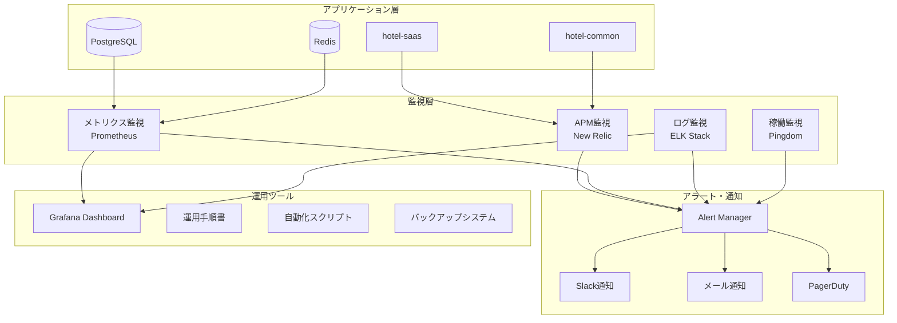

# 運用・保守管理仕様書

**Doc-ID**: SPEC-2025-016
**Version**: 1.0
**Status**: Active
**Owner**: 金子裕司
**Linked-Docs**: SPEC-2025-013, SPEC-2025-015, SPEC-2025-012

---

## 📋 **概要**

hotel-saasプロジェクトの運用・保守管理の包括的仕様書です。システム監視、トラブルシューティング、保守作業、災害復旧、運用プロセスを統合的に定義します。

## 🎯 **運用目標**

### **基本方針**
- **高可用性**: 99.99%のシステム稼働率維持
- **予防保守**: 問題発生前の予防的対応
- **迅速復旧**: 障害発生時の迅速な復旧
- **継続改善**: 運用効率の継続的向上

### **SLA目標**
- システム稼働率: 99.99%
- 平均復旧時間(MTTR): 4時間以内
- 平均故障間隔(MTBF): 720時間以上
- レスポンス時間: 95%ile < 500ms

## 🏗️ **運用アーキテクチャ**

### **監視・運用システム構成**


### **運用プロセス**
```typescript
interface OperationsProcess {
  // 日常運用
  daily_operations: {
    health_check: '毎朝9:00システムヘルスチェック'
    performance_review: '日次パフォーマンスレビュー'
    log_analysis: 'エラーログ分析・対応'
    backup_verification: 'バックアップ状況確認'
  }

  // 週次運用
  weekly_operations: {
    capacity_planning: 'リソース使用量分析'
    security_review: 'セキュリティログレビュー'
    performance_optimization: 'パフォーマンス最適化'
    maintenance_planning: '保守作業計画'
  }

  // 月次運用
  monthly_operations: {
    sla_review: 'SLA達成状況レビュー'
    capacity_forecast: 'キャパシティ予測'
    disaster_recovery_test: 'DR訓練実施'
    process_improvement: '運用プロセス改善'
  }
}
```

## 📊 **システム監視戦略**

### **監視項目・閾値**
```yaml
アプリケーション監視:
  レスポンス時間:
    - 警告: 500ms
    - 危険: 1000ms
    - 測定間隔: 1分

  エラー率:
    - 警告: 1%
    - 危険: 5%
    - 測定間隔: 5分

  スループット:
    - 警告: 前週比-20%
    - 危険: 前週比-50%
    - 測定間隔: 5分

インフラ監視:
  CPU使用率:
    - 警告: 70%
    - 危険: 85%
    - 測定間隔: 1分

  メモリ使用率:
    - 警告: 80%
    - 危険: 90%
    - 測定間隔: 1分

  ディスク使用率:
    - 警告: 80%
    - 危険: 90%
    - 測定間隔: 5分

  ネットワーク:
    - 警告: 帯域幅80%
    - 危険: 帯域幅95%
    - 測定間隔: 1分

データベース監視:
  接続数:
    - 警告: 最大接続数の70%
    - 危険: 最大接続数の85%
    - 測定間隔: 1分

  スロークエリ:
    - 警告: 1秒以上のクエリ
    - 危険: 5秒以上のクエリ
    - 測定間隔: リアルタイム

  レプリケーション遅延:
    - 警告: 10秒
    - 危険: 30秒
    - 測定間隔: 1分
```

### **アラート設定**
```typescript
interface AlertConfiguration {
  // 緊急アラート（即座対応）
  critical_alerts: {
    system_down: {
      condition: 'HTTP 5xx > 50% for 2 minutes'
      notification: ['pagerduty', 'slack', 'email']
      escalation: '15分後にマネージャーに通知'
    }
    database_down: {
      condition: 'Database connection failed'
      notification: ['pagerduty', 'slack', 'email']
      escalation: '即座にDBAに通知'
    }
    security_breach: {
      condition: 'Suspicious activity detected'
      notification: ['pagerduty', 'security_team']
      escalation: '即座にセキュリティチームに通知'
    }
  }

  // 警告アラート（1時間以内対応）
  warning_alerts: {
    high_response_time: {
      condition: 'Response time > 500ms for 5 minutes'
      notification: ['slack', 'email']
      escalation: '1時間後にエスカレーション'
    }
    high_error_rate: {
      condition: 'Error rate > 1% for 10 minutes'
      notification: ['slack', 'email']
      escalation: '1時間後にエスカレーション'
    }
    resource_usage: {
      condition: 'CPU/Memory > 80% for 15 minutes'
      notification: ['slack']
      escalation: '2時間後にエスカレーション'
    }
  }
}
```

## 🔧 **トラブルシューティング体系**

### **問題分類・対応フロー**
```yaml
接続問題:
  症状:
    - Connection failed エラー
    - タイムアウトエラー
    - 間欠的な接続断

  診断手順:
    1. ネットワーク接続確認
    2. ポート競合チェック
    3. CORS設定確認
    4. ファイアウォール設定確認
    5. DNS解決確認

  対処法:
    - ポート変更・明示的指定
    - CORS設定修正
    - キャッシュクリア
    - ネットワーク設定見直し

認証問題:
  症状:
    - ログイン失敗
    - トークン無効エラー
    - 権限不足エラー

  診断手順:
    1. JWT トークン検証
    2. hotel-common API接続確認
    3. 権限設定確認
    4. セッション状態確認

  対処法:
    - トークン再発行
    - API接続設定修正
    - 権限設定更新
    - セッションリセット

パフォーマンス問題:
  症状:
    - 画面表示遅延
    - API レスポンス遅延
    - メモリ使用量増加

  診断手順:
    1. パフォーマンス監視確認
    2. ボトルネック特定
    3. リソース使用状況確認
    4. データベースクエリ分析

  対処法:
    - キャッシュ最適化
    - クエリ最適化
    - リソース増強
    - 負荷分散調整

データベース問題:
  症状:
    - 接続エラー
    - スロークエリ
    - デッドロック
    - レプリケーション遅延

  診断手順:
    1. 接続プール状況確認
    2. 実行中クエリ確認
    3. ロック状況確認
    4. レプリケーション状況確認

  対処法:
    - 接続プール調整
    - インデックス最適化
    - クエリ最適化
    - レプリケーション再構築
```

### **トラブルシューティング自動化**
```typescript
// 自動診断スクリプト例
interface AutoDiagnostics {
  // システムヘルスチェック
  health_check: {
    api_endpoints: string[]
    database_connection: boolean
    cache_connection: boolean
    external_services: string[]
  }

  // パフォーマンス診断
  performance_check: {
    response_time_analysis: PerformanceMetrics
    resource_usage_analysis: ResourceMetrics
    bottleneck_detection: BottleneckAnalysis
  }

  // 自動復旧
  auto_recovery: {
    service_restart: boolean
    cache_clear: boolean
    connection_pool_reset: boolean
    failover_execution: boolean
  }
}

// 自動診断実行
async function runAutoDiagnostics(): Promise<DiagnosticReport> {
  const healthStatus = await checkSystemHealth()
  const performanceMetrics = await analyzePerformance()
  const recommendations = generateRecommendations(healthStatus, performanceMetrics)

  return {
    timestamp: new Date().toISOString(),
    health_status: healthStatus,
    performance_metrics: performanceMetrics,
    recommendations: recommendations,
    auto_actions_taken: await executeAutoRecovery(recommendations)
  }
}
```

## 🔄 **保守作業管理**

### **定期保守スケジュール**
```yaml
日次保守:
  実行時間: 毎日 03:00-04:00
  作業内容:
    - ログローテーション
    - 一時ファイル削除
    - キャッシュクリア
    - ヘルスチェック実行

  自動化レベル: 100%
  所要時間: 30分
  影響: サービス継続

週次保守:
  実行時間: 毎週日曜 02:00-05:00
  作業内容:
    - データベース最適化
    - インデックス再構築
    - 統計情報更新
    - セキュリティパッチ適用

  自動化レベル: 80%
  所要時間: 2-3時間
  影響: 軽微な性能向上

月次保守:
  実行時間: 毎月第1日曜 01:00-06:00
  作業内容:
    - OS アップデート
    - ミドルウェア更新
    - セキュリティ監査
    - 容量計画見直し

  自動化レベル: 60%
  所要時間: 4-5時間
  影響: 計画停止（最大1時間）

四半期保守:
  実行時間: 四半期末土曜 22:00-翌06:00
  作業内容:
    - メジャーバージョンアップ
    - アーキテクチャ見直し
    - 災害復旧テスト
    - 性能チューニング

  自動化レベル: 40%
  所要時間: 6-8時間
  影響: 計画停止（最大4時間）
```

### **変更管理プロセス**
```typescript
interface ChangeManagement {
  // 変更分類
  change_categories: {
    emergency: {
      approval_required: false
      testing_required: 'minimal'
      rollback_plan: 'mandatory'
      notification: 'post_change'
    }
    standard: {
      approval_required: true
      testing_required: 'full'
      rollback_plan: 'mandatory'
      notification: 'pre_change'
    }
    major: {
      approval_required: true
      testing_required: 'comprehensive'
      rollback_plan: 'mandatory'
      notification: 'advance_notice'
    }
  }

  // 承認プロセス
  approval_process: {
    technical_review: 'テクニカルリード承認'
    business_review: 'ビジネスオーナー承認'
    security_review: 'セキュリティチーム承認'
    final_approval: 'プロジェクトマネージャー承認'
  }

  // 実装プロセス
  implementation_process: {
    pre_change_backup: '変更前バックアップ'
    change_implementation: '変更実装'
    verification_testing: '検証テスト'
    rollback_if_needed: '必要時ロールバック'
    post_change_monitoring: '変更後監視'
  }
}
```

## 💾 **バックアップ・復旧戦略**

### **バックアップ体系**
```yaml
データベースバックアップ:
  フルバックアップ:
    - 頻度: 毎日 03:00
    - 保持期間: 30日
    - 圧縮: gzip
    - 暗号化: AES-256
    - 保存先: S3 + 別リージョン

  増分バックアップ:
    - 頻度: 6時間毎
    - 保持期間: 7日
    - WAL アーカイブ連携
    - 自動検証実行

  Point-in-Time Recovery:
    - WAL 継続アーカイブ
    - 1秒単位復旧可能
    - 保持期間: 7日
    - 自動テスト実行

アプリケーションバックアップ:
  設定ファイル:
    - 頻度: 変更時
    - バージョン管理: Git
    - 暗号化: 機密情報のみ

  ログファイル:
    - 頻度: リアルタイム
    - 保存先: ELK Stack
    - 保持期間: 90日

  メディアファイル:
    - 頻度: リアルタイム同期
    - 保存先: S3 + CloudFront
    - バージョニング: 有効
```

### **災害復旧計画**
```yaml
RTO/RPO目標:
  RTO (Recovery Time Objective):
    - Critical: 1時間
    - High: 4時間
    - Medium: 8時間
    - Low: 24時間

  RPO (Recovery Point Objective):
    - Critical: 15分
    - High: 1時間
    - Medium: 4時間
    - Low: 24時間

復旧手順:
  Level 1 - サービス部分停止:
    1. 影響範囲特定 (15分)
    2. 代替サービス起動 (30分)
    3. 問題修正 (2時間)
    4. サービス復旧 (30分)

  Level 2 - サービス全停止:
    1. 緊急対応チーム招集 (30分)
    2. バックアップサイト起動 (1時間)
    3. データ復旧実行 (2時間)
    4. サービス切り替え (30分)

  Level 3 - 災害復旧:
    1. 災害対策本部設置 (1時間)
    2. 代替データセンター起動 (4時間)
    3. 完全システム復旧 (8時間)
    4. 本格運用開始 (2時間)

復旧テスト:
  頻度: 四半期毎
  範囲: 全システム
  参加者: 全運用チーム
  評価項目: RTO/RPO達成度
```

## 📈 **運用監視・レポート**

### **運用ダッシュボード**
```yaml
リアルタイムダッシュボード:
  システム状況:
    - サービス稼働状況
    - レスポンス時間
    - エラー率
    - アクティブユーザー数

  インフラ状況:
    - CPU/メモリ使用率
    - ディスク使用量
    - ネットワーク使用量
    - データベース接続数

  ビジネス指標:
    - 注文数
    - 売上
    - ユーザー活動
    - 変換率

週次レポート:
  SLA達成状況:
    - 稼働率: 目標99.99%
    - レスポンス時間: 目標500ms以内
    - エラー率: 目標1%以内

  パフォーマンス分析:
    - トレンド分析
    - ボトルネック特定
    - 改善提案

  インシデント分析:
    - 発生件数・分類
    - 平均復旧時間
    - 根本原因分析
    - 再発防止策

月次レポート:
  運用効率分析:
    - 自動化率向上
    - 人的作業時間削減
    - コスト最適化

  容量計画:
    - リソース使用予測
    - スケーリング計画
    - 投資計画

  セキュリティ状況:
    - セキュリティインシデント
    - 脆弱性対応状況
    - コンプライアンス状況
```

### **運用メトリクス自動収集**
```typescript
// 運用メトリクス収集システム
interface OperationalMetrics {
  // システムメトリクス
  system_metrics: {
    uptime: number
    response_time_p95: number
    error_rate: number
    throughput: number
  }

  // ビジネスメトリクス
  business_metrics: {
    active_users: number
    orders_per_hour: number
    revenue_per_hour: number
    conversion_rate: number
  }

  // 運用メトリクス
  operational_metrics: {
    incident_count: number
    mttr: number
    automation_rate: number
    sla_compliance: number
  }
}

// 自動レポート生成
async function generateOperationalReport(): Promise<OperationalReport> {
  const metrics = await collectMetrics()
  const trends = await analyzeTrends(metrics)
  const recommendations = await generateRecommendations(metrics, trends)

  return {
    period: getPeriod(),
    metrics: metrics,
    trends: trends,
    sla_status: calculateSLAStatus(metrics),
    recommendations: recommendations,
    action_items: generateActionItems(recommendations)
  }
}
```

## 🔒 **セキュリティ運用**

### **セキュリティ監視**
```yaml
リアルタイム監視:
  不正アクセス検知:
    - ログイン失敗回数監視
    - 異常なアクセスパターン
    - 地理的異常アクセス
    - ブルートフォース攻撃

  脆弱性監視:
    - 依存関係脆弱性
    - セキュリティパッチ状況
    - 設定不備検知
    - 証明書期限監視

定期セキュリティ作業:
  日次:
    - セキュリティログ分析
    - 異常アクセス調査
    - 脆弱性スキャン結果確認

  週次:
    - セキュリティパッチ適用
    - アクセス権限レビュー
    - セキュリティ設定監査

  月次:
    - ペネトレーションテスト
    - セキュリティ意識向上研修
    - インシデント対応訓練
```

## 🚀 **運用自動化・効率化**

### **自動化対象・レベル**
```yaml
完全自動化 (100%):
  - 日次バックアップ
  - ログローテーション
  - ヘルスチェック
  - 基本的なアラート対応
  - リソース監視

半自動化 (70-90%):
  - セキュリティパッチ適用
  - データベース最適化
  - 容量拡張
  - 障害復旧

手動作業 (人的判断必要):
  - 重大インシデント対応
  - アーキテクチャ変更
  - セキュリティインシデント対応
  - ビジネス要件変更
```

### **運用効率化施策**
```typescript
interface OperationalEfficiency {
  // プロセス自動化
  process_automation: {
    deployment_automation: 'CI/CD パイプライン'
    monitoring_automation: '自動監視・アラート'
    backup_automation: '自動バックアップ・検証'
    scaling_automation: '自動スケーリング'
  }

  // 知識管理
  knowledge_management: {
    runbook_automation: '手順書自動更新'
    incident_knowledge_base: 'インシデント知識ベース'
    best_practices_sharing: 'ベストプラクティス共有'
    training_automation: '自動トレーニング'
  }

  // 予測分析
  predictive_analytics: {
    capacity_forecasting: '容量予測'
    failure_prediction: '障害予測'
    performance_optimization: '性能最適化提案'
    cost_optimization: 'コスト最適化提案'
  }
}
```

---

## 📋 **関連ドキュメント**

- **SPEC-2025-013**: 移行・統合戦略仕様書
- **SPEC-2025-015**: テスト・品質保証戦略仕様書
- **SPEC-2025-012**: データベースアーキテクチャ設計仕様書
