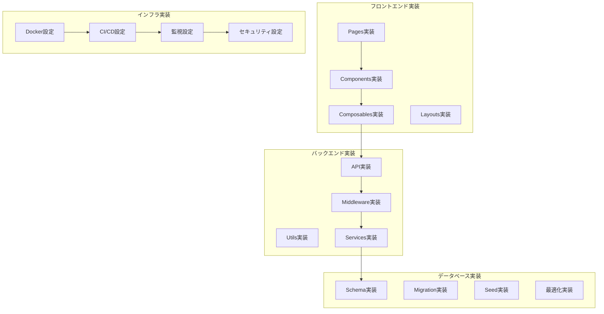

# 包括的実装ガイド統合仕様書

**Doc-ID**: SPEC-2025-017
**Version**: 1.0
**Status**: Active
**Owner**: 金子裕司
**Linked-Docs**: SPEC-2025-014, SPEC-2025-013, SPEC-2025-015

---

## 📋 **概要**

hotel-saasプロジェクトの包括的実装ガイド統合仕様書です。実装手順、設定ガイド、API仕様詳細、UI/UX実装、パフォーマンス最適化など、開発・実装に必要な全ての情報を統合的に定義します。

## 🎯 **実装目標**

### **基本方針**
- **実装品質**: 本番レベルの実装品質を常に維持
- **効率性**: 開発効率と保守性の最適化
- **一貫性**: 統一されたアーキテクチャ・設計パターン
- **拡張性**: 将来の機能拡張に対応可能な実装

### **品質指標**
- 実装完成度: 100%
- コード品質スコア: 9.0/10以上
- パフォーマンススコア: 90以上
- セキュリティスコア: A+

## 🏗️ **実装アーキテクチャ**

### **全体実装構成**


## 💻 **フロントエンド実装ガイド**

### **Pages実装パターン**
```vue
<!-- 標準ページ実装テンプレート -->
<template>
  <div class="page-container">
    <!-- ローディング状態 -->
    <LoadingSpinner v-if="loading" />

    <!-- エラー状態 -->
    <ErrorMessage v-else-if="error" :message="error" />

    <!-- メインコンテンツ -->
    <div v-else class="main-content">
      <PageHeader :title="pageTitle" :breadcrumbs="breadcrumbs" />

      <div class="content-area">
        <!-- 実際のコンテンツ -->
        <slot />
      </div>

      <PageFooter v-if="showFooter" />
    </div>
  </div>
</template>

<script setup lang="ts">
interface Props {
  pageTitle: string
  breadcrumbs?: BreadcrumbItem[]
  showFooter?: boolean
}

const props = withDefaults(defineProps<Props>(), {
  showFooter: true
})

// ページメタデータ設定
definePageMeta({
  layout: 'admin',
  middleware: 'admin-auth'
})

// SEO設定
useSeoMeta({
  title: props.pageTitle,
  description: `${props.pageTitle} - hotel-saas管理画面`
})

// 状態管理
const loading = ref(false)
const error = ref<string | null>(null)

// ページ初期化
onMounted(async () => {
  await initializePage()
})

async function initializePage() {
  loading.value = true
  error.value = null

  try {
    // ページ固有の初期化処理
    await loadPageData()
  } catch (err) {
    error.value = err instanceof Error ? err.message : 'Unknown error'
  } finally {
    loading.value = false
  }
}
</script>

<style scoped>
.page-container {
  @apply min-h-screen bg-gray-50;
}

.main-content {
  @apply container mx-auto px-4 py-6;
}

.content-area {
  @apply bg-white rounded-lg shadow-sm p-6;
}
</style>
```

### **Components実装パターン**
```vue
<!-- 再利用可能コンポーネントテンプレート -->
<template>
  <div :class="containerClasses">
    <div v-if="title" class="component-header">
      <h3 class="title">{{ title }}</h3>
      <div v-if="$slots.actions" class="actions">
        <slot name="actions" />
      </div>
    </div>

    <div class="component-body">
      <slot />
    </div>

    <div v-if="$slots.footer" class="component-footer">
      <slot name="footer" />
    </div>
  </div>
</template>

<script setup lang="ts">
interface Props {
  title?: string
  variant?: 'default' | 'card' | 'bordered'
  size?: 'sm' | 'md' | 'lg'
}

const props = withDefaults(defineProps<Props>(), {
  variant: 'default',
  size: 'md'
})

// 動的クラス計算
const containerClasses = computed(() => [
  'component-container',
  `variant-${props.variant}`,
  `size-${props.size}`
])
</script>

<style scoped>
.component-container {
  @apply w-full;
}

.variant-card {
  @apply bg-white rounded-lg shadow-sm border;
}

.variant-bordered {
  @apply border border-gray-200 rounded-md;
}

.component-header {
  @apply flex justify-between items-center mb-4;
}

.title {
  @apply text-lg font-semibold text-gray-900;
}

.size-sm .title {
  @apply text-base;
}

.size-lg .title {
  @apply text-xl;
}
</style>
```

### **Composables実装パターン**
```typescript
// 標準Composable実装テンプレート
export function useDataFetcher<T>(
  endpoint: string,
  options: {
    immediate?: boolean
    transform?: (data: any) => T
    onError?: (error: Error) => void
  } = {}
) {
  const { immediate = true, transform, onError } = options

  // 状態管理
  const data = ref<T | null>(null)
  const loading = ref(false)
  const error = ref<string | null>(null)

  // API クライアント
  const apiClient = useApiClient()

  // データ取得関数
  const fetch = async (params?: Record<string, any>) => {
    loading.value = true
    error.value = null

    try {
      const response = await apiClient.authenticatedFetch(endpoint, {
        method: 'GET',
        query: params
      })

      data.value = transform ? transform(response.data) : response.data
    } catch (err) {
      const errorMessage = err instanceof Error ? err.message : 'Unknown error'
      error.value = errorMessage

      if (onError) {
        onError(err instanceof Error ? err : new Error(errorMessage))
      }
    } finally {
      loading.value = false
    }
  }

  // リフレッシュ関数
  const refresh = () => fetch()

  // 初期実行
  if (immediate) {
    onMounted(() => fetch())
  }

  return {
    data: readonly(data),
    loading: readonly(loading),
    error: readonly(error),
    fetch,
    refresh
  }
}

// 使用例
export function useOrders() {
  const {
    data: orders,
    loading,
    error,
    fetch: fetchOrders,
    refresh: refreshOrders
  } = useDataFetcher<Order[]>('/api/v1/orders', {
    transform: (response) => response.orders || []
  })

  // 注文作成
  const createOrder = async (orderData: CreateOrderRequest) => {
    const apiClient = useApiClient()

    try {
      const response = await apiClient.authenticatedFetch('/api/v1/orders', {
        method: 'POST',
        body: orderData
      })

      // 成功後にリフレッシュ
      await refreshOrders()

      return response.data
    } catch (error) {
      throw error
    }
  }

  return {
    orders,
    loading,
    error,
    fetchOrders,
    refreshOrders,
    createOrder
  }
}
```

## 🔧 **バックエンド実装ガイド**

### **API実装パターン**
```typescript
// 標準API実装テンプレート
export default defineEventHandler(async (event) => {
  try {
    // 1. 認証チェック
    const authUser = await verifyAuth(event)
    if (!authUser) {
      throw createError({
        statusCode: 401,
        statusMessage: 'Unauthorized'
      })
    }

    // 2. リクエスト検証
    const method = getMethod(event)
    let validatedData: any

    if (method === 'GET') {
      const query = getQuery(event)
      validatedData = await validateQuery(query, querySchema)
    } else {
      const body = await readBody(event)
      validatedData = await validateBody(body, bodySchema)
    }

    // 3. ビジネスロジック実行
    const result = await executeBusinessLogic(validatedData, authUser)

    // 4. レスポンス返却
    return {
      success: true,
      data: result,
      timestamp: new Date().toISOString()
    }

  } catch (error) {
    // エラーハンドリング
    console.error('API Error:', error)

    if (error.statusCode) {
      throw error
    }

    throw createError({
      statusCode: 500,
      statusMessage: 'Internal Server Error'
    })
  }
})

// ビジネスロジック実装
async function executeBusinessLogic(data: any, authUser: AuthUser) {
  // hotel-common API呼び出し
  const response = await $fetch(`${HOTEL_COMMON_API_URL}/api/v1/target-endpoint`, {
    method: 'POST',
    headers: {
      'Authorization': `Bearer ${authUser.token}`,
      'Content-Type': 'application/json'
    },
    body: data
  })

  return response.data
}

// バリデーションスキーマ
const querySchema = z.object({
  page: z.coerce.number().min(1).default(1),
  limit: z.coerce.number().min(1).max(100).default(20),
  search: z.string().optional()
})

const bodySchema = z.object({
  name: z.string().min(1).max(255),
  email: z.string().email(),
  data: z.record(z.any()).optional()
})
```

### **Middleware実装パターン**
```typescript
// 認証ミドルウェア実装
export default defineNuxtRouteMiddleware((to, from) => {
  // クライアントサイドでのみ実行
  if (process.server) return

  const { isAuthenticated, user } = useJwtAuth()

  // 認証チェック
  if (!isAuthenticated.value) {
    throw createError({
      statusCode: 401,
      statusMessage: 'Authentication required'
    })
  }

  // 権限チェック（必要に応じて）
  if (to.meta.requiresRole && user.value?.role !== to.meta.requiresRole) {
    throw createError({
      statusCode: 403,
      statusMessage: 'Insufficient permissions'
    })
  }
})

// サーバーサイドミドルウェア実装
export default defineEventHandler(async (event) => {
  // 特定のパスのみ処理
  if (!event.node.req.url?.startsWith('/api/v1/admin/')) {
    return
  }

  try {
    // 認証トークン検証
    const authHeader = getHeader(event, 'authorization')
    if (!authHeader?.startsWith('Bearer ')) {
      throw createError({
        statusCode: 401,
        statusMessage: 'Missing or invalid authorization header'
      })
    }

    const token = authHeader.substring(7)
    const user = await verifyJwtToken(token)

    // コンテキストに認証情報を設定
    event.context.user = user

  } catch (error) {
    throw createError({
      statusCode: 401,
      statusMessage: 'Invalid authentication token'
    })
  }
})
```

## 🗄️ **データベース実装ガイド**

### **Schema実装パターン**
```prisma
// 標準テーブル設計パターン
model ExampleEntity {
  // 主キー（UUID推奨）
  id        String   @id @default(cuid())

  // テナント分離（必須）
  tenantId  String
  tenant    Tenant   @relation(fields: [tenantId], references: [id], onDelete: Cascade)

  // ビジネスデータ
  name      String   @db.VarChar(255)
  email     String?  @db.VarChar(255)
  status    String   @default("active") @db.VarChar(20)

  // JSON データ（柔軟性確保）
  metadata  Json?    @default("{}")
  settings  Json?    @default("{}")

  // 監査フィールド（必須）
  createdAt DateTime @default(now())
  updatedAt DateTime @updatedAt
  createdBy String?
  updatedBy String?

  // インデックス
  @@index([tenantId])
  @@index([tenantId, status])
  @@index([createdAt])

  // 制約
  @@unique([tenantId, email])

  @@map("example_entities")
}

// リレーション設計パターン
model Order {
  id          String      @id @default(cuid())
  tenantId    String

  // 基本情報
  orderNumber String      @db.VarChar(50)
  roomNumber  String      @db.VarChar(20)
  status      OrderStatus @default(RECEIVED)

  // 金額情報
  subtotal    Int         @default(0)
  tax         Int         @default(0)
  total       Int         @default(0)

  // リレーション
  tenant      Tenant      @relation(fields: [tenantId], references: [id], onDelete: Cascade)
  items       OrderItem[]

  // 監査フィールド
  createdAt   DateTime    @default(now())
  updatedAt   DateTime    @updatedAt

  @@index([tenantId, status])
  @@unique([tenantId, orderNumber])
  @@map("orders")
}

enum OrderStatus {
  RECEIVED
  COOKING
  READY
  DELIVERING
  COMPLETED
  CANCELLED
}
```

### **Migration実装パターン**
```sql
-- 標準マイグレーション実装
-- CreateExampleEntity
CREATE TABLE "example_entities" (
    "id" TEXT NOT NULL,
    "tenantId" TEXT NOT NULL,
    "name" VARCHAR(255) NOT NULL,
    "email" VARCHAR(255),
    "status" VARCHAR(20) NOT NULL DEFAULT 'active',
    "metadata" JSONB DEFAULT '{}',
    "settings" JSONB DEFAULT '{}',
    "createdAt" TIMESTAMP(3) NOT NULL DEFAULT CURRENT_TIMESTAMP,
    "updatedAt" TIMESTAMP(3) NOT NULL,
    "createdBy" TEXT,
    "updatedBy" TEXT,

    CONSTRAINT "example_entities_pkey" PRIMARY KEY ("id")
);

-- インデックス作成
CREATE INDEX "example_entities_tenantId_idx" ON "example_entities"("tenantId");
CREATE INDEX "example_entities_tenantId_status_idx" ON "example_entities"("tenantId", "status");
CREATE INDEX "example_entities_createdAt_idx" ON "example_entities"("createdAt");

-- ユニーク制約
CREATE UNIQUE INDEX "example_entities_tenantId_email_key" ON "example_entities"("tenantId", "email");

-- 外部キー制約
ALTER TABLE "example_entities" ADD CONSTRAINT "example_entities_tenantId_fkey" FOREIGN KEY ("tenantId") REFERENCES "tenants"("id") ON DELETE CASCADE ON UPDATE CASCADE;

-- RLS (Row Level Security) 設定
ALTER TABLE "example_entities" ENABLE ROW LEVEL SECURITY;

CREATE POLICY "example_entities_tenant_isolation" ON "example_entities"
  FOR ALL TO authenticated
  USING ("tenantId" = current_setting('app.current_tenant_id')::TEXT);
```

## 🎨 **UI/UX実装ガイド**

### **デザインシステム実装**
```typescript
// カラーシステム実装
export const colors = {
  // プライマリカラー
  primary: {
    50: '#eff6ff',
    100: '#dbeafe',
    500: '#3b82f6',
    600: '#2563eb',
    900: '#1e3a8a'
  },

  // セマンティックカラー
  success: {
    50: '#f0fdf4',
    500: '#22c55e',
    600: '#16a34a'
  },

  error: {
    50: '#fef2f2',
    500: '#ef4444',
    600: '#dc2626'
  },

  warning: {
    50: '#fffbeb',
    500: '#f59e0b',
    600: '#d97706'
  }
} as const

// タイポグラフィシステム
export const typography = {
  fontFamily: {
    sans: ['Inter', 'system-ui', 'sans-serif'],
    mono: ['JetBrains Mono', 'monospace']
  },

  fontSize: {
    xs: ['0.75rem', { lineHeight: '1rem' }],
    sm: ['0.875rem', { lineHeight: '1.25rem' }],
    base: ['1rem', { lineHeight: '1.5rem' }],
    lg: ['1.125rem', { lineHeight: '1.75rem' }],
    xl: ['1.25rem', { lineHeight: '1.75rem' }],
    '2xl': ['1.5rem', { lineHeight: '2rem' }]
  }
} as const

// スペーシングシステム
export const spacing = {
  px: '1px',
  0: '0px',
  1: '0.25rem',
  2: '0.5rem',
  3: '0.75rem',
  4: '1rem',
  5: '1.25rem',
  6: '1.5rem',
  8: '2rem',
  10: '2.5rem',
  12: '3rem',
  16: '4rem',
  20: '5rem',
  24: '6rem'
} as const
```

### **コンポーネントライブラリ実装**
```vue
<!-- Button コンポーネント -->
<template>
  <button
    :type="type"
    :disabled="disabled || loading"
    :class="buttonClasses"
    @click="handleClick"
  >
    <LoadingSpinner v-if="loading" class="w-4 h-4 mr-2" />
    <Icon v-else-if="icon" :name="icon" class="w-4 h-4 mr-2" />

    <span>{{ label }}</span>
  </button>
</template>

<script setup lang="ts">
interface Props {
  label: string
  variant?: 'primary' | 'secondary' | 'danger' | 'ghost'
  size?: 'sm' | 'md' | 'lg'
  type?: 'button' | 'submit' | 'reset'
  disabled?: boolean
  loading?: boolean
  icon?: string
}

const props = withDefaults(defineProps<Props>(), {
  variant: 'primary',
  size: 'md',
  type: 'button'
})

const emit = defineEmits<{
  click: [event: MouseEvent]
}>()

// 動的クラス計算
const buttonClasses = computed(() => [
  'inline-flex items-center justify-center font-medium rounded-md transition-colors focus:outline-none focus:ring-2 focus:ring-offset-2',

  // サイズ
  {
    'px-3 py-2 text-sm': props.size === 'sm',
    'px-4 py-2 text-base': props.size === 'md',
    'px-6 py-3 text-lg': props.size === 'lg'
  },

  // バリアント
  {
    'bg-blue-600 text-white hover:bg-blue-700 focus:ring-blue-500': props.variant === 'primary',
    'bg-gray-200 text-gray-900 hover:bg-gray-300 focus:ring-gray-500': props.variant === 'secondary',
    'bg-red-600 text-white hover:bg-red-700 focus:ring-red-500': props.variant === 'danger',
    'bg-transparent text-gray-700 hover:bg-gray-100 focus:ring-gray-500': props.variant === 'ghost'
  },

  // 状態
  {
    'opacity-50 cursor-not-allowed': props.disabled || props.loading
  }
])

const handleClick = (event: MouseEvent) => {
  if (!props.disabled && !props.loading) {
    emit('click', event)
  }
}
</script>
```

## 🚀 **パフォーマンス最適化実装**

### **フロントエンド最適化**
```typescript
// 画像最適化実装
export function useImageOptimization() {
  const optimizeImage = (src: string, options: {
    width?: number
    height?: number
    quality?: number
    format?: 'webp' | 'avif' | 'jpg' | 'png'
  } = {}) => {
    const { width, height, quality = 80, format = 'webp' } = options

    // Nuxt Image を使用した最適化
    return $img(src, {
      width,
      height,
      quality,
      format,
      loading: 'lazy'
    })
  }

  return { optimizeImage }
}

// 遅延ローディング実装
export function useLazyLoading<T>(
  loadFn: () => Promise<T>,
  options: {
    threshold?: number
    rootMargin?: string
  } = {}
) {
  const { threshold = 0.1, rootMargin = '50px' } = options

  const data = ref<T | null>(null)
  const loading = ref(false)
  const error = ref<string | null>(null)
  const elementRef = ref<HTMLElement>()

  const load = async () => {
    if (loading.value || data.value) return

    loading.value = true
    error.value = null

    try {
      data.value = await loadFn()
    } catch (err) {
      error.value = err instanceof Error ? err.message : 'Load error'
    } finally {
      loading.value = false
    }
  }

  // Intersection Observer セットアップ
  onMounted(() => {
    if (!elementRef.value) return

    const observer = new IntersectionObserver(
      (entries) => {
        if (entries[0].isIntersecting) {
          load()
          observer.disconnect()
        }
      },
      { threshold, rootMargin }
    )

    observer.observe(elementRef.value)

    onUnmounted(() => observer.disconnect())
  })

  return {
    data: readonly(data),
    loading: readonly(loading),
    error: readonly(error),
    elementRef,
    load
  }
}
```

### **バックエンド最適化**
```typescript
// キャッシュ実装
export function useCache() {
  const redis = useRedis()

  const get = async <T>(key: string): Promise<T | null> => {
    try {
      const cached = await redis.get(key)
      return cached ? JSON.parse(cached) : null
    } catch (error) {
      console.error('Cache get error:', error)
      return null
    }
  }

  const set = async <T>(
    key: string,
    value: T,
    ttl: number = 300 // 5分
  ): Promise<void> => {
    try {
      await redis.setex(key, ttl, JSON.stringify(value))
    } catch (error) {
      console.error('Cache set error:', error)
    }
  }

  const del = async (key: string): Promise<void> => {
    try {
      await redis.del(key)
    } catch (error) {
      console.error('Cache delete error:', error)
    }
  }

  return { get, set, del }
}

// API レスポンスキャッシュ実装
export function withCache<T>(
  key: string,
  fetchFn: () => Promise<T>,
  ttl: number = 300
) {
  return async (): Promise<T> => {
    const cache = useCache()

    // キャッシュから取得試行
    const cached = await cache.get<T>(key)
    if (cached) {
      return cached
    }

    // データ取得・キャッシュ保存
    const data = await fetchFn()
    await cache.set(key, data, ttl)

    return data
  }
}
```

## 🔒 **セキュリティ実装ガイド**

### **認証・認可実装**
```typescript
// JWT 実装
export function useJwtSecurity() {
  const generateToken = async (payload: any, expiresIn: string = '1h') => {
    const secret = process.env.JWT_SECRET
    if (!secret) throw new Error('JWT_SECRET not configured')

    return jwt.sign(payload, secret, { expiresIn })
  }

  const verifyToken = async (token: string) => {
    const secret = process.env.JWT_SECRET
    if (!secret) throw new Error('JWT_SECRET not configured')

    try {
      return jwt.verify(token, secret) as any
    } catch (error) {
      throw new Error('Invalid token')
    }
  }

  const refreshToken = async (token: string) => {
    const payload = await verifyToken(token)
    delete payload.iat
    delete payload.exp

    return generateToken(payload)
  }

  return { generateToken, verifyToken, refreshToken }
}

// 入力値検証実装
export function useInputValidation() {
  const sanitizeHtml = (input: string): string => {
    return DOMPurify.sanitize(input, {
      ALLOWED_TAGS: ['b', 'i', 'em', 'strong', 'p', 'br'],
      ALLOWED_ATTR: []
    })
  }

  const validateEmail = (email: string): boolean => {
    const emailRegex = /^[^\s@]+@[^\s@]+\.[^\s@]+$/
    return emailRegex.test(email)
  }

  const validatePassword = (password: string): {
    isValid: boolean
    errors: string[]
  } => {
    const errors: string[] = []

    if (password.length < 8) {
      errors.push('パスワードは8文字以上である必要があります')
    }

    if (!/[A-Z]/.test(password)) {
      errors.push('大文字を含む必要があります')
    }

    if (!/[a-z]/.test(password)) {
      errors.push('小文字を含む必要があります')
    }

    if (!/\d/.test(password)) {
      errors.push('数字を含む必要があります')
    }

    return {
      isValid: errors.length === 0,
      errors
    }
  }

  return { sanitizeHtml, validateEmail, validatePassword }
}
```

## 📊 **監視・ログ実装**

### **ログ実装**
```typescript
// 構造化ログ実装
export function useLogger() {
  const logger = winston.createLogger({
    level: process.env.LOG_LEVEL || 'info',
    format: winston.format.combine(
      winston.format.timestamp(),
      winston.format.errors({ stack: true }),
      winston.format.json()
    ),
    transports: [
      new winston.transports.File({ filename: 'logs/error.log', level: 'error' }),
      new winston.transports.File({ filename: 'logs/combined.log' }),
      new winston.transports.Console({
        format: winston.format.simple()
      })
    ]
  })

  const logRequest = (event: any) => {
    logger.info('API Request', {
      method: getMethod(event),
      url: getRequestURL(event),
      userAgent: getHeader(event, 'user-agent'),
      ip: getClientIP(event),
      timestamp: new Date().toISOString()
    })
  }

  const logError = (error: Error, context?: any) => {
    logger.error('Application Error', {
      message: error.message,
      stack: error.stack,
      context,
      timestamp: new Date().toISOString()
    })
  }

  return { logger, logRequest, logError }
}

// メトリクス実装
export function useMetrics() {
  const prometheus = require('prom-client')

  // カスタムメトリクス定義
  const httpRequestDuration = new prometheus.Histogram({
    name: 'http_request_duration_seconds',
    help: 'Duration of HTTP requests in seconds',
    labelNames: ['method', 'route', 'status_code']
  })

  const httpRequestTotal = new prometheus.Counter({
    name: 'http_requests_total',
    help: 'Total number of HTTP requests',
    labelNames: ['method', 'route', 'status_code']
  })

  const recordRequest = (
    method: string,
    route: string,
    statusCode: number,
    duration: number
  ) => {
    httpRequestDuration
      .labels(method, route, statusCode.toString())
      .observe(duration)

    httpRequestTotal
      .labels(method, route, statusCode.toString())
      .inc()
  }

  return { recordRequest, register: prometheus.register }
}
```

---

## 📋 **関連ドキュメント**

- **SPEC-2025-014**: 開発ガイドライン統合仕様書
- **SPEC-2025-013**: 移行・統合戦略仕様書
- **SPEC-2025-015**: テスト・品質保証戦略仕様書
