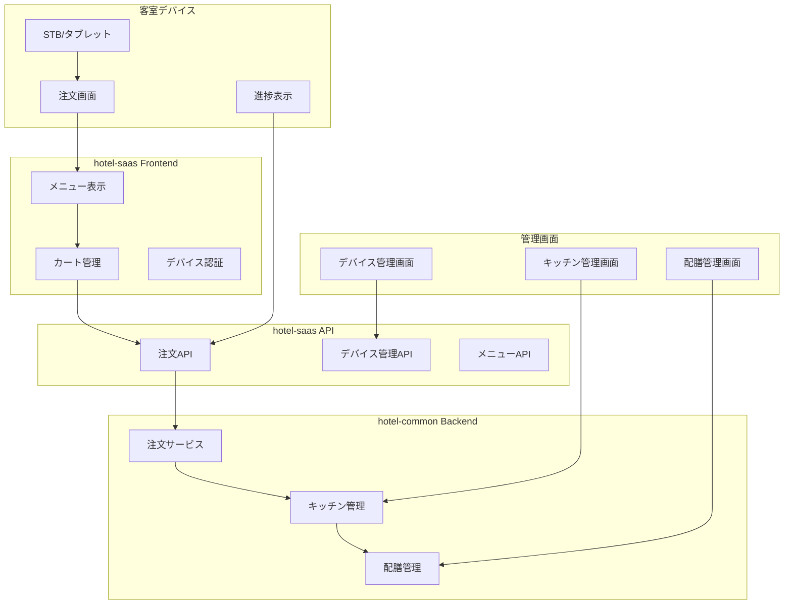
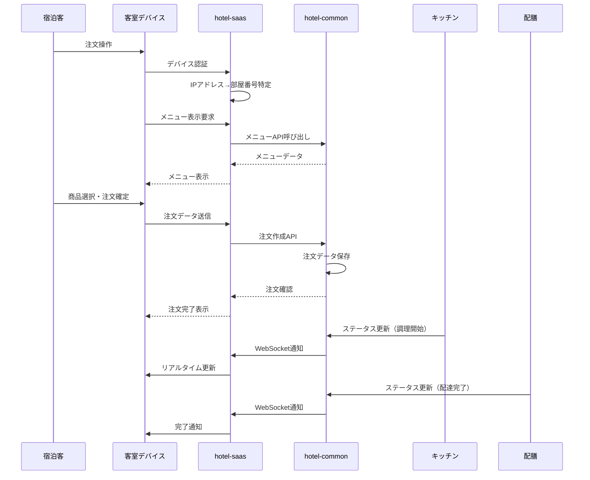
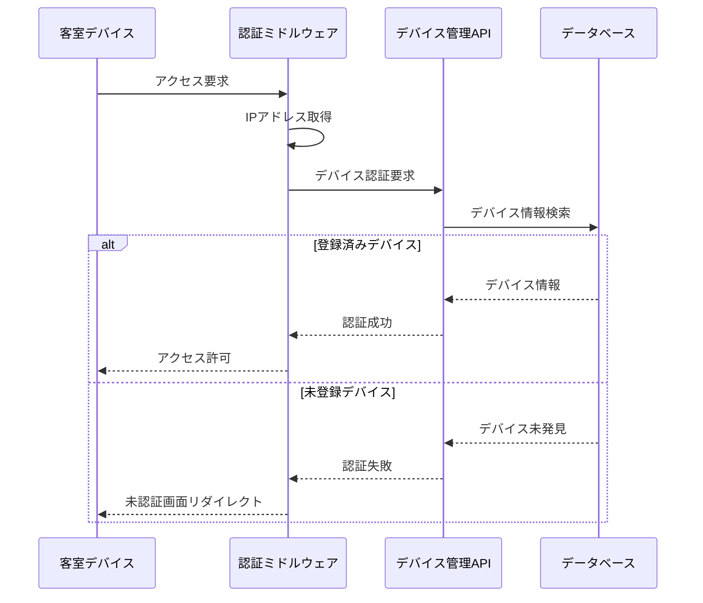

# 注文管理システム統合仕様書

**Doc-ID**: SPEC-2025-007
**Version**: 1.0
**Status**: Active
**Owner**: 金子裕司
**Linked-Docs**: SPEC-2025-003, SPEC-2025-004, SPEC-2025-005, SPEC-2025-006

---

## 📋 **概要**

hotel-saasプロジェクトの注文管理システムの包括的仕様書です。客室からの注文受付、調理・配膳管理、デバイス認証、カテゴリ・タグ管理を統合的に定義します。

## 🎯 **システム目標**

### **基本方針**
- **1オーダー1配膳制**: 効率的なルームサービス運用
- **リアルタイム可視化**: 注文〜配達完了までの進捗追跡
- **デバイス自動認証**: 客室STB/タブレットでのシームレス利用
- **多言語対応**: 日英対応の商品・カテゴリ管理

### **ユーザー体験目標**
- 客室デバイスでの直感的な注文操作
- リアルタイムな注文状況確認
- 年齢制限商品の適切な制御
- アップセル提案による売上向上

## 🏗️ **システムアーキテクチャ**

### **注文フロー全体像**


### **データフロー**


## 🔐 **デバイス認証システム**

### **認証方式**
```typescript
interface DeviceAuth {
  // 認証方法
  method: 'ip_address' | 'mac_address' | 'room_code'

  // デバイス情報
  device: {
    id: string
    name: string
    type: 'stb' | 'tablet' | 'tv'
    room_number: string
    ip_address?: string
    mac_address?: string
    status: 'active' | 'inactive'
  }

  // 認証結果
  auth_result: {
    authenticated: boolean
    room_id: string
    tenant_id: string
    permissions: string[]
  }
}
```

### **認証フロー**


### **デバイス管理機能**
```yaml
管理画面パス: /admin/devices

機能一覧:
  - デバイス一覧表示（検索・フィルタリング）
  - 新規デバイス登録
  - 既存デバイス編集（部屋番号、ステータス等）
  - デバイス削除（論理削除）
  - ステータス管理（有効/無効切り替え）

データモデル:
  - id: デバイス識別子
  - name: デバイス名
  - room_number: 部屋番号
  - device_type: デバイス種別
  - ip_address: IPアドレス
  - mac_address: MACアドレス
  - status: ステータス
  - created_at: 登録日時
  - updated_at: 更新日時
```

## 🛒 **注文管理システム**

### **注文ステータス管理**
```typescript
enum OrderStatus {
  RECEIVED = 'received',      // 受付済み
  COOKING = 'cooking',        // 調理中
  READY = 'ready',           // 配達待ち
  DELIVERING = 'delivering',  // 配達中
  DONE = 'done',             // 配達完了
  CANCELLED = 'cancelled'     // キャンセル
}

interface Order {
  id: string
  room_number: string
  status: OrderStatus
  total_amount: number
  tax_amount: number
  items: OrderItem[]
  created_at: string
  updated_at: string
  estimated_time?: number
  special_requests?: string
}

interface OrderItem {
  id: string
  order_id: string
  menu_item_id: string
  name: string
  price: number
  quantity: number
  status: OrderStatus
  notes?: string
}
```

### **1オーダー1配膳制**
```yaml
基本原則:
  - 1つの注文に対して1回の配膳で全商品を提供
  - 全商品の準備完了まで配達開始不可
  - 商品ごとの個別ステータス管理
  - 注文全体のステータスは商品ステータスから自動算出

ステータス遷移ルール:
  received → cooking: 調理開始時
  cooking → ready: 全商品準備完了時
  ready → delivering: 配達開始時
  delivering → done: 配達完了時

配膳管理:
  - 看板方式のステータス表示
  - 商品ごとのチェックリスト
  - リアルタイム進捗更新
  - 効果音・デスクトップ通知
```

### **リアルタイム通知システム**
```typescript
interface OrderNotification {
  type: 'order_status_changed' | 'new_order' | 'order_cancelled'
  data: {
    order_id: string
    room_number: string
    status: OrderStatus
    previous_status?: OrderStatus
    estimated_time?: number
    message?: string
    items: Array<{
      id: string
      name: string
      status: OrderStatus
    }>
  }
  metadata: {
    timestamp: string
    source: 'kitchen' | 'delivery' | 'customer'
    tenant_id: string
    room_id: string
  }
}
```

## 🏷️ **カテゴリ・タグ管理システム**

### **データモデル**
```typescript
interface MenuItem {
  id: number
  name_ja: string
  name_en: string
  description_ja?: string
  description_en?: string
  price: number
  image_url?: string
  tags: Tag[]

  // 販売制御
  start_time?: string        // HH:mm形式
  end_time?: string          // HH:mm形式
  age_restricted?: boolean   // 年齢制限
  is_upsell?: boolean       // アップセル対象

  // 表示制御
  display_start?: string     // 表示開始日時
  display_end?: string       // 表示終了日時
  is_hidden?: boolean        // 非表示フラグ

  // 特別メニュー
  access_code?: string       // 裏メニューアクセスコード
}

interface Tag {
  id: number
  path: string              // 階層パス（例: "food/meal/sandwich"）
  name_ja: string
  name_en: string
  aliases: string[]         // 検索用エイリアス
  items: MenuItem[]
}

interface Category {
  id: number
  name_ja: string
  name_en: string
  tag_prefix: string        // 対象タグのプレフィックス
  sort_order: number
  is_active: boolean
}
```

### **階層タグシステム**
```yaml
タグ階層構造:
  L1/L2/L3形式: "food/meal/sandwich"

階層例:
  food/                     # 大カテゴリ
    meal/                   # 中カテゴリ
      sandwich/             # 小カテゴリ
      pasta/
      rice/
    snack/
      chips/
      nuts/
  drink/
    coffee/
      hot/
      iced/
    alcohol/
      beer/
      wine/

検索方式:
  - プレフィックス検索でカテゴリ配下の商品を取得
  - エイリアス機能で多言語・同義語検索対応
  - 階層の深さは可変（最大3階層推奨）
```

### **カテゴリ内ランキング**
```typescript
interface CategoryRanking {
  category_id: number
  ranking_type: 'sales' | 'popularity' | 'recommendation'
  period: 'daily' | 'weekly' | 'monthly'
  items: Array<{
    menu_item_id: number
    rank: number
    score: number
    sales_count?: number
    rating?: number
  }>
  updated_at: string
}
```

## 🎯 **特殊機能仕様**

### **年齢確認フロー**
```yaml
対象商品: age_restricted = true
確認方式: 生年月日入力（日付ピッカー）

フロー:
  1. 年齢制限商品をカート追加時
  2. モーダル表示（生年月日入力）
  3. 20歳未満チェック → NG時はトースト表示
  4. OK時はカート追加実行
  5. 24時間キャッシュ（localStorage.ageVerified）

UI要素:
  - 📅 日付ピッカー
  - バリデーションメッセージ
  - 確認・キャンセルボタン
```

### **アップセル提案システム**
```yaml
トリガー: カート追加直後
アルゴリズム: 同カテゴリでis_upsell=trueの商品を優先表示

表示ルール:
  - 最大3商品まで表示
  - 価格帯を考慮した提案
  - 既にカートに入っている商品は除外
  - ランダム要素を含む表示順

UI設計:
  - モーダルまたはサイドパネル表示
  - 商品画像・名前・価格表示
  - ワンクリック追加ボタン
  - 「提案を閉じる」オプション
```

### **販売時間制御**
```yaml
時間制御フィールド:
  - start_time: 販売開始時刻（HH:mm）
  - end_time: 販売終了時刻（HH:mm）

UI制御:
  - 時間外商品: opacity-40 + pointer-events-none
  - ツールチップ: "提供時間外です (10:00 – 22:30)"
  - カート追加ボタン無効化

表示期間制御:
  - display_start: 表示開始日時
  - display_end: 表示終了日時
  - 事前公開機能（販売前の商品告知）
```

### **裏メニューシステム**
```yaml
アクセス方式: 特別なアクセスコード入力
対象商品: access_code フィールド設定済み商品

機能:
  - 隠しメニューページ
  - アクセスコード入力画面
  - 限定商品の特別表示
  - VIP顧客向けサービス

セキュリティ:
  - アクセスコードの暗号化保存
  - 試行回数制限
  - アクセスログ記録
```

## 📊 **管理画面仕様**

### **キッチン管理画面**
```yaml
パス: /admin/kitchen/orders

機能:
  - 注文一覧（ステータス別カラム表示）
  - 商品ごとの準備状態管理
  - ステータス更新（調理開始・完了）
  - カテゴリ別フィルタリング
  - リアルタイム更新

UI設計:
  - 看板方式（Kanban）レイアウト
  - ドラッグ&ドロップでステータス変更
  - 商品チェックリスト
  - タイマー機能
  - 効果音通知
```

### **配膳管理画面**
```yaml
パス: /admin/delivery/manage

機能:
  - 配達待ち注文一覧
  - 配達員アサイン
  - 配達ルート最適化
  - 配達完了報告
  - 配達履歴管理

UI設計:
  - 部屋番号別グループ表示
  - 配達時間予測
  - GPS連携（将来実装）
  - 配達状況リアルタイム更新
```

### **メニュー管理画面**
```yaml
パス: /admin/menu/items

機能:
  - 商品CRUD操作
  - カテゴリ・タグ管理
  - 価格・在庫管理
  - 画像アップロード
  - 多言語対応

UI設計:
  - データテーブル表示
  - インライン編集機能
  - 一括操作機能
  - プレビュー機能
  - インポート・エクスポート
```

## 🔄 **API仕様**

### **注文関連API**
```yaml
POST /api/v1/orders
  説明: 新規注文作成
  認証: デバイス認証
  リクエスト:
    room_number: string
    items: Array<{menu_item_id, quantity, notes?}>
    special_requests?: string
  レスポンス:
    order_id: string
    estimated_time: number
    total_amount: number

GET /api/v1/orders/{order_id}
  説明: 注文詳細取得
  認証: デバイス認証
  レスポンス:
    order: Order
    items: OrderItem[]

PUT /api/v1/admin/orders/{order_id}/status
  説明: 注文ステータス更新
  認証: スタッフ認証
  リクエスト:
    status: OrderStatus
    estimated_time?: number
  レスポンス:
    success: boolean
    updated_order: Order
```

### **メニュー関連API**
```yaml
GET /api/v1/menu/items
  説明: メニュー一覧取得
  認証: デバイス認証
  クエリ:
    category?: string
    tag?: string
    search?: string
    include_hidden?: boolean
  レスポンス:
    items: MenuItem[]
    categories: Category[]
    total: number

GET /api/v1/menu/categories
  説明: カテゴリ一覧取得
  認証: デバイス認証
  レスポンス:
    categories: Category[]
    tags: Tag[]

POST /api/v1/admin/menu/items
  説明: 商品作成
  認証: 管理者認証
  リクエスト:
    name_ja: string
    name_en: string
    price: number
    tag_ids: number[]
    # その他商品属性
  レスポンス:
    item: MenuItem
```

### **デバイス管理API**
```yaml
GET /api/v1/admin/devices
  説明: デバイス一覧取得
  認証: 管理者認証
  クエリ:
    search?: string
    status?: string
    room_number?: string
  レスポンス:
    devices: Device[]
    total: number

POST /api/v1/admin/devices
  説明: デバイス登録
  認証: 管理者認証
  リクエスト:
    name: string
    room_number: string
    device_type: string
    ip_address?: string
    mac_address?: string
  レスポンス:
    device: Device

PUT /api/v1/admin/devices/{device_id}
  説明: デバイス更新
  認証: 管理者認証
  リクエスト:
    name?: string
    room_number?: string
    status?: string
  レスポンス:
    device: Device
```

## 🧪 **テスト仕様**

### **機能テスト**
```yaml
注文フロー:
  - デバイス認証テスト
  - メニュー表示テスト
  - カート操作テスト
  - 注文作成テスト
  - ステータス更新テスト
  - リアルタイム通知テスト

特殊機能:
  - 年齢確認フローテスト
  - アップセル提案テスト
  - 販売時間制御テスト
  - 裏メニューアクセステスト

管理機能:
  - キッチン管理画面テスト
  - 配膳管理画面テスト
  - デバイス管理テスト
  - メニュー管理テスト
```

### **パフォーマンステスト**
```yaml
負荷テスト:
  - 同時注文処理: 100注文/分
  - リアルタイム通知: 1000接続
  - メニュー表示: 1秒以内
  - 注文作成: 2秒以内

ストレステスト:
  - 大量商品表示: 1000商品
  - 長時間稼働: 24時間連続
  - メモリリーク検証
  - データベース負荷測定
```

## 📈 **運用・監視**

### **監視項目**
```yaml
ビジネスメトリクス:
  - 注文数（時間別・日別）
  - 平均注文金額
  - 人気商品ランキング
  - キャンセル率
  - 配達時間

技術メトリクス:
  - API レスポンス時間
  - エラー率
  - WebSocket接続数
  - データベース負荷
  - メモリ使用量

デバイス監視:
  - デバイス稼働状況
  - 認証成功率
  - 未認証アクセス数
  - デバイス障害検知
```

### **アラート設定**
```yaml
緊急アラート:
  - システム障害
  - データベース接続エラー
  - 認証システム障害
  - 注文処理エラー

警告アラート:
  - レスポンス時間遅延
  - エラー率上昇
  - 未認証アクセス増加
  - デバイス障害
```

## 🚀 **今後の拡張計画**

### **Phase 1拡張**
```yaml
機能追加:
  - 在庫管理システム
  - 予約注文機能
  - 定期注文機能
  - クーポン・割引システム

UI/UX改善:
  - 音声注文機能
  - AR商品表示
  - パーソナライゼーション
  - アクセシビリティ向上
```

### **Phase 2拡張**
```yaml
外部連携:
  - POS システム連携
  - 在庫管理システム連携
  - 会計システム連携
  - CRM システム連携

高度な機能:
  - AI レコメンデーション
  - 需要予測
  - 動的価格設定
  - 多言語音声認識
```

---

## 📋 **関連ドキュメント**

- **SPEC-2025-003**: JWT認証システム統合仕様書
- **SPEC-2025-004**: 統合API仕様書
- **SPEC-2025-005**: WebSocket統合設計仕様書
- **SPEC-2025-006**: システムアーキテクチャ設計仕様書
