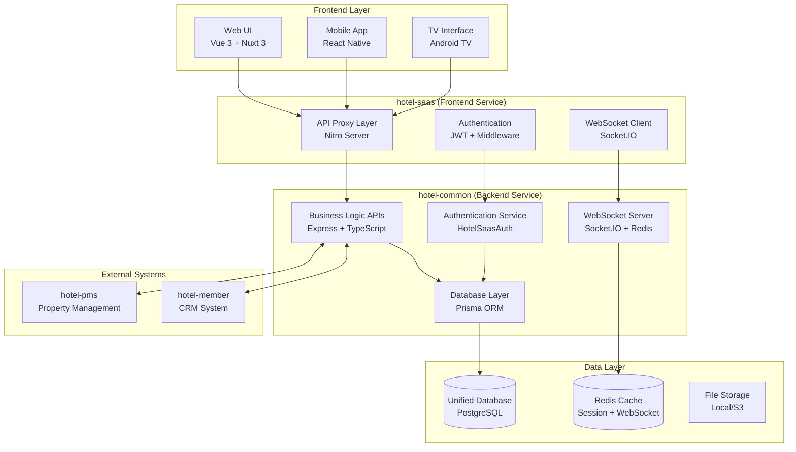
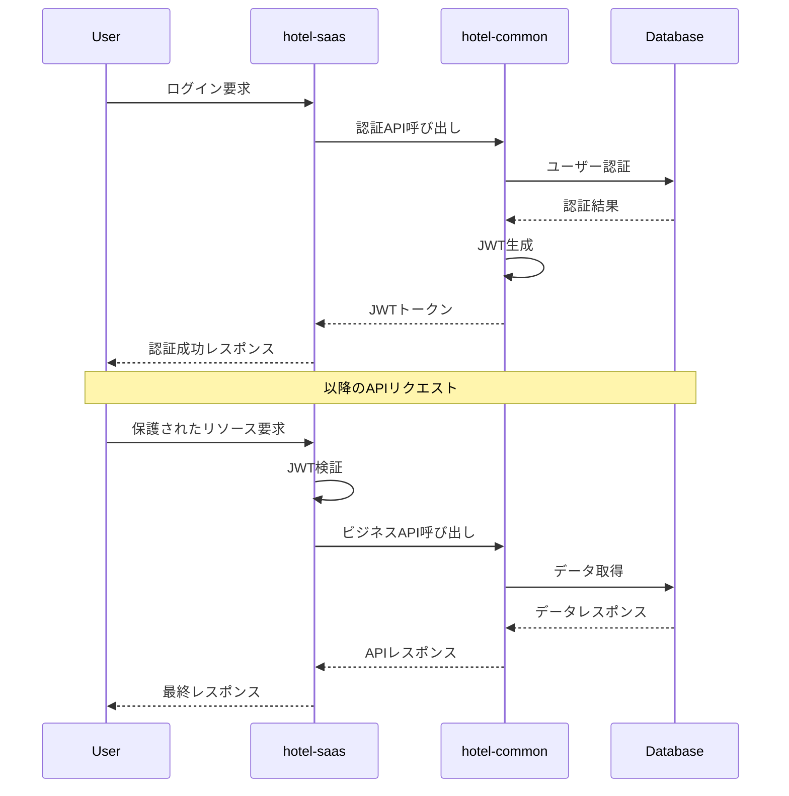
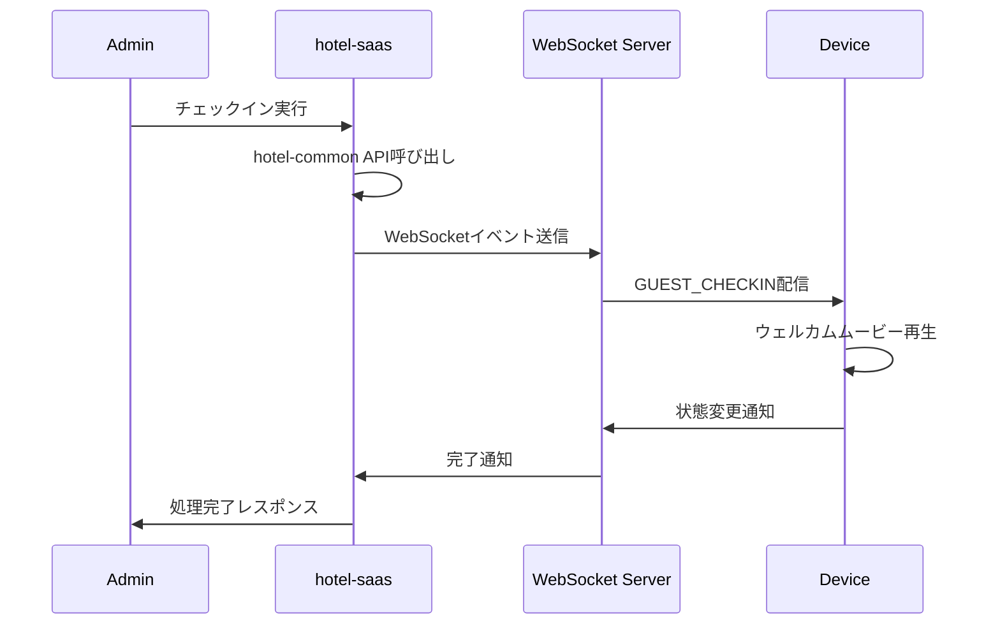

# システムアーキテクチャ設計仕様書

**Doc-ID**: SPEC-2025-006
**Version**: 1.0
**Status**: Active
**Owner**: 金子裕司
**Linked-Docs**: ADR-2025-003, SPEC-2025-003, SPEC-2025-004, SPEC-2025-005

---

## 📋 **概要**

hotel-saasプロジェクトの統合システムアーキテクチャ設計仕様書です。hotel-commonとの統合アーキテクチャ、技術スタック、システム構成を包括的に定義します。

## 🏗️ **統合アーキテクチャ概要**

### **システム全体構成**


### **アーキテクチャ原則**

#### **1. 層分離の厳格化**
```yaml
Frontend Layer (hotel-saas):
  責務:
    - UI/UX提供
    - ユーザーインタラクション処理
    - 認証状態管理
    - API プロキシ機能

  禁止事項:
    - 直接データベースアクセス
    - ビジネスロジック実装
    - データ永続化処理

Backend Layer (hotel-common):
  責務:
    - ビジネスロジック実装
    - データベース管理
    - 認証・認可処理
    - 外部システム連携

  提供機能:
    - RESTful API
    - WebSocket通信
    - 統合認証サービス
```

#### **2. API First設計**
- hotel-commonが全てのビジネスロジックAPIを提供
- hotel-saasは軽量なプロキシレイヤーとして機能
- OpenAPI仕様による契約駆動開発

#### **3. 統合認証システム**
- JWT標準による統一認証
- マルチテナント対応
- ロールベースアクセス制御

## 🔧 **技術スタック**

### **hotel-saas (Frontend Service)**
```yaml
Framework:
  - Nuxt 3: フルスタックフレームワーク
  - Vue 3: UIフレームワーク（Composition API）
  - TypeScript: 型安全性

Styling:
  - Tailwind CSS: ユーティリティファーストCSS
  - Headless UI: アクセシブルなUIコンポーネント
  - Heroicons: アイコンライブラリ

State Management:
  - Pinia: 状態管理
  - Composables: ロジック再利用

HTTP Client:
  - $fetch: Nuxt標準HTTPクライアント
  - ofetch: 軽量fetchラッパー

WebSocket:
  - Socket.IO Client: リアルタイム通信

Development:
  - Vite: 高速ビルドツール
  - ESLint: コード品質
  - Prettier: コードフォーマット
```

### **hotel-kanri (Unified Service)**
```yaml
Framework:
  - Nuxt 3: フルスタックフレームワーク
  - Nitro: サーバーエンジン（Nuxt内蔵）
  - TypeScript: 型安全性

Database:
  - Prisma ORM: データベースアクセス
  - SQLite: 開発環境データベース
  - PostgreSQL: 本番環境データベース（予定）

Authentication:
  - JWT: トークンベース認証
  - @sidebase/nuxt-auth: Nuxt認証モジュール

WebSocket:
  - WebSocket API: リアルタイム通信
  - Nitro WebSocket: サーバーサイド実装

Validation:
  - Zod: スキーマバリデーション

Testing:
  - Jest: テストフレームワーク
  - Supertest: APIテスト
```

## 📁 **ディレクトリ構造**

### **hotel-saas構造**
```
hotel-saas/
├── components/              # UIコンポーネント
│   ├── common/             # 共通コンポーネント
│   ├── admin/              # 管理画面コンポーネント
│   └── ui/                 # 基本UIコンポーネント
├── composables/            # Composition API
│   ├── useJwtAuth.ts       # 認証管理
│   ├── useApiClient.ts     # API呼び出し
│   ├── usePlanFeatures.ts  # プラン機能管理
│   └── useDeviceCheckin.ts # デバイス制御
├── layouts/                # レイアウトテンプレート
│   ├── default.vue         # デフォルトレイアウト
│   ├── admin.vue           # 管理画面レイアウト
│   └── operation.vue       # 運用画面レイアウト
├── middleware/             # ルートミドルウェア
│   └── admin-auth.ts       # 管理者認証ガード
├── pages/                  # ページコンポーネント
│   ├── admin/              # 管理画面
│   ├── order/              # 注文機能
│   ├── info/               # 館内情報
│   └── concierge/          # AIコンシェルジュ
├── server/                 # サーバーサイド
│   ├── api/v1/             # APIエンドポイント
│   ├── middleware/         # サーバーミドルウェア
│   └── utils/              # ユーティリティ
├── stores/                 # Pinia状態管理
└── types/                  # TypeScript型定義
```

### **hotel-common構造**
```
hotel-common/
├── src/
│   ├── controllers/        # APIコントローラー
│   ├── services/           # ビジネスロジック
│   ├── models/             # データモデル
│   ├── middleware/         # Express ミドルウェア
│   ├── auth/               # 認証サービス
│   ├── websocket/          # WebSocket処理
│   ├── utils/              # ユーティリティ
│   └── types/              # TypeScript型定義
├── prisma/                 # Prisma設定
│   ├── schema.prisma       # データベーススキーマ
│   └── migrations/         # マイグレーション
├── tests/                  # テストファイル
└── docs/                   # API仕様書
```

## 🔄 **データフロー**

### **認証フロー**


### **リアルタイム通信フロー**


## 🔐 **セキュリティアーキテクチャ**

### **認証・認可**
```typescript
interface SecurityLayer {
  // 認証レイヤー
  authentication: {
    method: 'JWT'
    provider: 'hotel-common'
    storage: 'localStorage'
    expiration: '24h'
  }

  // 認可レイヤー
  authorization: {
    model: 'RBAC' // Role-Based Access Control
    levels: ['none', 'device', 'staff', 'admin']
    permissions: string[]
  }

  // 通信セキュリティ
  transport: {
    protocol: 'HTTPS'
    websocket: 'WSS'
    headers: ['Authorization', 'Content-Type']
  }
}
```

### **データ保護**
- **暗号化**: HTTPS/TLS 1.3
- **認証トークン**: JWT with RS256
- **セッション管理**: Redis with TTL
- **入力検証**: Zod schema validation
- **SQL インジェクション対策**: Prisma ORM

## 📊 **パフォーマンス設計**

### **レスポンス時間目標**
```yaml
API Response Times:
  認証API: < 500ms
  一般API: < 1000ms
  大量データAPI: < 3000ms
  WebSocket: < 100ms

Page Load Times:
  初回ロード: < 2000ms
  ページ遷移: < 500ms
  SPA遷移: < 200ms
```

### **スケーラビリティ**
```yaml
Concurrent Users:
  hotel-saas: 1,000 users
  hotel-common: 10,000 requests/min
  WebSocket: 5,000 connections

Database:
  Read QPS: 1,000
  Write QPS: 100
  Connection Pool: 20

Cache Strategy:
  Redis: Session + API cache
  Browser: Static assets
  CDN: Media files
```

## 🔍 **監視・ログ**

### **アプリケーション監視**
```typescript
interface MonitoringMetrics {
  // パフォーマンス
  responseTime: number
  throughput: number
  errorRate: number

  // リソース使用量
  cpuUsage: number
  memoryUsage: number
  diskUsage: number

  // ビジネスメトリクス
  activeUsers: number
  apiCalls: number
  websocketConnections: number
}
```

### **ログ管理**
```yaml
Log Levels:
  ERROR: システムエラー、例外
  WARN: 警告、非致命的問題
  INFO: 一般的な情報、API呼び出し
  DEBUG: デバッグ情報（開発環境のみ）

Log Format:
  timestamp: ISO 8601
  level: string
  message: string
  context: object
  request_id: string
  user_id?: string
  tenant_id?: string
```

## 🧪 **テスト戦略**

### **テストピラミッド**
```yaml
Unit Tests (70%):
  - Composables
  - Utilities
  - Business Logic
  - API Controllers

Integration Tests (20%):
  - API Endpoints
  - Database Operations
  - WebSocket Events
  - Authentication Flow

E2E Tests (10%):
  - User Journeys
  - Critical Paths
  - Cross-browser Testing
  - Mobile Responsive
```

### **テスト環境**
```yaml
Development:
  database: SQLite (local)
  redis: Local instance
  external_apis: Mock

Staging:
  database: PostgreSQL (staging)
  redis: Redis cluster
  external_apis: Staging endpoints

Production:
  database: PostgreSQL (production)
  redis: Redis cluster
  external_apis: Production endpoints
```

## 🚀 **デプロイメント戦略**

### **環境構成**
```yaml
Development:
  hotel-saas: localhost:3100
  hotel-common: localhost:3400
  database: localhost:5432
  redis: localhost:6379

Staging:
  hotel-saas: staging-saas.example.com
  hotel-common: staging-common.example.com
  database: staging-db.example.com
  redis: staging-redis.example.com

Production:
  hotel-saas: hotel-saas.example.com
  hotel-common: hotel-common.example.com
  database: prod-db.example.com
  redis: prod-redis.example.com
```

### **CI/CD パイプライン**
```yaml
Build Pipeline:
  1. Code Quality Check (ESLint, Prettier)
  2. Type Check (TypeScript)
  3. Unit Tests
  4. Integration Tests
  5. Build Assets
  6. Security Scan
  7. Deploy to Staging
  8. E2E Tests
  9. Deploy to Production

Deployment Strategy:
  - Blue-Green Deployment
  - Health Check Endpoints
  - Rollback Capability
  - Zero-downtime Updates
```

## 📈 **拡張性設計**

### **水平スケーリング**
```yaml
hotel-saas:
  - Load Balancer (Nginx)
  - Multiple Instances
  - Stateless Design
  - CDN Integration

hotel-common:
  - API Gateway
  - Microservices Ready
  - Database Sharding
  - Redis Clustering
```

### **将来拡張**
```yaml
Planned Extensions:
  - Mobile App Support
  - Multi-language Support
  - AI/ML Integration
  - IoT Device Integration
  - Third-party Integrations

Architecture Evolution:
  - Microservices Migration
  - Event-driven Architecture
  - CQRS Pattern
  - Domain-driven Design
```

## 🎊 **アーキテクチャの利点**

### **開発効率**
- **明確な責務分離**: フロントエンド・バックエンドの役割明確化
- **API First**: 契約駆動開発による並行開発
- **型安全性**: TypeScriptによる開発時エラー削減

### **保守性**
- **統一認証**: 認証ロジックの一元管理
- **プロキシパターン**: hotel-saasの軽量化
- **ドキュメント管理**: 体系的な仕様管理

### **スケーラビリティ**
- **層分離**: 各層の独立スケーリング
- **WebSocket**: リアルタイム通信の効率化
- **キャッシュ戦略**: パフォーマンス最適化

### **セキュリティ**
- **統一認証**: セキュリティポリシーの一貫性
- **API Gateway**: 集約されたセキュリティ制御
- **データ保護**: 暗号化・検証の標準化

---

## 📋 **関連ドキュメント**

- **SPEC-2025-003**: JWT認証システム統合仕様書
- **SPEC-2025-004**: 統合API仕様書
- **SPEC-2025-005**: WebSocket統合設計仕様書
- **ADR-2025-003**: データベースアクセスポリシーの決定
