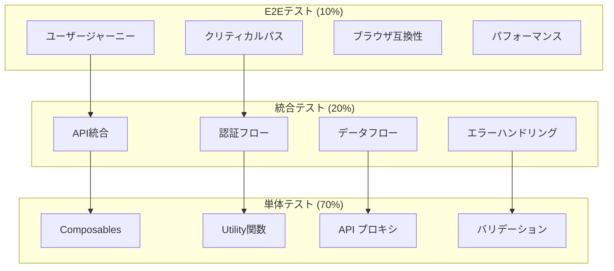

# テスト・品質保証戦略仕様書

**Doc-ID**: SPEC-2025-015
**Version**: 1.0
**Status**: Active
**Owner**: 金子裕司
**Linked-Docs**: SPEC-2025-014, SPEC-2025-013, SPEC-2025-006

---

## 📋 **概要**

hotel-saasプロジェクトのテスト・品質保証戦略の包括的仕様書です。テスト体系、品質保証プロセス、自動化戦略、パフォーマンステスト、セキュリティテストを統合的に定義します。

## 🎯 **品質目標**

### **基本方針**
- **品質第一**: 本番レベルの品質を開発段階から確保
- **自動化優先**: 手動テストを最小化し、効率的な品質保証
- **継続的改善**: メトリクス基づく品質向上
- **予防的品質**: 問題発生前の品質確保

### **品質指標**
- テストカバレッジ: 90%以上
- バグ検出率: 95%以上（本番前）
- 自動化率: 85%以上
- 品質ゲート通過率: 100%

## 🏗️ **テスト体系アーキテクチャ**

### **テストピラミッド**


### **テスト環境構成**
```typescript
interface TestEnvironments {
  // 開発環境
  development: {
    database: 'SQLite (local)'
    api_endpoint: 'http://localhost:3400'
    test_data: 'minimal_dataset'
    purpose: 'unit_and_integration_testing'
  }

  // テスト環境
  testing: {
    database: 'PostgreSQL (test)'
    api_endpoint: 'https://api-test.hotel-common.com'
    test_data: 'comprehensive_dataset'
    purpose: 'automated_testing_pipeline'
  }

  // ステージング環境
  staging: {
    database: 'PostgreSQL (staging)'
    api_endpoint: 'https://api-staging.hotel-common.com'
    test_data: 'production_like_dataset'
    purpose: 'e2e_and_performance_testing'
  }
}
```

## 🧪 **単体テスト戦略**

### **テスト対象・範囲**
```yaml
Composables テスト:
  対象:
    - useApiClient: API呼び出しロジック
    - useJwtAuth: 認証状態管理
    - usePlanFeatures: プラン機能管理
    - useDeviceCheckin: デバイス状態管理

  テスト観点:
    - 正常系フロー
    - 異常系フロー
    - 境界値テスト
    - 状態遷移テスト

  モック戦略:
    - API呼び出し: MSW (Mock Service Worker)
    - ローカルストレージ: vi.mock
    - WebSocket: Mock WebSocket Server

Utility関数テスト:
  対象:
    - データ変換関数
    - バリデーション関数
    - 日付・時刻処理
    - 文字列処理

  テスト観点:
    - 入力値バリデーション
    - 出力値検証
    - エラーハンドリング
    - パフォーマンス

API プロキシテスト:
  対象:
    - 認証ミドルウェア
    - リクエスト変換
    - レスポンス変換
    - エラーハンドリング

  テスト観点:
    - hotel-common API連携
    - 認証トークン処理
    - エラーレスポンス変換
    - タイムアウト処理
```

### **単体テスト実装例**
```typescript
// useApiClient テスト例
describe('useApiClient', () => {
  beforeEach(() => {
    // MSW セットアップ
    server.use(
      rest.get('/api/v1/orders', (req, res, ctx) => {
        return res(ctx.json({ success: true, data: mockOrders }))
      })
    )
  })

  it('認証付きでAPIを呼び出せる', async () => {
    const { authenticatedFetch } = useApiClient()

    // JWT トークンをモック
    vi.mocked(useJwtAuth).mockReturnValue({
      token: ref('mock-jwt-token'),
      isAuthenticated: ref(true)
    })

    const result = await authenticatedFetch('/api/v1/orders')

    expect(result.success).toBe(true)
    expect(result.data).toEqual(mockOrders)
  })

  it('認証エラー時に適切にエラーハンドリングする', async () => {
    server.use(
      rest.get('/api/v1/orders', (req, res, ctx) => {
        return res(ctx.status(401), ctx.json({ error: 'Unauthorized' }))
      })
    )

    const { authenticatedFetch } = useApiClient()

    await expect(authenticatedFetch('/api/v1/orders')).rejects.toThrow('Unauthorized')
  })
})

// API プロキシテスト例
describe('/api/v1/orders', () => {
  it('認証されたユーザーの注文一覧を取得できる', async () => {
    const event = createMockEvent({
      headers: { authorization: 'Bearer valid-token' }
    })

    // hotel-common API モック
    vi.mocked($fetch).mockResolvedValue({
      success: true,
      data: { orders: mockOrders }
    })

    const result = await handler(event)

    expect(result.success).toBe(true)
    expect(result.data.orders).toEqual(mockOrders)
  })
})
```

## 🔗 **統合テスト戦略**

### **API統合テスト**
```yaml
hotel-saas ↔ hotel-common 統合:
  テストシナリオ:
    - 認証フロー全体
    - 注文作成〜完了フロー
    - テナント切り替えフロー
    - エラー伝播テスト

  テストデータ:
    - 複数テナントデータ
    - 各プランのテストユーザー
    - 様々な注文パターン
    - エラーケースデータ

  検証項目:
    - データ整合性
    - レスポンス時間
    - エラーハンドリング
    - セキュリティ

認証統合テスト:
  シナリオ:
    - ログイン成功・失敗
    - トークン更新
    - 権限チェック
    - セッション管理

  検証項目:
    - JWT トークン検証
    - 権限レベル確認
    - セッション有効期限
    - セキュリティヘッダー
```

### **データフロー統合テスト**
```typescript
// 注文フロー統合テスト例
describe('注文フロー統合テスト', () => {
  beforeAll(async () => {
    // テストデータベースセットアップ
    await setupTestDatabase()
  })

  it('注文作成から完了までのフロー', async () => {
    // 1. ログイン
    const loginResponse = await request(app)
      .post('/api/v1/auth/login')
      .send({ email: 'test@example.com', password: 'password' })

    const token = loginResponse.body.data.accessToken

    // 2. メニュー取得
    const menuResponse = await request(app)
      .get('/api/v1/menu/items')
      .set('Authorization', `Bearer ${token}`)

    expect(menuResponse.status).toBe(200)

    // 3. 注文作成
    const orderData = {
      roomNumber: '101',
      items: [
        { menuItemId: menuResponse.body.data[0].id, quantity: 2 }
      ]
    }

    const orderResponse = await request(app)
      .post('/api/v1/orders')
      .set('Authorization', `Bearer ${token}`)
      .send(orderData)

    expect(orderResponse.status).toBe(201)
    expect(orderResponse.body.data.status).toBe('received')

    // 4. 注文ステータス更新
    const statusResponse = await request(app)
      .put(`/api/v1/orders/${orderResponse.body.data.id}/status`)
      .set('Authorization', `Bearer ${token}`)
      .send({ status: 'completed' })

    expect(statusResponse.status).toBe(200)
    expect(statusResponse.body.data.status).toBe('completed')
  })
})
```

## 🌐 **E2Eテスト戦略**

### **ユーザージャーニーテスト**
```yaml
管理者ジャーニー:
  シナリオ:
    1. ログイン
    2. ダッシュボード確認
    3. 注文管理
    4. メニュー管理
    5. 統計確認
    6. ログアウト

  検証項目:
    - 画面遷移
    - データ表示
    - 操作レスポンス
    - エラーハンドリング

宿泊客ジャーニー:
  シナリオ:
    1. デバイス認証
    2. メニュー閲覧
    3. 商品選択
    4. 注文確定
    5. 進捗確認
    6. 完了通知

  検証項目:
    - デバイス認証
    - メニュー表示
    - 注文フロー
    - リアルタイム更新
```

### **E2Eテスト実装例**
```typescript
// Playwright E2Eテスト例
test.describe('管理者ダッシュボード', () => {
  test.beforeEach(async ({ page }) => {
    // ログイン
    await page.goto('/admin/login')
    await page.fill('[data-testid="email"]', 'admin@example.com')
    await page.fill('[data-testid="password"]', 'password')
    await page.click('[data-testid="login-button"]')

    // ダッシュボードページ到達確認
    await expect(page).toHaveURL('/admin')
  })

  test('KPI統計が正しく表示される', async ({ page }) => {
    // 統計カード表示確認
    await expect(page.locator('[data-testid="total-orders"]')).toBeVisible()
    await expect(page.locator('[data-testid="total-revenue"]')).toBeVisible()
    await expect(page.locator('[data-testid="average-order-value"]')).toBeVisible()

    // 数値が表示されていることを確認
    const totalOrders = await page.locator('[data-testid="total-orders"] .value').textContent()
    expect(totalOrders).toMatch(/^\d+$/)
  })

  test('注文一覧が表示され、ステータス更新ができる', async ({ page }) => {
    await page.click('[data-testid="orders-tab"]')

    // 注文一覧表示確認
    await expect(page.locator('[data-testid="orders-table"]')).toBeVisible()

    // 最初の注文のステータス更新
    await page.click('[data-testid="order-status-button"]:first-child')
    await page.click('[data-testid="status-cooking"]')

    // ステータス更新確認
    await expect(page.locator('[data-testid="order-status"]:first-child')).toHaveText('調理中')
  })
})
```

## 🚀 **パフォーマンステスト戦略**

### **負荷テスト**
```yaml
負荷テストシナリオ:
  通常負荷:
    - 同時ユーザー数: 100
    - 実行時間: 30分
    - レスポンス時間: 95%ile < 500ms
    - エラー率: < 1%

  ピーク負荷:
    - 同時ユーザー数: 500
    - 実行時間: 15分
    - レスポンス時間: 95%ile < 1000ms
    - エラー率: < 5%

  ストレステスト:
    - 同時ユーザー数: 1000+
    - 限界点特定
    - 復旧時間測定
    - リソース使用量監視

テストツール:
  - k6: 負荷テスト実行
  - Artillery: API負荷テスト
  - Lighthouse CI: フロントエンド性能
  - WebPageTest: 実環境性能測定
```

### **パフォーマンステスト実装例**
```javascript
// k6 負荷テスト例
import http from 'k6/http'
import { check, sleep } from 'k6'

export const options = {
  stages: [
    { duration: '2m', target: 10 },   // ランプアップ
    { duration: '5m', target: 100 },  // 通常負荷
    { duration: '2m', target: 200 },  // ピーク負荷
    { duration: '5m', target: 200 },  // 持続
    { duration: '2m', target: 0 },    // ランプダウン
  ],
  thresholds: {
    http_req_duration: ['p(95)<500'],  // 95%のリクエストが500ms以内
    http_req_failed: ['rate<0.01'],    // エラー率1%未満
  },
}

export default function () {
  // ログイン
  const loginResponse = http.post('http://localhost:3100/api/v1/auth/login', {
    email: 'test@example.com',
    password: 'password'
  })

  check(loginResponse, {
    'login successful': (r) => r.status === 200,
    'token received': (r) => r.json('data.accessToken') !== '',
  })

  const token = loginResponse.json('data.accessToken')

  // API呼び出し
  const headers = { Authorization: `Bearer ${token}` }

  const ordersResponse = http.get('http://localhost:3100/api/v1/orders', { headers })
  check(ordersResponse, {
    'orders loaded': (r) => r.status === 200,
    'response time OK': (r) => r.timings.duration < 500,
  })

  sleep(1)
}
```

## 🔒 **セキュリティテスト戦略**

### **セキュリティテスト項目**
```yaml
認証・認可テスト:
  - JWT トークン検証
  - 権限昇格テスト
  - セッション管理
  - パスワードポリシー
  - ブルートフォース攻撃

入力値検証テスト:
  - SQLインジェクション
  - XSS (Cross-Site Scripting)
  - CSRF (Cross-Site Request Forgery)
  - コマンドインジェクション
  - ファイルアップロード

通信セキュリティ:
  - TLS設定検証
  - セキュリティヘッダー
  - CORS設定
  - API レート制限

データ保護:
  - 個人情報暗号化
  - ログ出力制御
  - エラーメッセージ制御
  - データ漏洩防止
```

### **自動セキュリティテスト**
```yaml
静的解析:
  - SonarQube: コード品質・脆弱性
  - ESLint Security: JavaScript脆弱性
  - Snyk: 依存関係脆弱性
  - OWASP Dependency Check

動的解析:
  - OWASP ZAP: Webアプリケーション脆弱性
  - Burp Suite: ペネトレーションテスト
  - Nmap: ネットワークスキャン
  - Nikto: Webサーバー脆弱性

継続的監視:
  - GitHub Security Advisories
  - CVE データベース監視
  - 依存関係自動更新
  - セキュリティパッチ適用
```

## 📊 **品質メトリクス・レポート**

### **品質ダッシュボード**
```yaml
テストメトリクス:
  - テスト実行数・成功率
  - テストカバレッジ推移
  - 欠陥密度・修正率
  - 自動化率・実行時間

品質メトリクス:
  - コード品質スコア
  - 技術的負債指標
  - セキュリティスコア
  - パフォーマンススコア

ビジネスメトリクス:
  - ユーザー満足度
  - システム稼働率
  - 障害発生率・復旧時間
  - リリース頻度・品質
```

### **品質レポート自動化**
```typescript
// 品質レポート生成例
interface QualityReport {
  test_results: {
    unit_tests: TestResults
    integration_tests: TestResults
    e2e_tests: TestResults
    performance_tests: PerformanceResults
  }

  quality_metrics: {
    code_coverage: number
    code_quality_score: number
    security_score: number
    performance_score: number
  }

  trends: {
    defect_density_trend: number[]
    test_automation_trend: number[]
    performance_trend: number[]
  }

  recommendations: string[]
}

// 自動レポート生成
async function generateQualityReport(): Promise<QualityReport> {
  const testResults = await collectTestResults()
  const qualityMetrics = await collectQualityMetrics()
  const trends = await calculateTrends()
  const recommendations = generateRecommendations(qualityMetrics)

  return {
    test_results: testResults,
    quality_metrics: qualityMetrics,
    trends: trends,
    recommendations: recommendations
  }
}
```

## 🔄 **CI/CD統合テスト**

### **パイプライン統合**
```yaml
Pull Request時:
  1. 静的解析 (ESLint, TypeScript)
  2. 単体テスト実行
  3. セキュリティスキャン
  4. コードカバレッジ計測
  5. 品質ゲートチェック

マージ時:
  1. 統合テスト実行
  2. E2Eテスト実行
  3. パフォーマンステスト
  4. セキュリティテスト
  5. デプロイ前検証

デプロイ後:
  1. スモークテスト
  2. ヘルスチェック
  3. パフォーマンス監視
  4. エラー監視
  5. ユーザー影響監視
```

## 🚀 **今後の拡張計画**

### **テスト自動化拡張**
```yaml
Phase 1拡張:
  - AI活用テスト生成
  - ビジュアルリグレッションテスト
  - アクセシビリティ自動テスト
  - モバイルデバイステスト

Phase 2拡張:
  - カオスエンジニアリング
  - 本番環境テスト
  - ユーザー行動テスト
  - 予測的品質分析
```

---

## 📋 **関連ドキュメント**

- **SPEC-2025-014**: 開発ガイドライン統合仕様書
- **SPEC-2025-013**: 移行・統合戦略仕様書
- **SPEC-2025-006**: システムアーキテクチャ設計仕様書
