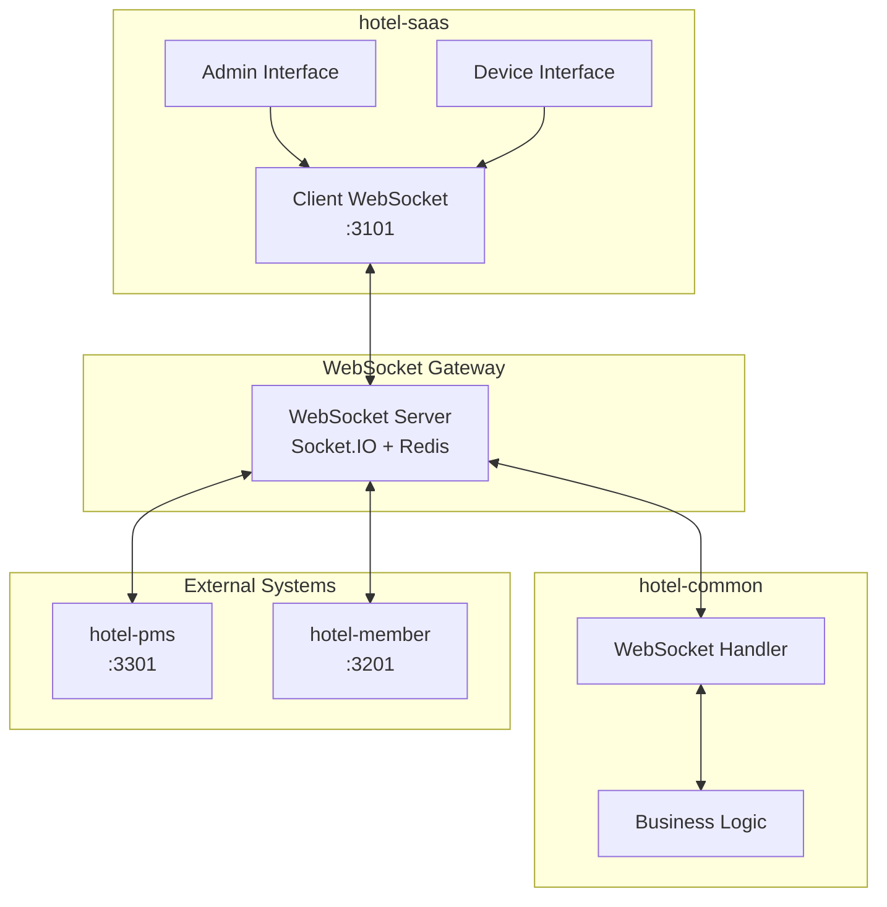
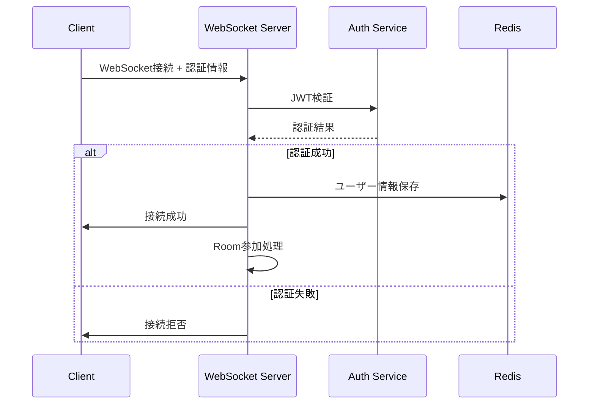

# WebSocket統合設計仕様書

**Doc-ID**: SPEC-2025-005
**Version**: 1.0
**Status**: Active
**Owner**: 金子裕司
**Linked-Docs**: SPEC-2025-004, REL-2025-001

---

## 📋 **概要**

hotel-saasプロジェクトにおけるWebSocket統合システムの設計仕様書です。リアルタイム通信、イベント配信、デバイス制御のためのWebSocket実装方針を定義します。

## 🏗️ **WebSocketアーキテクチャ**

### **システム構成**


### **技術スタック**
- **Socket.IO**: WebSocketライブラリ
- **Redis**: メッセージブローカー・Pub/Sub
- **JWT**: WebSocket認証
- **Room機能**: テナント・グループ別メッセージング

## 🔐 **WebSocket認証仕様**

### **接続認証**
```typescript
interface WebSocketAuth {
  token: string                           // JWT トークン
  tenant_id: string                       // テナントID
  system: 'saas' | 'member' | 'pms'      // システム識別
  client_type: 'admin' | 'device' | 'guest' // クライアント種別
  room_id?: string                        // 客室ID（デバイス接続時）
}
```

### **認証フロー**


### **Room管理**
```typescript
interface RoomStructure {
  // テナント別Room
  tenant: `tenant:${tenantId}`

  // システム別Room
  system: `system:${systemType}`

  // 客室別Room
  room: `room:${roomNumber}`

  // 管理者Room
  admin: `admin:${tenantId}`

  // デバイスRoom
  device: `device:${roomId}`
}
```

## 📡 **イベント仕様**

### **イベント分類**
```typescript
enum EventType {
  // 注文関連
  ORDER_CREATED = 'order_created',
  ORDER_UPDATED = 'order_updated',
  ORDER_STATUS_CHANGED = 'order_status_changed',

  // チェックイン・チェックアウト
  GUEST_CHECKIN = 'guest_checkin',
  GUEST_CHECKOUT = 'guest_checkout',

  // デバイス制御
  DEVICE_CONTROL = 'device_control',
  DEVICE_STATUS = 'device_status',

  // システム通知
  SYSTEM_MESSAGE = 'system_message',
  SYSTEM_ALERT = 'system_alert',

  // 統計・監視
  STATS_UPDATE = 'stats_update',
  HEALTH_CHECK = 'health_check'
}
```

### **イベントペイロード構造**
```typescript
interface WebSocketEvent<T = any> {
  type: EventType
  data: T
  metadata: {
    timestamp: string
    source: string
    tenant_id: string
    room_id?: string
    user_id?: string
    request_id?: string
  }
}
```

## 🎬 **チェックインイベント仕様**

### **GUEST_CHECKIN イベント**
```typescript
interface GuestCheckinEvent {
  type: 'GUEST_CHECKIN'
  data: {
    roomNumber: string
    roomId: string
    guestCount: number
    checkinDate: string
    timestamp: string
    welcomeVideo: {
      shouldPlay: boolean
      videoUrl: string
      duration: number
      autoSkip: boolean
    }
    guestInfo?: {
      primaryGuest: string
      specialRequests?: string[]
    }
  }
  metadata: {
    timestamp: string
    source: 'hotel-saas'
    tenant_id: string
    room_id: string
    user_id: string
    request_id: string
  }
}
```

### **GUEST_CHECKOUT イベント**
```typescript
interface GuestCheckoutEvent {
  type: 'GUEST_CHECKOUT'
  data: {
    roomNumber: string
    roomId: string
    checkoutDate: string
    timestamp: string
    resetDevice: boolean
    cleaningRequired: boolean
  }
  metadata: {
    timestamp: string
    source: 'hotel-saas'
    tenant_id: string
    room_id: string
    user_id: string
    request_id: string
  }
}
```

## 🔄 **注文イベント仕様**

### **ORDER_STATUS_CHANGED イベント**
```typescript
interface OrderStatusChangedEvent {
  type: 'ORDER_STATUS_CHANGED'
  data: {
    orderId: string
    roomNumber: string
    status: 'pending' | 'cooking' | 'ready' | 'delivered' | 'cancelled'
    previousStatus: string
    estimatedTime?: number
    message?: string
    items: Array<{
      id: string
      name: string
      quantity: number
      status: string
    }>
  }
  metadata: {
    timestamp: string
    source: 'hotel-common'
    tenant_id: string
    room_id: string
    order_id: string
    request_id: string
  }
}
```

## 🖥️ **デバイス制御仕様**

### **DEVICE_CONTROL イベント**
```typescript
interface DeviceControlEvent {
  type: 'DEVICE_CONTROL'
  data: {
    action: 'restart' | 'update' | 'display_message' | 'play_video' | 'reset'
    target: 'all' | 'room' | 'device'
    targetId?: string
    parameters?: {
      message?: string
      videoUrl?: string
      duration?: number
      priority?: 'low' | 'medium' | 'high'
    }
  }
  metadata: {
    timestamp: string
    source: 'hotel-saas'
    tenant_id: string
    room_id?: string
    user_id: string
    request_id: string
  }
}
```

## 🔧 **実装仕様**

### **サーバーサイド実装**

#### **WebSocketサーバー初期化**
```typescript
// server/utils/webSocketServer.ts
import { Server } from 'socket.io'
import { createAdapter } from '@socket.io/redis-adapter'
import { createClient } from 'redis'

export class HotelWebSocketServer {
  private io: Server
  private redisClient: any

  constructor(httpServer: any) {
    this.io = new Server(httpServer, {
      cors: {
        origin: process.env.ALLOWED_ORIGINS?.split(',') || ['http://localhost:3100'],
        methods: ['GET', 'POST']
      },
      transports: ['websocket', 'polling']
    })

    this.setupRedisAdapter()
    this.setupEventHandlers()
  }

  private async setupRedisAdapter() {
    const pubClient = createClient({
      url: process.env.REDIS_URL || 'redis://localhost:6379'
    })
    const subClient = pubClient.duplicate()

    await Promise.all([pubClient.connect(), subClient.connect()])

    this.io.adapter(createAdapter(pubClient, subClient))
  }

  private setupEventHandlers() {
    this.io.on('connection', (socket) => {
      this.handleConnection(socket)
    })
  }
}
```

#### **イベント送信ヘルパー**
```typescript
export class WebSocketEventService {
  constructor(private io: Server) {}

  // 特定の部屋にイベント送信
  sendToRoom(roomNumber: string, event: WebSocketEvent) {
    const roomId = `room:${roomNumber}`
    this.io.to(roomId).emit(event.type, event)

    console.log(`📡 WebSocketイベント送信: ${event.type} → ${roomId}`)
  }

  // テナント全体にイベント送信
  sendToTenant(tenantId: string, event: WebSocketEvent) {
    const tenantRoom = `tenant:${tenantId}`
    this.io.to(tenantRoom).emit(event.type, event)

    console.log(`📡 WebSocketイベント送信: ${event.type} → ${tenantRoom}`)
  }

  // 管理者にイベント送信
  sendToAdmins(tenantId: string, event: WebSocketEvent) {
    const adminRoom = `admin:${tenantId}`
    this.io.to(adminRoom).emit(event.type, event)

    console.log(`📡 WebSocketイベント送信: ${event.type} → ${adminRoom}`)
  }
}
```

### **クライアントサイド実装**

#### **WebSocket接続管理**
```typescript
// composables/useWebSocket.ts
export function useWebSocket() {
  const socket = ref<Socket | null>(null)
  const isConnected = ref(false)
  const connectionError = ref<Error | null>(null)

  const connect = async (auth: WebSocketAuth) => {
    try {
      const { io } = await import('socket.io-client')

      socket.value = io('ws://localhost:3101', {
        auth,
        transports: ['websocket', 'polling']
      })

      socket.value.on('connect', () => {
        isConnected.value = true
        connectionError.value = null
        console.log('✅ WebSocket接続成功')
      })

      socket.value.on('disconnect', () => {
        isConnected.value = false
        console.log('🔌 WebSocket接続切断')
      })

      socket.value.on('connect_error', (error) => {
        connectionError.value = error
        console.error('❌ WebSocket接続エラー:', error)
      })

    } catch (error) {
      connectionError.value = error as Error
      console.error('❌ WebSocket初期化エラー:', error)
    }
  }

  const disconnect = () => {
    if (socket.value) {
      socket.value.disconnect()
      socket.value = null
      isConnected.value = false
    }
  }

  const on = (event: string, handler: Function) => {
    if (socket.value) {
      socket.value.on(event, handler)
    }
  }

  const emit = (event: string, data: any) => {
    if (socket.value && isConnected.value) {
      socket.value.emit(event, data)
    }
  }

  return {
    isConnected: readonly(isConnected),
    connectionError: readonly(connectionError),
    connect,
    disconnect,
    on,
    emit
  }
}
```

#### **イベントハンドリング**
```typescript
// composables/useWebSocketEvents.ts
export function useWebSocketEvents() {
  const { on } = useWebSocket()

  // チェックインイベント処理
  const onGuestCheckin = (handler: (data: GuestCheckinEvent['data']) => void) => {
    on('GUEST_CHECKIN', (event: GuestCheckinEvent) => {
      console.log('🎉 チェックインイベント受信:', event.data)
      handler(event.data)
    })
  }

  // 注文ステータス変更イベント処理
  const onOrderStatusChanged = (handler: (data: OrderStatusChangedEvent['data']) => void) => {
    on('ORDER_STATUS_CHANGED', (event: OrderStatusChangedEvent) => {
      console.log('📦 注文ステータス変更:', event.data)
      handler(event.data)
    })
  }

  // デバイス制御イベント処理
  const onDeviceControl = (handler: (data: DeviceControlEvent['data']) => void) => {
    on('DEVICE_CONTROL', (event: DeviceControlEvent) => {
      console.log('🖥️ デバイス制御イベント:', event.data)
      handler(event.data)
    })
  }

  return {
    onGuestCheckin,
    onOrderStatusChanged,
    onDeviceControl
  }
}
```

## 📊 **パフォーマンス仕様**

### **接続管理**
- **最大同時接続数**: 10,000接続
- **接続タイムアウト**: 30秒
- **ハートビート間隔**: 25秒
- **再接続間隔**: 5秒（指数バックオフ）

### **メッセージ配信**
- **配信遅延**: 100ms以内
- **メッセージサイズ**: 最大1MB
- **配信保証**: At-least-once
- **順序保証**: Room内で保証

### **リソース使用量**
- **メモリ使用量**: 接続あたり10KB
- **CPU使用量**: 1000接続で10%以下
- **ネットワーク**: 100Mbps対応

## 🔍 **監視・ログ**

### **接続監視**
```typescript
interface ConnectionMetrics {
  totalConnections: number
  connectionsByTenant: Record<string, number>
  connectionsByType: Record<string, number>
  averageLatency: number
  errorRate: number
}
```

### **イベント監視**
```typescript
interface EventMetrics {
  totalEvents: number
  eventsByType: Record<string, number>
  averageProcessingTime: number
  failedEvents: number
  retryCount: number
}
```

### **ログ出力**
- 接続・切断ログ
- イベント送受信ログ
- エラーログ
- パフォーマンスログ

## 🧪 **テスト仕様**

### **接続テスト**
```typescript
describe('WebSocket接続', () => {
  test('正常な認証での接続成功', async () => {
    const auth = {
      token: 'valid-jwt-token',
      tenant_id: 'tenant-1',
      system: 'saas',
      client_type: 'admin'
    }

    const socket = io('ws://localhost:3101', { auth })

    await new Promise((resolve) => {
      socket.on('connect', resolve)
    })

    expect(socket.connected).toBe(true)
    socket.disconnect()
  })
})
```

### **イベントテスト**
```typescript
describe('WebSocketイベント', () => {
  test('チェックインイベントの送受信', async () => {
    const checkinEvent: GuestCheckinEvent = {
      type: 'GUEST_CHECKIN',
      data: {
        roomNumber: '101',
        roomId: 'room-1',
        guestCount: 2,
        checkinDate: '2025-01-28T06:00:00.000Z',
        timestamp: new Date().toISOString(),
        welcomeVideo: {
          shouldPlay: true,
          videoUrl: '/videos/welcome.mp4',
          duration: 30000,
          autoSkip: true
        }
      },
      metadata: {
        timestamp: new Date().toISOString(),
        source: 'hotel-saas',
        tenant_id: 'tenant-1',
        room_id: 'room-1',
        user_id: 'staff-1',
        request_id: 'req-123'
      }
    }

    // イベント送信テスト
    webSocketService.sendToRoom('101', checkinEvent)

    // イベント受信テスト
    const receivedEvent = await waitForEvent('GUEST_CHECKIN')
    expect(receivedEvent.data.roomNumber).toBe('101')
  })
})
```

## 🚀 **デプロイメント**

### **環境設定**
```yaml
# .env
REDIS_URL=redis://localhost:6379
WEBSOCKET_PORT=3101
ALLOWED_ORIGINS=http://localhost:3100,https://hotel-saas.example.com
JWT_SECRET=your-jwt-secret
```

### **Docker設定**
```dockerfile
# WebSocketサーバー用
FROM node:18-alpine

WORKDIR /app
COPY package*.json ./
RUN npm ci --only=production

COPY . .
EXPOSE 3101

CMD ["npm", "run", "start:websocket"]
```

---

## 📋 **関連ドキュメント**

- **SPEC-2025-004**: 統合API仕様書
- **REL-2025-001**: チェックイン端末制御機能リリースノート
- **SPEC-2025-003**: JWT認証システム統合仕様書
