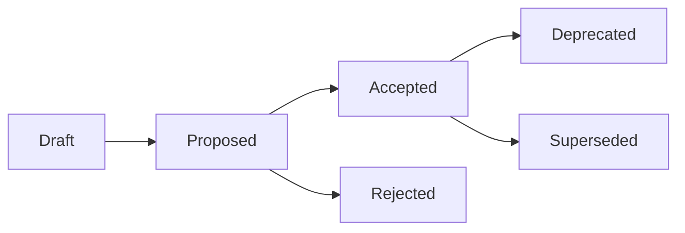

# ADR（Architecture Decision Records）

**目的**: 技術的な意思決定を記録し、なぜその決定を下したのかを追跡可能にする

---

## 📋 ADR一覧

| ADR | タイトル | ステータス | 作成日 | 決定者 |
|:----|:--------|:---------|:------|:------|
| [ADR-000](./ADR-000-template.md) | テンプレート | Template | - | - |

---

## 🎯 ADRの目的

1. **意思決定の透明性**: なぜその技術を選んだのか、なぜその実装方針にしたのかを明確に記録
2. **将来への情報伝達**: 数ヶ月後、数年後に見返したときに決定の背景を理解できる
3. **代替案の記録**: 検討した他の選択肢とその評価を残す
4. **トレーサビリティ**: 要件 → ADR → 実装 → テスト の追跡

---

## 📝 ADRを作成すべきタイミング

### ✅ 作成すべき決定

- **アーキテクチャの選択**: マイクロサービスか、モノリスか
- **技術スタックの選択**: Vue 3 vs React、PostgreSQL vs MongoDB
- **セキュリティ方針**: JWT vs Session認証
- **データ設計**: マルチテナント方式、テーブル設計
- **API設計**: RESTful vs GraphQL、エンドポイント命名規則
- **開発プロセス**: Git-flow vs GitHub-flow
- **品質基準**: 命名規則、テスト戦略
- **パフォーマンス方針**: キャッシュ戦略、最適化方針

### ❌ 作成不要な決定

- 日常的なバグ修正
- 単純なリファクタリング
- コーディングスタイルの微調整

---

## 🔄 ADRのライフサイクル



- **Draft**: 初稿、レビュー前
- **Proposed**: レビュー依頼中
- **Accepted**: 承認済み、実装中/実装済み
- **Deprecated**: 非推奨（使用禁止ではないが、新規採用は避ける）
- **Superseded**: 別のADRに置き換えられた（ADR番号を明記）
- **Rejected**: 却下

---

## 📄 ADR作成手順

### Step 1: 新規ADR番号を採番

```bash
# 最新のADR番号を確認
ls -1 docs/adr/ | grep "^ADR-" | sort -V | tail -1

# 次の番号で作成（例: ADR-001）
cp docs/adr/ADR-000-template.md docs/adr/ADR-001-session-authentication.md
```

### Step 2: テンプレートを埋める

- Context（背景・課題）
- Decision（決定内容）
- Alternatives Considered（代替案）
- Consequences（結果・影響）
- Implementation（実装指針）
- Compliance & Security（コンプライアンス・セキュリティ）
- Traceability（トレーサビリティ）

### Step 3: レビュー依頼

- ステータスを `Proposed` に変更
- Linear Issueにリンク
- レビュアーを指定

### Step 4: 承認後、実装

- ステータスを `Accepted` に変更
- 実装開始
- 実装完了後、ADRに実装結果を追記

---

## 🔗 関連ドキュメント

- **SSOT**: `/Users/kaneko/hotel-kanri/docs/03_ssot/`
- **要件ID体系**: `/Users/kaneko/hotel-kanri/docs/03_ssot/00_foundation/SSOT_REQUIREMENT_ID_SYSTEM.md`
- **アーキテクチャ**: `/Users/kaneko/hotel-kanri/docs/architecture/`
- **データベース命名規則**: `/Users/kaneko/hotel-kanri/docs/standards/DATABASE_NAMING_STANDARD.md`
- **API設計ガイドライン**: `/Users/kaneko/hotel-kanri/docs/01_systems/saas/API_ROUTING_GUIDELINES.md`

---

## 🎯 hotel-kanri における ADR の位置づけ

```
要求（FR/SSOT）
    ↓
技術決定（ADR）← ★ ここ
    ↓
設計（アーキテクチャ/API/DB）
    ↓
実装（hotel-saas/common/pms/member）
    ↓
テスト（APIテスト/手動UIテスト）
```

ADRは**要求と設計の橋渡し**を行い、**なぜその設計にしたのか**を記録します。

---

## 📊 ADRの品質基準

### ✅ 良いADR

- [ ] 背景（Context）が明確
- [ ] 決定内容（Decision）が具体的
- [ ] 代替案を3つ以上検討
- [ ] 各代替案のメリット・デメリットを記載
- [ ] 結果・影響（Consequences）を正直に記載
- [ ] トレーサビリティ（FR/QAS/SSOT）を記載
- [ ] セキュリティ・コンプライアンスチェック完了

### ❌ 悪いADR

- 代替案の検討なし
- 決定の理由が曖昧（「なんとなく」「良さそうだから」）
- デメリットを隠蔽
- トレーサビリティなし

---

## 🤖 Cursor AI への指示例

```
Command – New ADR

目的: Session認証を採用した理由をADR-001として作成

入力:
- Context: JWT認証 vs Session認証の選択
- Decision: Session認証（Redis + HttpOnly Cookie）を採用
- Alternatives: JWT認証、OAuth2

出力: ADR-001-session-authentication.md
```

---

ここまで読み込んだらまず「ADR README.md 読了」と表示すること

