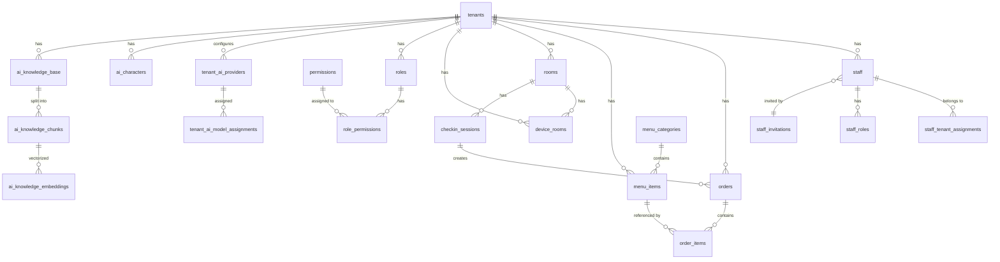

# SSOT-4: Data Model

**Doc-ID**: SSOT-4
**Version**: 1.0.1
**Created**: 2026-03-05
**Status**: Approved
**Source**: Consolidated from SSOT_SAAS_DATABASE_SCHEMA.md, SSOT_OPERATIONAL_LOG_ARCHITECTURE.md, and all feature SSOTs

---

## §1 Architecture

### §1.1 Database Topology

```
┌─────────────────────────────────────────┐
│     PostgreSQL 14+ (Single Instance)    │
│  hotel-common が管理・マイグレーション   │
└──────────────┬──────────────────────────┘
               │
   ┌───────────┴──────────┐
   │                      │
┌──┴─────────────┐  ┌────┴───────────┐
│  hotel-common  │  │  hotel-saas    │
│  Prisma Client │  │  API 経由      │
│  Direct DB     │  │  (db-service)  │
│  REST API 提供 │  │                │
└────────────────┘  └────────────────┘
```

- **MUST**: `hotel-common/prisma/schema.prisma` が唯一の真実の情報源（1 ファイル）である。 **Accept**: hotel-saas に `@prisma/client` の直接依存が 0 件であること。
- **MUST**: hotel-saas は hotel-common API 経由でデータアクセスすること。 **Accept**: hotel-saas の `package.json` に `@prisma/client` が 0 件であること。
- **MUST**: 全マイグレーションは hotel-common から実行すること。 **Accept**: `prisma migrate status` が hotel-common の 1 ディレクトリでのみ成功すること。

### §1.2 ORM Configuration

```prisma
generator client {
  provider = "prisma-client-js"
  output   = "../src/generated/prisma"
}

datasource db {
  provider = "postgresql"
  url      = env("DATABASE_URL")
}
```

---

## §2 Naming Conventions

| Layer | Convention | Example |
|-------|-----------|---------|
| PostgreSQL Table | snake_case (plural) | `menu_items`, `order_items` |
| PostgreSQL Column | snake_case | `tenant_id`, `created_at` |
| Prisma Model | PascalCase (singular) | `MenuItem`, `OrderItem` |
| Prisma Field | camelCase + `@map` | `tenantId @map("tenant_id")` |
| API/JSON | camelCase | `tenantId`, `createdAt` |
| TypeScript Variable | camelCase | `const menuItem = ...` |

- **MUST**: Prisma モデルは `@@map("table_name")` でテーブル名をマッピングすること。 **Accept**: `schema.prisma` 内の全モデルに `@@map` が存在し、`grep -c '@@map' schema.prisma` がモデル数（30 以上）と一致すること。
- **MUST**: 全フィールドに `@map("column_name")` を指定すること（名前が一致する場合を除く）。 **Accept**: camelCase フィールドの 100% に対し `@map` が定義されていること。

---

## §3 Common Columns

- **MUST**: 全テーブルに以下の 5 カラムを持つこと。 **Accept**: `schema.prisma` の全モデルに `created_at`, `updated_at`, `is_deleted`, `deleted_at`, `deleted_by` の 5 フィールドが定義されていること。

| Column | Type | Default | Description |
|--------|------|---------|-------------|
| `created_at` | TIMESTAMP | `NOW()` | Record creation time |
| `updated_at` | TIMESTAMP | `NOW()` | Last update time |
| `is_deleted` | BOOLEAN | `false` | Soft delete flag |
| `deleted_at` | TIMESTAMP | NULL | Deletion time |
| `deleted_by` | TEXT | NULL | Deleted by user ID |

- **MUST**: 全テナントスコープテーブルに `tenant_id TEXT NOT NULL` を持つこと。 **Accept**: `tenants` を除く全テーブル定義（29 テーブル以上）に `tenant_id TEXT NOT NULL` が存在すること。

---

## §4 Core Tables

### §4.1 tenants

```sql
CREATE TABLE tenants (
  id              TEXT PRIMARY KEY,
  name            TEXT NOT NULL,
  domain          TEXT UNIQUE,
  plan_type       TEXT,
  status          TEXT DEFAULT 'active',
  contact_email   TEXT,
  features        TEXT[],
  settings        JSONB,
  created_at      TIMESTAMP DEFAULT NOW(),
  deleted_at      TIMESTAMP,
  deleted_by      TEXT,
  is_deleted      BOOLEAN DEFAULT false,

  CONSTRAINT tenants_status_check CHECK (status IN ('active', 'suspended', 'deleted'))
);

CREATE INDEX idx_tenants_domain ON tenants(domain) WHERE is_deleted = false;
CREATE INDEX idx_tenants_status ON tenants(status) WHERE is_deleted = false;
```

**Note**: `settings` JSONB にはホテル情報・会計設定・支払い方法・表示制御を格納。

### §4.2 staff

```sql
CREATE TABLE staff (
  id              TEXT PRIMARY KEY,
  tenant_id       TEXT NOT NULL,
  email           TEXT NOT NULL,
  name            TEXT NOT NULL,
  role            TEXT NOT NULL,
  department      TEXT,
  is_active       BOOLEAN NOT NULL DEFAULT true,
  password_hash   TEXT,
  system_access   JSONB,
  base_level      INTEGER,
  last_login_at   TIMESTAMP,
  created_at      TIMESTAMP NOT NULL DEFAULT NOW(),
  updated_at      TIMESTAMP NOT NULL DEFAULT NOW(),

  CONSTRAINT fk_staff_tenant FOREIGN KEY (tenant_id) REFERENCES tenants(id)
);

CREATE INDEX idx_staff_tenant_id ON staff(tenant_id);
CREATE INDEX idx_staff_email ON staff(email);
CREATE INDEX idx_staff_is_active ON staff(is_active);
```

### §4.3 orders (Operational)

```sql
CREATE TABLE orders (
  id          SERIAL PRIMARY KEY,
  tenant_id   TEXT NOT NULL,
  room_id     TEXT NOT NULL,
  place_id    INTEGER,
  status      TEXT DEFAULT 'received',
  items       JSONB NOT NULL,
  total       INTEGER NOT NULL,
  created_at  TIMESTAMP DEFAULT NOW(),
  updated_at  TIMESTAMP DEFAULT NOW(),
  paid_at     TIMESTAMP,
  is_deleted  BOOLEAN DEFAULT false,
  deleted_at  TIMESTAMP,
  session_id  TEXT,
  uuid        TEXT UNIQUE,

  CONSTRAINT fk_orders_session FOREIGN KEY (session_id) REFERENCES checkin_sessions(id)
);

CREATE INDEX idx_orders_tenant_id ON orders(tenant_id);
CREATE INDEX idx_orders_session_id ON orders(session_id);
CREATE INDEX idx_orders_status ON orders(status);
CREATE INDEX idx_orders_created_at ON orders(created_at);
CREATE INDEX idx_orders_is_deleted_paid_at ON orders(is_deleted, paid_at);
```

**Status values**: `received`, `preparing`, `ready`, `delivering`, `delivered`, `completed`, `cancelled`

### §4.4 order_logs (Archive)

**MUST**: `orders` と同一スキーマ。完了後 24 時間で自動移行。 **Accept**: `\d orders` と `\d order_logs` のカラム定義が一致し、24 時間以上経過した completed レコードが orders に 0 件であること。

```sql
CREATE TABLE order_logs (
  -- Same schema as orders
  -- Monthly partitioned by created_at
) PARTITION BY RANGE (created_at);
```

### §4.5 order_items / order_item_logs

```sql
CREATE TABLE order_items (
  id            SERIAL PRIMARY KEY,
  tenant_id     TEXT NOT NULL,
  order_id      INTEGER NOT NULL,
  menu_item_id  INTEGER NOT NULL,
  quantity      INTEGER NOT NULL,
  unit_price    INTEGER NOT NULL,
  subtotal      INTEGER NOT NULL,
  created_at    TIMESTAMP DEFAULT NOW(),

  CONSTRAINT fk_order_items_order FOREIGN KEY (order_id) REFERENCES orders(id)
);
```

---

## §5 Menu Tables

### §5.1 menu_items

```sql
CREATE TABLE menu_items (
  id              SERIAL PRIMARY KEY,
  tenant_id       TEXT NOT NULL,
  name_ja         TEXT NOT NULL,
  name_en         TEXT,
  description_ja  TEXT,
  description_en  TEXT,
  price           INTEGER NOT NULL,
  category_id     INTEGER,
  image_url       TEXT,
  video_url       TEXT,
  is_available    BOOLEAN DEFAULT true,
  is_featured     BOOLEAN DEFAULT false,
  sort_order      INTEGER DEFAULT 0,
  allergens       JSONB,
  calories        INTEGER,
  protein         NUMERIC,
  fat             NUMERIC,
  carbs           NUMERIC,
  sodium          NUMERIC,
  created_at      TIMESTAMP DEFAULT NOW(),
  updated_at      TIMESTAMP DEFAULT NOW(),
  is_deleted      BOOLEAN DEFAULT false,
  deleted_at      TIMESTAMP
);

CREATE INDEX idx_menu_items_tenant_id ON menu_items(tenant_id);
CREATE INDEX idx_menu_items_category_id ON menu_items(category_id);
CREATE INDEX idx_menu_items_is_available ON menu_items(is_available);
```

### §5.2 menu_categories

```sql
CREATE TABLE menu_categories (
  id          SERIAL PRIMARY KEY,
  tenant_id   TEXT NOT NULL,
  name_ja     TEXT NOT NULL,
  name_en     TEXT,
  parent_id   INTEGER,
  sort_order  INTEGER DEFAULT 0,
  is_active   BOOLEAN DEFAULT true,
  created_at  TIMESTAMP DEFAULT NOW(),
  updated_at  TIMESTAMP DEFAULT NOW(),

  CONSTRAINT fk_menu_categories_parent FOREIGN KEY (parent_id) REFERENCES menu_categories(id)
);
```

### §5.3 tags (New 3-level category system)

```sql
CREATE TABLE tags (
  id          SERIAL PRIMARY KEY,
  tenant_id   TEXT NOT NULL,
  name_ja     TEXT NOT NULL,
  name_en     TEXT,
  level       INTEGER NOT NULL CHECK (level IN (1, 2, 3)),
  parent_id   INTEGER,
  sort_order  INTEGER DEFAULT 0,
  created_at  TIMESTAMP DEFAULT NOW()
);
```

---

## §6 Room & Device Tables

### §6.1 rooms

```sql
CREATE TABLE rooms (
  id              TEXT PRIMARY KEY,
  tenant_id       TEXT NOT NULL,
  room_number     TEXT NOT NULL,
  room_grade_id   TEXT,
  status          TEXT DEFAULT 'available',
  floor           INTEGER,
  capacity        INTEGER,
  features        JSONB,
  created_at      TIMESTAMP DEFAULT NOW(),
  updated_at      TIMESTAMP DEFAULT NOW(),

  CONSTRAINT rooms_status_check CHECK (status IN ('available', 'occupied', 'cleaning', 'maintenance'))
);
```

### §6.2 room_grades

```sql
CREATE TABLE room_grades (
  id          TEXT PRIMARY KEY,
  tenant_id   TEXT NOT NULL,
  name_ja     TEXT NOT NULL,
  name_en     TEXT,
  sort_order  INTEGER DEFAULT 0,
  created_at  TIMESTAMP DEFAULT NOW()
);
```

### §6.3 device_rooms

```sql
CREATE TABLE device_rooms (
  id          TEXT PRIMARY KEY,
  tenant_id   TEXT NOT NULL,
  room_id     TEXT NOT NULL,
  mac_address TEXT,
  ip_address  TEXT,
  device_name TEXT,
  is_active   BOOLEAN DEFAULT true,
  created_at  TIMESTAMP DEFAULT NOW(),
  updated_at  TIMESTAMP DEFAULT NOW()
);

CREATE INDEX idx_device_rooms_tenant_id ON device_rooms(tenant_id);
CREATE INDEX idx_device_rooms_mac_address ON device_rooms(mac_address);
CREATE INDEX idx_device_rooms_ip_address ON device_rooms(ip_address);
```

### §6.4 checkin_sessions

```sql
CREATE TABLE checkin_sessions (
  id              TEXT PRIMARY KEY,
  tenant_id       TEXT NOT NULL,
  room_id         TEXT NOT NULL,
  guest_name      TEXT,
  check_in_at     TIMESTAMP DEFAULT NOW(),
  check_out_at    TIMESTAMP,
  status          TEXT DEFAULT 'checked_in',
  created_at      TIMESTAMP DEFAULT NOW(),
  updated_at      TIMESTAMP DEFAULT NOW()
);

CREATE INDEX idx_checkin_sessions_tenant_id ON checkin_sessions(tenant_id);
CREATE INDEX idx_checkin_sessions_room_id ON checkin_sessions(room_id);
CREATE INDEX idx_checkin_sessions_status ON checkin_sessions(status);
```

---

## §7 Permission Tables

### §7.1 roles

```sql
CREATE TABLE roles (
  id          TEXT PRIMARY KEY,
  tenant_id   TEXT NOT NULL,
  name        TEXT NOT NULL,
  description TEXT,
  is_system   BOOLEAN DEFAULT false,
  created_at  TIMESTAMP DEFAULT NOW(),
  updated_at  TIMESTAMP DEFAULT NOW()
);
```

### §7.2 permissions

```sql
CREATE TABLE permissions (
  id          TEXT PRIMARY KEY,
  category    TEXT NOT NULL,
  resource    TEXT NOT NULL,
  action      TEXT NOT NULL,
  description TEXT,
  created_at  TIMESTAMP DEFAULT NOW()
);
```

**Format**: `{category}:{resource}:{action}` (e.g., `orders:list:read`)

### §7.3 role_permissions

```sql
CREATE TABLE role_permissions (
  role_id       TEXT NOT NULL,
  permission_id TEXT NOT NULL,
  PRIMARY KEY (role_id, permission_id),
  CONSTRAINT fk_rp_role FOREIGN KEY (role_id) REFERENCES roles(id),
  CONSTRAINT fk_rp_perm FOREIGN KEY (permission_id) REFERENCES permissions(id)
);
```

---

## §8 Staff Management Tables

### §8.1 staff_invitations

```sql
CREATE TABLE staff_invitations (
  id          TEXT PRIMARY KEY,
  tenant_id   TEXT NOT NULL,
  email       TEXT NOT NULL,
  role        TEXT NOT NULL,
  token       TEXT NOT NULL UNIQUE,
  expires_at  TIMESTAMP NOT NULL,  -- 7 days from creation
  accepted_at TIMESTAMP,
  created_at  TIMESTAMP DEFAULT NOW()
);
```

### §8.2 staff_tenant_assignments

```sql
CREATE TABLE staff_tenant_assignments (
  id          TEXT PRIMARY KEY,
  staff_id    TEXT NOT NULL,
  tenant_id   TEXT NOT NULL,
  is_primary  BOOLEAN DEFAULT false,
  created_at  TIMESTAMP DEFAULT NOW(),

  CONSTRAINT fk_sta_staff FOREIGN KEY (staff_id) REFERENCES staff(id),
  CONSTRAINT fk_sta_tenant FOREIGN KEY (tenant_id) REFERENCES tenants(id),
  UNIQUE (staff_id, tenant_id)
);
```

### §8.3 staff_roles

```sql
CREATE TABLE staff_roles (
  staff_id    TEXT NOT NULL,
  role_id     TEXT NOT NULL,
  tenant_id   TEXT NOT NULL,
  PRIMARY KEY (staff_id, role_id, tenant_id)
);
```

---

## §9 AI Concierge Tables

### §9.1 tenant_ai_providers

```sql
CREATE TABLE tenant_ai_providers (
  id          TEXT PRIMARY KEY,
  tenant_id   TEXT NOT NULL,
  provider    TEXT NOT NULL,  -- 'openai', 'anthropic', 'google', 'azure'
  api_key     TEXT NOT NULL,  -- encrypted
  endpoint    TEXT,
  is_active   BOOLEAN DEFAULT true,
  priority    INTEGER DEFAULT 0,
  created_at  TIMESTAMP DEFAULT NOW(),
  updated_at  TIMESTAMP DEFAULT NOW()
);
```

### §9.2 tenant_ai_model_assignments

```sql
CREATE TABLE tenant_ai_model_assignments (
  id          TEXT PRIMARY KEY,
  tenant_id   TEXT NOT NULL,
  use_case    TEXT NOT NULL,  -- 'chat', 'embedding', 'image_generation'
  provider_id TEXT NOT NULL,
  model_id    TEXT NOT NULL,
  created_at  TIMESTAMP DEFAULT NOW()
);
```

### §9.3 ai_characters

```sql
CREATE TABLE ai_characters (
  id              TEXT PRIMARY KEY,
  tenant_id       TEXT NOT NULL,
  name            TEXT NOT NULL,
  personality     TEXT,  -- 'friendly', 'professional', 'luxury', 'casual'
  tone            TEXT,  -- 'polite', 'casual', 'formal'
  system_prompt   TEXT,
  welcome_message TEXT,
  is_active       BOOLEAN DEFAULT true,
  created_at      TIMESTAMP DEFAULT NOW(),
  updated_at      TIMESTAMP DEFAULT NOW()
);
```

### §9.4 ai_knowledge_base

```sql
CREATE TABLE ai_knowledge_base (
  id          TEXT PRIMARY KEY,
  tenant_id   TEXT NOT NULL,
  title       TEXT NOT NULL,
  content     TEXT,
  file_url    TEXT,
  file_type   TEXT,
  category_id TEXT,
  status      TEXT DEFAULT 'pending',  -- 'pending', 'processing', 'ready', 'error'
  created_at  TIMESTAMP DEFAULT NOW(),
  updated_at  TIMESTAMP DEFAULT NOW()
);
```

### §9.5 ai_knowledge_chunks

```sql
CREATE TABLE ai_knowledge_chunks (
  id              TEXT PRIMARY KEY,
  knowledge_id    TEXT NOT NULL,
  chunk_index     INTEGER NOT NULL,
  content         TEXT NOT NULL,
  token_count     INTEGER,
  created_at      TIMESTAMP DEFAULT NOW(),

  CONSTRAINT fk_chunks_kb FOREIGN KEY (knowledge_id) REFERENCES ai_knowledge_base(id)
);
```

### §9.6 ai_knowledge_embeddings

```sql
CREATE TABLE ai_knowledge_embeddings (
  id          TEXT PRIMARY KEY,
  chunk_id    TEXT NOT NULL,
  embedding   VECTOR(1536),  -- OpenAI ada-002 dimension
  model       TEXT NOT NULL,
  created_at  TIMESTAMP DEFAULT NOW(),

  CONSTRAINT fk_emb_chunk FOREIGN KEY (chunk_id) REFERENCES ai_knowledge_chunks(id)
);
```

---

## §10 Logging & Audit Tables

### §10.1 audit_logs

```sql
CREATE TABLE audit_logs (
  id          SERIAL PRIMARY KEY,
  tenant_id   TEXT NOT NULL,
  user_id     TEXT,
  action      TEXT NOT NULL,
  resource    TEXT NOT NULL,
  resource_id TEXT,
  details     JSONB,
  ip_address  TEXT,
  created_at  TIMESTAMP DEFAULT NOW()
);

CREATE INDEX idx_audit_logs_tenant_id ON audit_logs(tenant_id);
CREATE INDEX idx_audit_logs_created_at ON audit_logs(created_at);
```

### §10.2 auth_logs

```sql
CREATE TABLE auth_logs (
  id          SERIAL PRIMARY KEY,
  tenant_id   TEXT,
  user_id     TEXT,
  action      TEXT NOT NULL,  -- 'login', 'logout', 'login_failed'
  ip_address  TEXT,
  user_agent  TEXT,
  created_at  TIMESTAMP DEFAULT NOW()
);
```

---

## §11 Plan & Billing Tables

### §11.1 tenant_system_plan

```sql
CREATE TABLE tenant_system_plan (
  id          TEXT PRIMARY KEY,
  tenant_id   TEXT NOT NULL,
  plan_id     TEXT NOT NULL,
  start_date  TIMESTAMP NOT NULL,
  end_date    TIMESTAMP,
  status      TEXT DEFAULT 'active',
  created_at  TIMESTAMP DEFAULT NOW()
);
```

### §11.2 system_plan_restrictions

```sql
CREATE TABLE system_plan_restrictions (
  id              TEXT PRIMARY KEY,
  plan_id         TEXT NOT NULL,
  feature_key     TEXT NOT NULL,
  max_value       INTEGER,
  is_enabled      BOOLEAN DEFAULT true,
  created_at      TIMESTAMP DEFAULT NOW()
);
```

---

## §12 UI Layout Tables

### §12.1 page_layouts

```sql
CREATE TABLE page_layouts (
  id          TEXT PRIMARY KEY,
  tenant_id   TEXT NOT NULL,
  page_type   TEXT NOT NULL,
  layout_data JSONB NOT NULL,
  is_active   BOOLEAN DEFAULT true,
  created_at  TIMESTAMP DEFAULT NOW(),
  updated_at  TIMESTAMP DEFAULT NOW()
);
```

### §12.2 page_templates / page_versions / page_widgets / page_schedules

省略 — 詳細は `docs/03_ssot/01_admin_features/SSOT_ADMIN_UI_DESIGN.md` を参照。

---

## §13 Operational/Log Dual Management

### §13.1 Architecture

```
Operational Table (Active)    Log Table (Archive)
├── Current data only         ├── All completed data
├── Fast response             ├── Full history retention
├── Periodic cleanup          ├── Monthly partitioned
└── orders, order_items       └── order_logs, order_item_logs
```

- **MUST**: 完了ステータス変更時にトランザクション内でログテーブルへコピーすること。 **Accept**: ステータス完了 API 実行後、同一トランザクション内で `order_logs` に 1 件以上のレコードが挿入されていること（DB ログで `BEGIN/COMMIT` 内に INSERT が確認できること）。
- **MUST**: 運用テーブルからの削除は 24 時間後にバッチ実行すること。 **Accept**: バッチ実行後、`orders` テーブルに `status='completed'` かつ `updated_at < NOW() - INTERVAL '24 hours'` のレコードが 0 件であること。

### §13.2 Target Data Types

| Data Type | Operational Table | Log Table |
|-----------|------------------|-----------|
| Orders | `orders` | `order_logs` |
| Order Items | `order_items` | `order_item_logs` |
| Check-in Sessions | `checkin_sessions` | `checkout_logs` |

---

## §14 Entity Relationship Diagram



---

## §15 Migration Strategy

- **MUST**: 全マイグレーションは `hotel-common` リポジトリの `prisma migrate` で実行すること。 **Accept**: `hotel-saas` ディレクトリに `prisma/migrations/` フォルダが 0 件存在しないこと。
- **MUST**: マイグレーション前にバックアップを取得すること。 **Accept**: マイグレーション実行ログに `pg_dump` 完了のタイムスタンプ（1 件以上）がマイグレーション開始より前であること。
3. **MUST**: 破壊的変更（カラム削除・型変更）は段階的に実行すること。 **Accept**: 破壊的マイグレーションが 2 ステップ以上（deprecate → remove）に分割されていること。
4. **SHOULD**: マイグレーションスクリプトにロールバック手順を含めること。

---

## §16 References

| Document | Path |
|----------|------|
| DB Schema Master | `docs/03_ssot/00_foundation/SSOT_SAAS_DATABASE_SCHEMA.md` |
| Op Log Architecture | `docs/03_ssot/00_foundation/SSOT_OPERATIONAL_LOG_ARCHITECTURE.md` |
| DB Migration Ops | `docs/03_ssot/00_foundation/SSOT_DATABASE_MIGRATION_OPERATION.md` |
| AI Concierge DB | `docs/03_ssot/01_admin_features/ai_concierge/SSOT_ADMIN_AI_CONCIERGE_DATABASE.md` |

---

## §18 Test Cases

### TC-DM-001: Schema Single Source of Truth (Normal)

| Item | Value |
|------|-------|
| Precondition | Both `hotel-common` and `hotel-saas` repos are available |
| Steps | 1. Check `hotel-saas/package.json` for `@prisma/client` dependency. 2. Run `prisma migrate status` in `hotel-saas`. |
| Expected | `@prisma/client` is absent from hotel-saas. `prisma migrate status` fails in hotel-saas. |

### TC-DM-002: Common Columns Presence (Normal)

| Item | Value |
|------|-------|
| Precondition | `hotel-common/prisma/schema.prisma` exists |
| Steps | Parse all model definitions and verify each contains `created_at`, `updated_at`, `is_deleted`, `deleted_at`, `deleted_by` fields. |
| Expected | All models include the 5 common columns. |

### TC-DM-003: Tenant Isolation (Normal)

| Item | Value |
|------|-------|
| Precondition | Database with 2+ tenants seeded |
| Steps | Query `orders WHERE tenant_id = 'tenant-A'`. Verify no records with `tenant_id = 'tenant-B'` appear. |
| Expected | Result set contains only tenant-A records. |

### TC-DM-004: Naming Convention Validation (Normal)

| Item | Value |
|------|-------|
| Precondition | `schema.prisma` exists |
| Steps | 1. Verify all models have `@@map("snake_case_plural")`. 2. Verify all camelCase fields have `@map("snake_case")`. |
| Expected | `grep -c '@@map'` equals model count. All camelCase fields have `@map`. |

### TC-DM-005: Order Log Migration (Normal)

| Item | Value |
|------|-------|
| Precondition | An order with `status='completed'` exists for > 24 hours |
| Steps | Run the cleanup batch job. Query `orders` for completed orders older than 24h. |
| Expected | 0 rows returned. Corresponding rows exist in `order_logs`. |

### TC-DM-006: Missing tenant_id (Abnormal)

| Item | Value |
|------|-------|
| Precondition | Database is running |
| Steps | Attempt `INSERT INTO orders (room_id, items, total) VALUES ('r1', '{}', 100)` without `tenant_id`. |
| Expected | `NOT NULL` constraint violation error. |

### TC-DM-007: Invalid Status Value (Abnormal)

| Item | Value |
|------|-------|
| Precondition | `tenants` table exists |
| Steps | Attempt `INSERT INTO tenants (id, name, status) VALUES ('t1', 'Test', 'invalid_status')`. |
| Expected | CHECK constraint `tenants_status_check` violation error. |

### TC-DM-008: Destructive Migration Safeguard (Abnormal)

| Item | Value |
|------|-------|
| Precondition | A column to be dropped exists |
| Steps | Attempt a single-step column drop migration without deprecation phase. |
| Expected | CI/review process rejects the migration. Must be split into deprecate then remove. |

### TC-DM-009: Boundary — Maximum JSONB Size (Boundary)

| Item | Value |
|------|-------|
| Precondition | `tenants` table exists |
| Steps | Insert a tenant with `settings` JSONB field of 1 MB size. |
| Expected | Insert succeeds. Query performance remains under 100ms for single-row fetch. |

### TC-DM-010: Boundary — Tag Level Constraint (Boundary)

| Item | Value |
|------|-------|
| Precondition | `tags` table exists |
| Steps | Attempt `INSERT INTO tags (id, tenant_id, name_ja, level) VALUES (1, 't1', 'test', 4)`. |
| Expected | CHECK constraint violation — `level` must be IN (1, 2, 3). |

---

## §19 Cross-SSOT References

| SSOT | Relationship | Details |
|------|-------------|---------|
| SSOT-1 (Architecture) | Schema ownership | hotel-common owns Prisma schema; hotel-saas accesses via API |
| SSOT-2 (API Design) | API ↔ Table mapping | REST endpoints map to tables defined here |
| SSOT-3 (Auth & Permissions) | Permission tables | `roles`, `permissions`, `role_permissions` tables |
| SSOT-5 (AI Concierge) | AI tables | `tenant_ai_providers`, `ai_characters`, `ai_knowledge_*` tables |
| SSOT-6 (UI Design) | Layout tables | `page_layouts`, `page_templates` tables |

---

## §20 Revision History

| Version | Date | Changes |
|---------|------|---------|
| 1.0.1 | 2026-03-05 | Add Accept criteria to all MUST requirements; add §18 Test Cases and §19 Cross-SSOT References |
| 1.0.0 | 2026-03-05 | Initial creation — 30+ tables consolidated from legacy SSOTs |
