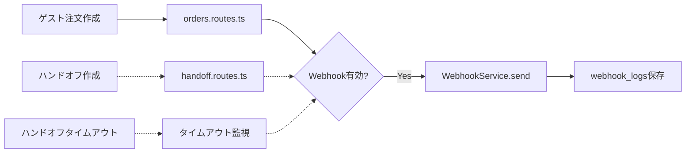

# DEV-0311: 通知Webhook 要件/制約整理

**作成日**: 2026-02-02  
**参照SSOT**: `SSOT_DEV-0250_NOTIFICATION_WEBHOOK.md`

---

## 1. 現在の実装状態

### 1.1 Webhook関連（❌ すべて未実装）

| コンポーネント | 状態 | 備考 |
|:--------------|:-----|:-----|
| `webhooks` テーブル | ❌ 未実装 | マイグレーション必要 |
| `webhook_logs` テーブル | ❌ 未実装 | マイグレーション必要 |
| Webhook CRUD API | ❌ 未実装 | hotel-common |
| Webhook送信サービス | ❌ 未実装 | リトライ付き |
| 暗号化ユーティリティ | ❌ 未実装 | URL暗号化用 |
| 管理UI | ❌ 未実装 | hotel-saas |

### 1.2 連携先の実装状態

| イベント | 状態 | 発火ポイント |
|:---------|:-----|:-------------|
| `ORDER_CREATED` | ✅ 注文API実装済み | `orders.routes.ts:392-430` |
| `HANDOFF_CREATED` | ❌ ハンドオフ未実装 | テーブル/APIなし |
| `HANDOFF_TIMEOUT` | ❌ ハンドオフ未実装 | テーブル/APIなし |

---

## 2. 技術的制約

### 2.1 URL暗号化

| 項目 | 仕様 |
|:-----|:-----|
| アルゴリズム | AES-256-GCM（推奨） |
| 環境変数 | `WEBHOOK_ENCRYPTION_KEY` |
| キー長 | 32バイト（256ビット） |
| 実装場所 | `hotel-common/src/utils/encryption.ts`（新規作成） |

```typescript
// 実装例
import { createCipheriv, createDecipheriv, randomBytes } from 'crypto';

export function encrypt(text: string, key: Buffer): string {
  const iv = randomBytes(16);
  const cipher = createCipheriv('aes-256-gcm', key, iv);
  const encrypted = Buffer.concat([cipher.update(text, 'utf8'), cipher.final()]);
  const tag = cipher.getAuthTag();
  return Buffer.concat([iv, tag, encrypted]).toString('base64');
}

export function decrypt(encryptedBase64: string, key: Buffer): string {
  const data = Buffer.from(encryptedBase64, 'base64');
  const iv = data.subarray(0, 16);
  const tag = data.subarray(16, 32);
  const encrypted = data.subarray(32);
  const decipher = createDecipheriv('aes-256-gcm', key, iv);
  decipher.setAuthTag(tag);
  return decipher.update(encrypted) + decipher.final('utf8');
}
```

### 2.2 リトライ戦略

| 項目 | 仕様 |
|:-----|:-----|
| 最大リトライ回数 | 3回 |
| リトライ間隔 | 1秒 → 5秒 → 30秒（指数バックオフ） |
| 実装方式 | 非同期（`setTimeout`ベース） |
| 永続化 | なし（MVP）、将来的にはジョブキュー検討 |

```typescript
// 実装例
const RETRY_DELAYS = [1000, 5000, 30000]; // ms

async function sendWithRetry(url: string, payload: object, attempt = 0): Promise<boolean> {
  try {
    const response = await fetch(url, {
      method: 'POST',
      headers: { 'Content-Type': 'application/json' },
      body: JSON.stringify(payload),
      signal: AbortSignal.timeout(10000), // 10秒タイムアウト
    });
    return response.ok;
  } catch (error) {
    if (attempt < RETRY_DELAYS.length) {
      await new Promise(resolve => setTimeout(resolve, RETRY_DELAYS[attempt]));
      return sendWithRetry(url, payload, attempt + 1);
    }
    return false;
  }
}
```

### 2.3 URL検証

| チェック項目 | 仕様 |
|:------------|:-----|
| プロトコル | `https://` のみ許可 |
| ローカルホスト | `localhost`, `127.0.0.1` 禁止 |
| プライベートIP | `10.x.x.x`, `172.16-31.x.x`, `192.168.x.x` 禁止 |
| ドメイン解決 | DNS解決可能であること |

```typescript
// 実装例
function isValidWebhookUrl(url: string): { valid: boolean; error?: string } {
  try {
    const parsed = new URL(url);
    
    if (parsed.protocol !== 'https:') {
      return { valid: false, error: 'HTTPS only' };
    }
    
    const hostname = parsed.hostname.toLowerCase();
    if (hostname === 'localhost' || hostname === '127.0.0.1') {
      return { valid: false, error: 'Localhost not allowed' };
    }
    
    // プライベートIP検出は簡易版（実装時に拡張）
    if (/^(10\.|172\.(1[6-9]|2[0-9]|3[01])\.|192\.168\.)/.test(hostname)) {
      return { valid: false, error: 'Private IP not allowed' };
    }
    
    return { valid: true };
  } catch {
    return { valid: false, error: 'Invalid URL format' };
  }
}
```

---

## 3. 依存関係

### 3.1 Webhook発火ポイント



### 3.2 実装順序

1. **Phase 1: 基盤**
   - `encryption.ts` 作成
   - `webhooks`, `webhook_logs` マイグレーション
   - Prismaスキーマ更新

2. **Phase 2: API**
   - Webhook CRUD API
   - WebhookService（送信＋リトライ）

3. **Phase 3: 連携**
   - `orders.routes.ts` 修正（ORDER_CREATED発火）
   - ※ HANDOFF_CREATED/TIMEOUT は当面スキップ（ハンドオフ機能未実装のため）

4. **Phase 4: UI**
   - hotel-saas プロキシAPI
   - 管理画面コンポーネント

---

## 4. MVPスコープの明確化

### 4.1 含める

| 機能 | 備考 |
|:-----|:-----|
| Webhook 1件登録 | テナントごと |
| URL暗号化保存 | AES-256-GCM |
| 3イベント対応 | ORDER_CREATED優先 |
| テスト送信 | 成功/失敗表示 |
| リトライ（3回） | 非同期 |
| 送信ログ保存 | DBのみ |

### 4.2 含めない（Phase 2）

| 機能 | 理由 |
|:-----|:-----|
| 複数Webhook（最大5件） | MVP最小化 |
| 送信履歴ビューア | UI工数削減 |
| カスタムペイロード | 複雑度削減 |
| HANDOFF_CREATED/TIMEOUT | ハンドオフ機能未実装 |

---

## 5. 決定事項確認

### 5.1 未決定事項（要確認）

| 項目 | 選択肢 | 推奨 |
|:-----|:------|:-----|
| HANDOFF連携 | A) ORDER_CREATEDのみ先行実装 / B) ハンドオフ機能と同時実装 | A |
| ジョブキュー | A) setTimeout（MVP） / B) Bull/Agenda | A |
| 暗号化キー管理 | A) 環境変数 / B) AWS KMS | A |

### 5.2 確認が必要な点

1. **HANDOFF_CREATED / HANDOFF_TIMEOUT について**
   - ハンドオフ機能自体が未実装
   - ORDER_CREATEDのみを先行実装し、ハンドオフは別タスクで対応するか？

---

## 6. 次のステップ（DEV-0312）

1. [ ] Prismaスキーマに `webhooks`, `webhook_logs` 追加
2. [ ] マイグレーション実行
3. [ ] `encryption.ts` 作成
4. [ ] `webhook.service.ts` 作成
5. [ ] CRUD API実装

---

**作成者**: Claude Code  
**最終更新**: 2026-02-02
