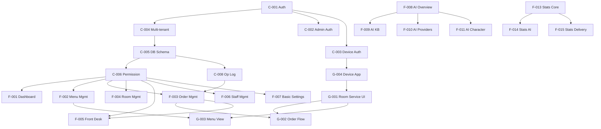

# SSOT-1: Feature Catalog

**Doc-ID**: SSOT-1
**Version**: 1.0.0
**Created**: 2026-03-05
**Status**: Approved
**Source**: Consolidated from 96 legacy SSOTs in `docs/03_ssot/`

---

## §1 Overview

本ドキュメントは hotel-kanri プラットフォームの全機能を一元管理する機能カタログである。

### §1.1 ID Convention

All feature IDs MUST follow the prefix convention below. **Accept**: 全 Feature ID が正規表現 `^(C|F|G)-\d{3}$` にマッチすること。

| Prefix | Category | Example |
|--------|----------|---------|
| C-xxx | Common/Foundation（基盤） | C-001 |
| F-xxx | Admin Features（管理機能） | F-001 |
| G-xxx | Guest Features（ゲスト機能） | G-001 |

### §1.2 Priority

Each feature MUST have exactly one priority level assigned. **Accept**: §3-§5 の全行に P0/P1/P2 のいずれかが設定されていること。

| Level | Meaning | Timing |
|-------|---------|--------|
| P0 | Critical — システム稼働に必須 | Immediate |
| P1 | High — 主要ビジネス機能 | Phase 1-2 |
| P2 | Medium — 付加価値機能 | Phase 3+ |

### §1.3 Size

Each feature MUST have a size estimate. **Accept**: §3-§5 の全行に S/M/L のいずれかが設定されていること。

| Size | Estimate | Criteria |
|------|----------|----------|
| S | 1-3 days | 単一 API + 単一画面 |
| M | 4-7 days | 複数 API + 複数画面 |
| L | 8+ days | 複数システム連携 + 複雑なロジック |

### §1.4 Dependency Rule

Features MUST NOT start implementation before all dependency features are complete. **Accept**: §10 Dependency Matrix のチェーンに従い、前提機能が「Implemented」ステータスであることを確認してから着手すること。

---

## §2 Feature Summary

| Category | Total | P0 | P1 | P2 |
|----------|-------|----|----|-----|
| Common/Foundation (C-xxx) | 15 | 8 | 4 | 3 |
| Admin Features (F-xxx) | 21 | 7 | 9 | 5 |
| Guest Features (G-xxx) | 10 | 4 | 3 | 3 |
| **Total** | **46** | **19** | **16** | **11** |

---

## §3 Common/Foundation Features (C-xxx)

| ID | Feature | Priority | Size | Status | Legacy SSOT |
|----|---------|----------|------|--------|-------------|
| C-001 | Authentication System | P0 | L | Implemented | SSOT_SAAS_AUTHENTICATION.md |
| C-002 | Admin Authentication | P0 | M | Implemented | SSOT_SAAS_ADMIN_AUTHENTICATION.md |
| C-003 | Device Authentication | P0 | M | Implemented | SSOT_SAAS_DEVICE_AUTHENTICATION.md |
| C-004 | Multi-tenant Architecture | P0 | L | Implemented | SSOT_SAAS_MULTITENANT.md |
| C-005 | Database Schema | P0 | L | Implemented | SSOT_SAAS_DATABASE_SCHEMA.md |
| C-006 | Permission System (RBAC) | P0 | L | Partial | SSOT_SAAS_PERMISSION_SYSTEM.md |
| C-007 | DB Migration Operations | P0 | S | Implemented | SSOT_DATABASE_MIGRATION_OPERATION.md |
| C-008 | Operational Log Architecture | P0 | M | Implemented | SSOT_OPERATIONAL_LOG_ARCHITECTURE.md |
| C-009 | Multilingual System | P1 | L | Not Started | SSOT_MULTILINGUAL_SYSTEM.md |
| C-010 | Multicultural AI | P1 | L | Not Started | SSOT_MULTICULTURAL_AI.md |
| C-011 | Media Management | P1 | M | Not Started | SSOT_SAAS_MEDIA_MANAGEMENT.md (planned) |
| C-012 | Email System | P1 | M | Not Started | SSOT_SAAS_EMAIL_SYSTEM.md (planned) |
| C-013 | Production Parity Rules | P0 | S | Implemented | SSOT_PRODUCTION_PARITY_RULES.md |
| C-014 | Staff Management (Common) | P0 | M | Implemented | SSOT_SAAS_STAFF_MANAGEMENT.md (foundation) |
| C-015 | World-class UI Design Principles | P2 | S | Documented | SSOT_WORLD_CLASS_UI_DESIGN_PRINCIPLES.md |

---

## §4 Admin Features (F-xxx)

| ID | Feature | Priority | Size | Status | Legacy SSOT |
|----|---------|----------|------|--------|-------------|
| F-001 | Dashboard | P0 | M | Implemented | SSOT_SAAS_DASHBOARD.md |
| F-002 | Menu Management | P0 | L | Implemented | SSOT_SAAS_MENU_MANAGEMENT.md |
| F-003 | Order Management | P0 | L | Implemented | SSOT_SAAS_ORDER_MANAGEMENT.md |
| F-004 | Room Management | P0 | M | Partial | SSOT_SAAS_ROOM_MANAGEMENT.md |
| F-005 | Front Desk Operations | P0 | L | Partial | SSOT_SAAS_FRONT_DESK_OPERATIONS.md |
| F-006 | Staff Management (Admin) | P0 | M | Implemented | SSOT_SAAS_STAFF_MANAGEMENT.md |
| F-007 | Basic Settings | P0 | M | Partial | SSOT_ADMIN_BASIC_SETTINGS.md |
| F-008 | AI Concierge Overview | P1 | L | Partial | ai_concierge/SSOT_ADMIN_AI_CONCIERGE_OVERVIEW.md |
| F-009 | AI Knowledge Base | P1 | M | Partial | ai_concierge/SSOT_ADMIN_AI_KNOWLEDGE_BASE.md |
| F-010 | AI Providers | P1 | M | Not Started | ai_concierge/SSOT_ADMIN_AI_PROVIDERS.md |
| F-011 | AI Character Settings | P1 | M | Partial | ai_concierge/SSOT_ADMIN_AI_CHARACTER.md |
| F-012 | AI Concierge Database | P1 | M | Partial | ai_concierge/SSOT_ADMIN_AI_CONCIERGE_DATABASE.md |
| F-013 | Statistics Core | P1 | L | Partial | SSOT_ADMIN_STATISTICS_CORE.md |
| F-014 | Statistics AI | P2 | L | Not Started | SSOT_ADMIN_STATISTICS_AI.md |
| F-015 | Statistics Delivery / A/B Test | P2 | L | Not Started | SSOT_ADMIN_STATISTICS_DELIVERY.md |
| F-016 | Admin UI Design / Layout | P1 | L | Partial | SSOT_ADMIN_UI_DESIGN.md |
| F-017 | System Logs | P1 | M | Partial | SSOT_ADMIN_SYSTEM_LOGS.md |
| F-018 | Billing | P1 | L | Not Started | SSOT_ADMIN_BILLING.md |
| F-019 | Super Admin | P1 | L | Not Started | SSOT_SAAS_SUPER_ADMIN.md |
| F-020 | AI Settings | P2 | M | Not Started | SSOT_ADMIN_AI_SETTINGS.md |
| F-021 | Permission System UI | P0 | M | Partial | SSOT_SAAS_PERMISSION_SYSTEM.md |

---

## §5 Guest Features (G-xxx)

| ID | Feature | Priority | Size | Status | Legacy SSOT |
|----|---------|----------|------|--------|-------------|
| G-001 | Room Service UI | P0 | L | Partial | SSOT_GUEST_ROOM_SERVICE_UI.md |
| G-002 | Order Flow | P0 | L | 90% Done | SSOT_GUEST_ORDER_FLOW.md |
| G-003 | Menu View | P0 | L | 85% Done | SSOT_GUEST_MENU_VIEW.md |
| G-004 | Device App (Capacitor) | P0 | M | Implemented | SSOT_GUEST_DEVICE_APP.md |
| G-005 | Campaign View | P1 | M | Not Started | SSOT_GUEST_CAMPAIGN_VIEW.md (planned) |
| G-006 | Info Portal | P1 | M | Not Started | SSOT_GUEST_INFO_PORTAL.md (planned) |
| G-007 | AI Chat | P1 | L | Not Started | SSOT_GUEST_AI_CHAT.md (planned) |
| G-008 | App Launcher | P2 | S | Not Started | SSOT_GUEST_APP_LAUNCHER.md (planned) |
| G-009 | Page Routing / Navigation | P2 | S | Not Started | SSOT_GUEST_PAGE_ROUTING.md (planned) |
| G-010 | Device Reset / Maintenance | P2 | S | Not Started | SSOT_GUEST_DEVICE_RESET.md (planned) |

---

## §6 Feature Status Summary

### §6.1 Implementation Status

| Status | Count | Percentage |
|--------|-------|-----------|
| Implemented | 13 | 28% |
| Partial | 13 | 28% |
| Not Started | 17 | 37% |
| Documented Only | 3 | 7% |
| **Total** | **46** | **100%** |

### §6.2 By Phase

| Phase | Features | Status |
|-------|----------|--------|
| Phase 0 (Auth Foundation) | C-001, C-002, C-003, C-004, C-005, C-013 | Completed |
| Phase 1 (Admin Foundation) | C-006, C-007, C-008, C-014, F-001..F-007, F-021 | In Progress |
| Phase 2 (Guest + AI) | G-001..G-004, F-008..F-012, F-016 | Partial |
| Phase 3 (Analytics + i18n) | F-013..F-015, F-017, F-018, C-009..C-012 | Planned |
| Phase 4 (Expansion) | G-005..G-010, F-019, F-020 | Planned |

---

## §7 Feature Detail: Common/Foundation

### C-001 Authentication System

- **Description**: hotel-kanri 全体の認証基盤。Session 認証（Redis + HttpOnly Cookie）を統一使用。
- **MUST**: 全システムが同一 Redis インスタンスを使用すること。**Accept**: hotel-common/hotel-saas の `.env` で同一 `REDIS_URL` であること。
- **MUST**: Cookie 名 `hotel-session-id` を全システムで統一すること。**Accept**: ブラウザ DevTools で Cookie 名が `hotel-session-id` であること。
- **MUST**: TTL は 3600 秒で統一すること。**Accept**: `redis-cli TTL "hotel:session:{id}"` が 0-3600 の範囲であること。
- **Verification**: `redis-cli KEYS "hotel:session:*"` でセッション確認。ref: [SSOT-5 §1](../design/core/SSOT-5_CROSS_CUTTING.md#1-authentication)

### C-004 Multi-tenant Architecture

- **Description**: 単一 DB で複数ホテル（テナント）を完全データ分離。
- **MUST**: 全テーブルに `tenant_id` カラムを持つこと（tenants テーブル自体を除く）。**Accept**: `prisma/schema.prisma` の全モデルに `tenantId` フィールドが存在すること。ref: [SSOT-4 §3](../design/core/SSOT-4_DATA_MODEL.md#3-common-columns)
- **MUST**: RLS + アプリケーションレベルフィルタリングで分離すること。**Accept**: テナント A のセッションでテナント B のデータが API レスポンスに含まれないこと。ref: [SSOT-5 §2](../design/core/SSOT-5_CROSS_CUTTING.md#2-multi-tenancy)
- **Verification**: 異なるテナントのデータが相互参照不可であること。

### C-006 Permission System (RBAC)

- **Description**: `{category}:{resource}:{action}` 形式の柔軟な権限管理。
- **MUST**: ワイルドカード権限は使用禁止（v2.1.0+）。個別権限のみ。**Accept**: `permissions` テーブルに `*` を含むレコードが 0 件であること。ref: [SSOT-4 §7](../design/core/SSOT-4_DATA_MODEL.md#7-permission-tables)
- **Requirement IDs**: PERM-001 〜 PERM-009, PERM-DB-001 〜 003, PERM-API-001 〜 007, PERM-UI-001 〜 007。

---

## §8 Feature Detail: Admin Features

### F-002 Menu Management

- **Description**: スタッフ専用メニュー・カテゴリ CRUD。15 言語対応。
- **Key APIs**: `GET/POST/PUT/DELETE /api/v1/admin/menu/items`, `GET /api/v1/admin/menu/categories`
- **Tables**: `menu_items`, `menu_categories`, `translations`

### F-003 Order Management

- **Description**: 注文ライフサイクル管理（received → preparing → ready → delivering → delivered → completed）。
- **MUST**: 運用/ログ二重管理（24 時間後に `orders` → `order_logs` へ自動移行）。**Accept**: `completed` ステータスの注文が 24 時間後に `order_logs` に存在し、`orders` から削除されていること。ref: [SSOT-5 §5](../design/core/SSOT-5_CROSS_CUTTING.md#5-operational--log-dual-management)
- **Key APIs**: `GET /api/v1/admin/orders`, WebSocket `ws://*/ws/orders`
- **Tables**: `orders`, `order_logs`, `order_items`, `order_item_logs`

### F-006 Staff Management (Admin)

- **Description**: スタッフ招待・ライフサイクル・権限付与。
- **Requirement IDs**: STAFF-001 〜 020, STAFF-SEC-001 〜 010, STAFF-UI-001 〜 010。
- **Key APIs**: `GET/POST/PUT/DELETE /staff`, `POST /staff/:id/accept-invitation`
- **Tables**: `staff`, `staff_invitations`, `staff_tenant_assignments`, `staff_roles`

---

## §9 Feature Detail: Guest Features

### G-002 Order Flow

- **Description**: ゲスト向け注文フロー（メニュー閲覧 → カート → 確認 → 送信 → 追跡）。
- **Pages**: `/`, `/order`, `/menu/index`, `/menu/category/[id]`, `/order/cart`, `/order/complete`, `/order/history`
- **MUST**: WebSocket でリアルタイムステータス更新すること。**Accept**: 注文ステータス変更後 1 秒以内にゲスト端末の UI が更新されること。ref: [SSOT-3 §3.1](../design/core/SSOT-3_API_CONTRACT.md#31-order-management-f-003)
- **Tables**: `orders`, `order_items`, `menu_items`, `checkin_sessions`

### G-003 Menu View

- **Description**: Netflix スタイルのカルーセル UI、3 階層カテゴリ、文化フィルタ。
- **Pages**: `/menu/index`, `/menu/category/[id]`
- **Components**: CategoryTabs, MenuCard, AvailabilityMask, GachaMenuCard
- **Key APIs**: `GET /api/v1/order/menu`, `GET /api/v1/menu/recommended`, `GET /api/v1/menus/top`

### G-004 Device App

- **Description**: Capacitor + Nuxt 3 WebView アプリ（Google TV/Android TV）。
- **MUST**: リモコン最適化（80-120px タッチターゲット）。**Accept**: 全クリッカブル要素の min-height/min-width が 80px 以上であること。ref: [SSOT-2 §1.2](../design/core/SSOT-2_UI_STATE.md#12-guest-theme-luxury)
- **MUST**: デバイス認証 middleware (`middleware/01-device-auth.ts`) を通過すること。**Accept**: 未登録デバイスから `/order` アクセス時に `/device/unregistered` へリダイレクトされること。ref: [SSOT-2 §4.2](../design/core/SSOT-2_UI_STATE.md#42-device-authentication-state)

---

## §10 Cross-Feature Dependencies

### §10.1 Dependency Matrix

```
C-001 (Auth) ──────────────► ALL features
C-004 (Multi-tenant) ─────► ALL features
C-005 (DB Schema) ────────► ALL features with DB access
C-006 (Permission) ───────► F-001..F-021 (all admin features)
C-008 (Op Log) ───────────► F-003 (Order Mgmt)
F-002 (Menu Mgmt) ────────► G-003 (Menu View), G-002 (Order Flow)
F-003 (Order Mgmt) ───────► G-002 (Order Flow), F-005 (Front Desk)
F-008 (AI Overview) ──────► F-009..F-012 (AI sub-features)
F-013 (Stats Core) ───────► F-014 (Stats AI), F-015 (Stats Delivery)
G-001 (Room Service UI) ──► G-002, G-003, G-004
```

### §10.2 Critical Path

```
C-001 → C-004 → C-005 → C-006 → F-001..F-007 → G-001..G-004
```

Phase 1 の前提条件チェーン:

- **MUST**: Authentication (C-001) が完了していること。**Accept**: `redis-cli ping` → PONG、ログイン → セッション生成を確認。
- **MUST**: Multi-tenant (C-004) が完了していること。**Accept**: 2 テナント間のデータ分離テスト合格。
- **MUST**: DB Schema (C-005) が完了していること。**Accept**: `prisma migrate status` でペンディングなし。
- **MUST**: Permission System (C-006) が全 Admin 機能より先に完了していること。**Accept**: 権限なしスタッフが保護 API に 403 を受けること。

---

## §11 Dependency Graph



---

## §12 Cross-SSOT References

| SSOT | Relationship |
|------|-------------|
| [SSOT-0 PRD](../requirements/SSOT-0_PRD.md) | §2 Product Scope → SSOT-1 §3-§5 feature lists |
| [SSOT-2 UI/State](../design/core/SSOT-2_UI_STATE.md) | SSOT-1 §9 Guest Features → SSOT-2 §3 Guest Screen Map |
| [SSOT-3 API Contract](../design/core/SSOT-3_API_CONTRACT.md) | SSOT-1 §7-§9 Key APIs → SSOT-3 §2-§4 endpoints |
| [SSOT-4 Data Model](../design/core/SSOT-4_DATA_MODEL.md) | SSOT-1 §7-§9 Tables → SSOT-4 §4-§12 table definitions |
| [SSOT-5 Cross-Cutting](../design/core/SSOT-5_CROSS_CUTTING.md) | SSOT-1 §7 C-001/C-004 → SSOT-5 §1/§2 auth & multi-tenant |

---

## §13 Revision History

| Version | Date | Changes |
|---------|------|---------|
| 1.0.0 | 2026-03-05 | Initial creation — 46 features cataloged from 96 legacy SSOTs |
| 1.0.1 | 2026-03-05 | Add acceptance criteria to all MUST requirements, add cross-SSOT refs §12 |
