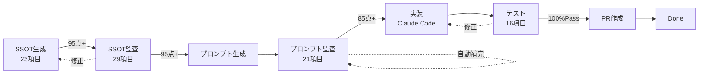

# 🎯 Quality Checklists - 品質チェックリスト体系

**バージョン**: 1.1.0
**最終更新**: 2026-01-23

---

## 📋 設計原則（ハッカソンノウハウ）

### 1. SMART原則

| 原則 | 説明 | 例 |
|:-----|:-----|:---|
| **S**pecific | 具体的・明確 | ❌「適切なエラー処理」→ ✅「401/403/404/500の4パターン定義」 |
| **M**easurable | 測定可能 | ❌「十分な項目」→ ✅「10項目以上」 |
| **A**utomatable | 自動検証可能 | regex/AST/API呼び出しで検証 |
| **R**elevant | 目的に関連 | 不要な項目を入れない |
| **T**racked | 追跡可能 | ID付与（G01, P01, E01等） |

### 2. 重み付け原則

```
Critical（致命的）: 20点 - これがないと動かない
Major（重要）    : 10点 - 品質に大きく影響
Minor（軽微）    :  5点 - あると良い
Optional（任意） :  3点 - ボーナス
```

### 3. 検証方法

| 方法 | 速度 | 精度 | 用途 |
|:-----|:-----|:-----|:-----|
| **regex** | 最速 | 低 | 構造チェック（セクション有無） |
| **AST** | 中速 | 高 | コード解析（型定義、関数構造） |
| **LLM** | 低速 | 最高 | 意味解析（要件の妥当性） |
| **実行** | 低速 | 確実 | 実際の動作確認（API呼び出し） |

### 4. スコア閾値

| レベル | スコア | 判定 | アクション |
|:-------|:-------|:-----|:-----------|
| 🟢 Excellent | 95-100 | 合格 | 次のステップへ |
| 🟡 Good | 85-94 | 条件付き合格 | 軽微な修正後に進行 |
| 🟠 Fair | 70-84 | 要修正 | 修正後に再監査 |
| 🔴 Poor | 0-69 | 不合格 | 作り直し |

---

## 📁 チェックリスト一覧

| ファイル | 対象 | 項目数 | 自動化率 |
|:---------|:-----|:-------|:---------|
| `ssot-generation.cjs` | SSOT生成 | 23項目 | 80% |
| `ssot-audit.cjs` | SSOT監査 | 29項目 | 90% |
| `prompt-audit.cjs` | プロンプト監査 | 21項目 + LLM | 95% |
| `test-execution.cjs` | テスト実行 | 16項目 | 100% |
| `implementation.cjs` | 実装 | 未実装 | - |
| `pr-review.cjs` | PRレビュー | 未実装 | - |

---

## 🔄 ワークフロー

```
┌─────────────────────────────────────────────────────────────────┐
│                     Quality Gate Pipeline                        │
├─────────────────────────────────────────────────────────────────┤
│                                                                  │
│  [SSOT生成] ──→ [SSOT監査] ──→ [プロンプト生成] ──→ [プロンプト監査]  │
│      ↓              ↓              ↓                  ↓          │
│   23項目         29項目          --               21項目          │
│   95点以上        95点以上         --               85点以上        │
│      │              │              │                  │          │
│      ↓              ↓              ↓                  ↓          │
│  [実装] ──────→ [テスト] ──────→ [PRレビュー] ──────→ [Done]       │
│      ↓              ↓              ↓                              │
│    --            16項目           --                              │
│    --           100%Pass          --                              │
│                                                                  │
└─────────────────────────────────────────────────────────────────┘
```

### Mermaid形式



---

## 📊 スコア計算

```javascript
// 重み付きスコア計算
function calculateScore(results, checklist) {
  let totalWeight = 0;
  let earnedWeight = 0;
  
  for (const item of checklist) {
    totalWeight += item.weight;
    const result = results.find(r => r.id === item.id);
    if (result?.passed) {
      earnedWeight += item.weight;
    }
  }
  
  return Math.round((earnedWeight / totalWeight) * 100);
}
```

---

## 🎯 ハッカソンノウハウ反映ポイント

### 1. MVP思考
- 必須項目（Critical）だけで最低限動く
- 完璧を目指さず、イテレーション

### 2. デモファースト
- テストチェックリストは「デモできる状態」を保証
- 見た目より動作を優先

### 3. 時間制約
- 各チェックは30秒以内に完了
- タイムアウトで自動スキップ

### 4. 審査員視点
- ビジネス価値（要件のAccept条件）
- 技術的難易度（適切な設計）
- 完成度（エラーハンドリング）

### 5. チーム連携
- チェックリストは共通言語
- 誰が見ても同じ判定

---

## 📝 使用方法

```bash
# SSOT生成チェック
node scripts/quality-checklists/ssot-generation.cjs docs/03_ssot/YOUR_SSOT.md

# SSOT監査
node scripts/quality-checklists/ssot-audit.cjs docs/03_ssot/YOUR_SSOT.md

# プロンプト監査
node scripts/quality-checklists/prompt-audit.cjs prompts/YOUR_PROMPT.md

# テスト実行（Admin用 - Session認証）
node scripts/quality-checklists/test-execution.cjs admin

# テスト実行（Guest用 - デバイス認証）※未実装
# node scripts/quality-checklists/test-execution.cjs guest

# 統合実行（run-task.cjs経由）
node scripts/auto-dev/run-task.cjs DEV-0170
```

---

## 🔐 認証方式別テスト

| テストタイプ | 認証方式 | API対象 | UI対象 |
|:------------|:---------|:--------|:-------|
| `admin` | Session認証（Cookie） | `/api/v1/admin/*` | `/admin` |
| `guest` | デバイス認証（device_rooms） | `/api/v1/guest/*` | `/menu` |

### Admin テスト（実装済み）
- ログイン → Cookie取得 → テナント切替 → API検証 → UI検証

### Guest テスト（未実装）
- デバイス認証（MAC/IP → device_rooms） → API検証 → UI検証

---

## 📝 更新履歴

| バージョン | 日付 | 変更内容 |
|:-----------|:-----|:---------|
| 1.1.0 | 2026-01-23 | Admin/Guest分離、テストチェックリスト修正 |
| 1.0.0 | 2026-01-22 | 初版リリース |
